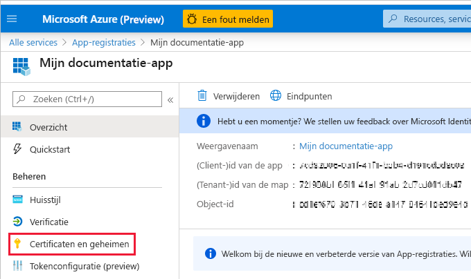
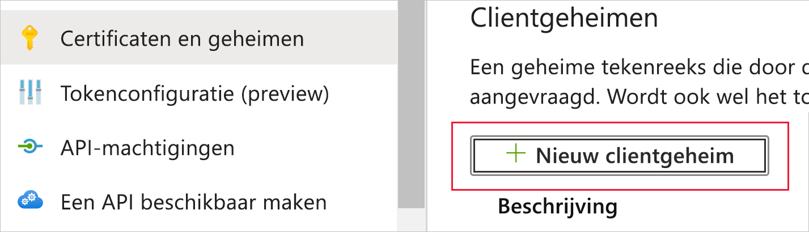
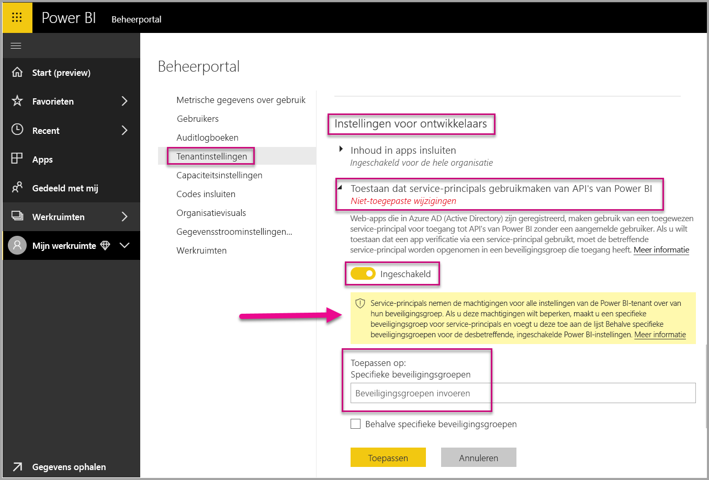
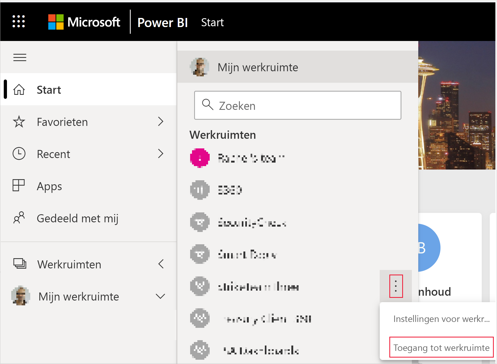
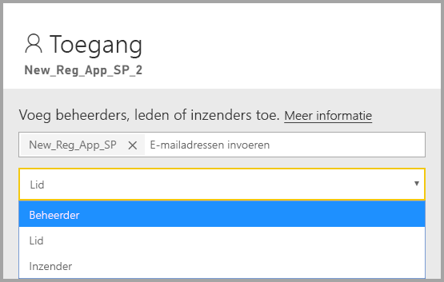

# <a name="embed-power-bi-content-with-service-principal-and-an-application-secret"></a>Power BI-inhoud insluiten met service-principal en een toepassingsgeheim

[!INCLUDE[service principal overview](../../includes/service-principal-overview.md)]

In dit artikel wordt de service-principal-verificatie met een *toepassings-id* en *toepassingsgeheim* beschreven.

>[!NOTE]
>We raden u aan uw backend-services te beveiligen met behulp van certificaten, in plaats van geheime sleutels.
>* [Meer informatie over het verkrijgen van toegangstokens van Azure AD met behulp van geheime sleutels of certificaten](https://docs.microsoft.com/azure/architecture/multitenant-identity/client-assertion).
>* [Power BI-inhoud met service-principal en een certificaat insluiten](embed-service-principal-certificate.md).

## <a name="method"></a>Methode

Voer de volgende stappen uit om een service-principal en een toepassings-id met ingesloten analyses te gebruiken:

1. Maak een [Azure AD-app](https://docs.microsoft.com/azure/active-directory/manage-apps/what-is-application-management).

    1. Maak het geheim van de Azure AD-app.
    
    2. Haal de *toepassings-id* en het *toepassingsgeheim* van de app op.

    >[!NOTE]
    >Deze stappen worden beschreven in **stap 1**. Zie het artikel [Een Azure AD-app maken](https://docs.microsoft.com/azure/active-directory/develop/howto-create-service-principal-portal) voor meer informatie over het maken van een Azure AD-app.

2. Maak een Azure AD-beveiligingsgroep.

3. Schakel de beheerdersinstellingen voor de Power BI-service in.

4. Voeg de service-principal toe aan uw werkruimte.

5. Sluit uw inhoud in.

> [!IMPORTANT]
> Nadat u de service-principal voor gebruik met Power BI hebt ingeschakeld, zijn de AD-machtigingen van de toepassing niet meer geldig. De machtigingen van de toepassing worden dan beheerd via de Power BI-beheerportal.

## <a name="step-1---create-an-azure-ad-app"></a>Stap 1: een Azure AD-app maken

Maak een Azure AD-app met behulp van een van deze methoden:
* De app maken in de [Microsoft Azure-portal](https://portal.azure.com/#allservices)
* Maak de app met behulp van [PowerShell](https://docs.microsoft.com/powershell/azure/create-azure-service-principal-azureps?view=azps-3.6.1).

### <a name="creating-an-azure-ad-app-in-the-microsoft-azure-portal"></a>Een Azure AD-app maken in de Microsoft Azure-portal

[!INCLUDE[service create app](../../includes/service-principal-create-app.md)]

7. Klik op de tab **Certificaten en geheimen**.

     


8. Klik op **Nieuw clientgeheim**

    

9. Voer in het venster *Een clientgeheim toevoegen* een beschrijving in, geef op wanneer u wilt dat het clientgeheim verloopt, en klik op **Toevoegen**.

10. Kopieer de waarde van *Clientgeheim* en sla deze op.

    

    >[!NOTE]
    >Wanneer u dit venster verlaat, wordt de waarde van het clientgeheim verborgen en kunt u deze niet meer weergeven of kopiëren.

### <a name="creating-an-azure-ad-app-using-powershell"></a>Een Azure AD-app maken met PowerShell

Deze sectie bevat een voorbeeldscript voor het maken van een nieuwe Azure AD-app met [PowerShell](https://docs.microsoft.com/powershell/azure/create-azure-service-principal-azureps?view=azps-1.1.0).

```powershell
# The app ID - $app.appid
# The service principal object ID - $sp.objectId
# The app key - $key.value

# Sign in as a user that's allowed to create an app
Connect-AzureAD

# Create a new Azure AD web application
$app = New-AzureADApplication -DisplayName "testApp1" -Homepage "https://localhost:44322" -ReplyUrls "https://localhost:44322"

# Creates a service principal
$sp = New-AzureADServicePrincipal -AppId $app.AppId

# Get the service principal key
$key = New-AzureADServicePrincipalPasswordCredential -ObjectId $sp.ObjectId
```

## <a name="step-2---create-an-azure-ad-security-group"></a>Stap 2: een Azure AD-beveiligingsgroep maken

De service-principal heeft geen toegang tot uw Power BI-inhoud en -API's. Om de service-principal toegang te geven, maakt u een beveiligingsgroep in Azure AD en voegt u de gemaakte service-principal toe aan die beveiligingsgroep.

U kunt op twee manieren een Azure AD-beveiligingsgroep maken:
* Handmatig (in Azure)
* PowerShell gebruiken

### <a name="create-a-security-group-manually"></a>Handmatig een beveiligingsgroep maken

Als u handmatig een Azure-beveiligingsgroep wilt maken, volgt u de instructies in het artikel [Een basisgroep maken en leden toevoegen met Azure Active Directory](https://docs.microsoft.com/azure/active-directory/fundamentals/active-directory-groups-create-azure-portal). 

### <a name="create-a-security-group-using-powershell"></a>Een beveiligingsgroep maken met PowerShell

Hieronder volgt een voorbeeldscript voor het maken van een nieuwe beveiligingsgroep en het toevoegen van een app aan die beveiligingsgroep.

>[!NOTE]
>Als u toegang tot service-principals wilt inschakelen voor de hele organisatie, slaat u deze stap over.

```powershell
# Required to sign in as a tenant admin
Connect-AzureAD

# Create an Azure AD security group
$group = New-AzureADGroup -DisplayName <Group display name> -SecurityEnabled $true -MailEnabled $false -MailNickName notSet

# Add the service principal to the group
Add-AzureADGroupMember -ObjectId $($group.ObjectId) -RefObjectId $($sp.ObjectId)
```

## <a name="step-3---enable-the-power-bi-service-admin-settings"></a>Stap 3: de beheerdersinstellingen voor de Power BI-service inschakelen

Voordat een Azure AD-app toegang kan krijgen tot de Power BI-inhoud en -API's, moet een Power BI-beheerder toegang tot de service-principal inschakelen in de Power BI-beheerportal.

Voeg de beveiligingsgroep die u in Azure AD hebt gemaakt, toe aan de sectie Specifieke beveiligingsgroep in de **instellingen voor ontwikkelaars**.

>[!IMPORTANT]
>Service-principals hebben toegang tot alle tenantinstellingen waarvoor ze zijn ingeschakeld. Afhankelijk van uw beheerdersinstellingen bevat dit specifieke beveiligingsgroepen of de hele organisatie.
>
>Als u de toegang van de service-principal wilt beperken tot specifieke tenantinstellingen, staat u alleen toegang tot specifieke beveiligingsgroepen toe. U kunt ook een toegewezen beveiligingsgroep voor service-principals maken en deze uitsluiten van de gewenste tenantinstellingen.



## <a name="step-4---add-the-service-principal-to-your-workspace"></a>Stap 4: voeg de service-principal toe aan uw werkruimte

Als u uw Azure AD-app toegang wilt verlenen tot artefacten zoals rapporten, dashboards en gegevenssets in de Power BI-service, voegt u de entiteit van de service-principal toe als lid of beheerder aan uw werkruimte.

>[!NOTE]
>Deze sectie bevat instructies voor de gebruikersinterface. U kunt ook een service-principal aan een werkruimte toevoegen met behulp van de [API Groups - Add Group User](https://docs.microsoft.com/rest/api/power-bi/groups/addgroupuser) (Groepen - Groepsgebruiker toevoegen).

1. Ga naar de werkruimte waarvoor u toegang wilt inschakelen, en selecteer in het menu **More** de optie **Workspace access**.

    

2. Voeg de service-principal als een **Admin** (beheerder) of **Member** (lid) toe aan de werkruimte.

    

## <a name="step-5---embed-your-content"></a>Stap 5: uw inhoud insluiten

U kunt nu uw inhoud insluiten in een voorbeeldtoepassing of in uw eigen toepassing.

* [Inhoud met behulp van de voorbeeldtoepassing insluiten](embed-sample-for-customers.md#embed-content-using-the-sample-application)
* [Inhoud in uw toepassing insluiten](embed-sample-for-customers.md#embed-content-within-your-application)

Als de inhoud is ingesloten, bent u klaar voor de [overgang naar de productieomgeving](embed-sample-for-customers.md#move-to-production).

[!INCLUDE[service principal limitations](../../includes/service-principal-limitations.md)]

## <a name="next-steps"></a>Volgende stappen

>[!div class="nextstepaction"]
>[Een app registreren](register-app.md)

> [!div class="nextstepaction"]
>[Power BI Embedded voor uw klanten](embed-sample-for-customers.md)

>[!div class="nextstepaction"]
>[Toepassings- en service-principal-objecten in Azure Active Directory](https://docs.microsoft.com/azure/active-directory/develop/app-objects-and-service-principals)

>[!div class="nextstepaction"]
>[Beveiliging op rijniveau met on-premises gegevensgateway met service-principal](embedded-row-level-security.md#on-premises-data-gateway-with-service-principal)

>[!div class="nextstepaction"]
>[Power BI-inhoud met service-principal en een certificaat insluiten](embed-service-principal-certificate.md)
