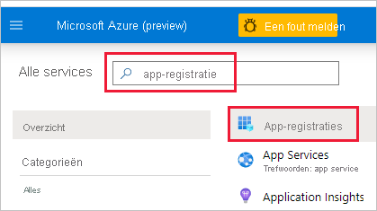
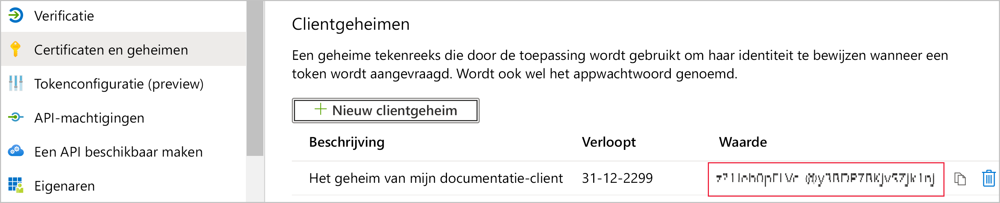

# <a name="embed-power-bi-content-with-service-principal-and-an-application-secret"></a>Power BI-inhoud insluiten met service-principal en een toepassingsgeheim

Service-principal is een verificatiemethode die kan worden gebruikt om een Azure AD-toepassing toegang te geven tot inhoud en API's van de Power BI-service.

Wanneer u een Azure Active Directory-app (Azure AD) maakt, wordt er een [service-principal-object](/azure/active-directory/develop/app-objects-and-service-principals#service-principal-object) gemaakt. Met het service-principal-object, ook wel een *service-principal* genoemd, kan Azure AD uw app verifiëren. Nadat de app is geverifieerd, heeft deze toegang tot Azure AD-tenantbronnen.

Voor de verificatie gebruikt de service-principal de *toepassings-id* van de Azure AD-app en een van de volgende elementen:

* Certificaat
* Toepassingsgeheim

In dit artikel wordt de service-principal-verificatie met een *toepassings-id* en *toepassingsgeheim* beschreven.

>[!NOTE]
>Azure AD raadt aan uw back-endservices te beveiligen met behulp van certificaten, in plaats van geheime sleutels.
>* [Meer informatie over het verkrijgen van toegangstokens van Azure AD met behulp van geheime sleutels of certificaten](/azure/architecture/multitenant-identity/client-assertion).
>* Als u uw oplossing wilt beveiligen met een certificaat, voert u de instructies in dit artikel uit en volgt u de stappen die worden beschreven in [Power BI-inhoud insluiten met service-principal en een certificaat](embed-service-principal-certificate.md).

## <a name="method"></a>Methode

Voer de volgende stappen uit om een service-principal en een toepassings-id met ingesloten analyses te gebruiken:

1. Maak een [Azure AD-app](/azure/active-directory/manage-apps/what-is-application-management).

    1. Maak het geheim van de Azure AD-app.
    
    2. Haal de *toepassings-id* en het *toepassingsgeheim* van de app op.

    >[!NOTE]
    >Deze stappen worden beschreven in **stap 1**. Zie het artikel [Een Azure AD-app maken](/azure/active-directory/develop/howto-create-service-principal-portal) voor meer informatie over het maken van een Azure AD-app.

2. Maak een Azure AD-beveiligingsgroep.

3. Schakel de beheerdersinstellingen voor de Power BI-service in.

4. Voeg de service-principal toe aan uw werkruimte.

5. Sluit uw inhoud in.

> [!IMPORTANT]
> Nadat u de service-principal voor gebruik met Power BI hebt ingeschakeld, zijn de AD-machtigingen van de toepassing niet meer geldig. De machtigingen van de toepassing worden dan beheerd via de Power BI-beheerportal.

## <a name="step-1---create-an-azure-ad-app"></a>Stap 1: een Azure AD-app maken

Maak een Azure AD-app met behulp van een van deze methoden:

* [De app maken in Microsoft Azure Portal](embed-service-principal.md#creating-an-azure-ad-app-in-the-microsoft-azure-portal)

* [De app maken met PowerShell](embed-service-principal.md#creating-an-azure-ad-app-using-powershell)

### <a name="creating-an-azure-ad-app-in-the-microsoft-azure-portal"></a>Een Azure AD-app maken in de Microsoft Azure-portal

1. Meld u aan bij [Microsoft Azure](https://ms.portal.azure.com/#allservices).

2. Zoek naar **App-registraties** en klik op de koppeling **App-registraties**.

    

3. Klik op **Nieuwe registratie**.

    

4. Vul de vereiste gegevens in:
    * **Naam**: voer een naam in voor de toepassing
    * **Ondersteunde accounttypen**: selecteer ondersteunde accounttypen
    * (Optioneel) **Omleidings-URI**: voer een URI in, indien nodig

5. Klik op **Registreren**.

6. Na de app-registratie is de *toepassings-id* beschikbaar op het tabblad **Overzicht**. Kopieer de *toepassings-id* en sla deze op voor later gebruik.

    

7. Klik op de tab **Certificaten en geheimen**.

     

8. Klik op **Nieuw clientgeheim**

    

9. Voer in het venster *Een clientgeheim toevoegen* een beschrijving in, geef op wanneer u wilt dat het clientgeheim verloopt, en klik op **Toevoegen**.

10. Kopieer de waarde van *Clientgeheim* en sla deze op.

    

    >[!NOTE]
    >Wanneer u dit venster verlaat, wordt de waarde van het clientgeheim verborgen en kunt u deze niet meer weergeven of kopiëren.

### <a name="creating-an-azure-ad-app-using-powershell"></a>Een Azure AD-app maken met PowerShell

Deze sectie bevat een voorbeeldscript voor het maken van een nieuwe Azure AD-app met [PowerShell](/powershell/azure/create-azure-service-principal-azureps).

```powershell
# The app ID - $app.appid
# The service principal object ID - $sp.objectId
# The app key - $key.value

# Sign in as a user that's allowed to create an app
Connect-AzureAD

# Create a new Azure AD web application
$app = New-AzureADApplication -DisplayName "testApp1" -Homepage "https://localhost:44322" -ReplyUrls "https://localhost:44322"

# Creates a service principal
$sp = New-AzureADServicePrincipal -AppId $app.AppId

# Get the service principal key
$key = New-AzureADServicePrincipalPasswordCredential -ObjectId $sp.ObjectId
```

## <a name="step-2---create-an-azure-ad-security-group"></a>Stap 2: een Azure AD-beveiligingsgroep maken

De service-principal heeft geen toegang tot uw Power BI-inhoud en -API's. Om de service-principal toegang te geven, maakt u een beveiligingsgroep in Azure AD en voegt u de gemaakte service-principal toe aan die beveiligingsgroep.

U kunt op twee manieren een Azure AD-beveiligingsgroep maken:
* [Handmatig (in Azure)](embed-service-principal.md#create-a-security-group-manually)
* [PowerShell gebruiken](embed-service-principal.md#create-a-security-group-using-powershell)

### <a name="create-a-security-group-manually"></a>Handmatig een beveiligingsgroep maken

Als u handmatig een Azure-beveiligingsgroep wilt maken, volgt u de instructies in het artikel [Een basisgroep maken en leden toevoegen met Azure Active Directory](/azure/active-directory/fundamentals/active-directory-groups-create-azure-portal). 

### <a name="create-a-security-group-using-powershell"></a>Een beveiligingsgroep maken met PowerShell

Hieronder volgt een voorbeeldscript voor het maken van een nieuwe beveiligingsgroep en het toevoegen van een app aan die beveiligingsgroep.

>[!NOTE]
>Als u toegang tot service-principals wilt inschakelen voor de hele organisatie, slaat u deze stap over.

```powershell
# Required to sign in as admin
Connect-AzureAD

# Create an Azure AD security group
$group = New-AzureADGroup -DisplayName <Group display name> -SecurityEnabled $true -MailEnabled $false -MailNickName notSet

# Add the service principal to the group
Add-AzureADGroupMember -ObjectId $($group.ObjectId) -RefObjectId $($sp.ObjectId)
```

## <a name="step-3---enable-the-power-bi-service-admin-settings"></a>Stap 3: de beheerdersinstellingen voor de Power BI-service inschakelen

Voordat een Azure AD-app toegang kan krijgen tot de Power BI-inhoud en -API's, moet een Power BI-beheerder toegang tot de service-principal inschakelen in de Power BI-beheerportal.

Voeg de beveiligingsgroep die u in Azure AD hebt gemaakt, toe aan de sectie Specifieke beveiligingsgroep in de **instellingen voor ontwikkelaars**.

>[!IMPORTANT]
>Service-principals hebben toegang tot alle tenantinstellingen waarvoor ze zijn ingeschakeld. Afhankelijk van uw beheerdersinstellingen bevat dit specifieke beveiligingsgroepen of de hele organisatie.
>
>Als u de toegang van de service-principal wilt beperken tot specifieke tenantinstellingen, staat u alleen toegang tot specifieke beveiligingsgroepen toe. U kunt ook een toegewezen beveiligingsgroep voor service-principals maken en deze uitsluiten van de gewenste tenantinstellingen.

>[!div class="mx-imgBorder"]
>:::image type="content" source="media/embed-service-principal/admin-portal.png" alt-text="Schermopname met de instellingen voor ontwikkelaars in de beheeropties in de Power BI-service.":::

## <a name="step-4---add-the-service-principal-to-your-workspace"></a>Stap 4: voeg de service-principal toe aan uw werkruimte

Als u uw Azure AD-app toegang wilt verlenen tot artefacten zoals rapporten, dashboards en gegevenssets in de Power BI-service, voegt u de entiteit van de service-principal of beveiligingsgroep met uw service-principal toe als lid of beheerder aan uw werkruimte.

>[!NOTE]
>Deze sectie bevat instructies voor de gebruikersinterface. U kunt ook een service-principal of een beveiligingsgroep aan een werkruimte toevoegen met behulp van de [API Groups - Add Group User](/rest/api/power-bi/groups/addgroupuser) (Groepen - Groepsgebruiker toevoegen).

1. Ga naar de werkruimte waarvoor u toegang wilt inschakelen, en selecteer in het menu **More** de optie **Workspace access**.

    :::image type="content" source="media/embed-service-principal/workspace-access.png" alt-text="Schermopname met de knop voor toegang tot een werkruimte in het menu More van een Power BI-werkruimte.":::

2. Voeg in het tekstvak van het deelvenster **Toegang** een van de volgende opties toe:

    * Uw **service-principal**. De naam van de service-principal is de *Weergavenaam* van uw Azure AD-app, zoals deze wordt weer gegeven op het overzichtstabblad van de Azure AD-app.

    * De **beveiligingsgroep** die uw service-principal bevat.

3. Selecteer in de vervolgkeuzelijst de optie **Lid** of **Beheerder**.

4. Selecteer **Toevoegen**.

### <a name="add-a-service-principal-as-a-workspace-member-using-powershell"></a>Een service-principal toevoegen als een werkruimtelid met behulp van PowerShell

Deze sectie bevat een voorbeeldscript voor het toevoegen van een service-principal als een werkruimtelid met behulp van [PowerShell](/powershell/azure/create-azure-service-principal-azureps).

```powershell
Login-PowerBI

# Service Principal Object ID for the created Service Principal
$SPObjectId = 'XXXXXXXX-XXXX-XXXX-XXXX-XXXXXXXXXXXX'

$pbiWorkspace = Get-PowerBIWorkspace -Name "YourWorkspaceName"

Add-PowerBIWorkspaceUser -Id $pbiWorkspace.Id -AccessRight Member -PrincipalType App -Identifier $SPObjectId 

```

### <a name="add-a-security-group-as-a-workspace-member-using-powershell"></a>Een beveiligingsgroep toevoegen als een werkruimtelid met behulp van PowerShell

Deze sectie bevat een voorbeeldscript voor het toevoegen van een beveiligingsgroep als een werkruimtelid met behulp van [PowerShell](/powershell/azure/create-azure-service-principal-azureps).

```powershell
Login-PowerBI

# Security Group Object ID for the created Security Group
$SGObjectId = 'XXXXXXXX-XXXX-XXXX-XXXX-XXXXXXXXXXXX'

$pbiWorkspace = Get-PowerBIWorkspace -Name "YourWorkspaceName"

Add-PowerBIWorkspaceUser -Id $pbiWorkspace.Id -AccessRight Member -PrincipalType Group -Identifier $SGObjectId 

```

## <a name="step-5---embed-your-content"></a>Stap 5: uw inhoud insluiten

U kunt [uw inhoud insluiten in een voorbeeld-app](embed-sample-for-customers.md) of in uw eigen app.

Als de inhoud is ingesloten, bent u klaar voor de [overgang naar de productieomgeving](move-to-production.md).

>[!NOTE]
>Als u uw inhoud wilt beveiligen met een certificaat volgt u de stappen die worden beschreven in [Power BI-inhoud insluiten met service-principal en een certificaat](embed-service-principal-certificate.md).

## <a name="considerations-and-limitations"></a>Overwegingen en beperkingen

* De service-principal werkt alleen met [nieuwe werkruimten](../../collaborate-share/service-create-the-new-workspaces.md).
* **Mijn werkruimte** wordt niet ondersteund bij het gebruik van een service-principal.
* Een capaciteit is vereist voor het verplaatsen naar productie.
* U kunt zich niet aanmelden bij de Power BI-portal met behulp van een service-principal.
* Power BI-beheerdersrechten zijn vereist voor het inschakelen van de service-principal in instellingen voor ontwikkelaars in de Power BI-beheerportal.
* Voor [Insluiten voor uw organisatie](embed-sample-for-your-organization.md)-toepassingen kan geen service-principal worden gebruikt.
* Beheer van [gegevensstromen](../../transform-model/dataflows/dataflows-introduction-self-service.md) wordt niet ondersteund.
* Service-principals bieden momenteel geen ondersteuning voor beheer-API's.
* Wanneer u de service-principal gebruikt met een [Azure Analysis Services](/azure/analysis-services/analysis-services-overview)-gegevensbron, moet de service-principal zelf machtigingen hebben voor Azure Analysis Services-instanties. Het gebruik van een beveiligingsgroep die de service-principal voor dit doel bevat, werkt niet.

## <a name="next-steps"></a>Volgende stappen

>[!div class="nextstepaction"]
>[Een app registreren](register-app.md)

> [!div class="nextstepaction"]
>[Power BI Embedded voor uw klanten](embed-sample-for-customers.md)

>[!div class="nextstepaction"]
>[Insluiten met een service-principal en een certificaat](embed-service-principal-certificate.md)

>[!div class="nextstepaction"]
>[Toepassings- en service-principal-objecten in Azure Active Directory](/azure/active-directory/develop/app-objects-and-service-principals)

>[!div class="nextstepaction"]
>[Beveiliging op rijniveau met on-premises gegevensgateway met service-principal](embedded-row-level-security.md#on-premises-data-gateway-with-service-principal)