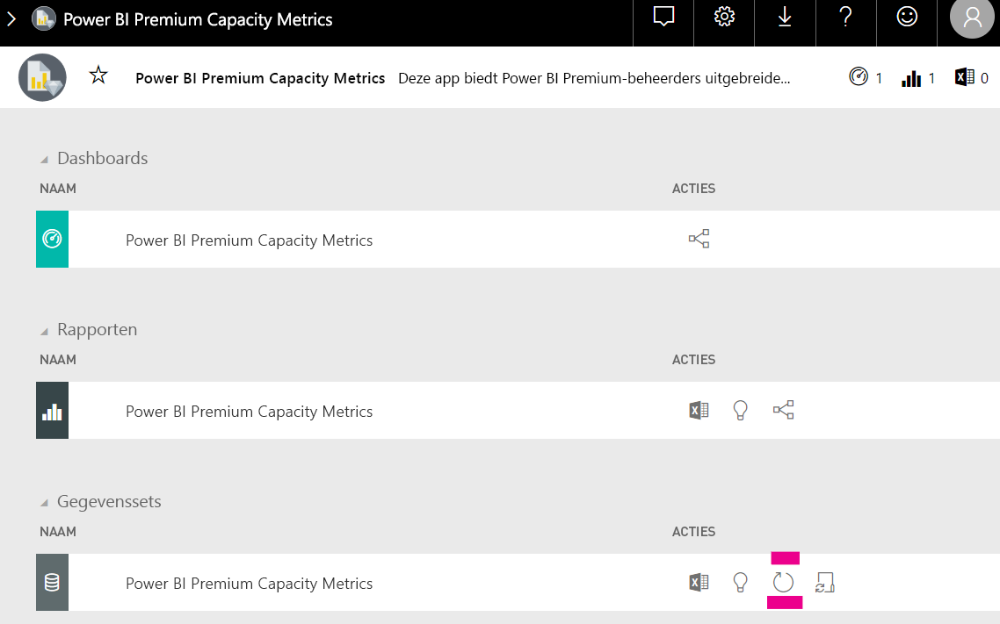

# Capaciteitsplanning in ingesloten Power BI-analyse

Het kan ingewikkeld zijn om te berekenen welk type capaciteit nodig is voor een ingesloten Power BI-analyse-implementatie. Dit komt doordat deze berekening is gebaseerd op meerdere parameters, waarvan enkele er moeilijk te voorspellen zijn.

Enkele van de dingen die u moet overwegen bij het plannen van uw capaciteit zijn:

* De gegevensmodellen die u gebruikt
* Het aantal en de complexiteit van de vereiste query's
* De verdeling van het gebruik van uw toepassing per uur
* Gegevensvernieuwingssnelheden
* Aanvullende gebruikspatronen die moeilijk te voorspellen zijn.

Dit artikel is ontworpen om de capaciteitsplanning voor Power BI Ingesloten analyse te vereenvoudigen, door de introductie van het [toegewezen Power BI-hulpprogramma voor beoordeling van capaciteitsbelasting](https://github.com/microsoft/PowerBI-Tools-For-Capacities/tree/master/LoadTestingPowerShellTool/), gemaakt om het testen van de belasting voor Power BI Ingesloten analyse-capaciteiten te automatiseren (*A*-, *EM*- of *P*-SKU's).

## Planningsprogramma

 Met het [toegewezen Power BI-hulpprogramma voor beoordeling van capaciteitsbelasting](https://github.com/microsoft/PowerBI-Tools-For-Capacities/tree/master/LoadTestingPowerShellTool/) kunt u zien hoeveel gebruikersbelasting met uw capaciteit kan worden verwerkt. Met behulp van PowerShell kunnen geautomatiseerde belastingtests worden gemaakt op basis van uw capaciteit, en kunt u kiezen welke rapporten u wilt testen en hoeveel gelijktijdige gebruikers u wilt simuleren.

Het hulpprogramma genereert belasting bij een capaciteit door voortdurend elk rapport te renderen met nieuwe filterwaarden (om onrealistische goede prestaties door rapportcaching te voorkomen), totdat de token die is vereist voor verificatie van het hulpprogramma voor de service, is verlopen.

### Het planningsprogramma gebruiken

Houd bij de uitvoering van het hulpprogramma rekening met de bestaande belasting van uw capaciteit en zorg ervoor dat u belastingtests niet uitvoert op momenten van piekgebruik.

Hier volgen enkele voorbeelden van hoe u het planningsprogramma kunt gebruiken.

* Capaciteitsbeheerders krijgen meer inzicht in het aantal gebruikers dat met hun capaciteit in een bepaald tijdsbestek kan worden verwerkt.
* Rapportontwerpers krijgen inzicht in het effect van gebruikersbelasting, zoals gemeten met de [Performance Analyzer](https://docs.microsoft.com/power-bi/desktop-performance-analyzer) op het bureaublad van Power BI.
* U kunt de rendering in realtime in uw browser volgen.
* Met SQL Server Profiler kunt u [verbinding maken met de XMLA-eindpunten](https://powerbi.microsoft.com/blog/power-bi-open-platform-connectivity-with-xmla-endpoints-public-preview/) van de gemeten capaciteit, om te zien welke query's er worden uitgevoerd.
* De effecten van de belastingtests worden weergegeven op de pagina Gegevenssets van de Premium-app die metrische gegevens van de capaciteit genereert. Capaciteitsbeheerders kunnen dit hulpprogramma gebruiken om belasting te genereren en te zien hoe deze belasting wordt weergegeven.

### De testresultaten controleren

Volg onderstaande instructies als u de effecten van de belastingtest in de metrische app wilt bekijken nadat de test is uitgevoerd. Houd rekening met een interval van maximaal vijftien minuten vanaf het moment waarop de test de belasting begint te genereren tot het moment waarop de belasting in de metrische gegevens wordt weergegeven.

1. Vouw het tabblad **Gegevenssets** van de landingspagina van de [metrische app](../../service-admin-premium-monitor-capacity.md) uit.
2. U kunt een vernieuwing activeren door op **Nu vernieuwen** te klikken. Beheerders moeten dit doen.

    

## GitHub-opslagplaats voor Power BI-capaciteitsprogramma's

De [GitHub-opslagplaats voor Power BI capaciteitsprogramma's](https://github.com/microsoft/PowerBI-Tools-For-Capacities) is gemaakt voor het hosten van het hulpprogramma voor capaciteitsplanning en andere toekomstige hulpmiddelen en -hulpprogramma's.

De opslagplaats is open source en gebruikers worden aangemoedigd om bijdragen te leveren, extra hulpprogramma's toe te voegen die betrekking hebben op Power BI Premium en Embedded-capaciteit, en die de bestaande mogelijk verbeteren.

## Volgende stappen

> [!div class="nextstepaction"]
>[Capaciteit en SKU's in Power BI Embedded-analyses](embedded-capacity.md)

> [!div class="nextstepaction"]
>[Aanbevolen procedures voor Power BI Embedded](embedded-performance-best-practices.md)