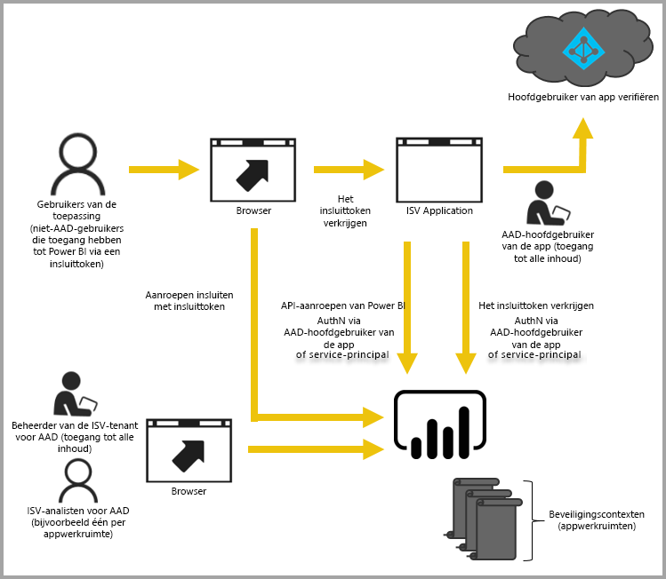

# Ingesloten analyses met Power BI

De Power BI-service (SaaS) en de Power BI Embedded-service in Azure (PaaS) bevatten API's voor het insluiten van uw dashboards en rapporten. Wanneer u inhoud insluit, hebt u hiermee toegang tot de nieuwste functies van Power BI, zoals dashboards, gateways en werkruimten.

U kunt het [installatieprogramma voor insluiten](https://aka.ms/embedsetup) uitvoeren om snel aan de slag te gaan en een voorbeeldtoepassing te downloaden.

Kies de oplossing die het beste bij u past:

* [Met het insluiten van inhoud voor uw organisatie](embedding.md#embedding-for-your-organization) kunt u Power BI-service uitbreiden. Implementeer hiervoor oplossing [Insluiten voor uw organisatie](https://aka.ms/embedsetup/UserOwnsData).
* Met [Insluiten voor uw klanten](embedding.md#embedding-for-your-customers) kunt u dashboards en rapporten insluiten voor gebruikers die geen Power BI-account hebben. Hiervoor moet u de oplossing [Insluiten voor uw klanten](https://aka.ms/embedsetup/AppOwnsData) implementeren.

## API's gebruiken

Er zijn twee hoofdscenario's voor het insluiten van Power BI-inhoud:
- Inhoud insluiten voor gebruikers van uw organisatie (die een Power BI-licentie hebben). 
 
- Inhoud insluiten voor uw gebruikers en klanten zonder dat een Power BI-licentie is vereist. 

U kunt beide scenario’s uitvoeren met de [Power BI REST API](https://docs.microsoft.com/rest/api/power-bi/).

Voor klanten en gebruikers zonder een Power Bi-licentie kunt u met dezelfde API dashboards en rapporten insluiten in uw aangepaste toepassing voor zowel uw organisatie als uw klanten. Uw klanten zien de gegevens die met de toepassing worden beheerd. De Power BI-gebruikers in uw organisatie hebben daarnaast aanvullende opties om *hun gegevens* rechtstreeks in Power BI of in de context van de ingesloten toepassing weer te geven. U kunt profiteren van de JavaScript- en REST-API's voor uw behoeften bij het insluiten van inhoud.

Zie het [Insluitvoorbeeld voor JavaScript](https://microsoft.github.io/PowerBI-JavaScript/demo/) als u wilt begrijpen hoe insluiten werkt.

## Inhoud insluiten voor uw organisatie

**Met het insluiten van inhoud voor uw organisatie** kunt u Power BI-service uitbreiden. Voor dit type insluiting moeten de gebruikers van uw toepassing zich aanmelden bij de Power BI-service om de inhoud weer te geven. Als iemand in uw organisatie zich heeft aangemeld, heeft hij alleen toegang tot zijn eigen dashboards en rapporten of de dashboards en rapporten die met hem zijn gedeeld in de Power BI-service.

Voorbeelden van insluitingen voor uw organisatie zijn interne toepassingen, zoals [SharePoint Online](https://powerbi.microsoft.com/blog/integrate-power-bi-reports-in-sharepoint-online/), [Microsoft Teams-integratie (hiervoor moet u beheerdersrechten hebben)](https://powerbi.microsoft.com/blog/power-bi-teams-up-with-microsoft-teams/) en [Microsoft Dynamics](https://docs.microsoft.com/dynamics365/customer-engagement/basics/add-edit-power-bi-visualizations-dashboard).

Zie voor informatie over insluiten voor uw organisatie [Zelfstudie: Power BI-inhoud insluiten in een toepassing voor uw organisatie](embed-sample-for-your-organization.md).

Mogelijkheden voor selfservice, zoals bewerken, opslaan en meer, zijn beschikbaar via de [JavaScript-API](https://github.com/Microsoft/PowerBI-JavaScript) wanneer u inhoud insluit voor Power BI-gebruikers.

U kunt het [installatieprogramma voor insluiten](https://aka.ms/embedsetup/UserOwnsData) uitvoeren om aan de slag te gaan en een voorbeeldtoepassing te downloaden waarmee u een rapport voor uw organisatie leert integreren.

## Inhoud voor uw klanten insluiten

**Door inhoud voor uw klanten in te sluiten** kunt u dashboards en rapporten insluiten voor gebruikers die geen Power BI-account hebben. Dit type insluiting wordt ook wel aangeduid als *Power BI Embedded*.

[Power BI Embedded](azure-pbie-what-is-power-bi-embedded.md) is een **Microsoft Azure**-service waarmee onafhankelijke softwareleveranciers (ISV's) en ontwikkelaars snel visuals, rapporten en dashboards in een toepassing kunnen insluiten. Deze insluiting vindt plaats via een op capaciteit gebaseerd model waarvoor per uur kosten in rekening worden gebracht.

Power BI Embedded biedt voordelen voor ISV's, ontwikkelaars en klanten. Een ISV kan bijvoorbeeld gratis visuals maken met Power BI Desktop. ISV's kunnen creaties ook sneller op de markt brengen omdat ze minder tijd hoeven te besteden aan het ontwikkelen van visuals én ze onderscheiden zich van de concurrentie omdat ze een verfrissende gegevenservaring bieden. ISV's kunnen er ook voor kiezen extra kosten in rekening te brengen voor de meerwaarde die de ingesloten analysemogelijkheden bieden.

Met Power BI Embedded hebben uw klanten geen voorkennis over Power BI nodig. U kunt twee verschillende methoden gebruiken om een ingesloten toepassing te maken:
- Power BI Pro-account 
- Service-principal 

Het Power BI Pro-account fungeert als het hoofdaccount van uw toepassing (dit is vergelijkbaar met een proxyaccount). Met dit account kunt u ook insluittokens genereren die toegang bieden tot de Power BI-dashboards en -rapporten van uw toepassing.

Met een [service-principal](embed-service-principal.md) kan Power BI-inhoud worden ingesloten in een toepassing met behulp van een token dat **alleen voor een app kan worden gebruikt**. Daarnaast kunt u hiermee insluittokens genereren die toegang bieden tot de Power BI-dashboards en -rapporten van uw toepassing.

Ontwikkelaars die Power BI Embedded gebruiken, kunnen hun tijd besteden aan het bouwen van de kernfunctionaliteit van hun toepassing in plaats van aan het ontwikkelen van visuals en analysemogelijkheden. Ze kunnen snel reageren op verzoeken van klanten om dashboards en rapporten en ze kunnen eenvoudig inhoud insluiten aan de hand van volledig gedocumenteerde API's en SDK's. Door het verkennen van gegevens eenvoudig te maken in apps, kunnen ISV's ervoor zorgen dat klanten op welk apparaat dan ook snel goede beslissingen kunnen nemen in de juiste context.

> [!IMPORTANT]
> Hoewel voor het insluiten van inhoud de Power BI-service is vereist, hoeven uw klanten niet over een Power BI-account te beschikken om de ingesloten inhoud van uw toepassing weer te geven. 

Wanneer u klaar bent om tot productie over te gaan, moet uw werkruimte worden toegewezen aan een toegewezen capaciteit. Power BI Embedded in Microsoft Azure biedt [toegewezen capaciteiten](azure-pbie-create-capacity.md) voor gebruik met uw toepassingen.

Zie [Power BI-inhoud insluiten](embed-sample-for-customers.md) voor meer informatie over het insluiten van inhoud.

## Volgende stappen

U kunt nu proberen om Power BI-inhoud in te sluiten in een toepassing of Power BI-inhoud in te sluiten voor uw klanten.

> [!div class="nextstepaction"]
> [Insluiten voor uw organisatie](embed-sample-for-your-organization.md)

> [!div class="nextstepaction"]
> [Wat is Power BI Embedded?](azure-pbie-what-is-power-bi-embedded.md)

> [!div class="nextstepaction"]
>[Insluiten voor uw klanten](embed-sample-for-customers.md)

Hebt u nog vragen? [Misschien dat de Power BI-community het antwoord weet](https://community.powerbi.com/)
