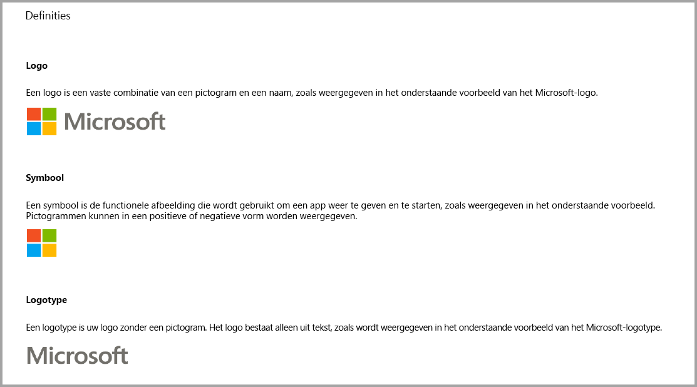
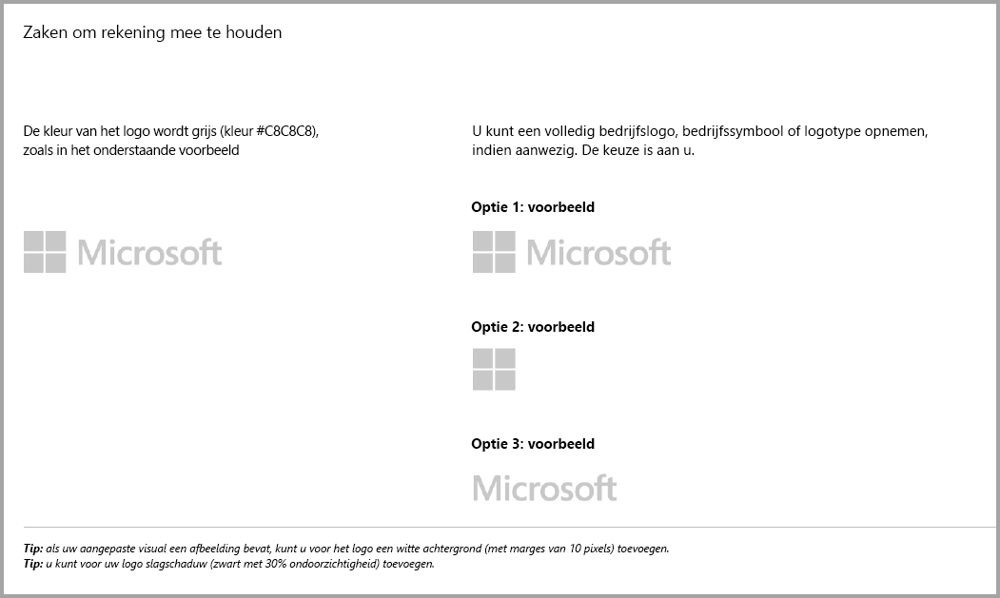
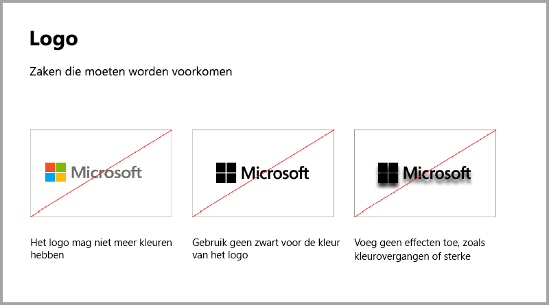
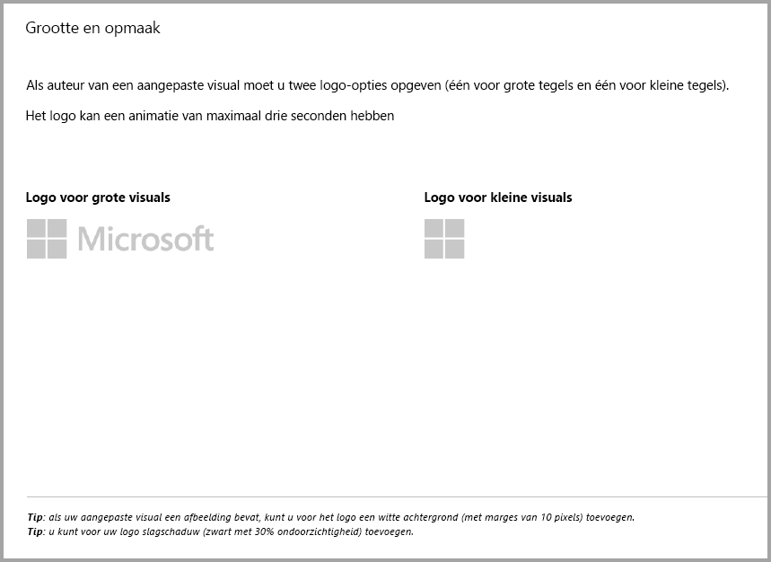
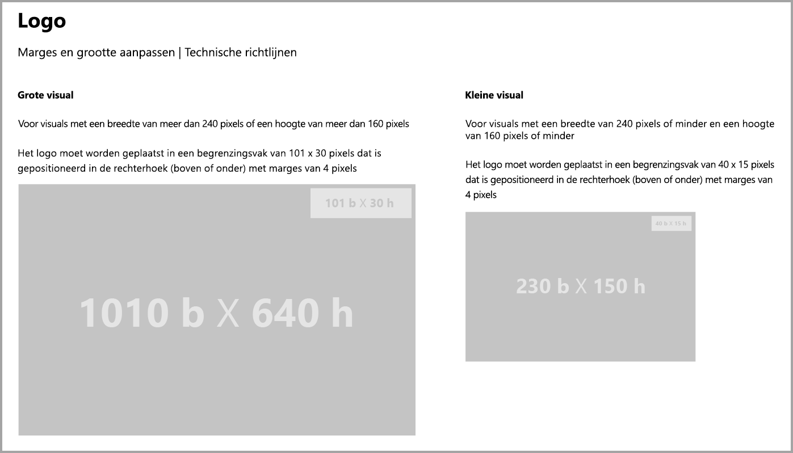
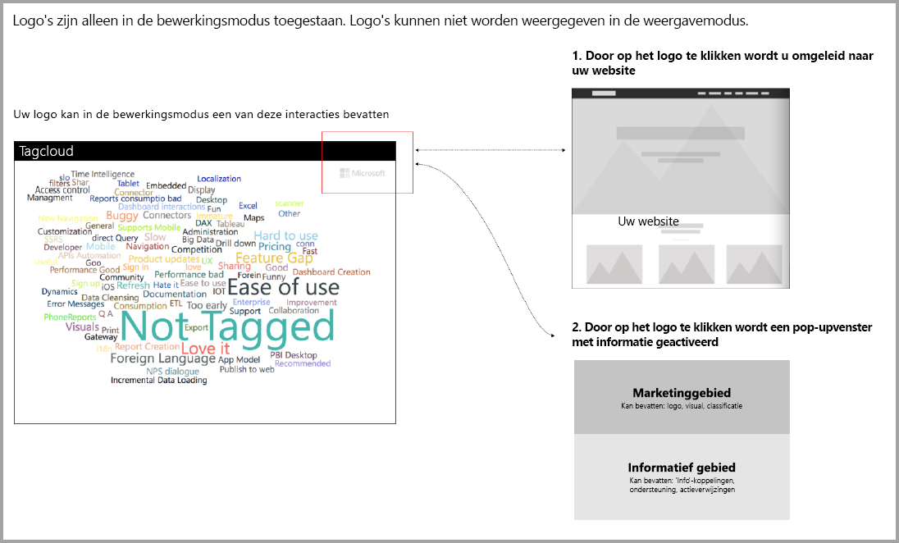

# Richtlijnen voor Power BI-visuals
Voordat u uw visual in AppSource [publiceert](https://docs.microsoft.com/power-bi/developer/office-store), zodat anderen deze kunnen detecteren en gebruiken, moet u ervoor zorgen dat u de richtlijnen volgt om een geweldige ervaring voor uw gebruikers te creëren. 

## Contextmenu
Het contextmenu is het snelmenu dat wordt weergegeven wanneer de gebruiker een visual aanwijst.
Met alle Power BI-visuals moet er een uniforme ervaring kunnen worden geboden in het contextmenu. Raadpleeg [dit artikel](https://github.com/Microsoft/PowerBI-visuals/blob/gh-pages/tutorials/building-bar-chart/adding-context-menu-to-the-bar.md) voor meer informatie over het toevoegen van een contextmenu.

## Richtlijnen voor logo's
> [!NOTE]
> Het woord logo in dit artikel refereert aan elk pictogram van een commercieel bedrijf zoals is beschreven in de onderstaande afbeeldingen. 

In deze sectie worden de specificaties voor het toevoegen van logo's in Power BI-visuals beschreven. Logo’s zijn niet verplicht. Als ze wel worden toegevoegd, moeten deze richtlijnen worden gevolgd. 

> [!IMPORTANT]
> Logo's zijn alleen in de *bewerkingsmodus* toegestaan. Logo's kunnen *niet* worden weergegeven in de weergavemodus.

Informatieve pictogrammen in de leesmodus, indien aanwezig, moeten voldoen aan de kleur, grootte en locaties van de bovenstaande logo's.

## Richtlijnen voor Power BI-visuals met extra aankopen

Tot voor kort accepteerde de Marketplace (AppSource) alleen gratis Power BI-visuals. Dit beleid is gewijzigd (december 2018), zodat u ook visuals naar AppSource kunt verzenden met de aanduiding 'Mogelijk extra aankoop vereist'. 

Visuals met de aanduiding ‘Mogelijk extra aankoop vereist’ zijn vergelijkbaar met IAP-invoegtoepassingen (in-app aankoop) in de Office Store. Ontwikkelaars kunnen deze visuals ook indienen voor certificering nadat ze door het AppSource-team zijn goedgekeurd en nadat is gecontroleerd of ze aan de vereisten voor certificering voldoen. Raadpleeg [Gecertificeerde Power BI-visuals](../power-bi-custom-visuals-certified.md) voor meer informatie over deze vereisten.

> [!NOTE]
> Visuals kunnen alleen worden gecertificeerd als deze geen toegang hebben tot externe services of resources.

>[!IMPORTANT]  
> Als u uw visual bijwerkt van gratis naar 'Mogelijk extra aankoop vereist', moeten gebruikers hetzelfde niveau van gratis functionaliteit als van voor de update krijgen. Behalve de bestaande gratis functies kunt u ook optionele, geavanceerde, betaalde functies toevoegen. U wordt aangeraden om IAP-visuals met geavanceerde functies als nieuwe visuals in te dienen en niet de bestaande, gratis exemplaren bij te werken.

## Wat is er veranderd in het indieningsproces?

Ontwikkelaars uploaden hun IAP-visuals naar AppSource via het Verkopersdashboard, zoals ze dat ook al deden voor gratis visuals. Om aan te geven dat de ingediende visual over IAP-functies beschikt, moeten ontwikkelaars op het Verkopersdashboard de opmerking 'Visual met in-app aankoop' toevoegen. Bovendien moeten ontwikkelaars een licentiesleutel of token opgeven zodat het validatieteam de IAP-functies kan valideren. Nadat de visual is gevalideerd en goedgekeurd, wordt bij de prijsopties in de AppSource-vermelding voor de IAP-visual 'Mogelijk extra aankoop vereist' vermeld.

## Wat is een Power BI-visual met IAP-functies?

Een IAP-visual is een *gratis* visual die *gratis functies* biedt. Zo'n visual bevat ook enkele geavanceerde functies waarvoor extra kosten in rekening kunnen worden gebracht als u ze wilt gebruiken. In de beschrijving van de visual moet de ontwikkelaar informatie geven over de functies waarvoor extra aankopen moeten worden gedaan als u ze wilt gebruiken. Op dit moment biedt Microsoft geen systeemeigen API's voor de ondersteuning van aankopen van apps en invoegtoepassingen.

Voor deze aankopen kunnen ontwikkelaars een extern betalingssysteem gebruiken. Zie ons [beleid voor de Store](https://docs.microsoft.com/office/dev/store/validation-policies#2-apps-or-add-ins-can-display-certain-ads) voor meer informatie.

> [!NOTE]
> Watermerken zijn niet toegestaan voor de gratis functies of gratis visuals. Watermerken kunnen alleen worden gebruikt op betaalde functies die onder een geldige licentie worden gebruikt. We raden u aan een pop-upvenster weer te geven met alle informatie met betrekking tot licenties, als de geavanceerde betaalde functies zonder een geldige licentie worden gebruikt.  

## Aanbevolen procedures

### Landingspagina van visual

Gebruik de landingspagina om gebruikers te informeren hoe zij uw visual kunnen gebruiken en waar ze de licentie kunnen aanschaffen. Sluit geen video's in die automatisch worden geactiveerd. Voeg uitsluitend materiaal toe dat helpt de gebruikerservaring te verbeteren, zoals informatie of koppelingen naar details over de aankoop van licenties en instructies voor het gebruik van de IAP-functies.

### Licentiesleutel en token

Voor het gemak van de gebruiker kunt u boven in het deelvenster Opmaak velden voor licentiesleutels of tokens toevoegen.

## Veelgestelde vragen

Voor meer informatie over visuals gaat u naar [Veelgestelde vragen over visuals met extra aankopen](https://docs.microsoft.com/power-bi/power-bi-custom-visuals-faq#visuals-with-additional-purchases).

## Volgende stappen

Meer informatie over het publiceren van aangepaste visuals naar [AppSource](office-store.md), zodat anderen deze kunnen gebruiken.
