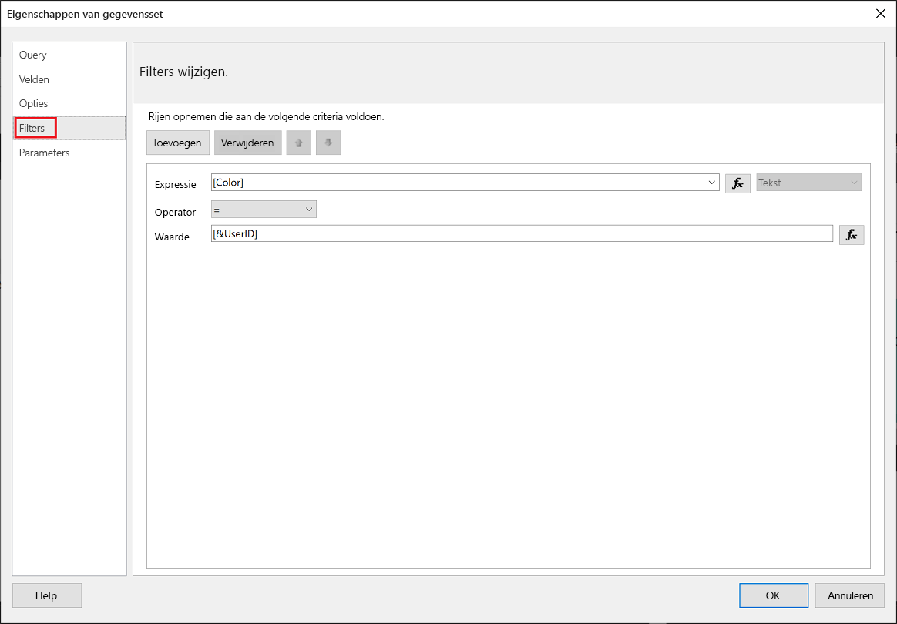
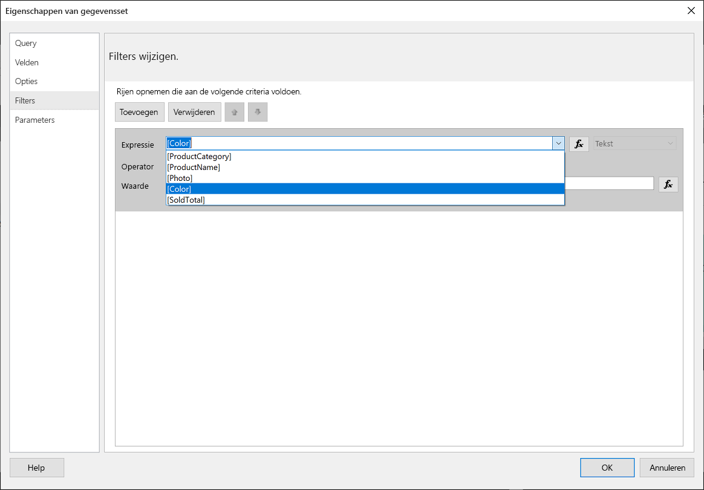
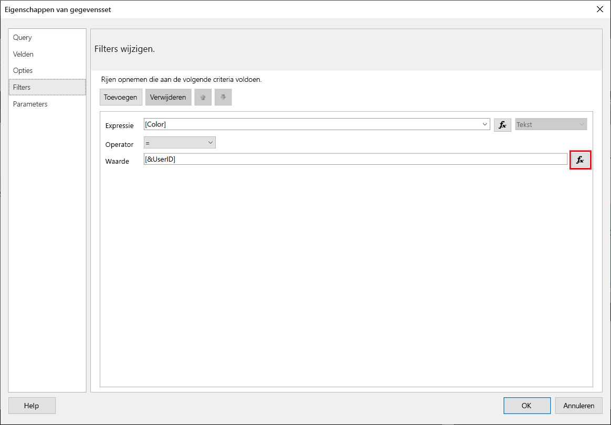
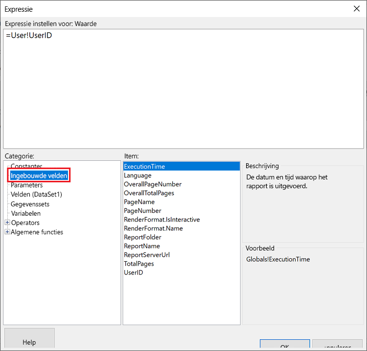
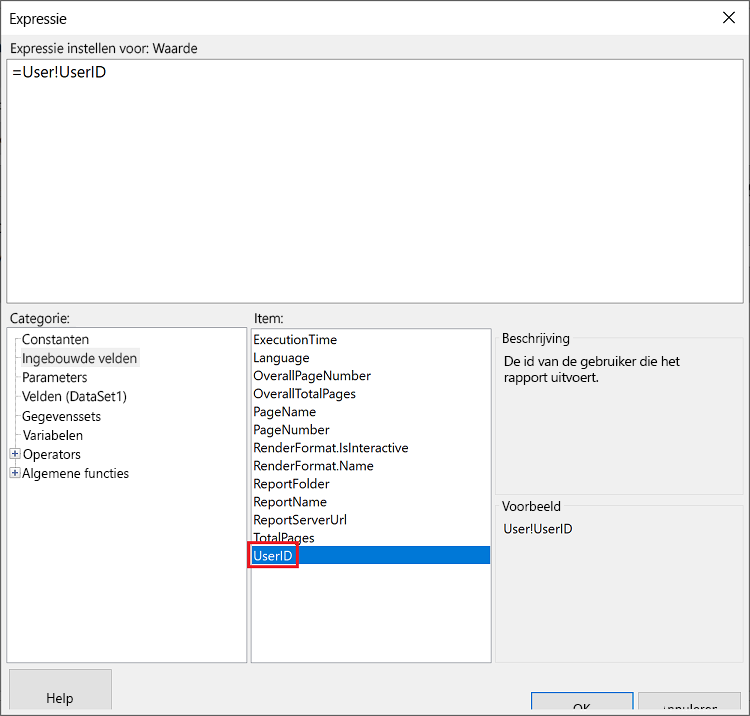
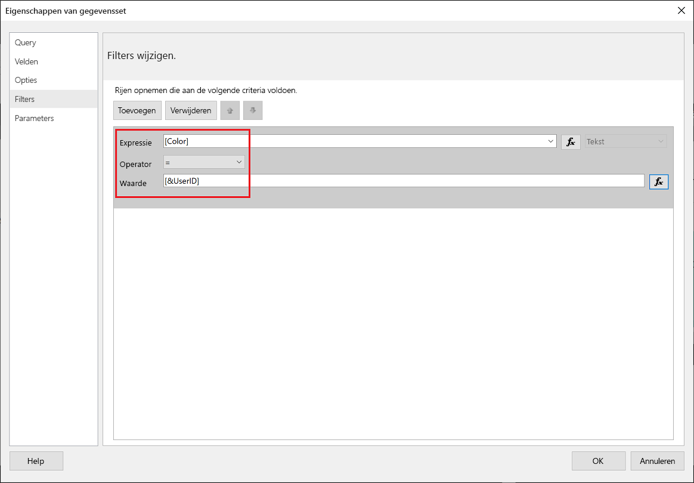
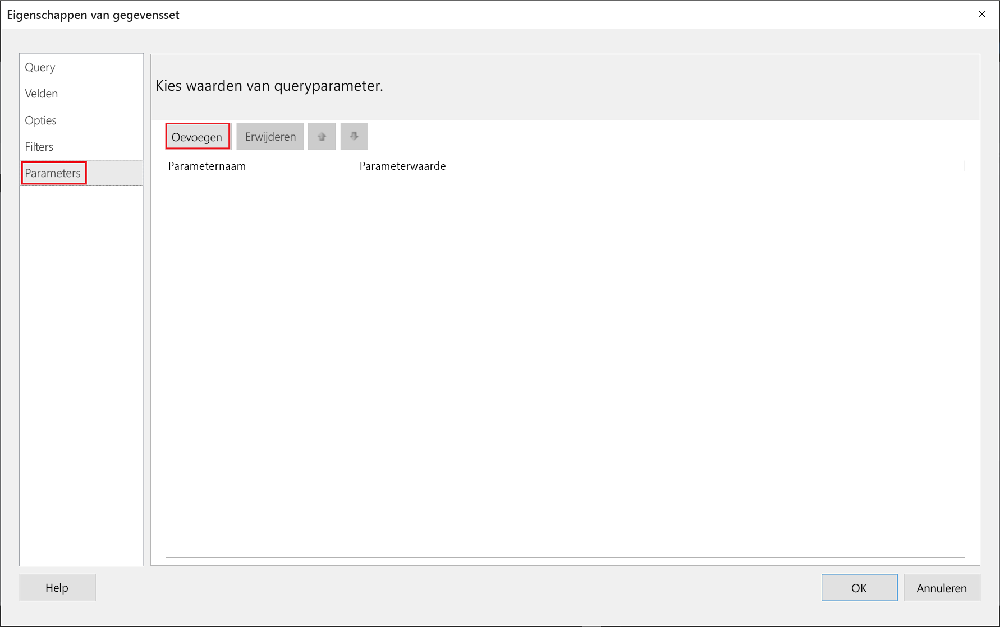
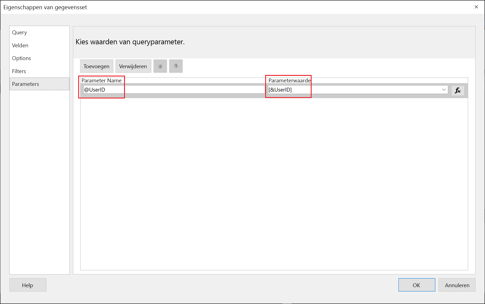
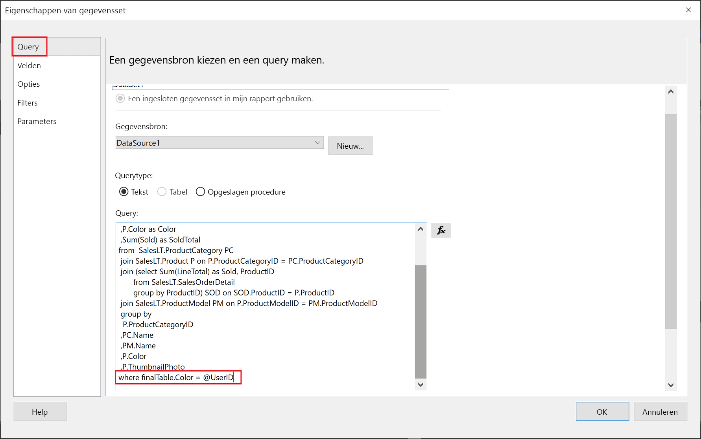

# <a name="implementing-row-level-security-in-embedded-paginated-reports-preview"></a>Beveiliging op rijniveau implementeren in ingesloten gepagineerde rapporten (preview)

Wanneer u een gepagineerd rapport insluit, kunt u bepalen welke gegevens worden weergegeven. Zo kunt u de weergegeven informatie per gebruiker aanpassen. Als u bijvoorbeeld een gepagineerd Power BI-rapport met algemene verkoopresultaten hebt, kunt u dit insluiten zodat alleen de verkoopresultaten van een bepaalde regio beschikbaar zijn.

Deze functie biedt een veilige manier om een subset van de gegevens weer te geven op een manier die de rest van de gegevens niet in gevaar brengt. Dit lijkt op de functie [Beveiliging op rijniveau (RLS)](embedded-row-level-security.md), waarmee u over een veilige manier beschikt om gegevens in Power BI-rapporten (die niet zijn gepagineerd), dashboards, tegels en gegevenssets weer te geven.  

> [!Note]
> Deze functie werkt met het insluiten van gepagineerde rapporten voor klanten.

## <a name="configuring-a-parameter-to-filter-the-dataset"></a>Een parameter configureren om de gegevensset te filteren

Wanneer u beveiliging op rijniveau toepast op een gepagineerd Power BI-rapport, moet u een [parameter](../report-builder-parameters.md) toewijzen aan het kenmerk **UserID**. Met deze parameter worden de gegevens die worden opgehaald uit de gegevensset beperkt voordat het rapport wordt ingesloten.

Nadat u de parameter hebt toegewezen aan **UserID**, gebruikt u de API [Reports GenerateTokenForCreateInGroup](https://docs.microsoft.com/rest/api/power-bi/embedtoken/reports_generatetokenforcreateingroup) om het insluittoken op te halen.

## <a name="use-userid-as-a-filter-at-report-or-query-level"></a>UserID gebruiken als filter op rapport- of queryniveau

U kunt **UserId** als een *filter* of in een *query* gebruiken voor de gegevensbron in [Gepagineerde Report Builder voor Power BI](../report-builder-power-bi.md).

### <a name="using-the-filter"></a>Het filter gebruiken

1. Selecteer **Filter** in het linkerdeelvenster van het venster **Eigenschappen van gegevensset**.

    

2. Selecteer in het vervolgkeuzemenu **Expressie** de parameter die u wilt gebruiken voor het filteren van de gegevens.

     

3. Klik op de functieknop **Waarde**. 

    

4. Selecteer in het venster **Expressie** in de lijst **Categorie** de optie **Ingebouwde velden**.

    

5. Selecteer in de lijst **Item** de optie **UserID** en klik op **OK**.

    

6. Controleer in het venster **Eigenschappen van gegevensset** of de expressie *uw geselecteerde parameter = UserID* is en klik op **OK**.

    

### <a name="using-a-query"></a>Een query gebruiken

1. Selecteer in het venster **Eigenschappen van gegevensset** vanuit het linkerdeelvenster **Parameters** en klik vervolgens op **Toevoegen**.

    

2. Voer in **Parameternaam** **\@UserID** in, en voeg in het veld **Parameterwaarde** **[&UserID]** toe.

     

3. Selecteer in het linkerdeelvenster **Query**, voeg in de query de parameter **UserID** toe als onderdeel van uw query en klik op **OK**.
    > [!NOTE]
    > In de onderstaande schermopname wordt de kleurparameter als voorbeeld gebruikt (whereFinalTable. Color = @UserID). Het is indien nodig mogelijk om een complexere query te maken.

    

## <a name="passing-the-configured-parameter-using-the-embed-token"></a>De geconfigureerde parameter doorgeven met het insluittoken

Wanneer u een gepagineerd rapport voor uw klanten insluit, wordt de API [Reports GenerateTokenForCreateInGroup](https://docs.microsoft.com/rest/api/power-bi/embedtoken/reports_generatetokenforcreateingroup) gebruikt om het insluittoken op te halen. Dit token kan ook worden gebruikt om een deel van de gegevens die uit het gepagineerde rapport worden opgehaald te filteren.

Als u slechts een deel van de gegevens beschikbaar wilt maken, wijst u het veld `username` toe met de informatie die u wilt weergeven. Als u bijvoorbeeld in een gepagineerd rapport met een kleurparameter *groen* in het veld `username` invoert, beperkt het insluittoken de ingesloten gegevens tot het weergeven van alleen gegevens die de waarde *groen* in de kolomkleur hebben.

```JSON
{
    "accessLevel": "View",
    "reportId": "cfafbeb1-8037-4d0c-896e-a46fb27ff229",
    "identities": [
            {
                    // Replace the 'username' with a paginated report parameter
                    "username":     "...",
                    "reports: [
                        "cfafbeb1-8037-4d0c-896e-a46fb27ff229"
                    ]
            }
    ]
}
```
