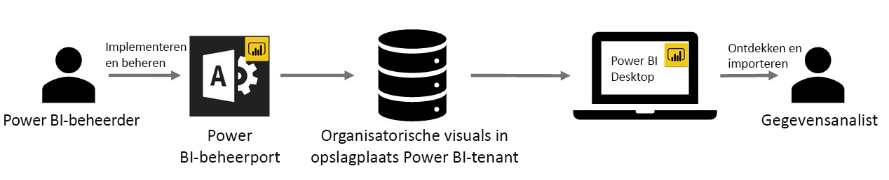

# Organisatievisuals in Power BI

U kunt Power BI-visuals gebruiken in Power BI om een uniek soort visual te maken die aan uw behoeften is aangepast. Power BI-visuals worden door ontwikkelaars gemaakt wanneer het grote aantal visuals in Power BI niet helemaal aan de behoefte voldoet.

In sommige organisaties zijn Power BI-visuals nog belangrijker. Ze kunnen nodig zijn om bepaalde gegevens of inzichten die uniek zijn voor de organisatie naar voren te brengen, hebben misschien speciale vereisten voor gegevens of kunnen unieke methoden van het bedrijf onderstrepen. Zulke organisaties moeten Power BI-visuals ontwikkelen, die in de hele organisatie delen en ervoor zorgen dat ze goed worden onderhouden. Met Power BI-visuals kunnen organisaties precies dat doen.

De volgende afbeelding toont via welk proces Power BI-visuals voor organisaties in Power BI vanaf de beheerder, via ontwikkeling en onderhoud, ten slotte allemaal bij de gegevensanalist aankomen.

Organisatievisuals worden door de Power BI-beheerder geïmplementeerd en beheerd vanuit de beheerportal. Zodra de visuals in de opslagplaats van de organisatie zijn geïmplementeerd, kunnen gebruikers in de organisatie de visuals eenvoudig vinden en de Power BI-visuals voor organisaties direct vanuit Power BI Desktop in hun rapporten importeren.

Raadpleeg het volgende artikel voor meer informatie over het gebruik van Power BI-organisatievisuals in rapporten die u hebt gemaakt: [Meer informatie over organisatievisuals importeren in uw rapporten](power-bi-custom-visuals.md).

## Power BI-visuals voor organisaties beheren

Raadpleeg het volgende artikel voor meer informatie over het beheren en implementeren van Power BI-visuals in uw organisatie: [Meer informatie over de implementatie en het beheer van Power BI-visuals voor organisaties](https://go.microsoft.com/fwlink/?linkid=866790).

> [!WARNING]
> Een aangepaste visual kan code bevatten met beveiligings- of privacyrisico's. Ga na of u de auteur en de bron van een aangepaste visual vertrouwt voordat u deze implementeert in de opslagplaats van de organisatie.

## Overwegingen en beperkingen

Er zijn enkele overwegingen en beperkingen waarmee u rekening moet houden.

Beheerder:

* Verouderde Power BI-visuals (zoals Power BI-visuals die niet met de nieuwe API-versies zijn ontwikkeld) worden niet ondersteund

* Als een aangepaste visual uit de opslagplaats wordt verwijderd, zullen de bestanden die de verwijderde visual gebruiken, de rendering stoppen. De verwijderingsbewerking vanuit de opslagplaats is niet omkeerbaar. Als u een aangepast visueel element tijdelijk moet uitschakelen, gebruikt u de functie ‘Uitschakelen’.

Eindgebruiker:

* Power BI-visuals voor organisaties zijn persoonlijke visuals die uit de organisatieopslagplaats zijn geïmporteerd. Evenmin als persoonlijke visuals kunnen ze niet worden [geëxporteerd naar PowerPoint](https://docs.microsoft.com/power-bi/consumer/end-user-powerpoint) of worden weergegeven in ontvangen e-mails als een gebruiker zich [abonneert op rapportpagina's](https://docs.microsoft.com/power-bi/consumer/end-user-subscribe). Alleen [gecertificeerde Power BI-visuals](https://docs.microsoft.com/power-bi/power-bi-custom-visuals-certified) die rechtstreeks zijn geïmporteerd vanuit de marketplace ondersteunen deze functies.

* De Visio-visual, PowerApps-visual, Map box-visual en GlobeMap-visual uit de AppSource-marketplace worden niet weergegeven als ze worden geïmplementeerd via de opslagplaats van de organisatie.

## Problemen oplossen

Ga naar [Problemen met Power BI-visuals oplossen](power-bi-custom-visuals-troubleshoot.md) voor informatie over het oplossen van problemen.

## Veelgestelde vragen

Ga naar [Veelgestelde vragen over Power BI-visuals](power-bi-custom-visuals-faq.md#organizational-power-bi-visuals) voor meer informatie en antwoorden op vragen.

Hebt u nog vragen? [Misschien dat de Power BI-community het antwoord weet](https://community.powerbi.com/).
