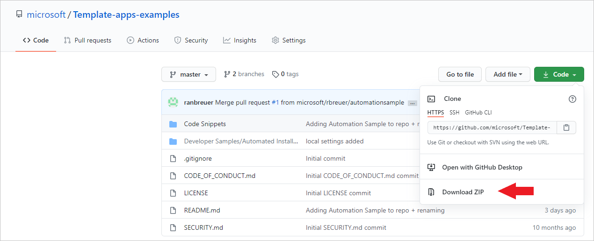
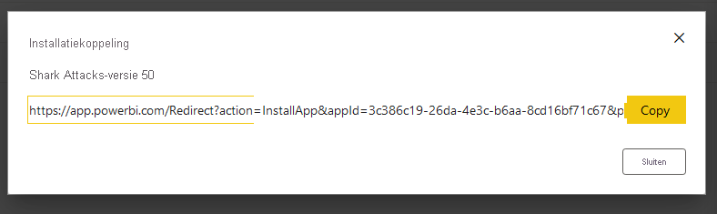
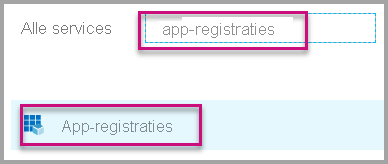
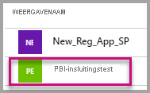
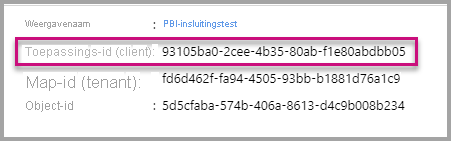
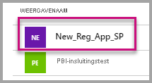
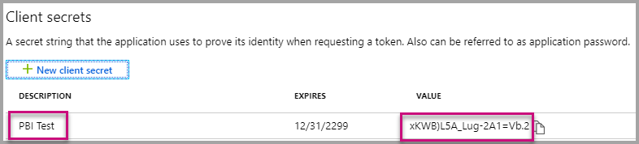

# <a name="tutorial-automate-configuration-of-template-app-installation-using-an-azure-function"></a>Zelfstudie: De configuratie van de installatie van sjabloon-apps automatiseren met een Azure-functie

Sjabloon-apps bieden klanten een uitstekende manier om inzichten te verkrijgen op basis van hun gegevens. Met sjabloon-apps kunnen ze snel aan de slag, doordat ze hiermee worden verbonden met hun gegevens en worden voorzien van vooraf ontworpen rapporten die ze vervolgens eventueel kunnen aanpassen.

Klanten weten niet altijd precies hoe ze verbinding moeten maken met hun gegevens en hoe ze deze gegevens moeten opgeven wanneer ze een sjabloon-app installeren. Dit kan een knelpunt zijn.

Als u een gegevensservicesprovider bent en een sjabloon-app hebt gemaakt om uw klanten te helpen aan de slag te gaan met hun gegevens in uw service, kunt u de installatie van uw sjabloon-app voor hen vereenvoudigen door de configuratie van de parameters van uw sjabloon-app te automatiseren. Wanneer de klant zich aanmeldt bij uw portal, klikken ze op een speciale koppeling die u hebt voorbereid. Hiermee wordt de automatisering gestart, waarbij de benodigde informatie wordt verzameld, de parameters van de sjabloon-app vooraf worden geconfigureerd en de klanten worden omgeleid naar hun Power BI-account waar ze de app kunnen installeren. Ze hoeven daar alleen maar op Installeren te klikken, zich te verifiëren bij de gegevensbron en ze kunnen aan de slag. 

Deze klanttoepassing wordt hieronder afgebeeld.


In deze zelfstudie gebruikt u een voorbeeld van een Azure-functie voor geautomatiseerde installatie die we hebben gemaakt om uw sjabloon-app vooraf te configureren en te installeren. We hebben dit voorbeeld voor demonstratiedoeleinden bewust eenvoudig gehouden. Het omvat de instelling van een Azure-functie zodat gebruik wordt gemaakt van Power BI-API's voor het automatisch installeren van een sjabloon-app en het configureren hiervan voor uw gebruikers.

Voor meer informatie over de algemene automatiseringsstroom en de API's die hierbij worden gebruikt, raadpleegt u [De configuratie van de installatie van een sjabloon-app automatiseren](template-apps-auto-install.md)

Onze eenvoudige app maakt gebruik van een Azure-functie. Zie de [documentatie over Azure-functies](https://docs.microsoft.com/azure/azure-functions/) voor meer informatie over Azure Functions.

## <a name="basic-flow"></a>Basisstroom

Hieronder wordt de basisstroom beschreven van de werking van de app wanneer de klant deze start door op de koppeling in uw portal te klikken.

1. De gebruiker meldt zich aan bij de portal van de onafhankelijke softwareleverancier en klikt op de opgegeven koppeling. Hiermee wordt de stroom gestart. In deze fase bereidt de portal van de onafhankelijke softwareleverancier de gebruikersspecifieke configuratie voor.

2. De onafhankelijke softwareleverancier verkrijgt een token **voor uitsluitend de app** dat is gebaseerd op een [service-principal (token voor uitsluitend de app)](../embedded/embed-service-principal.md), die is geregistreerd in de tenant van de onafhankelijke softwareleverancier.

3. Met behulp van [Power BI REST API's](https://docs.microsoft.com/rest/api/power-bi/) maakt de onafhankelijke softwareleverancier een **installatieticket** dat de configuratie van gebruikersspecifieke parameters bevat die is voorbereid door de onafhankelijke softwareleverancier.

4. De onafhankelijke softwareleverancier stuurt de gebruiker door naar Power BI met behulp van een ```POST```-omleidingsmethode die het installatieticket bevat.

5. De gebruiker wordt omgeleid naar het Power BI-account met het installatieticket en wordt gevraagd om de sjabloon-app te installeren. Wanneer de gebruiker op Installeren klikt, wordt de sjabloon-app geïnstalleerd.

>[!Note]
>Terwijl parameterwaarden worden geconfigureerd door de onafhankelijke softwareleverancier bij het maken van het installatieticket, worden referenties voor de gegevensbron alleen verstrekt door de gebruiker in de laatste stappen van de installatie. Op deze manier wordt voorkomen dat ze worden blootgesteld aan derden en wordt er zo gezorgd voor een beveiligde verbinding tussen de gebruiker en de gegevensbronnen van de sjabloon-app.

## <a name="prerequisites"></a>Vereisten

Voordat u aan de slag gaat, hebt u het volgende nodig:

* Een eigen Azure Active Directory-tenant. Zie [Een Azure Active Directory-tenant maken](https://docs.microsoft.com/power-bi/developer/embedded/create-an-azure-active-directory-tenant) voor instructies voor het instellen hiervan.

* Een [service-principal (token voor uitsluitend de app)](https://docs.microsoft.com/power-bi/developer/embedded/embed-service-principal) die is geregistreerd in de bovenstaande tenant.

* Een geparametriseerde [sjabloon-app](https://docs.microsoft.com/power-bi/connect-data/service-template-apps-overview) die gereed is voor installatie. De sjabloon-app moet worden gemaakt in dezelfde tenant als waarin u uw app registreert in Microsoft Azure Active Directory (Azure AD). Zie [tips voor-sjabloon apps](https://docs.microsoft.com/power-bi/connect-data/service-template-apps-tips) of [Een sjabloon-app maken in Power BI](https://docs.microsoft.com/power-bi/connect-data/service-template-apps-create) voor meer informatie.

* Een **Power BI Pro-licentie**. Als u zich niet hebt geregistreerd voor Power BI Pro, [kunt u zich hier aanmelden voor een gratis proefversie](https://powerbi.microsoft.com/pricing/) voordat u begint.

## <a name="set-up-your-template-apps-automation-development-environment"></a>Uw ontwikkelomgeving voor de automatisering van sjabloon-apps instellen

Voordat u verdergaat met het instellen van uw app, volgt u de instructies in [Quickstart: een Azure Functions-app maken met Azure App Configuration](https://docs.microsoft.com/azure/azure-app-configuration/quickstart-azure-functions-csharp) om een Azure-functie samen met een Azure-appconfiguratie te ontwikkelen. Maak uw appconfiguratie zoals in het artikel wordt beschreven.

### <a name="register-an-application-in-azure-active-directory-azure-ad"></a>Een toepassing registreren in Azure Active Directory (Azure AD)

Maak een service-principal zoals wordt beschreven in [Power BI-inhoud insluiten met een service-principal en een app-geheim](https://docs.microsoft.com/power-bi/developer/embedded/embed-service-principal).

Zorg ervoor dat u de app registreert als een **web-app aan serverzijde**. U registreert een webtoepassing aan de serverzijde om een toepassingsgeheim te maken.

Sla de *app-id* (client-id) en het *app-geheim* (clientgeheim) op voor latere stappen.

U kunt het [installatieprogramma voor insluiten](https://aka.ms/embedsetup/AppOwnsData) uitvoeren om snel aan de slag te gaan met het maken van een app-registratie. Als u het [hulpprogramma voor app-registratie van Power BI](https://app.powerbi.com/embedsetup) gebruikt, selecteert u de optie *Insluiten voor uw klanten*.

## <a name="template-app-preparation"></a>Voorbereiding sjabloon-app

Wanneer u de sjabloon-app hebt gemaakt en deze gereed is voor installatie, slaat u de volgende informatie op voor de volgende stappen:

* *App-id*, *pakketsleutel*, *eigenaar-id* zoals deze worden weergegeven in de installatie-URL aan het einde van het proces [De eigenschappen van de sjabloon-app definiëren](../../connect-data/service-template-apps-create.md#define-the-properties-of-the-template-app) toen de app werd gemaakt.

    U kunt dezelfde koppeling ook verkrijgen door op **Koppeling ophalen** te klikken in het [releasebeheer](../../connect-data/service-template-apps-create.md#manage-the-template-app-release) van de sjabloon-app.

* *Parameternamen* zoals deze in de gegevensset van de sjabloon-app worden gedefinieerd. Parameternamen zijn hoofdlettergevoelige tekenreeksen en kunnen ook worden opgehaald van het tabblad **Parameterinstellingen** wanneer u [de eigenschappen van de sjabloon-app definieert](../../connect-data/service-template-apps-create.md#define-the-properties-of-the-template-app) of uit de instellingen van de gegevensset in Power BI.

>[!NOTE]
>U kunt uw vooraf geconfigureerde installatie-app voor uw sjabloon-app testen als de sjabloon-app gereed is voor installatie, zelfs als deze nog niet openbaar beschikbaar is in AppSource. Als u echter wilt dat gebruikers buiten uw tenant de app voor geautomatiseerde installatie kunnen gebruiken om uw sjabloon-app te installeren, moet de app-sjabloon openbaar beschikbaar zijn in de [Marketplace voor Power BI-apps](https://app.powerbi.com/getdata/services). Voordat u uw sjabloon-app distribueert met behulp van de app voor geautomatiseerde installatie die u maakt, moet u er dus voor zorgen dat deze naar het [Partnercentrum](https://docs.microsoft.com/azure/marketplace/partner-center-portal/create-power-bi-app-offer) wordt gepubliceerd.


## <a name="install-and-configure-your-template-app-using-our-azure-function-sample"></a>Uw sjabloon-app installeren en configureren met behulp van ons voorbeeld van een Azure-functie

In dit gedeelte gebruikt u een voorbeeld van een Azure-functie voor geautomatiseerde installatie die we hebben gemaakt om uw sjabloon-app vooraf te configureren en te installeren. We hebben dit voorbeeld voor demonstratiedoeleinden bewust eenvoudig gehouden. U kunt zo gebruikmaken van een [Azure-functie](https://docs.microsoft.com/azure/azure-functions/functions-overview) en [Azure App Configuration](https://docs.microsoft.com/azure/azure-app-configuration/overview) om de API voor geautomatiseerde installatie eenvoudig te implementeren en te gebruiken voor uw sjabloon-apps.

### <a name="download-visual-studio-version-2017-or-later"></a>Download [Visual Studio](https://www.visualstudio.com/) (versie 2017 of later)

Download [Visual Studio](https://www.visualstudio.com/) (versie 2017 of later). Download het meest recente [NuGet-pakket](https://www.nuget.org/profiles/powerbi).

### <a name="download-the-automated-install-azure-function-sample"></a>Het voorbeeld van de Azure-functie voor geautomatiseerde installatie downloaden

Download het [voorbeeld van de Azure-functie voor geautomatiseerde installatie](https://github.com/microsoft/Template-apps-examples/tree/master/Developer%20Samples/Automated%20Install%20Azure%20Function) uit GitHub om aan de slag te gaan.



### <a name="setup-your-azure-app-configuration"></a>De Azure App Configuration-service instellen

Als u dit voorbeeld wilt uitvoeren, moet u de Azure App Configuration-service instellen met de waarden en sleutels zoals hieronder wordt beschreven. De sleutels zijn de **app-id**, het **app-geheim** en de **app-id** van uw sjabloon-app, de **pakketsleutel** en de **eigenaar-id**. Zie de volgende secties voor informatie over het verkrijgen van deze waarden. 

De sleutels worden ook gedefinieerd in het bestand **Constants.cs**.

| Configuratiesleutel | Betekenis           |
|---------------    |-------------------|
| TemplateAppInstall:Application:AppId | *App-id* uit de [installatie-URL](#getting-the-template-app-properties) |
| TemplateAppInstall:Application:PackageKey | *Pakketsleutel* uit de [installatie-URL](#getting-the-template-app-properties) |
| TemplateAppInstall:Application:OwnerId | *Eigenaar-id* uit de [installatie-URL](#getting-the-template-app-properties) |
| TemplateAppInstall:ServicePrincipal:ClientId | [App-id](#getting-the-application-id) voor de service-principal |
| TemplateAppInstall:ServicePrincipal:ClientSecret | [App-geheim](#getting-the-application-secret) voor de service-principal |
|||


Het bestand **Constants.cs**:


#### <a name="getting-the-template-app-properties"></a>De eigenschappen van de sjabloon-app verkrijgen
Vul alle relevante eigenschappen van de sjabloon-app in zoals deze worden gedefinieerd wanneer de app wordt gemaakt. Deze eigenschappen zijn de **App-id**, **pakketsleutel** & **eigenaar-id** van de sjabloon-app.

Voer de volgende stappen uit om de bovenstaande waarden te verkrijgen:

1. Meld u aan bij [Power BI](https://app.powerbi.com).

2. Ga naar de oorspronkelijke werkruimte van de app.

3. Open het deelvenster Releasebeheer.

    

4. Selecteer de app-versie en haal de installatiekoppeling op.

    

5. Kopieer de koppeling naar het klembord.

    

6. Deze installatie-URL bevat de drie URL-parameters waarvan u de waarden nodig hebt. Gebruik de waarden van **app-id**, **pakketsleutel** & **eigenaar-id** voor de app. Een voorbeeld-URL ziet er ongeveer uit zoals hieronder wordt weergegeven.

    ```html
    https://app.powerbi.com/Redirect?action=InstallApp&appId=3c386...16bf71c67&packageKey=b2df4b...dLpHIUnum2pr6k&ownerId=72f9...1db47&buildVersion=5
    ```

#### <a name="getting-the-application-id"></a>De app-id ophalen

Vul bij **applicationId** de **Toepassings-id** van **Azure** in. De **applicationId** wordt door de toepassing gebruikt om zich te identificeren bij de gebruikers bij wie u machtigingen aanvraagt.

Ga als volgt te werk om de **applicationId** op te halen:

1. Meld u aan bij [Azure Portal](https://portal.azure.com).

2. Selecteer in het navigatievenster links **Alle services** en selecteer **App-registraties**.

    

3. Selecteer de toepassing waarvoor de **applicationID** nodig is.

    

4. U ziet een **toepassings-id** die wordt vermeld als een GUID. Gebruik deze **Toepassings-id** als de **applicationId** voor de toepassing.

    

#### <a name="getting-the-application-secret"></a>Het app-geheim ophalen

Geef de **ApplicationSecret**-gegevens op in de sectie **Sleutels** van de sectie **App-registraties** in **Azure**.  Dit kenmerk werkt wanneer u een [service-principal](../embedded/embed-service-principal.md) gebruikt.

Ga als volgt te werk om de **ApplicationSecret** op te halen:

 1. Meld u aan bij [Azure Portal](https://portal.azure.com).

 2. Selecteer in het navigatievenster links **Alle services** en selecteer **App-registraties**.

    

3. Selecteer de toepassing die de **ApplicationSecret** moet gebruiken.

    

4. Selecteer **Certificaten en geheimen** onder **Beheren**.

5. Selecteer **Nieuwe clientgeheimen**.

6. Voer in het vak **Beschrijving** een naam in en selecteer een duur. Selecteer vervolgens **Opslaan** om de **Waarde** voor uw toepassing op te halen. Wanneer u het deelvenster **Sleutels** sluit nadat u de sleutelwaarde hebt opgeslagen, wordt het waardeveld alleen nog als verborgen weergegeven. Op dat punt kunt u de sleutelwaarde niet meer ophalen. Als u de sleutelwaarde kwijtraakt, kunt u een nieuwe maken in Azure Portal.

    

## <a name="test-your-function-locally"></a>Uw functie lokaal testen

Voer de stappen uit zoals deze staan beschreven in [De functie lokaal uitvoeren](https://docs.microsoft.com/azure/azure-functions/functions-create-your-first-function-visual-studio#run-the-function-locally) om uw functie uit te voeren.

Configureer uw portal zo dat een ```POST```-aanvraag wordt verzonden naar de URL van de functie (bijvoorbeeld ```POST http://localhost:7071/api/install```). De aanvraagbody moet een JSON-object zijn waarin de sleutel-waardeparen worden beschreven, waarbij de sleutels *parameternamen* zijn (gedefinieerd in Power BI Desktop) en de waarden de gewenste waarden zijn die moeten worden ingesteld voor elke parameter in de sjabloon-app.

>[!Note]
> In een productieomgeving worden parameterwaarden voor elke gebruiker afgeleid door de beoogde logica van uw portal.

De gewenste stroom moet zijn:

1. De portal bereidt de aanvraag per gebruiker\sessie voor.
2. ```POST /api/install```-aanvraag wordt naar uw Azure-functie verzonden. De aanvraagbody bestaat uit sleutel-waardeparen, waarbij de sleutel de parameternaam is en de waarde de gewenste waarde is die moet worden ingesteld. 
3. Als alles juist is geconfigureerd, moet de browser automatisch worden omgeleid naar het Power BI-account van de klant en de stroom voor de geautomatiseerde installatie weergeven.
4. Bij de installatie worden parameterwaarden ingesteld zoals is geconfigureerd in stap 1 en 2.
 
## <a name="next-steps"></a>Volgende stappen

### <a name="publish-your-project-to-azure"></a>Uw project naar Azure publiceren

Raadpleeg de [documentatie voor Azure-functies](https://docs.microsoft.com/azure/azure-functions/functions-create-your-first-function-visual-studio#publish-the-project-to-azure) voor instructies over het publiceren van uw project naar Azure, zodat u API's voor de geautomatiseerde installatie van de sjabloon-app kunt integreren in uw product en deze kunt gaan testen in productieomgevingen.
