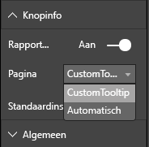

# <a name="tooltips-in-power-bi-visuals"></a>Knopinfo voor Power BI-visuals

Voor visuals kunt u nu gebruikmaken van de knopinfo-ondersteuning van Power BI. Voor Power BI-knopinfo zijn de volgende interacties beschikbaar:

* Knopinfo tonen.
* Knopinfo verbergen.
* Knopinfo verplaatsen.

In de knopinfo kan een tekstelement met een titel, een waarde bij een opgegeven kleur en dekking bij een specifieke set coördinaten worden weergegeven. Deze gegevens worden weergegeven voor de API en in de Power BI-host worden de gegevens op dezelfde manier weergegeven als knopinfo voor systeemeigen visuals wordt getoond.

Knopinfo in een voorbeeld van een staafdiagram wordt weergegeven in de volgende afbeelding:


De bovenstaande knopinfo toont één staafcategorie en waarde. U kunt één knopinfo uitbreiden om meerdere waarden weer te geven.

## <a name="manage-tooltips"></a>Knopinfo beheren

De interface die u gebruikt om knopinfo te beheren is de 'ITooltipService'. Deze interface wordt gebruikt om de host te informeren dat knopinfo moet worden weergegeven, verwijderd of verplaatst.

```typescript
    interface ITooltipService {
        enabled(): boolean;
        show(options: TooltipShowOptions): void;
        move(options: TooltipMoveOptions): void;
        hide(options: TooltipHideOptions): void;
    }
```

Uw visual moet naar de muisbewerkingen binnen uw visual luisteren en waar nodig de gedelegeerde items `show()`, `move()` en `hide()` aanroepen, waarbij de juiste inhoud in de `Tooltip****Options`-objecten is ingevuld.
Met `TooltipShowOptions` en `TooltipHideOptions` wordt vervolgens gedefinieerd wat er moet worden weergegeven en welk gedrag is vereist bij deze gebeurtenissen.

Omdat voor het aanroepen van deze methoden gebruikers actie moeten ondernemen, zoals het verplaatsen van een muis of het drukken op een knop, is het handig om listeners te maken voor deze acties, waarmee vervolgens de `TooltipService`-leden worden aangeroepen.
Onze voorbeeldaggregaties in een klasse met de naam `TooltipServiceWrapper`.

### <a name="the-tooltipservicewrapper-class"></a>De TooltipServiceWrapper-klasse

Deze klasse is met name bedoeld om het exemplaar van de `TooltipService` op te slaan, naar D3-muisacties te luisteren over relevante elementen en vervolgens, indien nodig, de aanroepen naar `show()` en `hide()` van de elementen uit te voeren.

In deze klasse worden relevante statussen en logica voor deze gebeurtenissen opgeslagen en beheerd, die met name zijn gericht op communicatie met de onderliggende D3-code. De D3-communicatie en -conversie worden verder niet behandeld in dit artikel.

U vindt de volledige voorbeeldcode in [opslagplaats SampleBarChart voor visuals](https://github.com/Microsoft/PowerBI-visuals-sampleBarChart/commit/981b021612d7b333adffe9f723ab27783c76fb14).

### <a name="create-tooltipservicewrapper"></a>De TooltipServiceWrapper maken

De BarChart-constructor bevat nu een `TooltipServiceWrapper`-lid, dat in de constructor wordt geïnstantieerd met het `tooltipService`-hostexemplaar.

```typescript
        private tooltipServiceWrapper: ITooltipServiceWrapper;

        this.tooltipServiceWrapper = createTooltipServiceWrapper(this.host.tooltipService, options.element);
```

In de `TooltipServiceWrapper`-klasse is het `tooltipService`-exemplaar opgeslagen, ook als het D3-hoofdelement van de visual- en aanraakparameters.

```typescript
    class TooltipServiceWrapper implements ITooltipServiceWrapper {
        private handleTouchTimeoutId: number;
        private visualHostTooltipService: ITooltipService;
        private rootElement: Element;
        private handleTouchDelay: number;

        constructor(tooltipService: ITooltipService, rootElement: Element, handleTouchDelay: number) {
            this.visualHostTooltipService = tooltipService;
            this.handleTouchDelay = handleTouchDelay;
            this.rootElement = rootElement;
        }
        .
        .
        .
    }
```

Het enige ingangspunt voor deze klasse om gebeurtenislisteners te registreren, is de `addTooltip`-methode.

### <a name="the-addtooltip-method"></a>De addTooltip-methode

```typescript
        public addTooltip<T>(
            selection: d3.Selection<Element>,
            getTooltipInfoDelegate: (args: TooltipEventArgs<T>) => VisualTooltipDataItem[],
            getDataPointIdentity: (args: TooltipEventArgs<T>) => ISelectionId,
            reloadTooltipDataOnMouseMove?: boolean): void {

            if (!selection || !this.visualHostTooltipService.enabled()) {
                return;
            }
        ...
        ...
        }
```

* **selection: d3.Selection<Element>** : De D3-elementen waarmee knopinfo wordt verwerkt.

* **getTooltipInfoDelegate: (args: TooltipEventArgs<T>) => VisualTooltipDataItem[]** : De gedelegeerde voor het invullen van de inhoud van de knopinfo (wat er moet worden weergegeven) per context.

* **getDataPointIdentity: (args: TooltipEventArgs<T>) => ISelectionId**: De gedelegeerde voor het ophalen van de gegevenspunt-id (wordt niet gebruikt in dit voorbeeld). 

* **reloadTooltipDataOnMouseMove? boolean**: Een Booleaanse waarde die aangeeft of de knopinfogegevens moeten worden vernieuwd tijdens een MouseMove-gebeurtenis (wordt niet gebruikt in dit voorbeeld).

Zoals u kunt zien, wordt `addTooltip` afgesloten zonder dat er acties worden uitgevoerd als `tooltipService` is uitgeschakeld of als er geen echte selectie wordt gemaakt.

### <a name="call-the-show-method-to-display-a-tooltip"></a>Aanroep van de weergavemethode om knopinfo weer te geven

Door de `addTooltip`-methode wordt vervolgens naar de D3 `mouseover`-gebeurtenis geluisterd, zoals wordt weer gegeven in de volgende code:

```typescript
        ...
        ...
        selection.on("mouseover.tooltip", () => {
            // Ignore mouseover while handling touch events
            if (!this.canDisplayTooltip(d3.event))
                return;

            let tooltipEventArgs = this.makeTooltipEventArgs<T>(rootNode, true, false);
            if (!tooltipEventArgs)
                return;

            let tooltipInfo = getTooltipInfoDelegate(tooltipEventArgs);
            if (tooltipInfo == null)
                return;

            let selectionId = getDataPointIdentity(tooltipEventArgs);

            this.visualHostTooltipService.show({
                coordinates: tooltipEventArgs.coordinates,
                isTouchEvent: false,
                dataItems: tooltipInfo,
                identities: selectionId ? [selectionId] : [],
            });
        });
```

* **makeTooltipEventArgs**: Hiermee wordt de context afgeleid van de geselecteerde D3-elementen in een tooltipEventArgs. Ook worden de coördinaten berekend.

* **getTooltipInfoDelegate**: Vervolgens wordt de inhoud van de knopinfo opgebouwd vanuit de tooltipEventArgs. Dit is een callback naar de BarChart-klasse, aangezien dit de logica van de visual is. Het is de daadwerkelijke tekstinhoud die in de knopinfo moet worden weergegeven.

* **getDataPointIdentity**: Niet gebruikt in dit voorbeeld.

* **this.visualHostTooltipService.show**: De aanroep om de knopinfo weer te geven.  

Extra verwerking vindt u in het voorbeeld voor `mouseout`- en `mousemove`-gebeurtenissen.

Zie de [SampleBarChart-opslagplaats voor visuals](https://github.com/Microsoft/PowerBI-visuals-sampleBarChart/commit/981b021612d7b333adffe9f723ab27783c76fb14) voor meer informatie.

### <a name="populate-the-tooltip-content-by-the-gettooltipdata-method"></a>De inhoud voor de knopinfo invullen via de getTooltipData-methode

De BarChart-klasse is toegevoegd met een `getTooltipData`-lid; hiermee worden simpelweg de `category`, `value` en de `color` van het gegevenspunt in een VisualTooltipDataItem[]-element geëxtraheerd.

```typescript
        private static getTooltipData(value: any): VisualTooltipDataItem[] {
            return [{
                displayName: value.category,
                value: value.value.toString(),
                color: value.color,
                header: 'ToolTip Title'
            }];
        }
```

In de bovenstaande implementatie is het `header`-lid constant, maar dit kan worden gebruikt voor complexere implementaties, waarvoor dynamische waarden zijn vereist. U kunt de `VisualTooltipDataItem[]` invullen met meerdere elementen; hierdoor worden meerdere regels aan de knopinfo toegevoegd. Het is bijvoorbeeld handig voor visuals zoals gestapelde staafdiagrammen, waarbij in de knopinfo gegevens uit meer dan één gegevenspunt worden weergegeven.

### <a name="call-the-addtooltip-method"></a>De addTooltip-methode aanroepen

Als laatste moet de `addTooltip`-methode worden aangeroepen als de daadwerkelijke gegevens worden gewijzigd. Deze aanroep vindt plaats in de `BarChart.update()`-methode. Er wordt dus een aanroep gedaan om de selectie van alle staafelementen te controleren, waarbij alleen de `BarChart.getTooltipData()` wordt doorgegeven (zoals hierboven is aangegeven).

```typescript
        this.tooltipServiceWrapper.addTooltip(this.barContainer.selectAll('.bar'),
            (tooltipEvent: TooltipEventArgs<number>) => BarChart.getTooltipData(tooltipEvent.data),
            (tooltipEvent: TooltipEventArgs<number>) => null);
```

## <a name="add-report-page-tooltips"></a>Knopinfo rapportpagina toevoegen

Als u ondersteuning wilt toevoegen voor knopinfo op rapportpagina’s, worden de meeste wijzigingen doorgevoerd in het bestand *capabilities.json*.

Een voorbeeldschema is

```json
{
    "tooltips": {
        "supportedTypes": {
            "default": true,
            "canvas": true
        },
        "roles": [
            "tooltips"
        ]
    }
}
```

U kunt knopinfo voor rapportpagina's definiëren in het deelvenster **Opmaak**.



* `supportedTypes`: de knopinfoconfiguratie die wordt ondersteund door de visual en die ook in het veld wordt weergegeven. 
   * `default`: hiermee wordt opgegeven of de ‘automatische’ binding van knopinfo via een gegevensveld wordt ondersteund. 
   * `canvas`: geeft aan of knopinfo op rapportpagina’s wordt ondersteund.

* `roles`: (Optioneel) Zodra dit is gedefinieerd, geeft deze optie aan welke gegevensrollen worden gekoppeld aan de geselecteerde knopinfo-optie in velden.

Zie de [richtlijnen voor gebruik over knopinfo op rapportpagina’s](https://powerbi.microsoft.com/blog/power-bi-desktop-march-2018-feature-summary/#tooltips) voor meer informatie.

Als u de knopinfo voor de rapportpagina wilt weergeven, nadat de Power BI-host `ITooltipService.Show(options: TooltipShowOptions)` of `ITooltipService.Move(options: TooltipMoveOptions)` aanroept, wordt de selectionId (`identities`-eigenschap van het vorige `options`-argument) verbruikt. De SelectionId vertegenwoordigt de geselecteerde gegevens (categorie, serie, enzovoort) van het item waarboven u de muis hebt bewogen om de knopinfo op te halen.

Een voorbeeld van het verzenden van de selectionId naar aanroepen voor weergave van de knopinfo wordt weergegeven in de volgende code:

```typescript
    this.tooltipServiceWrapper.addTooltip(this.barContainer.selectAll('.bar'),
        (tooltipEvent: TooltipEventArgs<number>) => BarChart.getTooltipData(tooltipEvent.data),
        (tooltipEvent: TooltipEventArgs<number>) => tooltipEvent.data.selectionID);
```
