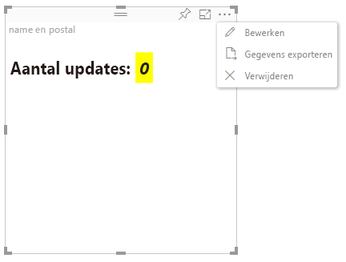

# Geavanceerde bewerkingsmodus

Visuals waarvoor geavanceerde besturingselementen voor de gebruikersinterface zijn vereist, kunnen ondersteuning van de geavanceerde bewerkingsmodus aanvragen.
Als dit wordt ondersteund, wordt in de rapportbewerkingsmodus de knop `Edit` weergegeven in het menu van de visual.
Wanneer u op de knop `Edit` klikt, wordt EditMode ingesteld op `Advanced`.
Voor de visual kan de EditMode-vlag worden gebruikt om te bepalen of dergelijke besturingselementen voor de gebruikersinterface moeten worden weergegeven.

Standaard biedt de visual geen ondersteuning voor de geavanceerde bewerkingsmodus.
Als ander gedrag is vereist, moet dit nadrukkelijk worden vermeld in het `capabilities.json`-bestand van de visual, door de eigenschap `advancedEditModeSupport` in te stellen.

De mogelijke waarden zijn:

- 0: NotSupported

- 1: SupportedNoAction

- 2: SupportedInFocus

## Geavanceerde bewerkingsmodus openen

De knop `Edit` is zichtbaar als:

 1: de eigenschap `advancedEditModeSupport` wordt in capabilities.json ingesteld op `SupportedNoAction` of `SupportedInFocus`.

 2: de visual wordt weergegeven in de rapportbewerkingsmodus.

Als de eigenschap `advancedEditModeSupport` ontbreekt in capabilities.json of is ingesteld op `NotSupported`, wordt de knop Bewerken niet weergegeven.

Wanneer de gebruiker op `Edit` klikt, ontvangt de visual de aanroep update() met EditMode ingesteld op `Advanced`.
Volgens de waarde die in de mogelijkheden is ingesteld, treden de volgende acties op:

* `SupportedNoAction`: geen verdere actie door de host.
* `SupportedInFocus`: de host wordt buiten de visual weergegeven de focusmodus.

## Geavanceerde bewerkingsmodus afsluiten

De knop `Back to report` is zichtbaar als:

1: de eigenschap `advancedEditModeSupport` ingesteld in capabilities.json op `SupportedInFocus`.
