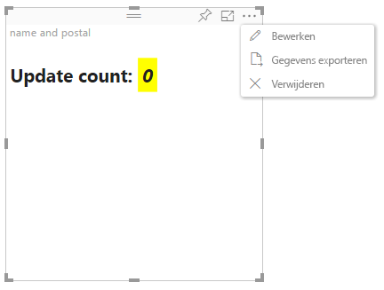

# Geavanceerde bewerkingsmodus in Power BI-visuals

Als u geavanceerde UI-besturingselementen in uw Power BI-visual nodig hebt, kunt u profiteren van de geavanceerde bewerkingsmodus. Als u zich in de rapportbewerkingsmodus bevindt, selecteert u een knop **Bewerken** om de bewerkingsmodus in te stellen op **Geavanceerd**. Voor de visual kan de vlag `EditMode` worden gebruikt om te bepalen of dit UI-besturingselement moet worden weergegeven.

Standaard biedt de visual geen ondersteuning voor de geavanceerde bewerkingsmodus. Als ander gedrag is vereist, kunt u dit nadrukkelijk vermelden in het bestand *capabilities.json* van de visual, door de eigenschap `advancedEditModeSupport` in te stellen.

De mogelijke waarden zijn:

- `0`: NotSupported

- `1`: SupportedNoAction

- `2`: SupportedInFocus

## De geavanceerde bewerkingsmodus openen

Een knop **Bewerken** wordt weergegeven als:

* De eigenschap `advancedEditModeSupport` in het bestand *capabilities.json* is ingesteld op `SupportedNoAction` of `SupportedInFocus`.

* De visual wordt weergegeven in de rapportbewerkingsmodus.

Als de eigenschap `advancedEditModeSupport` ontbreekt in het bestand *capabilities.json* of is ingesteld op `NotSupported`, wordt de knop **Bewerken** niet weergegeven.

Wanneer u **Bewerken** selecteert, ontvangt de visual de aanroep update (), waarbij EditMode is ingesteld op `Advanced`. Afhankelijk van de waarde die is ingesteld in het bestand *capabilities.json* worden de volgende acties uitgevoerd:

* `SupportedNoAction`: er is geen verdere actie vereist door de host.
* `SupportedInFocus`: de host wordt buiten de visual weergegeven in de focusmodus.

## De geavanceerde bewerkingsmodus sluiten

De knop **Terug naar rapport** wordt weergegeven als:

* De eigenschap `advancedEditModeSupport` in het bestand *capabilities.json* is ingesteld op `SupportedInFocus`.
