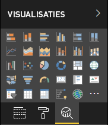

# <a name="the-analytics-pane-in-power-bi-visuals"></a>Het deelvenster Analyse in Power BI-visuals

In november 2018 is het deelvenster **Analyse** geïntroduceerd voor [native visuals](https://docs.microsoft.com/power-bi/desktop-analytics-pane).
In dit artikel leest u hoe Power BI-visuals met API versie 2.5.0 hun eigenschappen in het deelvenster **Analyse** kunnen presenteren en beheren.



## <a name="manage-the-analytics-pane"></a>Het deelvenster Analyse beheren

Net zoals u eigenschappen in het [deelvenster **Opmaak**](https://docs.microsoft.com/power-bi/developer/custom-visual-develop-tutorial-format-options) zou beheren, zo beheert u ook het deelvenster **Analyse** door het definiëren van een object in het bestand *capabilities.json* van de visual. 

Voor het deelvenster **Analyse** gelden de volgende verschillen:

* Onder de definitie van het object voegt u een veld **objectCategory** toe met de waarde 2.

    > [!NOTE]
    > Het optionele veld `objectCategory` is geïntroduceerd in API 2.5.0. Hiermee wordt het aspect van de visual gedefinieerd dat door het object wordt bestuurd (1 = opmaak, 2 = analyse). `Formatting` wordt gebruikt voor elementen als uiterlijk, kleuren, assen en labels. `Analytics` wordt gebruikt voor elementen als prognoses, trendlijnen, referentielijnen en vormen.
    >
    > Als de waarde niet is opgegeven, wordt `objectCategory` standaard ingesteld op 'Opmaak'.

* Het object moet de volgende twee eigenschappen hebben:
    * `show` van het type `bool` met een standaardwaarde `false`.
    * `displayName` van het type `text`. De standaardwaarde die u kiest, wordt de aanvankelijke weergavenaam van de instantie.

```json
{
  "objects": {
    "YourAnalyticsPropertiesCard": {
      "displayName": "Your analytics properties card's name",
      "objectCategory": 2,
      "properties": {
        "show": {
          "type": {
            "bool": true
          }
        },
        "displayName": {
          "type": {
            "text": true
          }
        },
      ... //any other properties for your Analytics card
      }
    }
  ...
  }
}
```

U kunt overige eigenschappen op dezelfde manier definiëren als die van **Opmaak**objecten. En u kunt objecten net zo opsommen als in het deelvenster **Opmaak**.

## <a name="known-limitations-and-issues-of-the-analytics-pane"></a>Bekende beperkingen en problemen van het deelvenster Analyse

* Het deelvenster **Analyse** heeft nog geen ondersteuning voor meerdere instanties. Objecten kunnen geen andere [selector](https://microsoft.github.io/PowerBI-visuals/docs/concepts/objects-and-properties/#selector) hebben dan static (dat wil zeggen selector: null), en Power BI-visuals kunnen geen door de gebruiker gedefinieerde meerdere instanties van een kaart hebben.
* Eigenschappen van het type `integer` worden niet correct weergegeven. Als tijdelijke oplossing kunt u in plaats daarvan het type `numeric` gebruiken.

> [!NOTE]
> * Gebruik het deelvenster **Analyse** alleen voor objecten die nieuwe informatie toevoegen of nieuw licht werpen op de gepresenteerde informatie (bijvoorbeeld dynamische referentielijnen die belangrijke trends illustreren).
> * Alle opties die het uiterlijk van de visual bepalen (dat wil zeggen de opmaak), moeten worden beperkt tot het deelvenster **Opmaak**.
