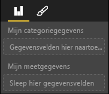

# <a name="capabilities-and-properties-of-power-bi-visuals"></a>Mogelijkheden en eigenschappen van Power BI-visuals 

U gebruikt mogelijkheden om de host van informatie te voorzien over uw visual. Alle eigenschappen van het mogelijkhedenmodel zijn `optional`.

De hoofdobjecten van de mogelijkheden van een visual zijn `dataRoles`, `dataViewMappings`, enzovoort.

```json
{
    "dataRoles": [ ... ],
    "dataViewMappings": [ ... ],
    "objects":  { ... },
    "supportsHighlight": true|false,
    "advancedEditModeSupport": 0|1|2,
    "sorting": { ... }
}

```

## <a name="define-the-data-fields-that-your-visual-expects-dataroles"></a>De gegevensvelden definiëren die voor uw visual worden verwacht: dataRoles

Als u velden wilt definiëren die kunnen worden gebonden aan gegevens, gebruikt u `dataRoles`. `dataRoles` neemt een matrix met `DataViewRole` objecten, waarin alle vereiste eigenschappen zijn gedefinieerd.

### <a name="properties"></a>Eigenschappen

* **name**: De interne naam van dit gegevensveld (moet uniek zijn).
* **soort**: Het soort veld:
    * `Grouping`: Discrete waarden die worden gebruikt om metingsvelden te groeperen.
    * `Measure`: Numerieke gegevenswaarden.
    * `GroupingOrMeasure`: Waarden die kunnen worden gebruikt als een groepering of een meting.
* **displayName**: De naam die voor de gebruiker wordt weergegeven in het deelvenster **Eigenschappen**.
* **beschrijving**: Een korte beschrijving van het veld (optioneel).
* **requiredTypes**: Het vereiste gegevenstype voor deze gegevensrol. Waarden die niet overeenkomen, worden ingesteld op null (optioneel).
* **preferredTypes**: Het gewenste gegevenstype voor deze gegevensrol (optioneel).

### <a name="valid-data-types-in-requiredtypes-and-preferredtypes"></a>Geldige gegevenstypen in requiredTypes en preferredTypes

* **bool**: Een booleaanse waarde
* **integer**: Een waarde die uit een geheel getal bestaat
* **numeriek**: Een numerieke waarde
* **tekst**: Een tekstwaarde
* **geografie**: Geografische gegevens

### <a name="example"></a>Voorbeeld

```json
"dataRoles": [
    {
        "displayName": "My Category Data",
        "name": "myCategory",
        "kind": "Grouping",
        "requiredTypes": [
            {
                "text": true
            },
            {
                "numeric": true
            },
            {
                "integer": true
            }
        ],
        "preferredTypes": [
            {
                "text": true
            }
        ]
    },
    {
        "displayName": "My Measure Data",
        "name": "myMeasure",
        "kind": "Measure",
        "requiredTypes": [
            {
                "integer": true
            },
            {
                "numeric": true
            }
        ],
        "preferredTypes": [
            {
                "integer": true
            }
        ]
    },
    {
        "displayNameKey": "Visual_Location",
        "name": "Locations",
        "kind": "Measure",
        "displayName": "Locations",
        "requiredTypes": [
            {
                "geography": {
                    "address": true
                }
            },
            {
                "geography": {
                    "city": true
                }
            },
            {
                "geography": {
                    "continent": true
                }
            },
            {
                "geography": {
                    "country": true
                }
            },
            {
                "geography": {
                    "county": true
                }
            },
            {
                "geography": {
                    "place": true
                }
            },
            {
                "geography": {
                    "postalCode": true
                }
            },
            {
                "geography": {
                    "region": true
                }
            },
            {
                "geography": {
                    "stateOrProvince": true
                }
            }
        ]
    }
]
```

Met de voorgaande gegevensrollen worden de velden gemaakt die worden weergegeven in de volgende afbeelding:



## <a name="define-how-you-want-the-data-mapped-dataviewmappings"></a>Definiëren hoe u de gegevens wilt toewijzen: dataViewMappings

Met een eigenschap DataViewMapping wordt de relatie tussen de verschillende gegevensrollen beschreven. Ook kunt u er voorwaardelijke vereisten voor opgeven.

Voor de meeste visuals is één toewijzing beschikbaar, maar u kunt meerdere dataViewMappings opgeven. Elke geldige toewijzing produceert een gegevensweergave. 

```json
"dataViewMappings": [
    {
        "conditions": [ ... ],
        "categorical": { ... },
        "table": { ... },
        "single": { ... },
        "matrix": { ... }
    }
]
```

Zie [Informatie over de toewijzing van gegevensweergaven in Power BI-visuals](dataview-mappings.md) voor meer informatie.

## <a name="define-property-pane-options-objects"></a>Opties in het deelvenster eigenschap definiëren: objecten

Met objecten kunt u de aanpasbare eigenschappen beschrijven die aan de visual zijn gekoppeld. Elk object kan meerdere eigenschappen hebben en aan elke eigenschap is een type gekoppeld. Typen verwijzen naar de uiteindelijke functie van de eigenschap. 

```json
"objects": {
    "myCustomObject": {
        "displayName": "My Object Name",
        "properties": { ... }
    }
}
```

Zie [Objecten en eigenschappen van Power BI-visuals](objects-properties.md) voor meer informatie.

## <a name="handle-partial-highlighting-supportshighlight"></a>Gedeeltelijke markeringen verwerken: supportsHighlight

Deze waarde is standaard ingesteld op `false`, wat betekent dat uw waarden automatisch worden gefilterd wanneer iets op de pagina is geselecteerd. Met dit automatische filter wordt uw visual vervolgens bijgewerkt zodat alleen de geselecteerde waarde wordt weergegeven. Als u de volledige gegevens wilt weergeven maar alleen de geselecteerde items wilt markeren, moet u `supportsHighlight` instellen op `true` in uw bestand *capabilities.json*.

Raadpleeg [Gegevenspunten markeren in Power BI-visuals](highlight.md) voor meer informatie.

## <a name="handle-advanced-edit-mode-advancededitmodesupport"></a>Geavanceerde bewerkingsmodus hanteren: advancedEditModeSupport

Een visual kan aangeven of deze de geavanceerde bewerkingsmodus ondersteunt. Standaard bieden visuals geen ondersteuning voor de geavanceerde bewerkingsmodus, tenzij dit anders wordt aangegeven in het bestand *capabilities.json*.

Zie [Geavanceerde bewerkingsmodus in Power BI-visuals](advanced-edit-mode.md) voor meer informatie.

## <a name="data-sorting-options-for-visual-sorting"></a>Sorteeropties van gegevens voor visuals: sorteren

Via de mogelijkheden van een visual kunt u het sorteergedrag van de visual definiëren. Standaard bieden visuals geen ondersteuning voor aanpassing van de bijbehorende sorteervolgorde, tenzij dit anders wordt aangegeven in het bestand *capabilities.json*.

Zie [Sorteeropties voor Power BI-visuals](sort-options.md) voor meer informatie.
