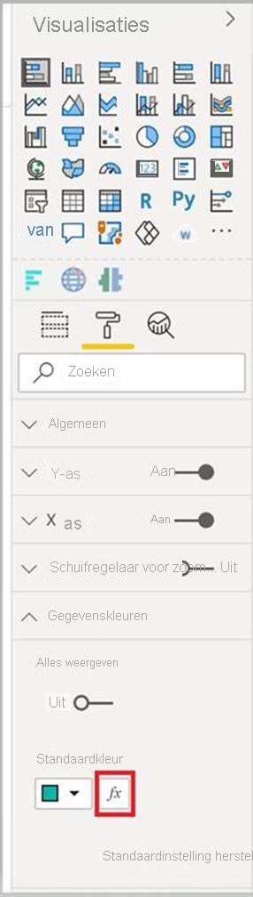

# <a name="add-conditional-formatting"></a>Voorwaardelijke opmaak toevoegen

Met [Voorwaardelijke opmaak](../../visuals/service-tips-and-tricks-for-color-formatting.md#conditional-formatting-for-visualizations) kan een maker van een rapport bepalen hoe kleuren worden weergegeven in een rapport, op basis van een numerieke waarde.

In dit artikel wordt beschreven hoe u de functionaliteit voor voorwaardelijke opmaak kunt toevoegen aan uw Power BI-visual.

Voorwaardelijke opmaak kan alleen worden toegepast op de volgende eigenschapstypen:
* Kleur
* Tekst
* Pictogram
* Web-URL

## <a name="add-conditional-formatting-to-your-project"></a>Voorwaardelijke opmaak toevoegen aan uw project

In deze sectie wordt uitgelegd hoe u voorwaardelijke opmaak kunt toevoegen aan een bestaande Power BI-visual. De voorbeeldcode in dit artikel is gebaseerd op de visual [SampleBarChart](https://github.com/microsoft/PowerBI-visuals-sampleBarChart). U kunt de broncode bekijken in [barChart.ts](https://github.com/microsoft/PowerBI-visuals-sampleBarChart/blob/master/src/barChart.ts).

### <a name="add-a-conditional-color-formatting-entry-in-the-format-pane"></a>Voeg een vermelding voor voorwaardelijke kleuropmaak toe in het deelvenster opmaak

In deze sectie leert u hoe u een vermelding voor voorwaardelijke kleuropmaak kunt toevoegen aan een gegevenspunt in het deelvenster opmaak.

1. U gebruikt de matrix `propertyInstanceKind` in `VisualObjectInstance`, die door `powerbi-visuals-api` wordt weergegeven. De eerste stap is om te controleren of het bestand deze import bevat:

    ```typescript
    import powerbiVisualsApi from "powerbi-visuals-api";
    ```

2. Als u het juiste type opmaak (*Constant*, *ConstantOfRegel* of *Regel*) wilt opgeven, gebruikt u de enum `VisualEnumerationInstanceKinds`. Voeg de volgende import toe aan het bestand:

    ```typescript
    import VisualEnumerationInstanceKinds = powerbiVisualsApi.VisualEnumerationInstanceKinds;
    ```

3. Geef een lijst weer met alle eigenschappen waarvoor u voorwaardelijke opmaak wilt ondersteunen, onder de matrix `propertyInstanceKind`. Definieer deze eigenschappen in de methode `enumerateObjectInstances`.

    ```typescript
    public enumerateObjectInstances(options: EnumerateVisualObjectInstancesOptions): VisualObjectInstanceEnumeration {
            …
            case 'colorSelector':
                …
                    objectEnumeration.push({
                        objectName: objectName,
                        displayName: barDataPoint.category,
                        properties: {
                            fill: {
                                solid: {
                                    color: barDataPoint.color
                                }
                            }
                        },
                        selector: dataViewWildcard.createDataViewWildcardSelector(dataViewWildcard.DataViewWildcardMatchingOption.InstancesAndTotals),
                        altConstantValueSelector: barDataPoint.selectionId.getSelector(),

                        // List your conditional formatting properties
                        propertyInstanceKind: {
                            fill: VisualEnumerationInstanceKinds.ConstantOrRule
                        }
                    });
                }
            …
    }

    ```

    `VisualEnumerationInstanceKinds.ConstantOrRule` maakt de UI-vermelding voor de voorwaardelijke opmaak naast het element gebruikersinterface voor constante opmaak.

    >[!div class="mx-imgBorder"]
    >

### <a name="define-how-conditional-formatting-behaves"></a>Definieer hoe voorwaardelijke opmaak zich gedraagt

Definieer hoe opmaak wordt toegepast op uw gegevenspunten.

Als u `createDataViewWildcardSelector` hebt gedeclareerd onder `powerbi-visuals-utils-dataviewutils`, geeft u op of de voorwaardelijke opmaak wordt toegepast op instanties, totalen of beide. Zie [DataViewWildcard](utils-dataview.md#) voor meer informatie.

Breng in `enumerateObjectInstances` de volgende wijzigingen aan in de objecten waarop u voorwaardelijke opmaak wilt toepassen:

 * Vervang de waarde `selector` door de oproep `dataViewWildcard.createDataViewWildcardSelector(dataViewWildcardMatchingOption)`. `DataViewWildcardMatchingOption` definieert of voorwaardelijke opmaak wordt toegepast op instanties, totalen of beide.

* Voeg de eigenschap `altConstantValueSelector` toe met de waarde die u eerder hebt gedefinieerd voor de eigenschap `selector`.

```typescript
case 'colorSelector':
         …
            objectEnumeration.push({
                objectName: objectName,
                displayName: barDataPoint.category,
                properties: {
                    fill: {
                        solid: {
                            color: barDataPoint.color
                        }
                    }
                },

                // Define whether the conditional formatting will apply to instances, totals, or both
                selector: dataViewWildcard.createDataViewWildcardSelector(dataViewWildcard.DataViewWildcardMatchingOption.InstancesAndTotals),

                // Add this property with the value previously defined for the selector property
                altConstantValueSelector: barDataPoint.selectionId.getSelector(),

                propertyInstanceKind: { 
                    fill: VisualEnumerationInstanceKinds.ConstantOrRule
                }
            });
        }

```

## <a name="next-steps"></a>Volgende stappen

Bekijk het artikel [DataViewUtils](utils-dataview.md).