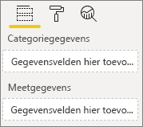
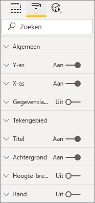
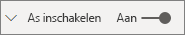
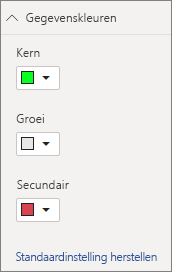

# <a name="build-a-bar-chart"></a>Een staafdiagram maken

Dit artikel is een stapsgewijze handleiding voor het maken van een voorbeeld van een Power BI-staafdiagram met code. U vindt het volledige codevoorbeeld op [https://github.com/Microsoft/PowerBI-visuals-sampleBarChart](https://github.com/Microsoft/PowerBI-visuals-sampleBarChart).

## <a name="view-model"></a>Weergavemodel
Het is belangrijk om eerst het weergavemodel van het staafdiagram te definiëren en verder te bouwen op wat beschikbaar is voor uw visual terwijl u deze samenstelt.

```typescript
/**
 * Interface for BarCharts viewmodel.
 *
 * @interface
 * @property {BarChartDataPoint[]} dataPoints - Set of data points the visual will render.
 * @property {number} dataMax                 - Maximum data value in the set of data points.
 */
interface BarChartViewModel {
    dataPoints: BarChartDataPoint[];
    dataMax: number;
};

/**
 * Interface for BarChart data points.
 *
 * @interface
 * @property {number} value    - Data value for the point.
 * @property {string} category - Corresponding category of the data value.
 */
interface BarChartDataPoint {
    value: number;
    category: string;
};
```

### <a name="use-static-data"></a>Statische gegevens gebruiken

Het gebruik van statische gegevens is een uitstekende manier om de visual te testen zonder gegevensbinding. Het weergavemodel wordt niet gewijzigd, zelfs niet wanneer u in een latere stap gegevensbinding toevoegt.

```typescript
let testData: BarChartDataPoint[] = [
    {
        value: 10,
        category: 'a'
    },
    {
        value: 20,
        category: 'b'
    },
    {
        value: 1,
        category: 'c'
    },
    {
        value: 100,
        category: 'd'
    },
    {
        value: 500,
        category: 'e'
    }];

let viewModel: BarChartViewModel = {
    dataPoints: testData,
    dataMax: d3.max(testData.map((dataPoint) => dataPoint.value))
};
```

## <a name="data-binding"></a>Gegevensbinding 
U voegt gegevensbinding toe door de mogelijkheden van een visual te definiëren in *capabilities.json*. De voorbeeldcode bevat al een schema dat u kunt gebruiken.

Gegevensbinding reageert op een bron **Veld** in Power BI.



### <a name="add-data-roles"></a>Gegevensrollen toevoegen
De voorbeeldcode bevat al gegevensrollen, maar u kunt deze aanpassen.

- `displayName` is de naam die wordt weergegeven in de bron **Veld**.
- `name` is de interne naam die wordt gebruikt om te verwijzen naar de gegevensrol.
- `kind` is het soort veld. *Groeperingsvelden* (0) bevatten discrete waarden. *Metingvelden* (1) bevatten numerieke gegevenswaarden.

```json
"dataRoles": [
    {
        "displayName": "Category Data",
        "name": "category",
        "kind": 0
    },
    {
        "displayName": "Measure Data",
        "name": "measure",
        "kind": 1
    }
],
```

Zie [Gegevensrollen](./capabilities.md#define-the-data-fields-that-your-visual-expects-dataroles) voor meer informatie.

### <a name="add-conditions-to-dataviewmapping"></a>Voorwaarden toevoegen aan DataViewMapping
Definieer voorwaarden binnen uw `dataViewMappings` om in te stellen hoeveel velden kunnen worden gebonden in elke bron Veld. Gebruik de interne `name` van de gegevensrol om naar elk veld te verwijzen.

```json
    "dataViewMappings": [
        {
            "conditions": [
                {
                    "category": {
                        "max": 1
                    },
                    "measure": {
                        "max": 1
                    }
                }
            ],
        }
    ]
```

Zie [Toewijzing van gegevensweergave](./dataview-mappings.md) voor meer informatie.

### <a name="define-and-use-visualtransform"></a>VisualTransform definiëren en gebruiken
De `DataView` is de structuur die Power BI uw visual biedt. Deze bevat de opgevraagde gegevens die moeten worden gevisualiseerd. `DataView` kan echter ook gegevens bieden in een andere vorm, bijvoorbeeld als categorie of tabel. Als u een categorische visual wilt maken, zoals een staafdiagram, hoeft u alleen maar de categorische eigenschap in de `DataView` te gebruiken. Door `visualTransform` te definiëren kunt u `DataView` converteren naar een weergavemodel dat wordt gebruikt voor de visual.

Gebruik `IVisualHost` om kleuren toe te wijzen en deze te selecteren bij het definiëren van afzonderlijke gegevenspunten. 

```typescript
/**
 * Function that converts queried data into a view model that will be used by the visual
 *
 * @function
 * @param {VisualUpdateOptions} options - Contains references to the size of the container
 *                                        and the dataView which contains all the data
 *                                        the visual had queried.
 * @param {IVisualHost} host            - Contains references to the host which contains services
 */
function visualTransform(options: VisualUpdateOptions, host: IVisualHost): BarChartViewModel {
    /*Convert dataView to your viewModel*/
}

```

## <a name="color"></a>Kleur 
De kleur wordt weergegeven als een van de services die beschikbaar zijn in `IVisualHost`.

### <a name="add-color-to-data-points"></a>Kleuren toevoegen aan gegevenspunten
Elk gegevenspunt wordt weergegeven met een andere kleur. U voegt kleur toe aan de interface van `BarChartDataPoint`.

```typescript
/**
 * Interface for BarChart data points.
 *
 * @interface
 * @property {number} value    - Data value for the point.
 * @property {string} category - Corresponding category of the data value.
 * @property {string} color    - Color corresponding to the data point.
 */
interface BarChartDataPoint {
    value: number;
    category: string;
    color: string;
};
```

### <a name="the-colorpalette-service"></a>De service colorPalette
Met de service `colorPalette` beheert u de kleuren die in uw visual worden gebruikt. Het exemplaar is beschikbaar op `IVisualHost`.

### <a name="assign-color-to-data-points"></a>Kleur toewijzen aan gegevenspunten
U hebt `visualTransform` gedefinieerd als een constructie om `dataView` te converteren naar een weergavemodel dat kan worden gebruikt voor een staafdiagram. Omdat u de punten in `visualTransform` doorloopt, is het ook de ideale plek om kleuren toe te wijzen.

```typescript
let colorPalette: IColorPalette = host.colorPalette; // host: IVisualHost
for (let i = 0, len = Math.max(category.values.length, dataValue.values.length); i < len; i++) {
    barChartDataPoints.push({
        category: category.values[i],
        value: dataValue.values[i],
        color: colorPalette.getColor(category.values[i]).value,
    });
}
```

## <a name="selection-and-interactions"></a>Selectie en interacties
Met de selectie kan de gebruiker werken met uw visual en andere visuals. 

### <a name="add-selection-to-each-data-point"></a>Selectie toevoegen aan elk gegevenspunt
Omdat elk gegevenspunt uniek is, voegt u de selectie toe aan elk gegevenspunt. U voegt de selectie-eigenschap toe aan de interface van `BarChartDataPoint`.

```typescript
/**
 * Interface for BarChart data points.
 *
 * @interface
 * @property {number} value             - Data value for the point.
 * @property {string} category          - Corresponding category of data value.
 * @property {string} color             - Color corresponding to data point.
 * @property {ISelectionId} selectionId - Id assigned to data point for cross filtering
 *                                        and visual interaction.
 */
interface BarChartDataPoint {
    value: number;
    category: string;
    color: string;
    selectionId: ISelectionId;
};
```

### <a name="assign-selection-ids-to-each-data-point"></a>Selectie-id’s toevoegen aan elk gegevenspunt
Omdat u de punten in `visualTransform` doorloopt, is het ook de ideale plek om selectie-id’s te maken. De hostvariabele is een `IVisualHost`, die services bevat die in de visual kunnen worden gebruikt, zoals kleur en de opbouwfunctie voor selectie. 

Gebruik de methode `createSelectionIdBuilder` factory in `IVisualHost` om een nieuwe selectie-id te maken. Maak een nieuwe opbouwfunctie voor selectie voor elk gegevenspunt.

Omdat u selecties maakt die alleen zijn gebaseerd op de categorie, hoeft u alleen selecties `withCategory` te definiëren.

```typescript
for (let i = 0, len = Math.max(category.values.length, dataValue.values.length); i < len; i++) {
    barChartDataPoints.push({
        category: category.values[i],
        value: dataValue.values[i],
        color: colorPalette.getColor(category.values[i]).value,
        selectionId: host.createSelectionIdBuilder()
            .withCategory(category, i)
            .createSelectionId()
    });
}
```

Raadpleeg [Een exemplaar van de opbouwfunctie voor selecties maken](./selection-api.md#create-an-instance-of-the-selection-builder) voor meer informatie.

### <a name="interact-with-data-points"></a>Communiceren met gegevenspunten
U kunt met elke balk in het staafdiagram werken zodra een selectie-id is toegewezen aan het gegevenspunt. Het staafdiagram luistert naar `click`-gebeurtenissen.

Gebruik de methode `selectionManager` factory in `IVisualHost` om een selectiebeheer te maken voor kruislings filteren en het wissen van selecties.

```typescript
let selectionManager = this.selectionManager;

//This must be an anonymous function instead of a lambda because
//d3 uses 'this' as the reference to the element that was clicked.
bars.on('click', function(d) {
    selectionManager.select(d.selectionId).then((ids: ISelectionId[]) => {
        bars.attr({
            'fill-opacity': ids.length > 0 ? BarChart.Config.transparentOpacity : BarChart.Config.solidOpacity
        });

        d3.select(this).attr({
            'fill-opacity': BarChart.Config.solidOpacity
        });
    });

    (<Event>d3.event).stopPropagation();
});
```

Raadpleeg [SelectionManager gebruiken](./selection-api.md#how-to-use-selectionmanager-to-select-data-points) voor meer informatie.

## <a name="static-objects"></a>Statische objecten

U kunt objecten toevoegen aan het deelvenster **Eigenschap** om de visual verder aan te passen. Deze aanpassingen kunnen wijzigingen in de gebruikersinterface zijn, of wijzigingen die betrekking hebben op de gegevens die zijn opgevraagd. In het voorbeeld wordt gebruikgemaakt van statische objecten om de X-as voor het staafdiagram weer te geven.

U kunt objecten in- of uitschakelen in het deelvenster **Eigenschap**.



### <a name="define-objects-in-capabilities"></a>Objecten definiëren in mogelijkheden
Definieer een eigenschap `objects` in het bestand *capabilities.json* om objecten weer te geven in het deelvenster **Eigenschappen**.
- `enableAxis` is de interne naam waarnaar `dataView` verwijst. 
- `displayName` is de naam die wordt weergegeven in het deelvenster **Eigenschap**.
- `bool` is een primitieve waarde die meestal wordt gebruikt voor statische objecten, zoals tekstvakken of schakelopties.
- `show` is een speciale eigenschap in `properties` waarmee de schakeloptie `show` wordt ingeschakeld voor het object. Omdat `show` een schakeloptie is, wordt deze getypt als een `bool`.



```typescript
"objects": {
    "enableAxis": {
        "displayName": "Enable Axis",
        "properties": {
            "show": {
                "displayName": "Enable Axis",
                "type": { "bool": true }
            }
        }
    }
}
```

Zie [Objecten](./objects-properties.md) voor meer informatie.

### <a name="define-property-settings"></a>Instellingen voor eigenschappen definiëren

In de volgende secties worden de basisprincipes beschreven voor het definiëren van instellingen voor eigenschappen. U kunt ook de hulpprogrammaklassen gebruiken die zijn gedefinieerd in het `powerbi-visuals-utils-dataviewutils`-pakket om instellingen voor eigenschappen te definiëren. Raadpleeg de documentatie en voorbeelden voor de klasse [DataViewObjectsParser](https://github.com/Microsoft/powerbi-visuals-utils-dataviewutils/blob/master/docs/api/data-view-objects-parser.md) voor meer informatie.


Hoewel dit optioneel is, is het raadzaam om de meeste instellingen op één object te lokaliseren voor eenvoudige raadpleging.

```typescript
/**
 * Interface for BarCharts viewmodel.
 *
 * @interface
 * @property {BarChartDataPoint[]} dataPoints - Set of data points the visual will render.
 * @property {number} dataMax                 - Maximum data value in the set of data points.
 * @property {BarChartSettings} settings      - Object property settings
 */
interface BarChartViewModel {
    dataPoints: BarChartDataPoint[];
    dataMax: number;
    settings: BarChartSettings;
};

/**
 * Interface for BarChart settings.
 *
 * @interface
 * @property "show" enableAxis - Object property that allows axis to be enabled.
 */
interface BarChartSettings {
    enableAxis: {
        show: boolean;
    };
}
```

### <a name="define-and-use-objectenumerationutility"></a>ObjectEnumerationUtility definiëren en gebruiken
Eigenschapswaarden voor objecten zijn beschikbaar als metagegevens in `dataView`, maar er is geen service om deze eigenschappen op te halen. `ObjectEnumerationUtility` is een set statische functies die u kunt gebruiken om objectwaarden op te halen uit `dataView`, en voor andere visualprojecten. `ObjectEnumerationUtility` is optioneel, maar is ideaal voor het doorlopen van `dataView` om objecteigenschappen op te halen.

```typescript
/**
 * Gets property value for a particular object.
 *
 * @function
 * @param {DataViewObjects} objects - Map of defined objects.
 * @param {string} objectName       - Name of desired object.
 * @param {string} propertyName     - Name of desired property.
 * @param {T} defaultValue          - Default value of desired property.
 */
export function getValue<T>(objects: DataViewObjects, objectName: string, propertyName: string, defaultValue: T ): T {
    if(objects) {
        let object = objects[objectName];
        if(object) {
            let property: T = object[propertyName];
            if(property !== undefined) {
                return property;
            }
        }
    }
    return defaultValue;
}
```

Raadpleeg [objectEnumerationUtility.ts](https://github.com/Microsoft/PowerBI-visuals-sampleBarChart/blob/master/src/objectEnumerationUtility.ts) voor de broncode.

### <a name="retrieve-property-values-from-dataview"></a>Eigenschapswaarden ophalen uit dataView
`visualTransform` is de ideale plek om het weergavemodel van de visual te bewerken. Als u wilt doorgaan met dit patroon, haalt u de objecteigenschappen op uit `dataView`.

Definieer de standaardstatus van de eigenschap en gebruik `getValue` om de eigenschap op te halen uit `dataView`.

```typescript
let defaultSettings: BarChartSettings = {
    enableAxis: {
        show: false,
    }
};

let barChartSettings: BarChartSettings = {
    enableAxis: {
        show: getValue<boolean>(objects, 'enableAxis', 'show', defaultSettings.enableAxis.show),
    }
}
```

### <a name="populate-property-pane-with-enumerateobjectinstances"></a>Deelvenster Eigenschap vullen met enumerateObjectInstances
Met de optionele methode `enumerateObjectInstances` in `IVisual` worden alle objecten opgesomd en in het deelvenster **Eigenschap** geplaatst. Elk object wordt aangeroepen met `enumerateObjectInstances`. De naam van het object is beschikbaar op `EnumerateVisualObjectInstancesOptions`.

Definieer voor elk object de eigenschap met de huidige status.

```typescript
/**
 * Enumerates through the objects defined in the capabilities and adds the properties to the format pane
 *
 * @function
 * @param {EnumerateVisualObjectInstancesOptions} options - Map of defined objects
 */
public enumerateObjectInstances(options: EnumerateVisualObjectInstancesOptions): VisualObjectInstanceEnumeration {
    let objectName = options.objectName;
    let objectEnumeration: VisualObjectInstance[] = [];

    switch(objectName) {
        case 'enableAxis':
            objectEnumeration.push({
                objectName: objectName,
                properties: {
                    show: this.barChartSettings.enableAxis.show,
                },
                selector: null
            });
    };

    return objectEnumeration;
}
```

### <a name="control-property-update-logic"></a>Updatelogica voor eigenschap beheren
Zodra een object is toegevoegd aan het deelvenster **Eigenschap**, wordt met elke wisselknop een update geactiveerd. Voeg specifieke objectlogica toe in `if`-blokken:

```typescript
if(settings.enableAxis.show) {
    let margins = BarChart.Config.margins;
    height -= margins.bottom;
}
```

## <a name="databound-objects"></a>Gegevensgebonden objecten
Gegevensgebonden objecten zijn vergelijkbaar met statische objecten, maar hebben meestal betrekking op gegevensselectie. U kunt bijvoorbeeld de kleur wijzigen die is gekoppeld aan het gegevenspunt.



### <a name="define-object-in-capabilities"></a>Objecten definiëren in capabilities.json
Net als bij statische objecten definieert u een ander object in *capabilities.json*. 
- `colorSelector` is de interne naam waarnaar `dataView` verwijst.
- `displayName` is de naam die wordt weergegeven in het deelvenster **Eigenschap**.
- `fill` is een gestructureerde objectwaarde die niet is gekoppeld aan een primitief type.

```typescript
"colorSelector": {
    "displayName": "Data Colors",
    "properties": {
        "fill": {
            "displayName": "Color",
            "type": {
                "fill": {
                    "solid": {
                        "color": true
                    }
                }
            }
        }
    }
}
```

Zie [Objecten](./objects-properties.md) voor meer informatie.

### <a name="use-objectenumerationutility"></a>ObjectEnumerationUtility gebruiken
Net als bij statische objecten moet u objectgegevens ophalen uit `dataView`. Echter, in plaats van dat de objectwaarden zich binnen de metagegevens bevinden, zijn de objectwaarden gekoppeld aan elke categorie.

```typescript
/**
 * Gets property value for a particular object in a category.
 *
 * @function
 * @param {DataViewCategoryColumn} category - List of category objects.
 * @param {number} index                    - Index of category object.
 * @param {string} objectName               - Name of desired object.
 * @param {string} propertyName             - Name of desired property.
 * @param {T} defaultValue                  - Default value of desired property.
 */
export function getCategoricalObjectValue<T>(category: DataViewCategoryColumn, index: number, objectName: string, propertyName: string, defaultValue: T): T {
    let categoryObjects = category.objects;

    if(categoryObjects) {
        let categoryObject: DataViewObject = categoryObjects[index];
        if(categoryObject) {
            let object = categoryObject[objectName];
            if(object) {
                let property: T = object[propertyName];
                if(property !== undefined) {
                    return property;
                }
            }
        }
    }
    return defaultValue;
}
```

Raadpleeg [objectEnumerationUtility.ts](https://github.com/Microsoft/PowerBI-visuals-sampleBarChart/blob/master/src/objectEnumerationUtility.ts) voor de broncode.

### <a name="define-default-color-and-retrieve-categorical-object-from-dataview"></a>Standaardkleur definiëren en categorieobject ophalen uit dataView
Elke kleur is nu gekoppeld aan elke categorie binnen `dataView`. U kunt elk gegevenspunt instellen op de bijbehorende kleur.

```typescript
for (let i = 0, len = Math.max(category.values.length, dataValue.values.length); i < len; i++) {
    let defaultColor: Fill = {
        solid: {
            color: colorPalette.getColor(category.values[i]).value
        }
    }

    barChartDataPoints.push({
        category: category.values[i],
        value: dataValue.values[i],
        color: getCategoricalObjectValue<Fill>(category, i, 'colorSelector', 'fill', defaultColor).solid.color,
        selectionId: host.createSelectionIdBuilder()
            .withCategory(category, i)
            .createSelectionId()
    });
}
```

### <a name="populate-property-pane-with-enumerateobjectinstances"></a>Deelvenster Eigenschap vullen met enumerateObjectInstances
Gebruik `enumerateObjectInstances` om het deelvenster **Eigenschappen** te vullen met objecten. 

Voeg voor dit exemplaar een kleurenkiezer toe om elke categorie weer te geven in het deelvenster **Eigenschap**. U doet dit door een extra case toe te voegen aan de instructie `switch` voor `colorSelector`, en elk gegevenspunt met de bijbehorende kleur te doorlopen. 

Selectie is vereist om de kleur te koppelen aan het gegevenspunt.

```typescript
/**
 * Enumerates through the objects defined in the capabilities and adds the properties to the format pane
 *
 * @function
 * @param {EnumerateVisualObjectInstancesOptions} options - Map of defined objects
 */
public enumerateObjectInstances(options: EnumerateVisualObjectInstancesOptions): VisualObjectInstanceEnumeration {
    let objectName = options.objectName;
    let objectEnumeration: VisualObjectInstance[] = [];

    switch(objectName) {
        case 'enableAxis':
            objectEnumeration.push({
                objectName: objectName,
                properties: {
                    show: this.barChartSettings.enableAxis.show,
                },
                selector: null
            });
            break;
        case 'colorSelector':
            for(let barDataPoint of this.barDataPoints) {
                objectEnumeration.push({
                    objectName: objectName,
                    displayName: barDataPoint.category,
                    properties: {
                        fill: {
                            solid: {
                                color: barDataPoint.color
                            }
                        }
                    },
                    selector: barDataPoint.selectionId.getSelector()
                });
            }
            break;
    };

    return objectEnumeration;
}
```

Nadat u voor elke eigenschap een kiezer hebt opgegeven, ziet u de volgende objectmatrix `dataView`:


Elk item in de matrix `dataViews[0].categorical.categories[0].objects` komt overeen met de concrete categorie van de gegevensset.

De functie `getCategoricalObjectValue` biedt op een handige manier toegang tot eigenschappen op basis van de categorie-index. U moet een `objectName` en `propertyName` opgeven die overeenkomen met het object en de eigenschap in *capabilities.json*.

## <a name="other-features"></a>Andere functies 
U kunt een schuifregelaar of knopinfo toevoegen aan het staafdiagram. Bekijk de doorvoeringen in [Een schuifregelaar voor het deelvenster Eigenschap toevoegen om de matheid te beheren](https://github.com/Microsoft/PowerBI-visuals-sampleBarChart/commit/e2e0bc5888d9a3ca305a7a7af5046068645c8b30) en [Ondersteuning voor knopinfo toevoegen](https://github.com/Microsoft/PowerBI-visuals-sampleBarChart/commit/981b021612d7b333adffe9f723ab27783c76fb14) voor informatie over de code die u wilt toevoegen. Raadpleeg [Knopinfo in Power BI-visuals](./add-tooltips.md) voor meer informatie.

## <a name="packaging"></a>Verpakking

Voordat u een visual kunt laden in [Power BI Desktop](https://powerbi.microsoft.com/desktop/) of kunt delen met de community in de [galerie met Power BI-visuals](https://visuals.powerbi.com/), moet u deze inpakken. Ga naar de hoofdmap van uw visualproject dat het bestand *pbiviz.json* bevat, en gebruik de volgende opdracht om een *PBIVIZ*-bestand te genereren:

```bash
pbiviz package
```
Met deze opdracht wordt een *PBIVIZ*-bestand gemaakt in de map *dist/* van uw visualproject, en wordt een eventueel al bestaand *PBIVIZ*-bestand uit eerdere inpakbewerkingen overschreven.

## <a name="next-steps"></a>Volgende stappen
U kunt de volgende mogelijkheden toevoegen aan een visual:
* [Een contextmenu toevoegen aan een visual](./context-menu.md)
* [Landingspagina](./landing-page.md)
* [Start-URL](./launch-url.md)
* [Ondersteuning voor landinstellingen](./localization.md)