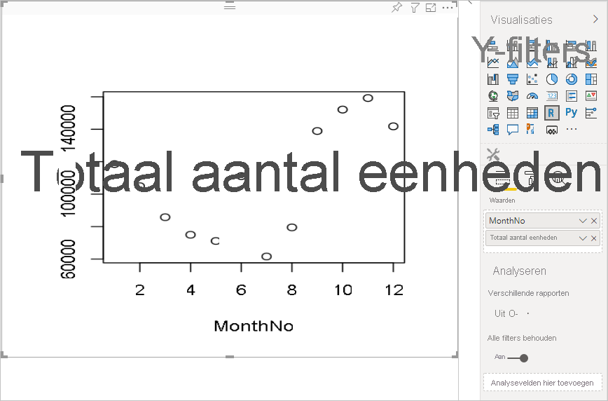
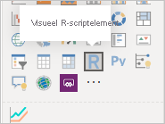
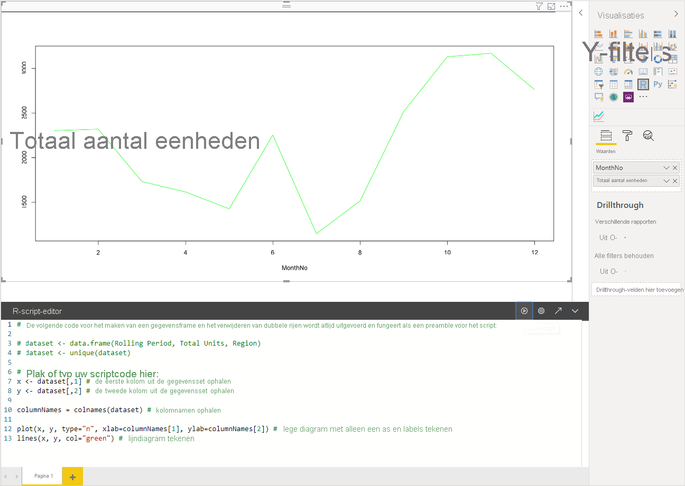
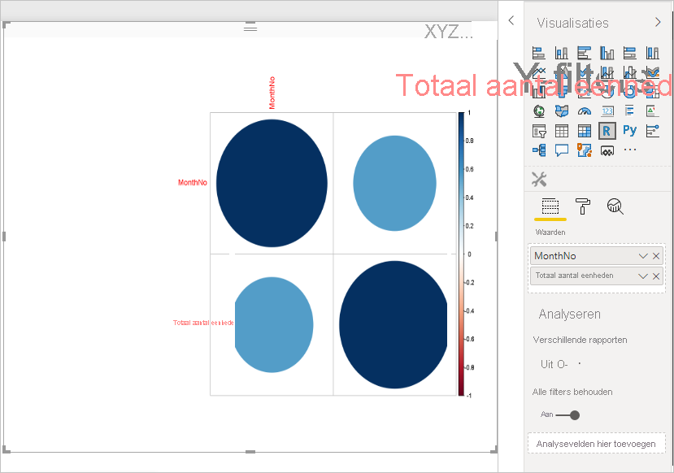
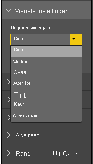
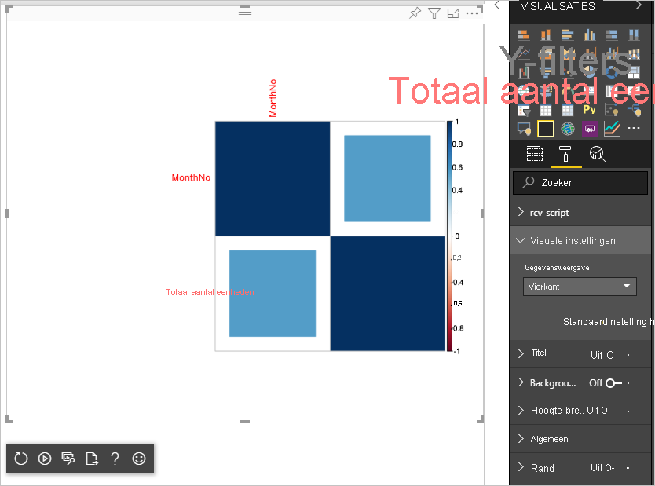

# <a name="tutorial-create-an-r-powered-power-bi-visual"></a>Zelfstudie: Power BI-visual maken met behulp van R

In deze zelfstudie wordt beschreven hoe u met behulp van R een visual maakt voor Power BI. Een visual wordt in de documentatie ook wel een visualisatie of visueel element genoemd.

In deze zelfstudie leert u het volgende:

> [!div class="checklist"]
>
> * Een visual maken met behulp van R
> * Het R-script bewerken in Power BI Desktop
> * Bibliotheken toevoegen aan de visual
> * Een statische eigenschap toevoegen

## <a name="prerequisites"></a>Vereisten

* Een **Power BI Pro**-account. [Meld u aan voor een gratis proefversie](https://powerbi.microsoft.com/pricing/) voordat u begint.
* De R-engine. U kunt deze gratis downloaden vanaf verschillende locaties, waaronder de [downloadpagina van Revolution Open](https://mran.revolutionanalytics.com/download/) en de [CRAN-opslagplaats](https://cran.r-project.org/bin/windows/base/). Zie [Power BI-visuals maken met R](../../desktop-r-visuals.md) voor meer informatie.
* [Power BI Desktop](../../fundamentals/desktop-get-the-desktop.md).
* [Windows PowerShell](https://docs.microsoft.com/powershell/scripting/install/installing-windows-powershell?view=powershell-6) versie 4 of hoger voor Windows-gebruikers OF [Terminal](https://macpaw.com/how-to/use-terminal-on-mac) voor Mac OS X-gebruikers.

## <a name="getting-started"></a>Aan de slag

1. Bereid voorbeeldgegevens voor die u wilt gebruiken voor de visual. U kunt deze waarden opslaan in een Excel-database of *CSV*-bestand en ze importeren in Power BI Desktop.

    | MonthNo | Totaal eenheden |
    |-----|-----|
    | 1 | 2303 |
    | 2 | 2319 |
    | 3 | 1732 |
    | 4 | 1615 |
    | 5 | 1427 |
    | 6 | 2253 |
    | 7 | 1147 |
    | 8 | 1515 |
    | 9 | 2516 |
    | 10 | 3131 |
    | 11 | 3170 |
    | 12 | 2762 |

1. Als u een visual wilt maken, opent u PowerShell of Terminal en voert u de volgende opdracht uit:

   ```cmd
   pbiviz new rVisualSample -t rvisual
   ```

   Met deze opdracht maakt u een nieuwe mapstructuur op basis van de sjabloon `rvisual`. Deze sjabloon bevat een eenvoudige, kant-en-klare R-visual waarmee het volgende R-script wordt uitgevoerd:

   ```r
   plot(Values)
   ```

   Het gegevensframe `Values` bevat kolommen in de gegevensrol `Values`.

1. Wijs gegevens toe aan de visual van de ontwikkelaar door **MonthNo** en **Totaal eenheden** toe te voegen aan **Waarden** voor de visual.

   

## <a name="editing-the-r-script"></a>Het R-script bewerken

Wanneer u `pbiviz` gebruikt voor het maken van een R-visual op basis van de sjabloon `rvisual`, wordt er een bestand gemaakt met de naam *script.r* in de hoofdmap van de visual. Dit bestand bevat het R-script dat wordt uitgevoerd om de afbeelding te genereren voor een gebruiker. U kunt een R-script maken in Power BI Desktop.

1. Selecteer in Power BI Desktop het pictogram **Visueel R-scriptelement**:

   

1. Plak deze R-code in de **R-script-editor**:

    ```r
    x <- dataset[,1] # get the first column from dataset
    y <- dataset[,2] # get the second column from dataset

    columnNames = colnames(dataset) # get column names

    plot(x, y, type="n", xlab=columnNames[1], ylab=columnNames[2]) # draw empty plot with axis and labels only
    lines(x, y, col="green") # draw line plot
    ```

1. Selecteer het pictogram **Script uitvoeren** om het resultaat te zien.

    

1. Wanneer uw R-script klaar is, kopieert u het naar het bestand `script.r` in het visuele project dat u in een van de eerdere stappen hebt gemaakt.

1. Wijzig de `name` van `dataRoles` in *capabilities.json* in `dataRoles`. Power BI geeft gegevens door als het gegevensframe-object `dataset` voor de R-scriptvisual, maar de R-visual krijgt de naam van het gegevensframe op basis van `dataRoles`-namen.

    ```json
    {
      "dataRoles": [
        {
          "displayName": "Values",
          "kind": "GroupingOrMeasure",
          "name": "dataRoles"
        }
      ],
      "dataViewMappings": [
        {
          "scriptResult": {
            "dataInput": {
              "table": {
                "rows": {
                  "select": [
                    {
                      "for": {
                        "in": "dataset"
                      }
                    }
                  ],
                  "dataReductionAlgorithm": {
                    "top": {}
                  }
                }
              }
            },
            ...
          }
        }
      ],
    }
    ```

1. Voeg de volgende code toe aan het bestand *src/visual.ts* om ondersteuning te bieden voor het wijzigen van de grootte van de afbeelding.

    ```typescript
      public onResizing(finalViewport: IViewport): void {
          this.imageDiv.style.height = finalViewport.height + "px";
          this.imageDiv.style.width = finalViewport.width + "px";
          this.imageElement.style.height = finalViewport.height + "px";
          this.imageElement.style.width = finalViewport.width + "px";
      }
    ```

## <a name="add-libraries-to-visual-package"></a>Bibliotheken toevoegen aan pakket van visual

Met deze procedure kan uw visual het `corrplot`-pakket gebruiken.

1. Voeg de bibliotheekafhankelijkheid voor uw visual toe aan `dependencies.json`. Hier ziet u een voorbeeld van de bestandsinhoud:

    ```json
    {
      "cranPackages": [
        {
          "name": "corrplot",
          "displayName": "corrplot",
          "url": "https://cran.r-project.org/web/packages/corrplot/"
        }
      ]
    }
    ```

    Het `corrplot`-pakket is een grafische weergave van een correlatiematrix. Zie [An Introduction to corrplot Package](https://cran.r-project.org/web/packages/corrplot/vignettes/corrplot-intro.html) voor meer informatie over `corrplot`.

1. Nadat u deze wijzigingen hebt aangebracht, kunt u het pakket gaan gebruiken in uw `script.r`-bestand.

    ```r
    library(corrplot)
    corr <- cor(dataset)
    corrplot(corr, method="circle", order = "hclust")
    ```

Het resultaat van het gebruik van het `corrplot`-pakket ziet er als volgt uit:



## <a name="adding-a-static-property-to-the-property-pane"></a>Een statische eigenschap toevoegen aan het eigenschappenvenster

Stel gebruikers in staat om instellingen van de gebruikersinterface te wijzigen. Dit doet u door eigenschappen toe te voegen aan het eigenschappenvenster waardoor het gedrag van het R-script op basis van gebruikersinvoer wordt gewijzigd.

U kunt `corrplot` configureren met behulp van het argument `method` voor de functie `corrplot`. Het standaardscript gebruikt een cirkel. Wijzig de visual zodat de gebruiker uit verschillende opties kan kiezen.

1. Definieer het object en de eigenschap in het bestand *capabilities.json*. Gebruik vervolgens deze objectnaam in de methode enumeration om die waarden op te halen uit het eigenschappenvenster.

    ```json
    {
      "settings": {
      "displayName": "Visual Settings",
      "description": "Settings to control the look and feel of the visual",
      "properties": {
        "method": {
          "displayName": "Data Look",
          "description": "Control the look and feel of the data points in the visual",
          "type": {
            "enumeration": [
              {
                "displayName": "Circle",
                "value": "circle"
              },
              {
                "displayName": "Square",
                "value": "square"
              },
              {
                "displayName": "Ellipse",
                "value": "ellipse"
              },
              {
                "displayName": "Number",
                "value": "number"
              },
              {
                "displayName": "Shade",
                "value": "shade"
              },
              {
                "displayName": "Color",
                "value": "color"
              },
              {
                "displayName": "Pie",
                "value": "pie"
              }
            ]
          }
        }
      }
    }
    ```

1. Open het bestand *src/settings.ts*. Maak een klasse `CorrPlotSettings` met de public-eigenschap `method`. Het type is `string` en de standaardwaarde is `circle`. Voeg de eigenschap `settings` toe aan de klasse `VisualSettings` met de standaardwaarde:

    ```typescript
    "use strict";

    import { dataViewObjectsParser } from "powerbi-visuals-utils-dataviewutils";
    import DataViewObjectsParser = dataViewObjectsParser.DataViewObjectsParser;

    export class VisualSettings extends DataViewObjectsParser {
      public rcv_script: rcv_scriptSettings = new rcv_scriptSettings();
      public settings: CorrPlotSettings = new CorrPlotSettings();
    }

    export class CorrPlotSettings {
      public method: string = "circle";
    }

    export class rcv_scriptSettings {
      public provider;
      public source;
    }
    ```

    Nadat u deze stappen hebt uitgevoerd, kunt u de eigenschap van de visual wijzigen.

   

    Ten slotte is het zo dat het R-script moet beginnen met een eigenschap. Als de gebruiker de eigenschap niet wijzigt, krijgt de visual geen waarde voor deze eigenschap.

    Voor R-runtimevariabelen voor de eigenschappen is de naamconventie `<objectname>_<propertyname>`, in dit geval `settings_method`.

1. Wijzig het R-script in uw visual zodat dit overeenkomt met de volgende code:

    ```r
    library(corrplot)
    corr <- cor(dataset)

    if (!exists("settings_method"))
    {
        settings_method = "circle";
    }

    corrplot(corr, method=settings_method, order = "hclust")
    ```

De uiteindelijke visual lijkt op het volgende voorbeeld:



## <a name="next-steps"></a>Volgende stappen

Zie [Met R gemaakte Power BI-visuals gebruiken in Power BI](../../desktop-r-powered-custom-visuals.md) voor meer informatie over visuals die zijn gemaakt met behulp van R.

Zie [Power BI-visuals maken met R](../../desktop-r-visuals.md) voor meer informatie over R-visuals in Power BI Desktop.
