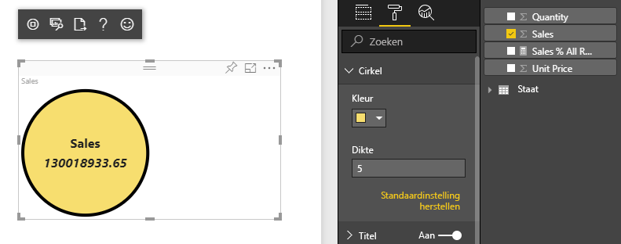
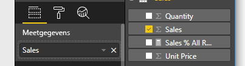

# <a name="tutorial-create-a-react-based-visual"></a>Zelfstudie: Een React-visual maken

In deze zelfstudie wordt uitgelegd hoe u een Power BI-visual maakt met behulp van [React](https://reactjs.org/). Met de visual wordt een waarde in een cirkel weergegeven. De visual heeft een adaptieve grootte en instellingen om deze aan te passen. Met de informatie in dit artikel kunt u uw eigen Power BI-visuals maken met React.



In deze zelfstudie leert u het volgende:

> [!div class="checklist"]
>
> * De ontwikkelomgeving instellen
> * Een React-visual maken
> * Mogelijkheden voor de visual configureren
> * Gegevens uit Power BI weergeven
> * Het formaat van de visual wijzigen
> * De visual aanpasbaar maken

## <a name="prerequisites"></a>Vereisten

* Een **Power BI Pro**-account. [Meld u aan voor een gratis proefversie](https://powerbi.microsoft.com/pricing/) voordat u begint.
* [Visual Studio Code](https://www.visualstudio.com/).
* [Windows PowerShell](https://docs.microsoft.com/powershell/scripting/install/installing-windows-powershell?view=powershell-6) versie 4 of hoger voor Windows-gebruikers OF [Terminal](https://macpaw.com/how-to/use-terminal-on-mac) voor OSX-gebruikers.
* Een omgeving zoals beschreven in [De ontwikkelomgeving instellen](custom-visual-develop-tutorial.md#setting-up-the-developer-environment).

## <a name="getting-started"></a>Aan de slag

Maak om te beginnen een minimale Power BI-visual met behulp van `pbiviz`. Zie [Projectstructuur van Power BI-visuals](visual-project-structure.md) voor meer informatie over projecten en de projectstructuur. Zie [Circle Card React Visual](https://github.com/Microsoft/powerbi-visuals-circlecard-react) (React-visual Circle Card) voor de volledige broncode van deze visual.

U kunt de volledige broncode van de visual klonen of downloaden van [GitHub](https://github.com/Microsoft/powerbi-visuals-circlecard-react).

1. Open PowerShell en voer de volgende opdracht uit:

   ```powershell
   pbiviz new ReactCircleCard
   ```

   Met de opdracht maakt u een map met de naam *ReactCircleCard*.

1. Wijzig de mappen in die map en open Visual Studio Code.

   ```powershell
   cd ./ReactCircleCard
   code .
   ```

1. Start de ontwikkelserver voor uw visual.

   ```powershell
   pbiviz start
   ```

   

Met deze eenvoudige visual wordt het aantal updates weergegeven. Laten we deze in de volgende stap transformeren tot een cirkelkaart.

## <a name="change-the-visual-to-a-circle-card"></a>De visual wijzigen in een cirkelkaart

Met deze eenvoudige visual wordt een telling van het aantal updates weergegeven. Transformeer deze vervolgens tot een cirkelkaart, waarin een meting en de bijbehorende titel worden weergegeven.

1. Voer de volgende opdracht uit om de vereiste afhankelijkheden te installeren:

   ```powershell
   npm i react react-dom
   ```

1. Voer de volgende opdracht uit om React 16 en de bijbehorende versies en typeringen van `react-dom` te installeren:

   ```powershell
   npm i @types/react @types/react-dom
   ```

1. Maak de React-klasse component. Selecteer in Visual Studio Code **File** > **New File**. Kopieer de volgende code naar het bestand.

    ```typescript
    import * as React from "react";

    export class ReactCircleCard extends React.Component<{}>{
        render(){
            return (
                <div className="circleCard">
                    Hello, React!
                </div>
            )
        }
    }

    export default ReactCircleCard;
    ```

1. Selecteer **Save As**. Ga naar de map *src*. Voer de naam *component* in. Selecteer bij **Save as type** de optie **TypeScript React**.

1. Open *src/visual.ts*. Vervang de huidige code door de volgende code:

    ```typescript
    "use strict";
    import powerbi from "powerbi-visuals-api";

    import DataView = powerbi.DataView;
    import VisualConstructorOptions = powerbi.extensibility.visual.VisualConstructorOptions;
    import VisualUpdateOptions = powerbi.extensibility.visual.VisualUpdateOptions;
    import IVisual = powerbi.extensibility.visual.IVisual;

    import "./../style/visual.less";

    export class Visual implements IVisual {

        constructor(options: VisualConstructorOptions) {

        }

        public update(options: VisualUpdateOptions) {

        }
    }
    ```

1. Importeer React-afhankelijkheden en het onderdeel dat u zojuist hebt toegevoegd.

    ```typescript
    import * as React from "react";
    import * as ReactDOM from "react-dom";
    ...
    import ReactCircleCard from "./component";
    ```

   Standaard worden React-bestanden (*tsx*) niet ondersteund als TypeScript-instelling in Power BI. In Visual Studio Code wordt `component` gemarkeerd als een fout.

1. Open het bestand *tsconfig. json* en voeg twee regels toe aan het begin van het item `compilerOptions`.

    ```json
    {
      "compilerOptions": {
        "jsx": "react",
        "types": ["react", "react-dom"],
        //...
      }
    }
    ```

   Als het goed is, wordt `component` nu niet meer gemarkeerd als een fout.

   Voeg het HTML-doelelement toe om het onderdeel weer te geven. Dit element is `HTMLElement` in `VisualConstructorOptions`, dat wordt doorgegeven aan de constructor.

1. Wijzig de klasse `Visual`, zoals wordt weergegeven in de volgende code:

    ```typescript
      private target: HTMLElement;
      private reactRoot: React.ComponentElement<any, any>;

      constructor(options: VisualConstructorOptions) {
          this.reactRoot = React.createElement(ReactCircleCard, {});
          this.target = options.element;

          ReactDOM.render(this.reactRoot, this.target);
      }
    ```

1. Sla de wijzigingen op en voer de bestaande code uit met behulp van deze opdracht:

    ```bash
    pbiviz start
    ```

   > [!NOTE]
   > Als u `pbiviz` eerder hebt uitgevoerd, moet u het opnieuw starten om de wijzigingen in *tsconfig.json* door te voeren.

  

## <a name="configure-capabilities"></a>Mogelijkheden configureren

U kunt de mogelijkheden van de visual configureren.

1. Open `capabilities.json`. Verwijder het object `Category Data` uit `dataRoles`. In `ReactCircleCard` wordt één waarde weergegeven, dus we hebben alleen `Measure Data` nodig. De sleutel `dataRoles` ziet er nu als volgt uit:

    ```json
    "dataRoles": [
        {
            "displayName": "Measure Data",
            "name": "measure",
            "kind": "Measure"
        }
    ],
    ```

1. Verwijder alle inhoud van de sleutel `objects`. U vult dit later in.

    ```json
        "objects": {},
    ```

1. Kopieer de volgende code van de eigenschap `dataViewMappings`. De waarde `max: 1` betekent dat er slechts één metingkolom kan worden verzonden.

    ```json
        "dataViewMappings": [
            {
                "conditions": [
                    {
                        "measure": {
                            "max": 1
                        }
                    }
                ],
                "single": {
                    "role": "measure"
                }
            }
        ]
    ```

U kunt nu gegevens uit het deelvenster `Fields` in de instellingen voor de visual opnemen.



## <a name="receive-properties-from-power-bi"></a>Eigenschappen ontvangen van Power BI

U kunt gegevens weergeven met React. Het onderdeel kan gegevens weergeven op basis van de eigen status.

1. Wijzig *src/component.tsx*.

    ```javascript
    export interface State {
        textLabel: string,
        textValue: string
    }

    export const initialState: State = {
        textLabel: "",
        textValue: ""
    }

    export class ReactCircleCard extends React.Component<{}, State>{
        constructor(props: any){
            super(props);
            this.state = initialState;
        }

        render(){
            const { textLabel, textValue } = this.state;

            return (
                <div className="circleCard">
                    <p>
                        {textLabel}
                        <br/>
                        <em>{textValue}</em>
                    </p>
                </div>
            )
        }
    }
    ```

1. Voeg stijlen voor nieuwe markup toe door *styles/visual.less* te bewerken.

    ```css
    .circleCard {
        position: relative;
        box-sizing: border-box;
        border: 1px solid #000;
        border-radius: 50%;
        width: 200px;
        height: 200px;
    }

    p {
        text-align: center;
        line-height: 30px;
        font-size: 20px;
        font-weight: bold;

        position: relative;
        top: -30px;
        margin: 50% 0 0 0;
    }
    ```

1. Visuals ontvangen actuele gegevens als een argument van de methode `update`. Open *src/visual.ts* en voeg code toe aan `ReactCircleCard.update`.

    ```typescript
    //...
    import { ReactCircleCard, initialState } from "./component";
    //...

    export class Visual implements IVisual {
        //...
        public update(options: VisualUpdateOptions) {

            if(options.dataViews && options.dataViews[0]){
                const dataView: DataView = options.dataViews[0];

                ReactCircleCard.update({
                    textLabel: dataView.metadata.columns[0].displayName,
                    textValue: dataView.single.value.toString()
                });
            }
            } else {
                this.clear();
            }
        }

        private clear() {
            ReactCircleCard.update(initialState);
        }
    }
    ```

    Met de code worden `textLabel` en `textValue` uit `DataView` geselecteerd en als de gegevens bestaan, wordt de status van het onderdeel bijgewerkt.

1. Als u updates wilt verzenden naar het exemplaar van het onderdeel, voegt u de volgende code toe aan de klasse `ReactCircleCard`:

    ```typescript
        private static updateCallback: (data: object) => void = null;

        public static update(newState: State) {
            if(typeof ReactCircleCard.updateCallback === 'function'){
                ReactCircleCard.updateCallback(newState);
            }
        }

        public state: State = initialState;

        public componentWillMount() {
            ReactCircleCard.updateCallback = (newState: State): void => { this.setState(newState); };
        }

        public componentWillUnmount() {
            ReactCircleCard.updateCallback = null;
        }
    ```

1. Test de visual. Controleer of `pbiviz start` is uitgevoerd en sla alle bestanden op. Vernieuw de visual.

   

## <a name="make-component-resizable"></a>De grootte van het onderdeel aanpasbaar maken

In deze sectie maakt u het grootte van het onderdeel aanpasbaar. Op dit moment heeft het onderdeel een vaste breedte en hoogte.

Haal de huidige grootte van de visual-viewport op uit het object `options`.

1. Open *src/visual.ts*. Importeer de interface `IViewport` en voeg de eigenschap `viewport` toe aan de klasse `visual`.

    ```typescript
    import IViewport = powerbi.IViewport;

    //...

    export class Visual implements IVisual {
        private viewport: IViewport;
        //...
    }
    ```

1. Voeg de volgende code toe aan de methode `update` van `visual`.

    ```typescript
      if (options.dataViews && options.dataViews[0]) {
          const dataView: DataView = options.dataViews[0];

          this.viewport = options.viewport;
          const { width, height } = this.viewport;
          const size = Math.min(width, height);

          ReactCircleCard.update({
              size,
              //...
          });
      }
    ```

1. Voeg eigenschappen toe aan de interface `State` in *src/component.tsx*.

    ```typescript
    export interface State {
        //...
        size: number
    }

    const initialState: State = {
        //...
        size: 200
    }
    ```

1. Breng de volgende wijzigingen aan in de methode `render` in *src/component.tsx*:

    ```typescript
        render() {
            const { textLabel, textValue, size } = this.state;

            const style: React.CSSProperties = { width: size, height: size };

            return (
                <div className="circleCard" style={style}>
                    {/* ... */}
                </div>
            )
        }
    ```

1. Vervang de regels `width` en `height` in *style/visual.less* door `min-width` en `min-height`.

    ```css
        min-width: 200px;
        min-height: 200px;
    ```

U kunt nu de grootte van de viewport wijzigen. De diameter van de cirkel komt overeen met de minimale grootte als breedte of hoogte.

## <a name="make-your-power-bi-visual-customizable"></a>Uw Power BI-visual aanpasbaar maken

In deze sectie maakt u de visual aanpasbaar.

1. Open *capabilities.json*. Voeg de volgende instellingen toe aan de eigenschap `objects`.

    ```json
    //...
        "objects": {
            "circle": {
                "displayName": "Circle",
                "properties": {
                    "circleColor": {
                        "displayName": "Color",
                        "description": "The fill color of the circle.",
                        "type": {
                            "fill": {
                                "solid": {
                                    "color": true
                                }
                            }
                        }
                    },
                    "circleThickness": {
                        "displayName": "Thickness",
                        "description": "The circle thickness.",
                        "type": {
                            "numeric": true
                        }
                    }
                }
            }
        },
    //...
    ```

1. Vervang de bestaande code in *src/settings.ts* door deze code:

    ```typescript
    "use strict";

    import { dataViewObjectsParser } from "powerbi-visuals-utils-dataviewutils";
    import DataViewObjectsParser = dataViewObjectsParser.DataViewObjectsParser;

    export class CircleSettings {
        public circleColor: string = "white";
        public circleThickness: number = 2;
    }

    export class VisualSettings extends DataViewObjectsParser {
        public circle: CircleSettings = new CircleSettings();
    }
    ```

1. Voeg deze `import`-instructies toe aan het begin van *src/visual.ts*:

    ```typescript
    import VisualObjectInstance = powerbi.VisualObjectInstance;
    import EnumerateVisualObjectInstancesOptions = powerbi.EnumerateVisualObjectInstancesOptions;
    import VisualObjectInstanceEnumerationObject = powerbi.VisualObjectInstanceEnumerationObject;

    import { VisualSettings } from "./settings";

    ```

1. Voeg de methode `enumerateObjectInstances` toe aan *src/visual.ts*. Deze methode wordt gebruikt om de instellingen voor de visual toe te passen.

    ```typescript
    export class Visual implements IVisual {
        private settings: VisualSettings;

        //...

        public enumerateObjectInstances(
            options: EnumerateVisualObjectInstancesOptions
        ): VisualObjectInstance[] | VisualObjectInstanceEnumerationObject {

            return VisualSettings.enumerateObjectInstances(this.settings || VisualSettings.getDefault(), options);
        }
    }
    ```

1. Voeg code toe zodat het object `dataView` nu instellingen kan ontvangen.

    ```typescript
        public update(options: VisualUpdateOptions) {

            if(options.dataViews && options.dataViews[0]){
                //...
                this.settings = VisualSettings.parse(dataView) as VisualSettings;
                const object = this.settings.circle;

                ReactCircleCard.update({
                    borderWidth: object && object.circleThickness ? object.circleThickness : undefined,
                    background: object && object.circleColor ? object.circleColor : undefined,
                    //...
                });
            }
        }
    }
    ```

1. Pas de bijbehorende wijzigingen toe op *src/component.tsx*, door eerst deze waarden toe te voegen aan `State`:

    ```typescript
    export interface State {
        //...
        background?: string,
        borderWidth?: number
    }
    ```

1. Voeg vervolgens de volgende code toe aan de methode `render`:

    ```typescript
        const { /*...*/ background, borderWidth } = this.state;

        const style: React.CSSProperties = { /*...*/ background, borderWidth };
    ```

    

## <a name="next-steps"></a>Volgende stappen

Zie [Richtlijnen voor Power BI-visuals](guidelines-powerbi-visuals.md) en [Visuals in Power BI](power-bi-visuals-concept.md) voor meer informatie over ontwikkeling in Power BI.