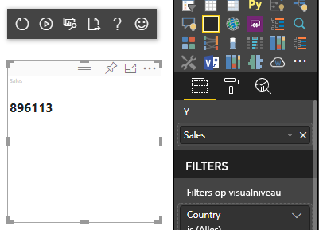
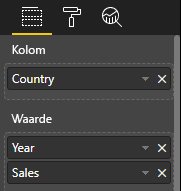
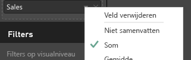
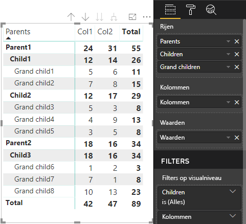

# <a name="understand-data-view-mapping-in-power-bi-visuals"></a>Informatie over toewijzing van gegevensweergaven in Power BI-visuals

In dit artikel wordt uitgelegd hoe toewijzing van gegevensweergaven verloopt en wordt de relatie tussen de verschillende gegevensrollen beschreven. Ook kunt u hiermee voorwaardelijke vereisten voor deze rollen opgeven. In dit artikel wordt ook elk `dataMappings`-type beschreven.

Door elke geldige toewijzing wordt een gegevensweergave geproduceerd, maar momenteel wordt slechts één query per visual ondersteunt. Normaal gesproken krijgt u slechts één gegevensweergave. U kunt echter meerdere gegevenstoewijzingen opgeven met verschillende voorwaarden, waardoor:

```json
"dataViewMappings": [
    {
        "conditions": [ ... ],
        "categorical": { ... },
        "single": { ... },
        "table": { ... },
        "matrix": { ... }
    }
]
```

Power BI een toewijzing naar een gegevensweergave maakt als de geldige toewijzing wordt ingevuld in `dataViewMappings`, en alleen dan.

Met andere woorden, `categorical` kan worden gedefinieerd in `dataViewMappings`, terwijl dit mogelijk niet geldt voor andere toewijzingen, zoals `table` of `single`. Bijvoorbeeld:

```json
"dataViewMappings": [
    {
        "categorical": { ... }
    }
]
```

Power BI produceert een gegevensweergave met één `categorical`-toewijzing en `table` en andere toewijzingen worden niet gedefinieerd:

```javascript
{
    "categorical": {
        "categories": [ ... ],
        "values": [ ... ]
    },
    "metadata": { ... }
}
```

## <a name="conditions"></a>Voorwaarden

In deze sectie worden de voorwaarden voor een bepaalde gegevenstoewijzing beschreven. U kunt meerdere sets voorwaarden opgeven, en als de gegevens overeenkomen met een van de beschreven sets voorwaarden, worden de gegevens door de visual geaccepteerd als geldig.

Op dit moment kunt u voor elk veld een minimum- en maximumwaarde opgeven. De waarde vertegenwoordigt het aantal velden dat aan die gegevensrol kan worden gebonden. 

> [!NOTE]
> Als een gegevensrol in de voorwaarde wordt weggelaten, kan een willekeurig aantal velden worden opgegeven.

### <a name="example-1"></a>Voorbeeld 1

U kunt meerdere velden naar elke gegevensrol slepen. In dit voorbeeld wordt de categorie (category) beperkt tot één gegevensveld en de meting (measure) tot twee gegevensvelden.

```json
"conditions": [
    { "category": { "max": 1 }, "y": { "max": 2 } },
]
```

### <a name="example-2"></a>Voorbeeld 2

In dit voorbeeld is een van de twee voorwaarden vereist:
* Precies één categoriegegevensveld en precies twee metingen
* Precies twee categorieën en precies één meting.

```json
"conditions": [
    { "category": { "min": 1, "max": 1 }, "measure": { "min": 2, "max": 2 } },
    { "category": { "min": 2, "max": 2 }, "measure": { "min": 1, "max": 1 } }
]
```

## <a name="single-data-mapping"></a>Enkele gegevenstoewijzing

Enkele gegevenstoewijzing is de eenvoudigste vorm van gegevenstoewijzing. Hiermee wordt één metingveld geaccepteerd en krijgt u het totaal. Als het veld numeriek is, krijgt u de som. Anders krijgt u het aantal unieke waarden.

Als u enkele gegevenstoewijzing wilt gebruiken, moet u de naam definiëren van de gegevensrol die u wilt toewijzen. Deze toewijzing werkt alleen met één metingveld. Als er een tweede veld wordt toegewezen, wordt er geen gegevensweergave gegenereerd, dus is het ook handig om een voorwaarde op te nemen waarmee de gegevens worden beperkt tot één veld.

> [!NOTE]
> Deze gegevenstoewijzing kan niet worden gebruikt in combinatie met een andere gegevenstoewijzing. De toewijzing is bedoeld om gegevens te reduceren tot één numerieke waarde.

### <a name="example-3"></a>Voorbeeld 3

```json
{
    "dataRoles": [
        {
            "displayName": "Y",
            "name": "Y",
            "kind": "Measure"
        }
    ],
    "dataViewMappings": [
        {
            "conditions": [
                {
                    "Y": {
                        "max": 1
                    }
                }
            ],
            "single": {
                "role": "Y"
            }
        }
    ]
}
```

De resulterende gegevensweergave bevat nog steeds de andere typen (tabel, categorische, enzovoort), maar elke toewijzing bevat alleen de enkele waarde. De aanbevolen procedure is om toegang te krijgen tot de waarde in één (single) veld.

```JSON
{
    "dataView": [
        {
            "metadata": null,
            "categorical": null,
            "matrix": null,
            "table": null,
            "tree": null,
            "single": {
                "value": 94163140.3560001
            }
        }
    ]
}
```

Codevoorbeeld voor het verwerken van de toewijzing van eenvoudige gegevensweergaven

```typescript
"use strict";
import powerbi from "powerbi-visuals-api";
import DataView = powerbi.DataView;
import DataViewSingle = powerbi.DataViewSingle;
// standart imports
// ...

export class Visual implements IVisual {
    private target: HTMLElement;
    private host: IVisualHost;
    private valueText: HTMLParagraphElement;

    constructor(options: VisualConstructorOptions) {
        // constructor body
        this.target = options.element;
        this.host = options.host;
        this.valueText = document.createElement("p");
        this.target.appendChild(this.valueText);
        // ...
    }

    public update(options: VisualUpdateOptions) {
        const dataView: DataView = options.dataViews[0];
        const singleDataView: DataViewSingle = dataView.single;

        if (!singleDataView ||
            !singleDataView.value ) {
            return
        }

        this.valueText.innerText = singleDataView.value.toString();
    }
}
```

Als gevolg hiervan wordt in de visual een enkele waarde uit Power BI weergegeven:



## <a name="categorical-data-mapping"></a>Categorische gegevenstoewijzing

Categorische gegevenstoewijzing wordt gebruikt om een of twee onafhankelijke groeperingen van gegevens op te halen.

### <a name="example-4"></a>Voorbeeld 4

Hier volgt de definitie uit het vorige voorbeeld over gegevensrollen:

```json
"dataRole":[
    {
        "displayName": "Category",
        "name": "category",
        "kind": "Grouping"
    },
    {
        "displayName": "Y Axis",
        "name": "measure",
        "kind": "Measure"
    }
]
```

De toewijzing is als volgt:

```json
"dataViewMappings": {
    "categorical": {
        "categories": {
            "for": { "in": "category" }
        },
        "values": {
            "select": [
                { "bind": { "to": "measure" } }
            ]
        }
    }
}
```

Dit is een eenvoudig voorbeeld. Er staat 'Wijs de gegevensrol van mijn `category` zo toe dat de gegevens van elk veld dat ik naar `category` sleep, worden toegewezen aan `categorical.categories`. En wijs de gegevensrol van mijn `measure` toe aan `categorical.values`'.

* **for... in**: Neem alle items in deze gegevensrol op in de gegevensquery.
* **bind...to**: Produceert hetzelfde resultaat als *for...in*, maar verwacht dat de gegevensrol een voorwaarde heeft die deze beperkt tot één veld.

### <a name="example-5"></a>Voorbeeld 5

In dit voorbeeld gebruiken we de eerste twee gegevensrollen uit het vorige voorbeeld en definiëren bovendien `grouping` en `measure2`.

```json
"dataRole":[
    {
        "displayName": "Category",
        "name": "category",
        "kind": "Grouping"
    },
    {
        "displayName": "Y Axis",
        "name": "measure",
        "kind": "Measure"
    },
    {
        "displayName": "Grouping with",
        "name": "grouping",
        "kind": "Grouping"
    },
    {
        "displayName": "X Axis",
        "name": "measure2",
        "kind": "Grouping"
    }
]
```

De toewijzing is als volgt:

```json
"dataViewMappings":{
    "categorical": {
        "categories": {
            "for": { "in": "category" }
        },
        "values": {
            "group": {
                "by": "grouping",
                "select":[
                    { "bind": { "to": "measure" } },
                    { "bind": { "to": "measure2" } }
                ]
            }
        }
    }
}
```

Hier is het verschil de manier waarop we categorical.values toewijzen. We zeggen: 'Wijs de gegevensrollen van mijn `measure` en `measure2` toe om te worden gegroepeerd op de gegevensrol `grouping`'.

### <a name="example-6"></a>Voorbeeld 6

Hier zijn de gegevensrollen:

```json
"dataRoles": [
    {
        "displayName": "Categories",
        "name": "category",
        "kind": "Grouping"
    },
    {
        "displayName": "Measures",
        "name": "measure",
        "kind": "Measure"
    },
    {
        "displayName": "Series",
        "name": "series",
        "kind": "Measure"
    }
]
```

Dit is de toewijzing van de gegevensweergave:

```json
"dataViewMappings": [
    {
        "categorical": {
            "categories": {
                "for": {
                    "in": "category"
                }
            },
            "values": {
                "group": {
                    "by": "series",
                    "select": [{
                            "for": {
                                "in": "measure"
                            }
                        }
                    ]
                }
            }
        }
    }
]
```

De categorische gegevensweergave kan als volgt worden gevisualiseerd:

| Land | 2013 | 2014 | 2015 | 2016 |
|---------|------|------|------|------|
| VS | x | x | 650 | 350 |
| Canada | x | 630 | 490 | x |
| Mexico | 645 | x | x | x |
| VK | x | x | 831 | x |


Power BI produceert deze als de categorische gegevensweergave. Het is de set met categorieën.

```JSON
{
    "categorical": {
        "categories": [
            {
                "source": {...},
                "values": [
                    "Canada",
                    "USA",
                    "UK",
                    "Mexico"
                ],
                "identity": [...],
                "identityFields": [...],
            }
        ]
    }
}
```

Elke categorie wordt ook toegewezen aan een set met waarden. Elk van deze waarden wordt gegroepeerd op een reeks, die wordt uitgedrukt in jaren.

Elke `values`-matrix vertegenwoordigt bijvoorbeeld gegevens voor elk jaar.
Elke `values`-matrix heeft ook vier waarden, voor respectievelijk Canada, USA, het VK en Mexico:

```JSON
{
    "values": [
        // Values for 2013 year
        {
            "source": {...},
            "values": [
                null, // Value for `Canada` category
                null, // Value for `USA` category
                null, // Value for `UK` category
                645 // Value for `Mexico` category
            ],
            "identity": [...],
        },
        // Values for 2014 year
        {
            "source": {...},
            "values": [
                630, // Value for `Canada` category
                null, // Value for `USA` category
                null, // Value for `UK` category
                null // Value for `Mexico` category
            ],
            "identity": [...],
        },
        // Values for 2015 year
        {
            "source": {...},
            "values": [
                490, // Value for `Canada` category
                650, // Value for `USA` category
                831, // Value for `UK` category
                null // Value for `Mexico` category
            ],
            "identity": [...],
        },
        // Values for 2016 year
        {
            "source": {...},
            "values": [
                null, // Value for `Canada` category
                350, // Value for `USA` category
                null, // Value for `UK` category
                null // Value for `Mexico` category
            ],
            "identity": [...],
        }
    ]
}
```

Het codevoorbeeld voor het verwerken van de toewijzing van categorische gegevensweergaven wordt hieronder beschreven. Het voorbeeld zorgt voor een hiërarchische structuur `Country => Year => Value`

```typescript
"use strict";
import powerbi from "powerbi-visuals-api";
import DataView = powerbi.DataView;
import DataViewDataViewCategoricalSingle = powerbi.DataViewCategorical;
import DataViewValueColumnGroup = powerbi.DataViewValueColumnGroup;
import PrimitiveValue = powerbi.PrimitiveValue;
// standart imports
// ...

export class Visual implements IVisual {
    private target: HTMLElement;
    private host: IVisualHost;
    private categories: HTMLElement;

    constructor(options: VisualConstructorOptions) {
        // constructor body
        this.target = options.element;
        this.host = options.host;
        this.categories = document.createElement("pre");
        this.target.appendChild(this.categories);
        // ...
    }

    public update(options: VisualUpdateOptions) {
        const dataView: DataView = options.dataViews[0];
        const categoricalDataView: DataViewCategorical = dataView.categorical;

        if (!categoricalDataView ||
            !categoricalDataView.categories ||
            !categoricalDataView.categories[0] ||
            !categoricalDataView.values) {
            return;
        }

        // Categories have only one column in data buckets
        // If you want to support several columns of categories data bucket, you should iterate categoricalDataView.categories array.
        const categoryFieldIndex = 0;
        // Measure has only one column in data buckets.
        // If you want to support several columns on data bucket, you should iterate years.values array in map function
        const measureFieldIndex = 0;
        let categories: PrimitiveValue[] = categoricalDataView.categories[categoryFieldIndex].values;
        let values: DataViewValueColumnGroup[] = categoricalDataView.values.grouped();

        let data = {};
        // iterate categories/countries
        categories.map((category: PrimitiveValue, categoryIndex: number) => {
            data[category.toString()] = {};
            // iterate series/years
            values.map((years: DataViewValueColumnGroup) => {
                if (!data[category.toString()][years.name] && years.values[measureFieldIndex].values[categoryIndex]) {
                    data[category.toString()][years.name] = []
                }
                if (years.values[0].values[categoryIndex]) {
                    data[category.toString()][years.name].push(years.values[measureFieldIndex].values[categoryIndex]);
                }
            });
        });

        this.categories.innerText = JSON.stringify(data, null, 6);
        console.log(data);
    }
}
```

Het resultaat van de visual:


## <a name="table-data-mapping"></a>Tabelgegevenstoewijzing

De tabelgegevensweergave is een eenvoudige gegevenstoewijzing. Het is in essentie een lijst met gegevenspunten, waarin numerieke gegevenspunten kunnen worden geaggregeerd.

### <a name="example-7"></a>Voorbeeld 7

Met de gegeven mogelijkheden:

```json
"dataRoles": [
    {
        "displayName": "Column",
        "name": "column",
        "kind": "Grouping"
    },
    {
        "displayName": "Value",
        "name": "value",
        "kind": "Measure"
    }
]
```

```json
"dataViewMappings": [
    {
        "table": {
            "rows": {
                "select": [
                    {
                        "for": {
                            "in": "column"
                        }
                    },
                    {
                        "for": {
                            "in": "value"
                        }
                    }
                ]
            }
        }
    }
]
```

U kunt de tabelgegevensweergave als volgt visualiseren:  

Voorbeeld van gegevens:

| Land| Year | Sales |
|-----|-----|------|
| VS | 2016 | 100 |
| VS | 2015 | 50 |
| Canada | 2015 | 200 |
| Canada | 2015 | 50 |
| Mexico | 2013 | 300 |
| VK | 2014 | 150 |
| VS | 2015 | 75 |

Gegevensbinding:



Power BI geeft uw gegevens weer als de tabelgegevensweergave. U moet er niet van uitgaan dat de gegevens zijn geordend.

```JSON
{
    "table" : {
        "columns": [...],
        "rows": [
            [
                "Canada",
                2014,
                630
            ],
            [
                "Canada",
                2015,
                490
            ],
            [
                "Mexico",
                2013,
                645
            ],
            [
                "UK",
                2014,
                831
            ],
            [
                "USA",
                2015,
                650
            ],
            [
                "USA",
                2016,
                350
            ]
        ]
    }
}
```

U kunt de gegevens samenvoegen door het gewenste veld te selecteren en vervolgens Som te selecteren.  



Codevoorbeeld voor het verwerken van de toewijzing van tabelgegevensweergaven.

```typescript
"use strict";
import "./../style/visual.less";
import powerbi from "powerbi-visuals-api";
// ...
import DataViewMetadataColumn = powerbi.DataViewMetadataColumn;
import DataViewTable = powerbi.DataViewTable;
import DataViewTableRow = powerbi.DataViewTableRow;
import PrimitiveValue = powerbi.PrimitiveValue;
// other imports
// ...

export class Visual implements IVisual {
    private target: HTMLElement;
    private host: IVisualHost;
    private table: HTMLParagraphElement;

    constructor(options: VisualConstructorOptions) {
        // constructor body
        this.target = options.element;
        this.host = options.host;
        this.table = document.createElement("table");
        this.target.appendChild(this.table);
        // ...
    }

    public update(options: VisualUpdateOptions) {
        const dataView: DataView = options.dataViews[0];
        const tableDataView: DataViewTable = dataView.table;

        if (!tableDataView) {
            return
        }
        while(this.table.firstChild) {
            this.table.removeChild(this.table.firstChild);
        }

        //draw header
        const tableHeader = document.createElement("th");
        tableDataView.columns.forEach((column: DataViewMetadataColumn) => {
            const tableHeaderColumn = document.createElement("td");
            tableHeaderColumn.innerText = column.displayName
            tableHeader.appendChild(tableHeaderColumn);
        });
        this.table.appendChild(tableHeader);

        //draw rows
        tableDataView.rows.forEach((row: DataViewTableRow) => {
            const tableRow = document.createElement("tr");
            row.forEach((columnValue: PrimitiveValue) => {
                const cell = document.createElement("td");
                cell.innerText = columnValue.toString();
                tableRow.appendChild(cell);
            })
            this.table.appendChild(tableRow);
        });
    }
}
```

Het bestand `style/visual.less` met visuele stijlen bevat een indeling voor tabel:

```less
table {
    display: flex;
    flex-direction: column;
}

tr, th {
    display: flex;
    flex: 1;
}

td {
    flex: 1;
    border: 1px solid black;
}
```


## <a name="matrix-data-mapping"></a>Matrixgegevenstoewijzing

Matrixgegevenstoewijzing lijkt op tabelgegevenstoewijzing, maar de rijen worden hiërarchisch gepresenteerd. Een van de gegevensrolwaarden kan worden gebruikt als kolomkopwaarde.

```json
{
    "dataRoles": [
        {
            "name": "Category",
            "displayName": "Category",
            "displayNameKey": "Visual_Category",
            "kind": "Grouping"
        },
        {
            "name": "Column",
            "displayName": "Column",
            "displayNameKey": "Visual_Column",
            "kind": "Grouping"
        },
        {
            "name": "Measure",
            "displayName": "Measure",
            "displayNameKey": "Visual_Values",
            "kind": "Measure"
        }
    ],
    "dataViewMappings": [
        {
            "matrix": {
                "rows": {
                    "for": {
                        "in": "Category"
                    }
                },
                "columns": {
                    "for": {
                        "in": "Column"
                    }
                },
                "values": {
                    "select": [
                        {
                            "for": {
                                "in": "Measure"
                            }
                        }
                    ]
                }
            }
        }
    ]
}
```

Power BI maakt een hiërarchische gegevensstructuur. De hoofdmap van de hiërarchiestructuur bevat de gegevens uit de kolom **Bovenliggende items** van de `Category`-gegevensrol met onderliggende items uit de kolom **Onderliggende items** van de gegevensroltabel.

Gegevensset:

| Bovenliggende items | Onderliggende items | Dieper onderliggende items | Kolommen | Waarden |
|-----|-----|------|-------|-------|
| Bovenliggend item 1 | Onderliggend item 1 | Dieper onderliggend item 1 | Kolom 1 | 5 |
| Bovenliggend item 1 | Onderliggend item 1 | Dieper onderliggend item 1 | Kolom 2 | 6 |
| Bovenliggend item 1 | Onderliggend item 1 | Dieper onderliggend item 2 | Kolom 1 | 7 |
| Bovenliggend item 1 | Onderliggend item 1 | Dieper onderliggend item 2 | Kolom 2 | 8 |
| Bovenliggend item 1 | Onderliggend item 2 | Dieper onderliggend item 3 | Kolom 1 | 5 |
| Bovenliggend item 1 | Onderliggend item 2 | Dieper onderliggend item 3 | Kolom 2 | 3 |
| Bovenliggend item 1 | Onderliggend item 2 | Dieper onderliggend item 4 | Kolom 1 | 4 |
| Bovenliggend item 1 | Onderliggend item 2 | Dieper onderliggend item 4 | Kolom 2 | 9 |
| Bovenliggend item 1 | Onderliggend item 2 | Dieper onderliggend item 5 | Kolom 1 | 3 |
| Bovenliggend item 1 | Onderliggend item 2 | Dieper onderliggend item 5 | Kolom 2 | 5 |
| Bovenliggend item 2 | Onderliggend item 3 | Dieper onderliggend item 6 | Kolom 1 | 1 |
| Bovenliggend item 2 | Onderliggend item 3 | Dieper onderliggend item 6 | Kolom 2 | 2 |
| Bovenliggend item 2 | Onderliggend item 3 | Dieper onderliggend item 7 | Kolom 1 | 7 |
| Bovenliggend item 2 | Onderliggend item 3 | Dieper onderliggend item 7 | Kolom 2 | 1 |
| Bovenliggend item 2 | Onderliggend item 3 | Dieper onderliggend item 8 | Kolom 1 | 10 |
| Bovenliggend item 2 | Onderliggend item 3 | Dieper onderliggend item 8 | Kolom 2 | 13 |

De kernmatrixvisual van Power BI geeft de gegevens weer als een tabel.



De visual krijgt de gegevensstructuur zoals beschreven in de volgende code (alleen de eerste twee tabelrijen worden hier weergegeven):

```json
{
    "metadata": {...},
    "matrix": {
        "rows": {
            "levels": [...],
            "root": {
                "childIdentityFields": [...],
                "children": [
                    {
                        "level": 0,
                        "levelValues": [...],
                        "value": "Parent1",
                        "identity": {...},
                        "childIdentityFields": [...],
                        "children": [
                            {
                                "level": 1,
                                "levelValues": [...],
                                "value": "Child1",
                                "identity": {...},
                                "childIdentityFields": [...],
                                "children": [
                                    {
                                        "level": 2,
                                        "levelValues": [...],
                                        "value": "Grand child1",
                                        "identity": {...},
                                        "values": {
                                            "0": {
                                                "value": 5 // value for Col1
                                            },
                                            "1": {
                                                "value": 6 // value for Col2
                                            }
                                        }
                                    },
                                    ...
                                ]
                            },
                            ...
                        ]
                    },
                    ...
                ]
            }
        },
        "columns": {
            "levels": [...],
            "root": {
                "childIdentityFields": [...],
                "children": [
                    {
                        "level": 0,
                        "levelValues": [...],
                        "value": "Col1",
                        "identity": {...}
                    },
                    {
                        "level": 0,
                        "levelValues": [...],
                        "value": "Col2",
                        "identity": {...}
                    },
                    ...
                ]
            }
        },
        "valueSources": [...]
    }
}
```

## <a name="data-reduction-algorithm"></a>Gegevensreductiealgoritme

Als u de hoeveelheid gegevens wilt beheren die in de gegevensweergave moet worden ontvangen, kunt u een gegevensreductiealgoritme toepassen.

Standaard wordt in alle Power BI-visuals het gegevensreductiealgoritme 'top' toegepast, met *count* (aantal) ingesteld op 1000 gegevenspunten. Dit is hetzelfde als het instellen van de volgende eigenschappen in het bestand *capabilities.json*:

```json
"dataReductionAlgorithm": {
    "top": {
        "count": 1000
    }
}
```

U kunt de waarde *count* instellen op ieder geheel getal tot 30000. Op R gebaseerde Power BI-visuals kunnen tot 150000 rijen ondersteunen.

## <a name="data-reduction-algorithm-types"></a>Soorten gegevensreductiealgoritmen

Er zijn vier typen instellingen voor gegevensreductiealgoritme:

* `top`: Als u de gegevens wilt beperken tot waarden van de bovenkant van de gegevensset. De bovenste *count*-waarden worden uit de gegevensset genomen.
* `bottom`: Als u de gegevens wilt beperken tot waarden van de onderkant van de gegevensset. De laatste 'count'-waarden worden uit de gegevensset genomen.
* `sample`: Verklein de gegevensset door een eenvoudig steekproefalgoritme, beperkt tot *count* items. Dit betekent dat het eerste en laatste item worden opgenomen, en een aantal van *count* gegevens met gelijke intervallen ertussen.
Als u bijvoorbeeld de gegevensset [0, 1, 2, ... 100] en een *count* van 9 hebt, ontvangt u de waarden [0, 10, 20... 100].
* `window`: Laadt één *venster* met gegevenspunten tegelijk, dat *count* elementen bevat. Momenteel zijn `top` en `window` equivalent. Er wordt gewerkt aan de volledige ondersteuning van een vensterbewerkingsinstelling.

## <a name="data-reduction-algorithm-usage"></a>Gebruik van gegevensreductiealgoritme

Het gegevensreductiealgoritme kan worden gebruikt bij categorische, tabel- of matrixtoewijzing.

Het algoritme kan worden opgenomen in `categories` en/of de groepssectie van `values` voor categorische gegevenstoewijzing.

### <a name="example-8"></a>Voorbeeld 8

```json
"dataViewMappings": {
    "categorical": {
        "categories": {
            "for": { "in": "category" },
            "dataReductionAlgorithm": {
                "window": {
                    "count": 300
                }
            }  
        },
        "values": {
            "group": {
                "by": "series",
                "select": [{
                        "for": {
                            "in": "measure"
                        }
                    }
                ],
                "dataReductionAlgorithm": {
                    "top": {
                        "count": 100
                    }
                }  
            }
        }
    }
}
```

U kunt het gegevensreductiealgoritme toepassen op de sectie `rows` van de toewijzingstabel van de gegevensweergave.

### <a name="example-9"></a>Voorbeeld 9

```json
"dataViewMappings": [
    {
        "table": {
            "rows": {
                "for": {
                    "in": "values"
                },
                "dataReductionAlgorithm": {
                    "top": {
                        "count": 2000
                    }
                }
            }
        }
    }
]
```

U kunt het gegevensreductiealgoritme toepassen op de secties `rows` en `columns` van de toewijzingsmatrix van de gegevensweergave.

## <a name="next-steps"></a>Volgende stappen

Lees meer informatie over het [toevoegen van ondersteuning voor inzoomen voor toewijzingen van gegevensweergaven in Power BI-visuals](drill-down-support.md).
