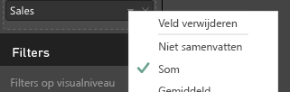
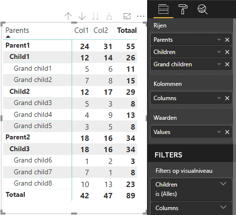

# <a name="data-view-mappings-in-power-bi-visuals"></a>Toewijzing van gegevensweergaven in Power BI-visuals

Met een `dataViewMappings` wordt de relatie tussen de verschillende gegevensrollen beschreven. Ook kunt u hiermee voorwaardelijke vereisten voor deze rollen opgeven.
Er is een sectie voor elk van de `dataMappings`.

Elke geldige toewijzing produceert een `DataView`, maar momenteel ondersteunen we het uitvoeren van slechts één query per visual, dus in de meeste gevallen krijgt u slechts één `DataView`. U kunt echter meerdere gegevenstoewijzingen opgeven met verschillende voorwaarden opgeven, waardoor

```json
"dataViewMappings": [
    {
        "conditions": [ ... ],
        "categorical": { ... },
        "single": { ... },
        "table": { ... },
        "matrix": { ... }
    }
]
```

> [!NOTE]
> Het is belangrijk om te weten dat Power BI een toewijzing naar een DataView maakt als de geldige toewijzing wordt ingevuld in `dataViewMappings`, en alleen dan.

Met andere woorden, als `categorical` wordt gedefinieerd in `dataViewMappings` maar andere toewijzingen zoals `table`, `single`, enzovoort niet, zoals in het volgende voorbeeld:
```json
"dataViewMappings": [
    {
        "categorical": { ... }
    }
]
```

dan produceert Power BI een `DataView` met één toewijzing, `categorical` (`table` en andere toewijzingen zijn `undefined`):
```javascript
{
    "categorical": {
        "categories": [ ... ],
        "values": [ ... ]
    },
    "metadata": { ... }
}
```

## <a name="conditions"></a>Voorwaarden

Hierin worden de voorwaarden voor een bepaalde gegevenstoewijzing beschreven. U kunt meerdere sets voorwaarden opgeven, en als de gegevens overeenkomen met een van de beschreven sets voorwaarden, wordt de gegevens door de visual geaccepteerd als geldig.

Op dit moment kunt u voor elk veld een minimum- en maximumwaarde opgeven. Het vertegenwoordigt het aantal velden dat aan die gegevensrol kan worden gebonden. 

> [!NOTE]
> Als een gegevensrol in de voorwaarde wordt weggelaten, kan een willekeurig aantal velden worden opgegeven.

### <a name="example-1"></a>Voorbeeld 1

U kunt meerdere velden naar elke gegevensrol slepen. In dit voor beeld beperken we de categorie (category) tot één gegevensveld en de meting (measure) tot twee gegevensvelden.

```json
"conditions": [
    { "category": { "max": 1 }, "y": { "max": 2 } },
]
```

### <a name="example-2"></a>Voorbeeld 2

In dit voor beeld is een van de twee voorwaarden vereist. Of precies één categoriegegevensveld en precies twee metingen, of precies twee categorieën en precies één meting.

```json
"conditions": [
    { "category": { "min": 1, "max": 1 }, "measure": { "min": 2, "max": 2 } },
    { "category": { "min": 2, "max": 2 }, "measure": { "min": 1, "max": 1 } }
]
```

## <a name="single-data-mapping"></a>Enkele gegevenstoewijzing

Enkele gegevenstoewijzing is de eenvoudigste vorm van gegevenstoewijzing. Hiermee wordt één metingveld geaccepteerd en krijgt u het totaal. Als het veld numeriek is, krijgt u de som. Anders krijgt u het aantal unieke waarden.

Als u enkele gegevenstoewijzing wilt gebruiken, moet u de naam definiëren van de gegevensrol die u wilt toewijzen. Deze toewijzing werkt alleen met één metingveld. Als er een tweede veld wordt toegewezen, wordt er geen gegevensweergave gegenereerd, dus is het ook handig om een voorwaarde op te nemen waarmee de gegevens worden beperkt tot één veld.

> [!NOTE]
> Deze gegevenstoewijzing kan niet worden gebruikt in combinatie met een andere gegevenstoewijzing. De toewijzing is bedoeld om gegevens te reduceren tot één numerieke waarde.

### <a name="example-3"></a>Voorbeeld 3

```json
"dataViewMappings": {
    "conditions": [
        { "Y": { "max": 1 } }
    ],
    "single": {
        "role": "Y"
    }
}  
```

De resulterende gegevens weergave bevat nog steeds de andere typen (tabel, categorische, enzovoort), maar elke toewijzing bevat alleen de enkele waarde. De aanbevolen procedure is om toegang te krijgen tot de waarde in één (single) veld.

```JSON
{
    "dataView": [
        {
            "metadata": null,
            "categorical": null,
            "matrix": null,
            "table": null,
            "tree": null,
            "single": {
                "value": 94163140.3560001
            }
        }
    ]
}
```

## <a name="categorical-data-mapping"></a>Categorische gegevenstoewijzing

Categorische gegevenstoewijzing wordt gebruikt om een of twee onafhankelijke groeperingen van gegevens op te halen.

### <a name="example-4"></a>Voorbeeld 4

Hier volgt de definitie uit het vorige voorbeeld over DataRoles.

```json
"dataRole":[
    {
        "displayName": "Category",
        "name": "category",
        "kind": "Grouping"
    },
    {
        "displayName": "Y Axis",
        "name": "measure",
        "kind": "Measure"
    }
]
```

Nu de toewijzing:

```json
"dataViewMappings": {
    "categorical": {
        "categories": {
            "for": { "in": "category" }
        },
        "values": {
            "select": [
                { "bind": { "to": "measure" } }
            ]
        }
    }
}
```

Het is een eenvoudig voorbeeld. In gewone taal staat er: 'Wijs de DataRole van mijn `category` zo toe dat de gegevens van elk veld dat ik naar `category` sleep, worden toegewezen aan `categorical.categories`. En wijs de DataRole van mijn `measure` toe aan `categorical.values`'.

* **for...in** - Neem alle items in deze gegevensrol op in de gegevensquery.
* **bind...to** - Produceert hetzelfde resultaat als for...in, maar verwacht dat de DataRole een voorwaarde heeft die deze beperkt tot één veld.

### <a name="example-5"></a>Voorbeeld 5

In dit voorbeeld gebruiken we de eerste twee DataRoles uit het vorige voorbeeld en definiëren bovendien `grouping` en `measure2`.

```json
"dataRole":[
    {
        "displayName": "Category",
        "name": "category",
        "kind": "Grouping"
    },
    {
        "displayName": "Y Axis",
        "name": "measure",
        "kind": "Measure"
    },
    {
        "displayName": "Grouping with",
        "name": "grouping",
        "kind": "Grouping"
    },
    {
        "displayName": "X Axis",
        "name": "measure2",
        "kind": "Grouping"
    }
]
```

Nu de toewijzing:

```json
"dataViewMappings":{
    "categorical": {
        "categories": {
            "for": { "in": "category" }
        },
        "values": {
            "group": {
                "by": "grouping",
                "select":[
                    { "bind": { "to": "measure" } },
                    { "bind": { "to": "measure2" } }
                ]
            }
        }
    }
}
```

Hier is het verschil de manier waarop we categorical.values toewijzen. We zeggen: 'Wijs de gegevensrollen van mijn `measure` en `measure2` toe om te worden gegroepeerd op de gegevensrol `grouping`'.

### <a name="example-6"></a>Voorbeeld 6

Hier zijn de dataRoles.

```json
"dataRoles": [
    {
        "displayName": "Categories",
        "name": "category",
        "kind": "Grouping"
    },
    {
        "displayName": "Measures",
        "name": "measure",
        "kind": "Measure"
    },
    {
        "displayName": "Series",
        "name": "series",
        "kind": "Measure"
    }
]
```

Hier is de dataViewMapping.

```json
"dataViewMappings": [
    {
        "categorical": {
            "categories": {
                "for": {
                    "in": "category"
                }
            },
            "values": {
                "group": {
                    "by": "series",
                    "select": [{
                            "for": {
                                "in": "measure"
                            }
                        }
                    ]
                }
            }
        }
    }
]
```

De categorische `dataview` kan als volgt worden gevisualiseerd.

| Categorisch |  |  | | | |
|-----|-----|------|------|------|------|
| | Jaar | 2013 | 2014 | 2015 | 2016 |
| Land | | |
| VS | | x | x | 125 | 100 |
| Canada | | x | 50 | 200 | x |
| Mexico | | 300 | x | x | x |
| VK | | x | x | 75 | x |

Power BI produceert dit voor u als de categorische gegevensweergave. Het is de set met categorieën.

```JSON
{
    "categorical": {
        "categories": [
            {
                "source": {...},
                "values": [
                    "Canada",
                    "Mexico",
                    "UK",
                    "USA"
                ],
                "identity": [...],
                "identityFields": [...],
            }
        ]
    }
}
```

Elke categorie wordt ook toegewezen aan een set met waarden. Elk van deze waarden wordt gegroepeerd op een reeks, namelijk jaren.

Zo is de verkoop in Canada in 2013 null, en de verkoop in Canada in 2014 is 50.

```JSON
{
    "values": [
        {
            "source": {...},
            "values": [
                null,
                300,
                null,
                null
            ],
            "identity": [...],
        },
        {
            "source": {...},
            "values": [
                50,
                null,
                150,
                null
            ],
            "identity": [...],
        },
        {
            "source": {...},
            "values": [
                200,
                null,
                null,
                125
            ],
            "identity": [...],
        },
        {
            "source": {...},
            "values": [
                null,
                null,
                null,
                100
            ],
            "identity": [...],
        }
    ]
}
```

## <a name="table-data-mapping"></a>Tabelgegevenstoewijzing

De tabelgegevensweergave is een eenvoudige gegevenstoewijzing. Het is in essentie een lijst met gegevenspunten, waarin numerieke gegevenspunten kunnen worden geaggregeerd.

### <a name="example-7"></a>Voorbeeld 7

Met de gegeven mogelijkheden:

```json
"dataRoles": [
    {
        "displayName": "Values",
        "name": "values",
        "kind": "Measure"
    }
]
```

```json
"dataViewMappings": [
    {
        "table": {
            "rows": {
                "for": {
                    "in": "values"
                }
            }
        }
    }
]
```

Kan de tabel `dataview` als volgt worden gevisualiseerd.  

| Land| Jaar | Verkoop |
|-----|-----|------|
| VS | 2016 | 100 |
| VS | 2015 | 50 |
| Canada | 2015 | 200 |
| Canada | 2015 | 50 |
| Mexico | 2013 | 300 |
| VK | 2014 | 150 |
| VS | 2015 | 75 |

Power BI produceert u bent als de gegevensweergave van de tabel. Ga er niet vanuit dat er een sortering is.

```JSON
{
    "table" : {
        "columns": [...],
        "rows": [
            [
                "Canada",
                2014,
                50
            ],
            [
                "Canada",
                2015,
                200
            ],
            [
                "Mexico",
                2013,
                300
            ],
            [
                "UK",
                2014,
                150
            ],
            [
                "USA",
                2015,
                100
            ],
            [
                "USA",
                2015,
                75
            ],
            [
                "USA",
                2016,
                100
            ]
        ]
    }
}
```

De gegevens kunnen worden geaggregeerd door het gewenste veld te selecteren en op Som te klikken.  



## <a name="matrix-data-mapping"></a>Matrixgegevenstoewijzing

Matrixgegevenstoewijzing lijkt op tabelgegevenstoewijzing, maar rijen worden hiërarchisch gepresenteerd. En een van de `dataRole`-waarden kan worden gebruikt als kolomkopwaarde.

```json
{
    "dataRoles": [
        {
            "name": "Category",
            "displayName": "Category",
            "displayNameKey": "Visual_Category",
            "kind": "Grouping"
        },
        {
            "name": "Column",
            "displayName": "Column",
            "displayNameKey": "Visual_Column",
            "kind": "Grouping"
        },
        {
            "name": "Measure",
            "displayName": "Measure",
            "displayNameKey": "Visual_Values",
            "kind": "Measure"
        }
    ],
    "dataViewMappings": [
        {
            "matrix": {
                "rows": {
                    "for": {
                        "in": "Category"
                    }
                },
                "columns": {
                    "for": {
                        "in": "Column"
                    }
                },
                "values": {
                    "select": [
                        {
                            "for": {
                                "in": "Measure"
                            }
                        }
                    ]
                }
            }
        }
    ]
}
```

Power BI maakt een hiërarchische gegevensstructuur. Het hoofditem van de structuur bevat de gegevens uit de eerste kolom van de gegevensrol `Category` met de onderliggende items uit de tweede kolom van de gegevensrol.

Gegevensset:

| Bovenliggende items | Onderliggende items | Dieper onderliggende items | Kolommen | Waarden |
|-----|-----|------|-------|-------|
| Bovenliggend item 1 | Onderliggend item 1 | Dieper onderliggend item 1 | Kolom 1 | 5 |
| Bovenliggend item 1 | Onderliggend item 1 | Dieper onderliggend item 1 | Kolom 2 | 6 |
| Bovenliggend item 1 | Onderliggend item 1 | Dieper onderliggend item 2 | Kolom 1 | 7 |
| Bovenliggend item 1 | Onderliggend item 1 | Dieper onderliggend item 2 | Kolom 2 | 8 |
| Bovenliggend item 1 | Onderliggend item 2 | Dieper onderliggend item 3 | Kolom 1 | 5 |
| Bovenliggend item 1 | Onderliggend item 2 | Dieper onderliggend item 3 | Kolom 2 | 3 |
| Bovenliggend item 1 | Onderliggend item 2 | Dieper onderliggend item 4 | Kolom 1 | 4 |
| Bovenliggend item 1 | Onderliggend item 2 | Dieper onderliggend item 4 | Kolom 2 | 9 |
| Bovenliggend item 1 | Onderliggend item 2 | Dieper onderliggend item 5 | Kolom 1 | 3 |
| Bovenliggend item 1 | Onderliggend item 2 | Dieper onderliggend item 5 | Kolom 2 | 5 |
| Bovenliggend item 2 | Onderliggend item 3 | Dieper onderliggend item 6 | Kolom 1 | 1 |
| Bovenliggend item 2 | Onderliggend item 3 | Dieper onderliggend item 6 | Kolom 2 | 2 |
| Bovenliggend item 2 | Onderliggend item 3 | Dieper onderliggend item 7 | Kolom 1 | 7 |
| Bovenliggend item 2 | Onderliggend item 3 | Dieper onderliggend item 7 | Kolom 2 | 1 |
| Bovenliggend item 2 | Onderliggend item 3 | Dieper onderliggend item 8 | Kolom 1 | 10 |
| Bovenliggend item 2 | Onderliggend item 3 | Dieper onderliggend item 8 | Kolom 2 | 13 |

De Core Matrix-visual van Power BI geeft het weer als een tabel.



De visual krijgt een gegevensstructuur zoals hieronder beschreven (alleen de eerste twee rijen worden gepresenteerd):

```json
{
    "metadata": {...},
    "matrix": {
        "rows": {
            "levels": [...],
            "root": {
                "childIdentityFields": [...],
                "children": [
                    {
                        "level": 0,
                        "levelValues": [...],
                        "value": "Parent1",
                        "identity": {...},
                        "childIdentityFields": [...],
                        "children": [
                            {
                                "level": 1,
                                "levelValues": [...],
                                "value": "Child1",
                                "identity": {...},
                                "childIdentityFields": [...],
                                "children": [
                                    {
                                        "level": 2,
                                        "levelValues": [...],
                                        "value": "Grand child1",
                                        "identity": {...},
                                        "values": {
                                            "0": {
                                                "value": 5 // value for Col1
                                            },
                                            "1": {
                                                "value": 6 // value for Col2
                                            }
                                        }
                                    },
                                    ...
                                ]
                            },
                            ...
                        ]
                    },
                    ...
                ]
            }
        },
        "columns": {
            "levels": [...],
            "root": {
                "childIdentityFields": [...],
                "children": [
                    {
                        "level": 0,
                        "levelValues": [...],
                        "value": "Col1",
                        "identity": {...}
                    },
                    {
                        "level": 0,
                        "levelValues": [...],
                        "value": "Col2",
                        "identity": {...}
                    },
                    ...
                ]
            }
        },
        "valueSources": [...]
    }
}
```

## <a name="data-reduction-algorithm"></a>Gegevensreductiealgoritme

Een `DataReductionAlgorithm` kan worden toegepast als u de hoeveelheid in de Dataview ontvangen gegevens wilt beheren.

Standaard wordt in alle aangepaste visuals het DataReductionAlgorithm 'top' toegepast, met 'count' (aantal) ingesteld op 1000 gegevenspunten. Dit is equivalent aan het instellen van de volgende eigenschappen in capabilities.json:

```json
"dataReductionAlgorithm": {
    "top": {
        "count": 1000
    }
}
```

U kunt de waarde van 'count' instellen op ieder geheel getal tot 30000. Op R gebaseerde aangepaste visuals kunnen tot 150000 rijen ondersteunen.

## <a name="data-reduction-algorithm-types"></a>Soorten gegevensreductiealgoritmen

Er zijn vier soorten `DataReductionAlgorithm`-instellingen:

* `top`: als u de gegevens wilt beperken tot waarden van de bovenkant van de gegevensset. De bovenste 'count' waarden worden uit de gegevensset genomen.
* `bottom`: als u de gegevens wilt beperken tot waarden van de onderkant van de gegevensset. De laatste 'count' waarden worden uit de gegevensset genomen.
* `sample`: verklein de gegevensset door een eenvoudig steekproefalgoritme, beperkt tot 'count' items. Het betekent dat het eerste en laatste item worden opgenomen, en een aantal van 'count' gegevens met gelijke intervallen ertussen.
Als u bijvoorbeeld de gegevensset [0, 1, 2, ... 100] hebt, en een `count: 9`, krijgt u de volgende waarden: [0, 10, 20 ... 100]
* `window`: laadt één 'venster' met gegevenspunten tegelijk, dat 'count' elementen bevat. Momenteel zijn `top` en `window` equivalent. Er wordt gewerkt aan de volledige ondersteuning van een vensterbewerkingsinstelling.

## <a name="data-reduction-algorithm-usage"></a>Gebruik van gegevensreductiealgoritme

`DataReductionAlgorithm` kan worden gebruikt bij categorische, tabel- of matrix-`dataview`-toewijzing.

Het kan worden opgenomen in `categories` en/of de groepssectie ('group') van `values` voor categorische gegevenstoewijzing.

### <a name="example-8"></a>Voorbeeld 8

```json
"dataViewMappings": {
    "categorical": {
        "categories": {
            "for": { "in": "category" },
            "dataReductionAlgorithm": {
                "window": {
                    "count": 300
                }
            }  
        },
        "values": {
            "group": {
                "by": "series",
                "select": [{
                        "for": {
                            "in": "measure"
                        }
                    }
                ],
                "dataReductionAlgorithm": {
                    "top": {
                        "count": 100
                    }
                }  
            }
        }
    }
}
```

Het gegevensreductiealgoritme kan worden toegepast op de sectie `rows` van tabel `dataview` toewijzing.

### <a name="example-9"></a>Voorbeeld 9

```json
"dataViewMappings": [
    {
        "table": {
            "rows": {
                "for": {
                    "in": "values"
                },
                "dataReductionAlgorithm": {
                    "top": {
                        "count": 2000
                    }
                } 
            }
        }
    }
]
```

Het gegevensreductiealgoritme kan worden toegepast op de sectie `rows` en/of `columns` van `matrix`-`dataview`-toewijzing.
