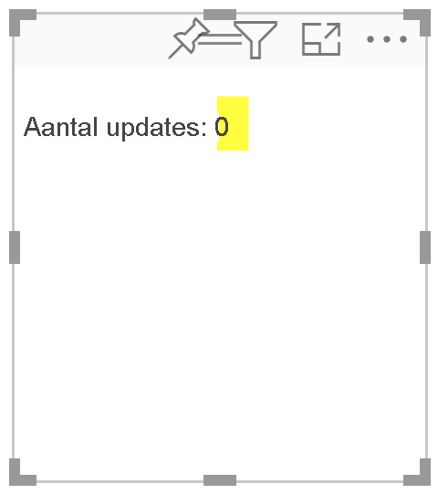
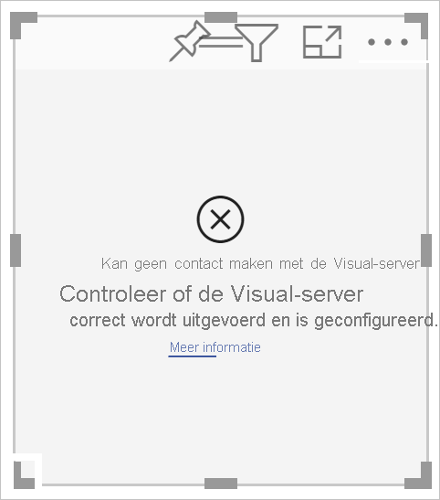
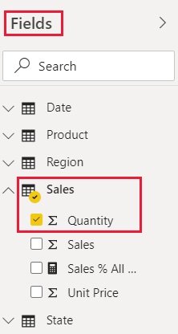
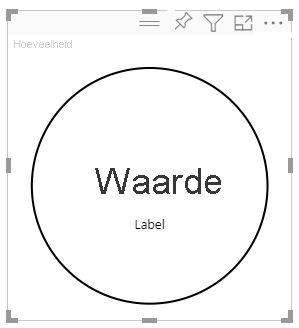
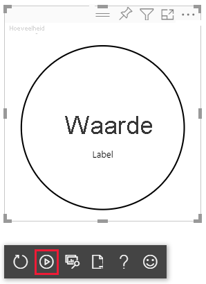
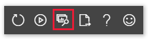

# <a name="tutorial-develop-a-power-bi-circle-card-visual"></a>Zelfstudie: Een visual van een cirkelkaart ontwikkelen in Power BI

Als ontwikkelaar kunt u uw eigen Power BI-visuals maken. Deze visuals kunnen door uzelf worden gebruikt, door uw organisatie of door derden.

In deze zelfstudie ontwikkelt u een Power BI-visual met de naam CircleCard waarin een opgemaakte meetwaarde wordt weergegeven in een cirkel. U kunt de opvulkleur en randbreedte van de visual van een cirkelkaart aanpassen.

In deze zelfstudie leert u het volgende:
> [!div class="checklist"]
> * Een ontwikkelingsproject maken voor uw visual.
> * De visual ontwikkelen met visuele D3-elementen.
> * De visual configureren voor het verwerken van gegevens.

## <a name="prerequisites"></a>Vereisten

Voordat u begint met het ontwikkelen van uw Power BI-visual controleert u of u over alles beschikt wat hieronder wordt vermeld.

* U hebt een **Power BI Pro** -account. Als u geen sleutel hebt, kunt u zich [registreren voor een gratis proefversie](https://powerbi.microsoft.com/pricing/).

* [Visual Studio Code (VS Code)](https://www.visualstudio.com/). VS Code is een ideale IDE (Integrated Development Environment) voor het ontwikkelen van JavaScript- en TypeScript-toepassingen.

* [Windows PowerShell](/powershell/scripting/install/installing-windows-powershell) versie 4 of hoger (voor Windows). Of [Terminal](https://macpaw.com/how-to/use-terminal-on-mac) (voor OSX).

* Een omgeving die is voorbereid voor het ontwikkelen van een Power BI-visual. [Lees hier hou u uw omgeving instelt voor het ontwikkelen van een Power BI-visual](environment-setup.md).

* In deze zelfstudie wordt het rapport **US Sales Analysis** gebruikt. U kunt dit rapport [downloaden](https://microsoft.github.io/PowerBI-visuals/docs/step-by-step-lab/images/US_Sales_Analysis.pbix) en uploaden naar de Power BI-service, maar u kunt ook uw eigen rapport gebruiken. Als u meer wilt weten over Power BI-service en bestanden en het uploaden van bestanden, raadpleegt u de zelfstudie [Aan de slag met de Power BI-service](../../fundamentals/service-get-started.md).

## <a name="create-a-development-project"></a>Een ontwikkelingsproject maken

In dit gedeelte maakt u een project voor de visual CircleCard.

1. Open PowerShell en navigeer naar de map waarin u het project wilt maken.

2. Voer de volgende opdracht in:

    ```PowerShell
    pbiviz new CircleCard
    ```

3. Navigeer naar de projectmap.

    ```powershell
    cd CircleCard
    ```

4. Start de visual CircleCard. Uw visual wordt nu uitgevoerd terwijl deze wordt gehost op uw computer.

    ```powershell
    pbiviz start
    ```
    >[!IMPORTANT]
    >Laat het venster van PowerShell geopend tot het einde van de zelfstudie. Als u het uitvoeren van de visual wilt stoppen, drukt u op Ctrl + C. Als wordt gevraagd of u de batchtaak wilt beëindigen, typt u Y in en drukt u op *Enter*.

## <a name="view-the-circle-card-in-power-bi-service"></a>De cirkelkaart weergeven in de Power BI-service

Om de visual van de cirkelkaart te testen in de Power BI-service, gebruiken we het rapport **US Sales Analysis**. U kunt dit rapport [downloaden](https://microsoft.github.io/PowerBI-visuals/docs/step-by-step-lab/images/US_Sales_Analysis.pbix) en uploaden naar de Power BI-service.

U kunt ook uw eigen rapport gebruiken om de visual van een cirkelkaart te testen.

>[!NOTE]
>Controleer eerst of u de [instellingen voor het ontwikkelen van visuals hebt ingeschakeld](environment-setup.md#set-up-power-bi-service-for-developing-a-visual).

1. Meld u aan bij [PowerBI.com](https://powerbi.microsoft.com/) en open het rapport **US Sales Analysis**.

2. Selecteer **Meer opties** > **Bewerken**.

    >[!div class="mx-imgBorder"]
    >

3. Maak een nieuwe pagina om te testen door op de knop **Nieuwe pagina** te klikken onderaan de interface van de Power BI-service.

    >[!div class="mx-imgBorder"]
    >

4. Selecteer de visual **Ontwikkelaar** in het deelvenster **Visualisaties**.

    >[!div class="mx-imgBorder"]
    >

    Deze visual (of visualisatie) staat voor de aangepaste visual die op uw computer wordt uitgevoerd. Deze optie is alleen beschikbaar wanneer de instelling [Aangepaste visuele foutopsporing inschakelen met de visual voor ontwikkelaars](environment-setup.md#set-up-power-bi-service-for-developing-a-visual) is ingeschakeld.

5. Kijk of er een visual is toegevoegd aan het rapportcanvas.

    >[!div class="mx-imgBorder"]
    >

    Dit is een eenvoudige visual die aangeeft hoe vaak de Update-methode van de visual is aangeroepen. Op dit moment is dat nul omdat de visual nog geen gegevens ophaalt.

    >[!NOTE]
    >Als in de visual een bericht over een verbindingsfout wordt weergegeven, opent u een nieuw tabblad in de browser, gaat u naar `https://localhost:8080/assets/status` en geeft u uw browser toestemming om dit adres te gebruiken.
    >
    >

6. Selecteer de nieuwe visual, ga naar het deelvenster **Velden** , vouw **Sales** uit en selecteer **Quantity**.

    >[!div class="mx-imgBorder"]
    >

7. Als u wilt testen hoe de visual reageert, wijzigt u het formaat van de visual. U ziet dan dat de waarde voor *Update count* telkens wordt verhoogd wanneer u het formaat van de visual wijzigt.

    >[!div class="mx-imgBorder"]
    >

## <a name="add-visual-elements-and-text"></a>Visuele elementen en tekst toevoegen

In dit gedeelte leert u hoe u van het visuele element een cirkel maakt en hoe u er tekst in kunt weergeven.

>[!NOTE]
>In deze zelfstudie wordt [Visual Studio Code](https://code.visualstudio.com/) (VS Code) gebruikt voor het ontwikkelen van de Power BI-visual.

### <a name="modify-the-visuals-file"></a>Het visual-bestand wijzigen

Pas het bestand **visual.ts** aan door een paar regels code te verwijderen en toe te voegen.

1. Open het project in VS Code ( **File** > **Open Folder** ).

2. Vouw in het deelvenster **Explorer** de map **src** uit en selecteert het bestand **visual.ts**.

    >[!div class="mx-imgBorder"]
    >

    > [!IMPORTANT]
    > Bekijk de opmerkingen bovenaan het bestand **visual.ts**. U ziet dat u in overeenstemming met de voorwaarden van de MIT-licentie (Massachusetts Institute of Technology) gratis gebruik kunt maken van de pakketten met aangepaste Power BI-visuals. Als onderdeel van de overeenkomst moet u de opmerkingen aan de bovenkant van het bestand laten staan.

3. Verwijder de volgende regels met code uit het bestand *visual.ts*.

    * De regel voor het importeren van de *VisualSettings* :
        ```typescript
        import { VisualSettings } from "./settings";
        ```

    * De vier declaraties voor privévariabelen op klasseniveau.

    * Alle coderegels binnen de *constructor*.

    * Alle coderegels binnen de methode *update*.

    * Alle resterende coderegels binnen de methode *update* , waaronder de methoden *parseSettings* en *enumerateObjectInstances*.

4. Voeg de volgende regels met code toe aan het einde van de sectie import:

    * *IVisualHost* : een verzameling eigenschappen en services die kunnen worden gebruikt voor interactie met de visual-host (Power BI).

         ```typescript
        import IVisualHost = powerbi.extensibility.IVisualHost;
        ```

    * *D3-bibliotheek*

        ```typescript
        import * as d3 from "d3";
        type Selection<T extends d3.BaseType> = d3.Selection<T, any,any, any>;
        ```
    
        >[!NOTE]
        >Als u deze bibliotheek niet hebt geselecteerd tijdens de installatie, [installeert u de D3-bibliotheek van JavaScript](environment-setup.md#d3-javascript-library).

5. Voeg onder de klassedeclaratie *Visual* de volgende eigenschappen op klasseniveau in. U hoeft alleen de coderegels toe te voegen die beginnen met `private`.

    ```typescript
    export class Visual implements IVisual {
        // ...
        private host: IVisualHost;
        private svg: Selection<SVGElement>;
        private container: Selection<SVGElement>;
        private circle: Selection<SVGElement>;
        private textValue: Selection<SVGElement>;
        private textLabel: Selection<SVGElement>;
        // ...
    }
    ```

6. Sla het bestand **visual.ts** op.

### <a name="add-a-circle-and-text-elements"></a>Een cirkel en tekstelementen toevoegen

Voeg D3 SVG (Scalable Vector Graphics) toe. Hierdoor kunt u drie vormen maken: een cirkel en twee tekstelementen.

1. Open **visual.ts** in VS Code.

2. Voeg de volgende code toe aan de *constructor*.

    ```typescript
    this.svg = d3.select(options.element)
        .append('svg')
        .classed('circleCard', true);
    this.container = this.svg.append("g")
        .classed('container', true);
    this.circle = this.container.append("circle")
        .classed('circle', true);
    this.textValue = this.container.append("text")
        .classed("textValue", true);
    this.textLabel = this.container.append("text")
        .classed("textLabel", true);
    ```

    >[!TIP]
    >Om de leesbaarheid te verbeteren, wordt het aanbevolen om het document steeds opnieuw op te maken als u codefragmenten hebt ingevoegd. Klik hiervoor met de rechtermuisknop ergens in VS Code en selecteer *Format Document* (Alt+Shift+F).

3. Sla het bestand **visual.ts** op.

### <a name="set-the-width-and-height"></a>De breedte en hoogte instellen

Stel de breedte en hoogte van de visual in, om vervolgens de kenmerken en stijlen van de elementen van de visual te initialiseren.

1. Open **visual.ts** in VS Code.

2. Voeg de volgende code toe aan de *updatemethode*.

    ```typescript
    let width: number = options.viewport.width;
    let height: number = options.viewport.height;
    this.svg.attr("width", width);
    this.svg.attr("height", height);
    let radius: number = Math.min(width, height) / 2.2;
    this.circle
        .style("fill", "white")
        .style("fill-opacity", 0.5)
        .style("stroke", "black")
        .style("stroke-width", 2)
        .attr("r", radius)
        .attr("cx", width / 2)
        .attr("cy", height / 2);
    let fontSizeValue: number = Math.min(width, height) / 5;
    this.textValue
        .text("Value")
        .attr("x", "50%")
        .attr("y", "50%")
        .attr("dy", "0.35em")
        .attr("text-anchor", "middle")
        .style("font-size", fontSizeValue + "px");
    let fontSizeLabel: number = fontSizeValue / 4;
    this.textLabel
        .text("Label")
        .attr("x", "50%")
        .attr("y", height / 2)
        .attr("dy", fontSizeValue / 1.2)
        .attr("text-anchor", "middle")
        .style("font-size", fontSizeLabel + "px");
    ```

3. Sla het bestand **visual.ts** op.

### <a name="optional-review-the-code-in-the-visuals-file"></a>(Optioneel) De code in het visual-bestand controleren

Controleer of de code in het bestand *visual.ts* er als volgt uitziet:

```typescript
/*
*  Power BI Visual CLI
*
*  Copyright (c) Microsoft Corporation
*  All rights reserved.
*  MIT License
*
*  Permission is hereby granted, free of charge, to any person obtaining a copy
*  of this software and associated documentation files (the ""Software""), to deal
*  in the Software without restriction, including without limitation the rights
*  to use, copy, modify, merge, publish, distribute, sublicense, and/or sell
*  copies of the Software, and to permit persons to whom the Software is
*  furnished to do so, subject to the following conditions:
*
*  The above copyright notice and this permission notice shall be included in
*  all copies or substantial portions of the Software.
*
*  THE SOFTWARE IS PROVIDED *AS IS*, WITHOUT WARRANTY OF ANY KIND, EXPRESS OR
*  IMPLIED, INCLUDING BUT NOT LIMITED TO THE WARRANTIES OF MERCHANTABILITY,
*  FITNESS FOR A PARTICULAR PURPOSE AND NONINFRINGEMENT. IN NO EVENT SHALL THE
*  AUTHORS OR COPYRIGHT HOLDERS BE LIABLE FOR ANY CLAIM, DAMAGES OR OTHER
*  LIABILITY, WHETHER IN AN ACTION OF CONTRACT, TORT OR OTHERWISE, ARISING FROM,
*  OUT OF OR IN CONNECTION WITH THE SOFTWARE OR THE USE OR OTHER DEALINGS IN
*  THE SOFTWARE.
*/
"use strict";

import "core-js/stable";
import "./../style/visual.less";
import powerbi from "powerbi-visuals-api";
import VisualConstructorOptions = powerbi.extensibility.visual.VisualConstructorOptions;
import VisualUpdateOptions = powerbi.extensibility.visual.VisualUpdateOptions;
import IVisual = powerbi.extensibility.visual.IVisual;
import EnumerateVisualObjectInstancesOptions = powerbi.EnumerateVisualObjectInstancesOptions;
import VisualObjectInstance = powerbi.VisualObjectInstance;
import DataView = powerbi.DataView;
import VisualObjectInstanceEnumerationObject = powerbi.VisualObjectInstanceEnumerationObject;
import IVisualHost = powerbi.extensibility.IVisualHost;
import * as d3 from "d3";
type Selection<T extends d3.BaseType> = d3.Selection<T, any, any, any>;

export class Visual implements IVisual {
    private host: IVisualHost;
    private svg: Selection<SVGElement>;
    private container: Selection<SVGElement>;
    private circle: Selection<SVGElement>;
    private textValue: Selection<SVGElement>;
    private textLabel: Selection<SVGElement>;

    constructor(options: VisualConstructorOptions) {
        this.svg = d3.select(options.element)
            .append('svg')
            .classed('circleCard', true);
        this.container = this.svg.append("g")
            .classed('container', true);
        this.circle = this.container.append("circle")
            .classed('circle', true);
        this.textValue = this.container.append("text")
            .classed("textValue", true);
        this.textLabel = this.container.append("text")
            .classed("textLabel", true);
    }

    public update(options: VisualUpdateOptions) {
        let width: number = options.viewport.width;
        let height: number = options.viewport.height;
        this.svg.attr("width", width);
        this.svg.attr("height", height);
        let radius: number = Math.min(width, height) / 2.2;
        this.circle
            .style("fill", "white")
            .style("fill-opacity", 0.5)
            .style("stroke", "black")
            .style("stroke-width", 2)
            .attr("r", radius)
            .attr("cx", width / 2)
            .attr("cy", height / 2);
        let fontSizeValue: number = Math.min(width, height) / 5;
        this.textValue
            .text("Value")
            .attr("x", "50%")
            .attr("y", "50%")
            .attr("dy", "0.35em")
            .attr("text-anchor", "middle")
            .style("font-size", fontSizeValue + "px");
        let fontSizeLabel: number = fontSizeValue / 4;
        this.textLabel
            .text("Label")
            .attr("x", "50%")
            .attr("y", height / 2)
            .attr("dy", fontSizeValue / 1.2)
            .attr("text-anchor", "middle")
            .style("font-size", fontSizeLabel + "px");
    }
}
```

### <a name="modify-the-capabilities-file"></a>Het capabilities-bestand wijzigen

Verwijder overbodige regels met code uit het capabilities-bestand.

1. Open het project in VS Code ( **File** > **Open Folder** ).

2. Selecteer het bestand **capabilities.json**.

    >[!div class="mx-imgBorder"]
    >

3. Verwijder alle objectelementen (regels 14-60).

4. Sla het bestand **capabilities.json** op.

### <a name="restart-the-circle-card-visual"></a>De visual CircleCard opnieuw starten

Stop de uitvoering van de visual en start deze opnieuw.

1. Druk hiervoor in het PowerShell-venster met de visual op Ctrl + C. Als wordt gevraagd of u de batchtaak wilt beëindigen, typt u Y in en drukt u op *Enter*.

2. Start de visual in PowerShell.

    ```powershell
    pbiviz start
    ```

### <a name="test-the-visual-with-the-added-elements"></a>De visual testen met de toegevoegde elementen

Controleer of de zojuist toegevoegde elementen worden weergegeven in de visual.

1. Open in de Power BI-service het rapport *US Sales Analysis*. Als u een ander rapport gebruikt voor het ontwikkelen van een cirkelkaart, gaat u naar dat rapport.

2. Zorg ervoor dat de visual de vorm van een cirkel heeft.

    >[!div class="mx-imgBorder"]
    >

    >[!NOTE]
    >Als de visual leeg is, sleept u het veld **Quantity** vanuit het deelvenster **Fields** naar de visual Ontwikkelaar.

3. Wijzig het formaat van de visual.

    U ziet dat de schaal van de cirkel en tekst wordt aangepast aan de afmetingen van de visual. De methode Update wordt aangeroepen wanneer u het formaat van de visual wijzigt, en als gevolg hiervan wordt de schaal van de visuele elementen opnieuw aangepast.

### <a name="enable-auto-reload"></a>Automatisch opnieuw laden inschakelen

U kunt instellen dat de visual automatisch opnieuw wordt geladen wanneer u projectwijzigingen opslaat.

1. Ga naar het rapport *US Sales Analysis* (of naar het project met uw visual van een cirkelkaart).

2. Selecteer de visual van de cirkelkaart

3. Selecteer **Automatisch opnieuw laden in-/uitschakelen** op de zwevende werkbalk.

    >[!div class="mx-imgBorder"]
    >

## <a name="get-the-visual-to-process-data"></a>Gegevens verwerken in de visual

In dit gedeelte definieert u gegevensrollen en toewijzingen van gegevensweergaven. U gaat de visual ook aanpassen om de naam weer te geven van de waarde in de visual.

### <a name="configure-the-capabilities-file"></a>Het capabilities-bestand configureren

Bewerk het bestand **capabilities.json** zo dat de toewijzingen voor de gegevensrol en gegevensweergave worden gedefinieerd.

* **De gegevensrol definiëren**

    Definieer de matrix *dataRoles* met één gegevensrol van het type *Measure*. Deze gegevensrol krijgt de naam *measure* en wordt weergegeven als *Measure*. Door deze gegevensrol kan er nu een meetveld worden doorgegeven, of een samengevat veld.

    1. Open het bestand **capabilities.json** in VS Code.

    2. Verwijder alle inhoud van de matrix **dataRoles** (regels 3-12).

    3. Voeg de volgende code toe aan de matrix **dataRoles**.

        ```json
        {
            "displayName": "Measure",
            "name": "measure",
            "kind": "Measure"
        }
        ```

    4. Sla het bestand **capabilities.json** op.

* **De toewijzing van de gegevensweergave definiëren**

    Definieer een bestand met de naam *measure* in de matrix *dataViewMappings*. Dit veld kan worden doorgegeven aan de gegevensrol.

    1. Open het bestand **capabilities.json** in VS Code.

    2. Verwijder alle inhoud van de matrix **dataViewMappings** (regels 10-30).

    3. Voeg de volgende code toe aan de matrix **dataViewMappings**.

        ```json
        {
            "conditions": [
                { "measure": { "max": 1 } }
            ],
            "single": {
                "role": "measure"
            }
        }
        ```

    4. Sla het bestand **capabilities.json** op.

### <a name="optional-review-the-capabilities-file-code-changes"></a>(Optioneel) De codewijzigingen in het capabilities-bestand controleren

Controleer of in de visual van de cirkelkaart het veld *measure* wordt weergegeven en controleer de wijzigingen die u hebt aangebracht met behulp van de op *Show Dataview*. 

1. Open in de Power BI-service het rapport *US Sales Analysis*. Als u een ander rapport gebruikt voor het ontwikkelen van een cirkelkaart, gaat u naar dat rapport.

2. U ziet dat de visual nu kan worden geconfigureerd met een veld met de naam *Measure*. U kunt elementen vanuit het deelvenster **Velden** slepen naar het veld *Measure*.

    >[!div class="mx-imgBorder"]
    >

    > [!Note]
    > Het visualproject bevat nog geen logica voor gegevensbinding.

3. Selecteer **DataView weergeven** op de zwevende werkbalk. 

    >[!div class="mx-imgBorder"]
    >

4. Selecteer de drie puntjes om de weergave uit te vouwen en selecteer **enkel** om de waarde weer te geven.

    >[!div class="mx-imgBorder"]
    >

5. Vouw **metadata** uit en daarna de matrix **columns**. Bekijk vervolgens de waarden voor **format** en **displayName**.

    >[!div class="mx-imgBorder"]
    >

6. Als u weer terug wilt naar de visual, selecteert u **DataView weergeven** in de werkbalk die boven de visual zweeft.

### <a name="configure-the-visual-to-consume-data"></a>De visual configureren om gegevens te gebruiken

Pas het bestand **visual.ts** zo aan dat de visual van de cirkelkaart gegevens kan gebruiken.

1. Open het bestand **visual.ts** in VS Code.

2. Voeg de volgende regel toe om de `DataView`-interface te importeren uit de `powerbi`-module.

    ```typescript
    import DataView = powerbi.DataView;
    ```

3. Ga als volgt te werk in de *update* -methode:

    * Voeg de volgende instructie toe als de eerste instructie. Deze instructie wijst *dataView* toe aan een variabele voor eenvoudige toegang en declareert de variabele om te verwijzen naar het object *dataView*.

        ```typescript
        let dataView: DataView = options.dataViews[0];
        ```

    * Vervang **.text("waarde")** door deze regel code:

        ```typescript
        .text(<string>dataView.single.value)
        ```

    * Vervang **.text("label")** door deze regel code:

        ```typescript
        .text(dataView.metadata.columns[0].displayName)
        ```

4. Sla het bestand **visual.ts** op.

5. Bekijk de visual in de Power BI-service. In de visual worden nu de waarde en de weergavenaam weergegeven.

## <a name="next-steps"></a>Volgende stappen

> [!div class="nextstepaction"]
> [Opmaakopties toevoegen aan de visual van de cirkelkaart](custom-visual-develop-tutorial-format-options.md)

> [!div class="nextstepaction"]
> [Een Power BI-visual van een staafdiagram maken](create-bar-chart.md)

> [!div class="nextstepaction"]
> [Meer informatie over het opsporen van fouten in een Power BI-visual die u hebt gemaakt](visuals-how-to-debug.md)

> [!div class="nextstepaction"]
> [Projectstructuur van Power BI-visuals](visual-project-structure.md)
