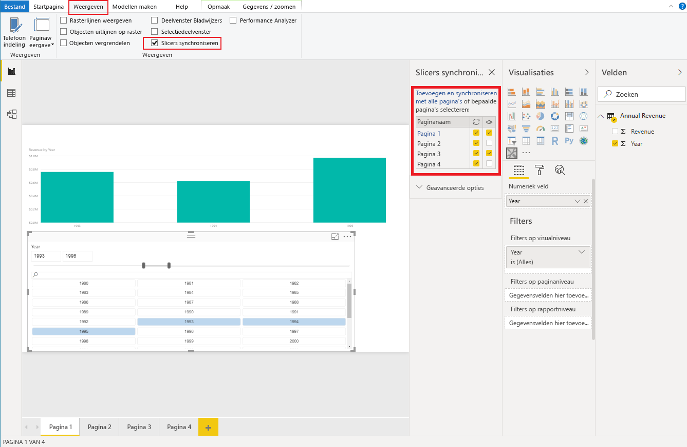

# <a name="sync-slicers-in-power-bi-visuals"></a>Slicers synchroniseren in Power BI-visuals

Gebruik API-versie 1.13 of hoger in uw aangepaste slicervisual om de functie [Slicers synchroniseren](https://docs.microsoft.com/power-bi/desktop-slicers) te ondersteunen.

Daarnaast moet u de optie inschakelen in het bestand *capabilities.json*, zoals weergegeven in de volgende code:

```json
{
    ...
    "supportsHighlight": true,
    "suppressDefaultTitle": true,
    "supportsSynchronizingFilterState": true,
    "sorting": {
        "default": {}
    }
}
```

Nadat u het bestand *capabilities.json* hebt bijgewerkt, kunt u het deelvenster met opties voor **Slicers synchroniseren** weergeven als u de aangepaste slicervisual selecteert.

> [!NOTE]
> De functie Slicers synchroniseren ondersteunt niet meer dan één veld. Als uw slicer meer dan één veld (**Categorie** of **Meting**) heeft, wordt de functie uitgeschakeld.



In het deelvenster **Slicers synchroniseren** ziet u dat de zichtbaarheid en filtratie van uw slicer op meerdere rapportpagina's kan worden toegepast.
