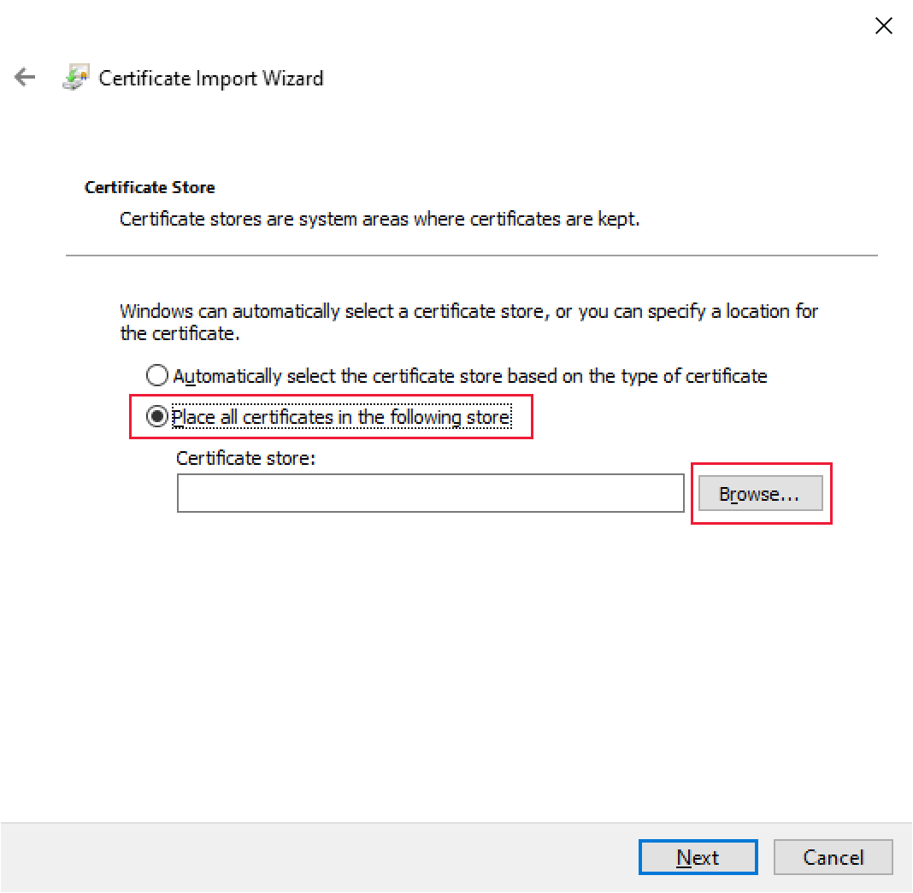

# <a name="set-up-your-environment-for-developing-a-power-bi-visual"></a>Uw omgeving instellen voor het ontwikkelen van een Power BI-visual

In dit artikel leert u hoe u uw omgeving kunt instellen voor het ontwikkelen van een Power BI Visual.

Voordat u begint, moet u **node.js** en het pakket **pbiviz** installeren. U moet ook een certificaat maken en installeren. Wanneer uw lokale omgeving is ingesteld, moet u de Power BI-service configureren voor het ontwikkelen van een Power BI-visual.

In dit artikel leert u het volgende:
> [!div class="checklist"]
> * *Node.js* installeren.
> * *Pbiviz* installeren.
> * Een certificaat maken en installeren.
> * Power BI-service instellen voor het ontwikkelen van een visual.
> * Extra bibliotheken installeren (vereist voor het ontwikkelen van een visual).

## <a name="install-nodejs"></a>Node.js installeren

*Node.js* is een JavaScript-runtime die op de V8 JavaScript-engine van Chrome is gebouwd. Ontwikkelaars gebruiken de runtime om apps uit te voeren die zijn gemaakt in JavaScript.

1. Als u *node.js* wilt installeren, navigeert u in een webbrowser naar [node.js](https://nodejs.org).

2. Download het nieuwste MSI-installatieprogramma.

3. Voer het installatieprogramma uit en volg de installatiestappen. Accepteer de voorwaarden van de licentieovereenkomst en alle standaarden.

4. Start de computer opnieuw op.

## <a name="install-pbiviz"></a>Pbiviz installeren

De tool *pbiviz*, die is geschreven met behulp van JavaScript, compileert de broncode van de visual uit het *pbiviz*-pakket.

Het *pbiviz*-pakket is een gezipt visualproject van Power BI Visual met alle benodigde scripts en assets.

1. Open Windows PowerShell en voer de volgende opdracht uit.

    ```powershell
    npm i -g powerbi-visuals-tools
    ```

## <a name="create-and-install-a-certificate"></a>Een certificaat maken en installeren

Een client (uw computer) en een server (Power BI-service) kunnen alleen veilig communiceren met behulp van een [SSL-certificaat (Secure Sockets Layer)](create-ssl-certificate.md). Zonder een certificaat om veilige interactie te garanderen, wordt de communicatie geblokkeerd door de browser.

# <a name="windows"></a>[Windows](#tab/windows)

Dit proces beschrijft het uitvoeren van een PowerShell-opdracht waarmee de wizard **Certificaat importeren** wordt gestart. Volg de onderstaande stappen om het certificaat te configureren in de wizard.

>[!IMPORTANT]
>Sluit het venster van PowerShell niet tijdens deze procedure.

1. Open Windows PowerShell en voer de volgende opdracht uit.

    ```powershell
    pbiviz --install-cert
    ```

    Deze opdracht doet twee dingen:
    * Er wordt een *toegangscode* geretourneerd. In dit geval is de *toegangscode* 9765328806094.
    * Ook wordt hierdoor de wizard voor het importeren van het gestart.
    
    >[!div class="mx-imgBorder"]
    >

2. Controleer in de wizard voor het importeren van certificaten of de opslaglocatie is ingesteld op *Huidige gebruiker* en selecteer dan **Nieuw**.

    >[!div class="mx-imgBorder"]
    >

3. Selecteer **Volgende** in het venster **Te importeren bestand**.

4. Plak de toegangscode die is geretourneerd tijdens het uitvoeren van de PowerShell-opdracht (stap 1) in het tekstvak **Wachtwoord** van het venster *Beveiliging met persoonlijke sleutel* en selecteer **Volgende**. In dit voorbeeld geval is de toegangscode 9765328806094.

    >[!div class="mx-imgBorder"]
    >

5. Selecteer in het venster **Certificaatarchief** de optie **Alle certificaten in het volgende archief plaatsen** en selecteer vervolgens **Bladeren**.

    >[!div class="mx-imgBorder"]
    >

6. Selecteer in het venster **Certificaatarchief selecteren** **Vertrouwde basiscertificeringsinstanties** en selecteer vervolgens **OK**.

    >[!div class="mx-imgBorder"]
    >

7. Selecteer *Volgende* in het venster **Certificaatarchief**.

    >[!div class="mx-imgBorder"]
    >

8. Controleer de instellingen in het venster voor het **voltooien van de wizard Certificaat importeren** en selecteer **Voltooien**.

    >[!NOTE]
    >Selecteer **Ja** als u een beveiligingswaarschuwing krijgt.


# <a name="osx"></a>[OSX](#tab/sdk2osx)

1. Als het slotje in de linkerbovenhoek is vergrendeld, selecteert u het slotje om te ontgrendelen. Zoek naar *localhost* en dubbelklik op het certificaat.

    

2. Selecteer **Altijd vertrouwen** en sluit het venster.

    

3. Voer uw gebruikersnaam en wachtwoord in en selecteer **Werk instellingen bij**.

    

4. Sluit alle browsers die u hebt geopend.

> [!NOTE]
> Als het certificaat niet wordt herkend, start u de computer opnieuw op.

---

## <a name="optional-verify-that-your-environment-is-set-up"></a>(Optioneel) Controleren of uw omgeving is ingesteld

Controleer of het pakket pbiviz is geïnstalleerd. Voer in PowerShell de opdracht `pbiviz` uit en controleer de uitvoer, inclusief de lijst met ondersteunde opdrachten.

>[!div class="mx-imgBorder"]
>

## <a name="set-up-power-bi-service-for-developing-a-visual"></a>Power BI-service instellen voor het ontwikkelen van een visual

Als u een Power BI-visual wilt ontwikkelen, moet u de optie 'Aangepaste visuele foutopsporing inschakelen met de visual voor ontwikkelaars' inschakelen in de Power BI-service. Volg de instructies in dit gedeelte om deze optie in te schakelen.

1. Meld u aan bij [PowerBI.com](https://powerbi.microsoft.com/).

2. Ga naar **Instellingen** > **Instellingen** > **Instellingen**.

    >[!div class="mx-imgBorder"]
    >

3. Selecteer **Ontwikkelaar** op het tabblad **Algemeen**. Schakel bij **Instellingen voor ontwikkelaars** het selectievakje **Aangepaste visuele foutopsporing inschakelen met de visual voor ontwikkelaars** in en selecteer **Toepassen**.

    >[!div class="mx-imgBorder"]
    >

## <a name="install-development-libraries"></a>Ontwikkelbibliotheken installeren

Als u zelf Power BI-visuals wilt ontwikkelen, moet u extra bibliotheken installeren. In dit gedeelte wordt beschreven hoe u dat doet en hoe u controleert of de installatie is geslaagd.

Als u de bibliotheken wilt installeren die in dit artikel worden vermeld, opent u PowerShell en voert u de installatieopdracht voor elk onderdeel in.

>[!NOTE]
>Zodra deze bibliotheken op uw computer zijn geïnstalleerd, kunt u ze gebruiken voor elk project met Power BI-visuals. Dit is een eenmalige installatieprocedure, per computer.


### <a name="d3-javascript-library"></a>D3 JavaScript-bibliotheek

[D3](https://d3js.org/) is een JavaScript-bibliotheek voor het produceren van dynamische, interactieve gegevensvisualisaties in webbrowsers. De bibliotheek is gebaseerd op breed geïmplementeerde standaarden voor SVG (Scalable Vector Graphics), HTML5 en CSS.

```powershell
npm i d3@^5.0.0 --save
```

### <a name="typescript-definitions"></a>TypeScript-definities

Installeer TypeScript-definities zodat u uw Power BI-visual kunt ontwikkelen in [TypeScript](https://www.typescriptlang.org/), een superset van JavaScript.

```powershell
npm i @types/d3@^5.0.0 --save
```

### <a name="core-js"></a>core-js

[Core-js](https://www.npmjs.com/package/core-js) is een modulaire standaardbibliotheek voor JavaScript met polyfills voor ECMAScript.

```powershell
npm i core-js@3.2.1 --save
```

### <a name="powerbi-visual-api"></a>powerbi-visual-api

API-definities van Power B I voor visuals installeren

```powershell
npm i powerbi-visuals-api --save-dev
```

### <a name="optional-verify-that-the-d3-library-is-installed"></a>(Optioneel) Controleren of de D3-bibliotheek is geïnstalleerd

[Visual Studio Code](https://code.visualstudio.com/) (VS Code) is een ideale IDE (Integrated Development Environment) voor het ontwikkelen van TypeScript-toepassingen. In deze sectie gebruiken we VS Code om te controleren of de D3-bibliotheek die u nodig hebt om uw Power BI-visual te ontwikkelen, juist is geïnstalleerd.

>[!NOTE]
>Bij het verificatieproces dat in dit gedeelte wordt beschreven, wordt ervan uitgegaan dat u een bestaand Power BI-visualsproject hebt. Als u geen Power BI-visualsproject hebt, kunt u er een maken door de instructies voor het maken van de [visual CircleCard](develop-circle-card.md#create-a-development-project) te volgen.

1. Open VS Code.

    >[!TIP]
    >U kunt VS Code openen vanuit PowerShell door de volgende opdracht uit te voeren:
    >
    >```powershell
    >code .
    >```
2. Open in VS Code het menu **File** en selecteer **Open Folder**.

    >[!div class="mx-imgBorder"]
    >

3. Selecteer in het venster **Open Folder** de map met uw Power BI-visualproject en selecteer **Select Folder**.

    >[!div class="mx-imgBorder"]
    >

4. Vouw in het deelvenster **Explorer** de map **node_modules** uit en controleer of de bibliotheek **d3** is geïnstalleerd.

    >[!div class="mx-imgBorder"]
    >

5. Vouw in het deelvenster **Explorer** de map **node_modules > @types  > d3** uit en controleer of het bestand **index.t.ds** is geïnstalleerd.

    >[!div class="mx-imgBorder"]
    >

## <a name="next-steps"></a>Volgende stappen

> [!div class="nextstepaction"]
> [Een visual van een cirkelkaart ontwikkelen in Power BI](develop-circle-card.md)

> [!div class="nextstepaction"]
> [Een Power BI-visual van een staafdiagram maken](create-bar-chart.md)
