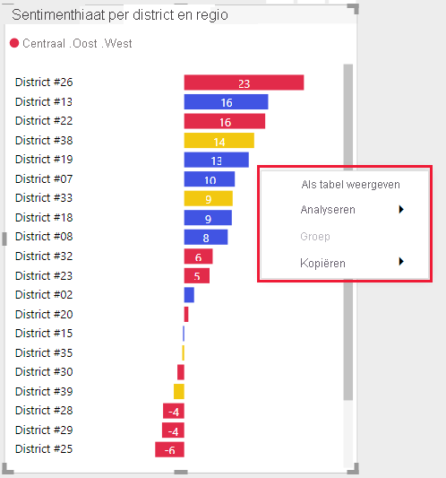

# Richtlijnen voor Power BI-visuals
Voordat u uw Power BI-visual in Microsoft AppSource [publiceert](office-store.md), zodat anderen deze kunnen detecteren en gebruiken, moet u ervoor zorgen dat u de richtlijnen volgt om een geweldige ervaring voor uw gebruikers te creëren.

## Power BI-visuals met aanvullende aankopen

U kunt Power BI-visuals verzenden die gratis zijn voor Marketplace (Microsoft AppSource). U kunt ook Power BI-visuals naar Microsoft AppSource verzenden met de aanduiding 'Mogelijk extra aankoop vereist'. Power BI-visuals met de aanduiding 'Mogelijk extra aankoop vereist' zijn vergelijkbaar met IAP-invoegtoepassingen (in-app aankoop) in de Office Store. 

Net als bij een gratis Power BI-visual, kan een Power BI IAP-visual ook worden gecertificeerd. Voordat u uw Power BI IAP-visual voor certificering indient, moet u controleren of deze voldoet aan de [certificeringsvereisten](power-bi-custom-visuals-certified.md).

### Wat is een Power BI-visual met IAP-functies?

Een Power BI IAP-visual is een *gratis* visual die *gratis functies* biedt. Zo'n visual bevat ook enkele geavanceerde functies waarvoor extra kosten in rekening kunnen worden gebracht. In de beschrijving van de Power BI-visual moet de ontwikkelaar informatie geven over de functies waarvoor extra aankopen moeten worden gedaan als u ze wilt gebruiken. Op dit moment biedt Microsoft geen systeemeigen API's voor de ondersteuning van aankopen van apps en invoegtoepassingen.

Voor deze aankopen kunnen ontwikkelaars een extern betalingssysteem gebruiken. Zie ons [beleid voor de Store](/legal/marketplace/certification-policies#11002-displaying-ads) voor meer informatie.

>[!IMPORTANT]  
> Als u uw Power BI-visual bijwerkt van gratis naar 'Mogelijk extra aankoop vereist', moeten gebruikers hetzelfde niveau van gratis functionaliteit als van voor de update krijgen. Behalve de bestaande gratis functies kunt u ook optionele, geavanceerde, betaalde functies toevoegen.

### Watermerken

U kunt watermerken gebruiken zodat klanten de geavanceerde functies van IAP blijven gebruiken zonder te betalen. 

Watermerken kunnen worden gebruikt om de volledige functionaliteit van de Power BI-visual te presenteren voordat een aankoop wordt gedaan. 

* Watermerken kunnen alleen worden gebruikt op betaalde functies die onder een geldige licentie worden gebruikt.
* Watermerken zijn niet toegestaan in Power BI-visuals met prijsaanduiding *gratis*.
* Watermerken zijn niet toegestaan in IAP-visuals wanneer de gebruiker gratis functies gebruikt. 

### Pop-upvenster

U kunt een pop-upvenster gebruiken om de aanschaf van een licentie uit te leggen wanneer een ongeldige (of verlopen) licentie wordt gebruikt met uw Power BI IAP-visual.

### Inzendingsproces

Volg het [inzendingsproces](office-store.md#submitting-to-appsource), en ga vervolgens naar het tabblad *Productinstallatie* en schakel het selectievakje *Mijn product vereist de aanschaf van een service* in.

Nadat de Power BI-visual is gevalideerd en goedgekeurd, wordt bij de prijsopties in de Microsoft AppSource-vermelding voor de Power BI IAP-visual 'Mogelijk extra aankoop vereist' vermeld.

## Contextmenu
Het contextmenu is het snelmenu dat wordt weergegeven wanneer de gebruiker een visual aanwijst.
Met alle Power BI-visuals moet er een uniforme ervaring kunnen worden geboden in het contextmenu.
Raadpleeg [dit artikel](https://github.com/PowerBi-Projects/PowerBI-visuals/tree/gh-pages/tutorials/building-bar-chart) voor meer informatie over het toevoegen van een contextmenu.

>[!div class="mx-imgBorder"]
>

## Commercieel logo
In deze sectie worden de specificaties voor het toevoegen van commerciële logo's in Power BI-visuals beschreven. Commerciële logo’s zijn niet verplicht. Als ze wel worden toegevoegd, moeten deze richtlijnen worden gevolgd.

> [!NOTE]
> * 'Commercieel logo' in dit artikel refereert aan elk pictogram van een commercieel bedrijf zoals is beschreven in de onderstaande afbeeldingen.
> * Het commerciële Microsoft-logo wordt in dit artikel alleen als voorbeeld gebruikt. Gebruik uw eigen commerciële logo met uw Power BI-visual.

> [!IMPORTANT]
> Commerciële logo's zijn *alleen in de bewerkingsmodus* toegestaan. Commerciële logo's kunnen *niet* worden weergegeven in de weergavemodus.

### Type commercieel logo

Er zijn drie typen commerciële logo's:
* **Logo**: een logo bestaat uit twee elementen die met elkaar zijn gecombineerd, een pictogram en een naam.

    

* **Symbool**: een grafische afbeelding zonder tekst.

    

* **Logotype**: een logo zonder pictogram dat alleen uit tekst bestaat.

    

### Kleur commercieel logo

Wanneer u een commercieel logo gebruikt, moet de kleur van het logo grijs (hexadecimale kleurcode #C8C8C8) zijn. Voeg geen effecten, zoals kleurovergangen, toe aan het commerciële logo.

* **Logo**

    

* **Symbool**: een grafische afbeelding zonder tekst.

    

* **Logotype**: een logo zonder pictogram dat alleen uit tekst bestaat.

    

> [!TIP]
> * Als uw Power BI-visual een afbeelding bevat, kunt u aan een witte achtergrond met marges van 10 pixels uw logo toevoegen.
> * U kunt voor uw logo slagschaduw (zwart met 30% ondoorzichtigheid) toevoegen.

### Afmeting commercieel logo

Een Power BI-visual vereist twee commerciële logo's, één voor grote tegels en één voor kleine tegels. Plaats het logo in een begrenzingsvak in de rechterboven- of rechterbenedenhoek met marges van 4 pixels.

In de volgende tabel worden de overwegingen met betrekking tot de afmetingen van Power BI-visuals beschreven.

|Instellingen  |Kleine Power BI-visual  |Grote Power BI-visual  |
|---------|---------|---------|
|*Breedte van logo*    |Tot 240 pixels         |Meer dan 240 pixels         |
|*Hoogte van logo*     |Tot 160 pixels         |Meer dan 160 pixels         |
|*Afmeting van het begrenzingsvak*     |40 x 15 pixels         |101 x 30 pixels         |
|*Voorbeeld van een commercieel logo*     |         |         |
|*Voorbeeld van een begrenzingsvak*    |         |         |
|    |         |         |

### Gedrag van een commercieel logo

Commerciële logo's zijn alleen in de bewerkingsmodus toegestaan. Wanneer erop wordt geklikt, kan een commercieel logo alleen de volgende functionaliteit bevatten:

* Wanneer u op het commerciële logo klikt, wordt u omgeleid naar uw website.

* Wanneer u op het commerciële logo klikt, wordt een pop-upvenster geopend met aanvullende informatie. Het pop-upvenster moet worden onderverdeeld in twee gedeelten:
    * Een marketinggedeelte dat het commerciële logo, een visual en marktclassificatie kan omvatten.
    * Een informatiegedeelte dat informatie en koppelingen kan bevatten.    

### Zaken die moeten worden voorkomen

* Commerciële logo's kunnen niet worden weergegeven in de weergavemodus.

* Een commercieel logo met animatie kan gedurende maximaal vijf seconden een animatie weer geven.

* Als uw Power BI informatieve pictogrammen (i) in de leesmodus bevat, moeten deze voldoen aan de kleur, de grootte en de locatie van het commerciële logo, zoals hierboven is beschreven.

* Vermijd een kleurrijk of zwart commercieel logo. Het commerciële logo moet grijs (hexadecimale kleurcode #C8C8C8) zijn.

     

* Een commercieel logo met effecten zoals kleurovergangen of sterke schaduwen.

    

## Aanbevolen procedures

U kunt, wanneer u een Power BI-visual publiceert, de volgende aanbevelingen overwegen om gebruikers een fantastische ervaring te bieden.

### Landingspagina van visual

Gebruik de landingspagina om gebruikers te uit te leggen hoe zij uw Power BI-visual kunnen gebruiken en waar ze de licentie kunnen aanschaffen. Sluit geen video's in die automatisch worden geactiveerd. Voeg uitsluitend materiaal toe dat helpt de gebruikerservaring te verbeteren, zoals informatie of koppelingen naar details over de aankoop van licenties en instructies voor het gebruik van de IAP-functies.

### Licentiesleutel en token

Voor het gemak van de gebruiker kunt u boven in het deelvenster Opmaak velden voor licentiesleutels of tokens toevoegen.

## Veelgestelde vragen

Voor meer informatie over Power BI-visuals gaat u naar [Veelgestelde vragen over Power BI-visuals met extra aankopen](power-bi-custom-visuals-faq.md#visuals-with-additional-purchases).

## Volgende stappen

Meer informatie over het publiceren van Power BI-visuals naar Microsoft AppSource, waar anderen deze kunnen ontdekken en gebruiken.

>[!div class="nextstepaction"]
>[Power BI-visuals publiceren](office-store.md)
