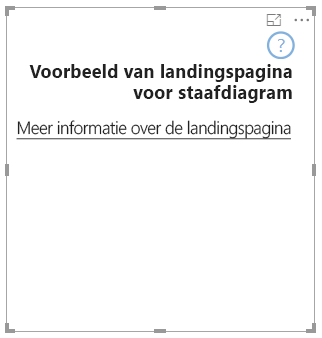

# <a name="add-a-landing-page-to-your-power-bi-visuals"></a>Een landingspagina toevoegen aan Power BI-visuals

Met API 2.3.0 kunt u een landingspagina toevoegen aan uw Power BI-visuals. U kunt dit doen door `supportsLandingPage` toe te voegen aan de mogelijkheden en deze in te stellen op waar. Met deze actie wordt uw visual geïnitialiseerd en bijgewerkt voordat u er gegevens aan toevoegt. Omdat de visual geen watermerk meer bevat, kunt u een eigen landingspagina ontwerpen voor weergave in de visual, zolang deze geen gegevens bevat.

```typescript
export class BarChart implements IVisual {
    //...
    private element: HTMLElement;
    private isLandingPageOn: boolean;
    private LandingPageRemoved: boolean;
    private LandingPage: d3.Selection<any>;

    constructor(options: VisualConstructorOptions) {
            //...
            this.element = options.element;
            //...
    }

    public update(options: VisualUpdateOptions) {
    //...
        this.HandleLandingPage(options);
    }

    private HandleLandingPage(options: VisualUpdateOptions) {
        if(!options.dataViews || !options.dataViews.length) {
            if(!this.isLandingPageOn) {
                this.isLandingPageOn = true;
                const SampleLandingPage: Element = this.createSampleLandingPage(); //create a landing page
                this.element.appendChild(SampleLandingPage);
                this.LandingPage = d3.select(SampleLandingPage);
            }

        } else {
                if(this.isLandingPageOn && !this.LandingPageRemoved){
                    this.LandingPageRemoved = true;
                    this.LandingPage.remove();
                }
        }
    }
```

Een voorbeeld van een landingspagina wordt in de volgende afbeelding weergegeven:


