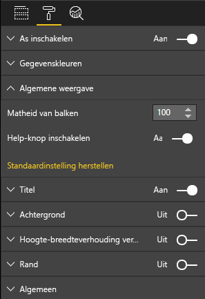

# <a name="create-a-launch-url"></a>Een start-URL maken

Met launchUrl kunt u een nieuw browsertabblad (of venster) openen door het echte werk aan Power BI te delegeren.

> [!IMPORTANT]
> `host.launchUrl()` is geïntroduceerd in Visuals-API 1.9.0.

## <a name="sample"></a>Voorbeeld

Importeer de interface voor `IVisualHost` en sla de koppeling op in object `host` in de constructor van de visual.

```typescript
import powerbi from "powerbi-visuals-api";
import IVisualHost = powerbi.extensibility.visual.IVisualHost;

export class Visual implements IVisual {
    private host: IVisualHost;
    // ...
    constructor(options: VisualConstructorOptions) {
        // ...
        this.host = options.host;
        // ...
    }

    // ...
}
```

## <a name="usage"></a>Gebruik

Gebruik de API-aanroep `host.launchUrl()`, waarbij u de doel-URL doorgeeft als een tekenreeksargument:

```typescript
this.host.launchUrl('https://some.link.net');
```

## <a name="restrictions"></a>Beperkingen

* Gebruik alleen absolute paden, geen relatieve paden. Gebruik bijvoorbeeld een absoluut pad als `https://some.link.net/subfolder/page.html`. Het relatieve pad, `/page.html`, wordt niet geopend.

* Momenteel worden alleen de protocollen *HTTP* en *HTTPS* ondersteund. Vermijd *FTP*, *MAILTO*, enzovoort.

## <a name="best-practices"></a>Best practices

* Meestal kunt u het beste alleen een koppeling openen als reactie op de expliciete actie van een gebruiker. Maak het voor de gebruiker gemakkelijk te begrijpen dat klikken op de koppeling of knop leidt tot het openen van een nieuw tabblad. Het activeren van een `launchUrl()`-aanroep zonder actie van een gebruiker, of als neveneffect van een andere actie, kan verwarrend of frustrerend zijn voor de gebruiker.

* Als de koppeling niet cruciaal is voor een juiste werking van de visual, wordt aanbevolen de auteur van het rapport een manier te geven om de koppeling uit te schakelen en te verbergen. Dit is in het bijzonder relevant voor speciale use-cases van Power BI, zoals het insluiten van een rapport in een toepassing van derden of het publiceren ervan op internet.

* Vermijd het activeren van een `launchUrl()`-aanroep vanuit een lus, de `update`-functie van de visual, of andere vaak uitgevoerde code.

## <a name="a-step-by-step-example"></a>Een stapsgewijs voorbeeld

### <a name="add-a-link-launching-element"></a>Een element voor het starten van een koppeling toevoegen

De volgende regels zijn toegevoegd aan de `constructor`-functie van de visual:

```typescript
    this.helpLinkElement = this.createHelpLinkElement();
    options.element.appendChild(this.helpLinkElement);
```

Er is een privéfunctie toegevoegd voor het maken en koppelen van het ankerelement:

```typescript
private createHelpLinkElement(): Element {
    let linkElement = document.createElement("a");
    linkElement.textContent = "?";
    linkElement.setAttribute("title", "Open documentation");
    linkElement.setAttribute("class", "helpLink");
    linkElement.addEventListener("click", () => {
        this.host.launchUrl("https://docs.microsoft.com/power-bi/developer/visuals/custom-visual-develop-tutorial");
    });
    return linkElement;
};
```

Ten slotte definieert een item in het bestand *visual.less* de stijl van het koppelingselement:

```less
.helpLink {
    position: absolute;
    top: 0px;
    right: 12px;
    display: block;
    width: 20px;
    height: 20px;
    border: 2px solid #80B0E0;
    border-radius: 20px;
    color: #80B0E0;
    text-align: center;
    font-size: 16px;
    line-height: 20px;
    background-color: #FFFFFF;
    transition: all 900ms ease;

    &:hover {
        background-color: #DDEEFF;
        color: #5080B0;
        border-color: #5080B0;
        transition: all 250ms ease;
    }

    &.hidden {
        display: none;
    }
}
```

### <a name="add-a-toggling-mechanism"></a>Een schakelmechanisme toevoegen

Als u een schakelmechanisme wilt toevoegen, moet u een statisch object toevoegen zodat de auteur van het rapport de zichtbaarheid van het koppelingselement kan in-of uitschakelen. (Dit element is standaard ingesteld op *verborgen*.) Zie de [zelfstudie over statische objecten](https://microsoft.github.io/PowerBI-visuals/docs/concepts/objects-and-properties) voor meer informatie.

Een `showHelpLink` statisch booleaans object is toegevoegd aan het item objects in het bestand *capabilities.json*, zoals weergegeven in de volgende code:

```typescript
"objects": {
    "generalView": {
            "displayName": "General View",
            "properties":
                "showHelpLink": {
                    "displayName": "Show Help Button",
                    "type": {
                        "bool": true
                    }
                }
            }
        }
    }
```



En in de `update`-functie van de visual zijn de volgende regels toegevoegd:

```typescript
if (settings.generalView.showHelpLink) {
    this.helpLinkElement.classList.remove("hidden");
} else {
    this.helpLinkElement.classList.add("hidden");
}
```

In het bestand *visual.less* wordt de klasse *verborgen* gedefinieerd om de weergave van het element te bepalen.