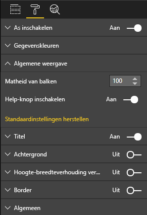

# <a name="launch-url"></a>Start-URL

Met launchUrl kan een nieuw browsertabblad (of venster) worden geopend door het echte werk aan Power BI te delegeren.

## <a name="sample"></a>Voorbeeld

```typescript
   this.host.launchUrl('https://powerbi.microsoft.com');
```

## <a name="usage"></a>Gebruik

Gebruik de API-aanroep `host.launchUrl()`, waarbij u de doel-URL doorgeeft als een tekenreeksargument:

```typescript
this.host.launchUrl('http://some.link.net');
```

## <a name="restrictions"></a>Beperkingen

* Gebruik alleen absolute paden, geen relatieve. `http://some.link.net/subfolder/page.html` is goed, `/page.html` wordt niet geopend.
* Momenteel worden alleen de protocollen `http` en `https` ondersteund. Vermijd `ftp`, `mailto` enzovoort.

## <a name="best-practices"></a>Aanbevolen procedures

1. In de meeste gevallen kunt u het beste alleen een koppeling openen als reactie op de expliciete actie van een gebruiker. Maak het voor de gebruiker gemakkelijk te begrijpen dat klikken op de koppeling of knop leidt tot het openen van een nieuw tabblad. Het activeren van een `launchUrl()`-aanroep zonder actie van een gebruiker, of als neveneffect van een andere actie, kan verwarrend of frustrerend zijn voor de gebruiker.
2. Als de koppeling niet cruciaal is voor een juiste werking van de visual, wordt aanbevolen de auteur van het rapport een manier te geven om de koppeling uit te schakelen en te verbergen. Dit is in het bijzonder relevant voor speciale use-cases van Power BI, zoals het insluiten van een rapport in een toepassing van derden of het publiceren ervan op internet.
3. Vermijd het activeren van een `launchUrl()`-aanroep vanuit een lus, de `update`-functie van de visual, of andere vaak uitgevoerde code.

## <a name="step-by-step-example"></a>Stapsgewijs voorbeeld

### <a name="adding-a-link-launching-element"></a>Element voor het starten van een koppeling toevoegen

De volgende regels zijn toegevoegd aan de `constructor`-functie van de visual:

```typescript
    this.helpLinkElement = this.createHelpLinkElement();
    options.element.appendChild(this.helpLinkElement);
```

En er is een privéfunctie toegevoegd voor het maken en koppelen van het ankerelement:

```typescript
private createHelpLinkElement(): Element {
    let linkElement = document.createElement("a");
    linkElement.textContent = "?";
    linkElement.setAttribute("title", "Open documentation");
    linkElement.setAttribute("class", "helpLink");
    linkElement.addEventListener("click", () => {
        this.host.launchUrl("https://docs.microsoft.com/power-bi/developer/custom-visual-develop-tutorial");
    });
    return linkElement;
};
```

Ten slotte definieert een item in het bestand visual.less de stijl van het koppelingselement:

```less
.helpLink {
    position: absolute;
    top: 0px;
    right: 12px;
    display: block;
    width: 20px;
    height: 20px;
    border: 2px solid #80B0E0;
    border-radius: 20px;
    color: #80B0E0;
    text-align: center;
    font-size: 16px;
    line-height: 20px;
    background-color: #FFFFFF;
    transition: all 900ms ease;

    &:hover {
        background-color: #DDEEFF;
        color: #5080B0;
        border-color: #5080B0;
        transition: all 250ms ease;
    }

    &.hidden {
        display: none;
    }
}
```

### <a name="adding-a-toggling-mechanism"></a>Een schakelmechanisme toevoegen

Hiervoor moet een statisch object worden toegevoegd (zie [static object tutorial](https://microsoft.github.io/PowerBI-visuals/docs/concepts/objects-and-properties)), zodat de auteur van het rapport de zichtbaarheid van het koppelingselement kan aan- of uitzetten (het is standaard ingesteld op verborgen).
Het statische booleaanse object `showHelpLink` is toegevoegd aan het item 'objects'in `capabilities.json`:

```typescript
"objects": {
    "generalView": {
            "displayName": "General View",
            "properties":
                "showHelpLink": {
                    "displayName": "Show Help Button",
                    "type": {
                        "bool": true
                    }
                }
            }
        }
    }
```



En in de `update`-functie van de visual zijn de volgende regels toegevoegd:

```typescript
if (settings.generalView.showHelpLink) {
    this.helpLinkElement.classList.remove("hidden");
} else {
    this.helpLinkElement.classList.add("hidden");
}
```

In visual.less wordt de klasse `hidden` gedefinieerd om de weergave van het element te bepalen.
