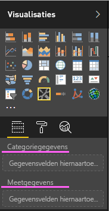
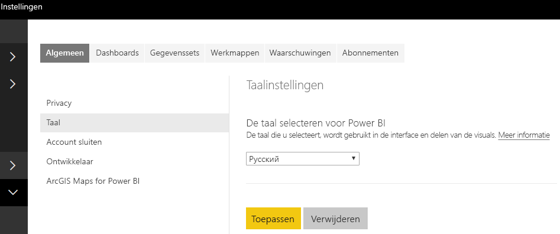

# <a name="add-the-locale-in-power-bi-for-power-bi-visuals"></a>De landinstelling in Power BI voor Power BI-visuals toevoegen

Met visuals kan de Power BI-landinstelling worden opgehaald voor het lokaliseren van de inhoud naar de relevante taal.

Lees meer over [Ondersteunde talen en landen/regio's voor Power BI](./../../supported-languages-countries-regions.md)

Bijvoorbeeld over het ophalen van landinstellingen in de visual Voorbeeldstaafdiagram.


Elk van deze staafdiagrammen is gemaakt onder een andere landinstelling (Engels, Baskisch en Hindi). Dit wordt weergegeven in de knopinfo.

> [!NOTE]
> De lokalisatiemanager in de code van de visual wordt ondersteund vanaf API 1.10.0 en hoger.

## <a name="get-the-locale"></a>De landinstelling ophalen

De `locale` wordt doorgegeven als een tekenreeks tijdens de initialisatie van de visual. Als een landinstelling wordt gewijzigd in Power BI, wordt de visual opnieuw gegenereerd met de nieuwe landinstelling. U vindt de volledige voorbeeldcode in SampleBarChart met Landinstelling

De BarChart-constructor bevat nu een landinstellingslid, dat in de constructor wordt geïnstantieerd met het landinstellingshostexemplaar.

```typescript
private locale: string;
...
this.locale = options.host.locale;
```

Ondersteunde landinstellingen:

Landinstellingstekenreeks | Taal
--------------|----------------------
ar-SA | العربية (Arabisch)
bg-BG | български (Bulgaars)
ca-ES | català (Catalaans)
cs-CZ | čeština (Tsjechisch)
da-DK | dansk (Deens)
de-DE | Deutsche (Duits)
el-GR | ελληνικά (Grieks)
en-US | English (Engels)
es-ES | español service (Spaans)
et-EE | eesti (Estlands)
eU-ES | Euskal (Baskisch)
fi-FI | Suomi (Fins)
fr-FR | français (Frans)
gl-ES | galego (Galicisch)
he IL | עברית (Hebreeuws)
hi-IN | हिन्दी (Hindi)
hr-HR | hrvatski (Kroatisch)
hu-HU | magyar (Hongaars)
id-ID | Bahasa Indonesia (Indonesisch)
it-IT | italiano (Italiaans)
ja-JP | 日本の (Japans)
kk-KZ | Қазақ (Kazachs)
ko-KR | 한국의 (Koreaans)
lt-LT | Lietuvos (Litouws)
lv-LV | Latvijas (Lets)
ms-MY | Bahasa Melayu (Maleis)
nb-NO | norsk (Noors)
nl-NL | Nederlands
pl-PL | polski (Pools)
pt-BR | português (Portugees)
pt-PT | português (Portugees)
ro-RO | românesc (Roemeens)
ru-RU | русский (Russisch)
sk-SK | slovenský (Slowaaks)
sl-SI | slovenski (Sloveens)
sr-Cyrl-RS | српски (Servisch)
sr-Latn-RS | srpski (Servisch)
sv-SE | svenska (Zweeds)
th-TH | ไทย (Thai)
tr-TR | Türk (Turks)
uk-UA | український (Oekraïens)
vi-VN | tiếng Việt (Vietnamees)
zh-CN | 中国 (vereenvoudigd Chinees)
zh-TW | 中國 (traditioneel Chinees)

> [!NOTE]
> In PowerBI Desktop bevat de eigenschap Landinstelling de taal van de Power BI Desktop die is geïnstalleerd.

## <a name="localizing-the-property-pane-for-power-bi-visuals"></a>Het eigenschappenvenster voor Power BI-visuals lokaliseren

Velden in het eigenschappenvenster kunnen worden gelokaliseerd en zo een meer geïntegreerde en samenhangende ervaring bieden. Het zorgt ervoor dat uw aangepaste visual zich hetzelfde gedraagt als andere Power BI-kernvisuals.

Als er bijvoorbeeld een niet-gelokaliseerde, aangepaste visual is gemaakt met behulp van de opdracht `pbiviz new`, worden daarin de volgende velden weergegeven in het eigenschappenvenster:



zowel de categoriegegevens als de meetgegevens worden gedefinieerd in het bestand Capabilities.json als `displayName`.

## <a name="how-to-localize-capabilities"></a>Functionaliteit lokaliseren

Voeg eerst een weergavenaamsleutel toe aan elke weergavenaam die u wilt lokaliseren in uw functionaliteit. In dit voorbeeld:

```json
{
    "dataRoles": [
        {
            "displayName": "Category Data",
            "displayNameKey": "VisualCategoryDataNameKey1",
            "name": "category",
            "kind": "Grouping"
        },
        {
            "displayName": "Measure Data",
            "displayNameKey": "VisualMeasureDataNameKey2",
            "name": "measure",
            "kind": "Measure"
        }
    ]
}
```

Voeg vervolgens een map toe met de naam stringResources. De map bevat al uw verschillende resourcebestanden van de tekenreeks op basis van de landinstellingen die u door uw visual wilt laten ondersteunen. Onder deze map moet u een JSON-bestand toevoegen voor elke landinstelling die u wilt ondersteunen. Deze bestanden bevatten de informatie over de landinstellingen en de gelokaliseerde tekenreekswaarden voor elke displayNameKey die u wilt vervangen.

Stel dat we in ons voorbeeld het Arabisch en Hebreeuws willen ondersteunen. We moeten nu twee JSON-bestanden toevoegen op de volgende manier:


Elk JSON-bestand definieert één landinstelling (dit bestand moet een van de landinstellingen zijn uit de hierboven vermelde, ondersteunde lijst), met de tekenreekswaarden voor de gewenste weergavenaamsleutels. In ons voorbeeld ziet het resourcebestand voor de Hebreeuwse tekenreeks er als volgt uit:

```json
{
    "locale": "he-IL",
    "values": {
        "VisualCategoryDataNameKey1": "קטגוריה",
        "VisualMeasureDataNameKey2": "יחידות מידה"
    }
}
```

Alle vereiste stappen voor het gebruik van lokalisatiemanager worden hieronder beschreven.

> [!NOTE]
> Lokalisatie wordt momenteel niet ondersteund voor het opsporen van fouten in de ontwikkelaarsvisual

## <a name="setup-environment"></a>Omgeving instellen

### <a name="desktop"></a>Desktop

Voor bureaubladgebruik downloadt u de gelokaliseerde versie van Power BI Desktop uit https://powerbi.microsoft.com.

### <a name="web-service"></a>Webservice

Als u de webclient (browser) in de service gebruikt, wijzigt u de taal in instellingen:



## <a name="resource-file"></a>Resourcebestand

Voeg een resources.resjson-bestand toe aan een map met de naam van de landinstelling die u in de map stringResources wilt gebruiken. Dit zijn en-US en ru-RU in ons voorbeeld.


Voeg daarna alle lokalisaties van tekenreeksen toe die u gaat gebruiken in het bestand resources.resjson dat u in de vorige stap hebt toegevoegd.

```json
{
    ...
    "Role_Legend": "Обозначения",
    "Role_task": "Задача",
    "Role_StartDate": "Дата начала",
    "Role_Duration": "Длительность"
    ...
}
```

Dit voorbeeld is de en-US-versie van het bestand resources.resjson:

```json
{
    ...
    "Role_Legend": "Legend",
    "Role_task": "Task",
    "Role_StartDate": "Start date",
    "Role_Duration": "Duration"
    ...
}
```

Nieuw localizationManager-exemplaar Maak als volgt een exemplaar van localizationManager in de code van uw visual

```typescript
private localizationManager: ILocalizationManager;

constructor(options: VisualConstructorOptions) {
    this.localizationManager = options.host.createLocalizationManager();
}
```

## <a name="localizationmanager-usage-sample"></a>voorbeeld van localizationManager-gebruik

U kunt nu de functie getDisplayName van de lokalisatiemanager aanroepen met het argument voor de tekenreekssleutel die u in resources resjson hebt gedefinieerd om de vereiste tekenreeks overal in uw code op te halen:

```typescript
let legend: string = this.localization.getDisplayName("Role_Legend");
```

Hiermee wordt 'Legend' geretourneerd voor en-US en 'Обозначения' voor ru-RU

## <a name="next-steps"></a>Volgende stappen

* [Lees hoe u de hulpprogramma's voor opmaak gebruikt om gelokaliseerde indelingen te bieden](utils-formatting.md)
