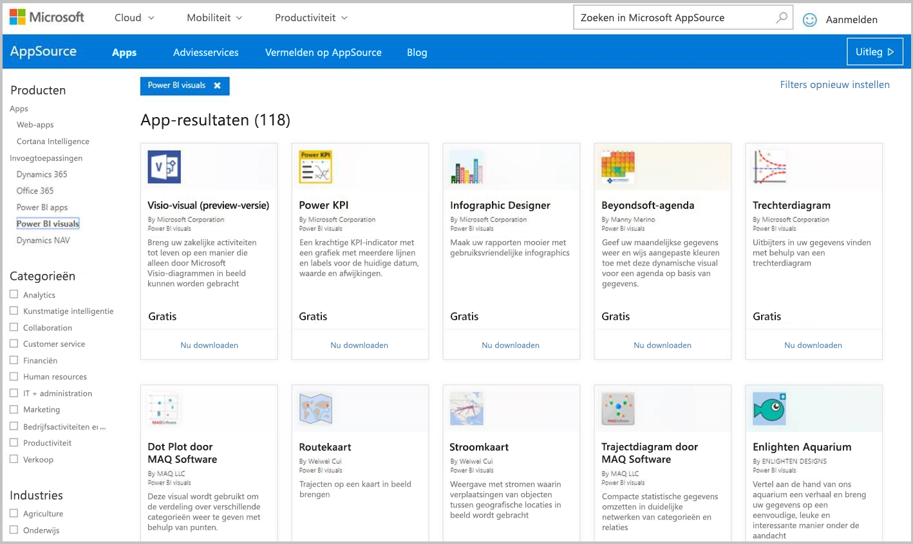
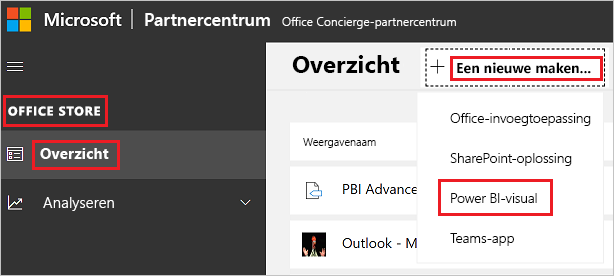

# Power BI-visuals publiceren in het Partnercentrum

Als u een Power BI-visual hebt gemaakt, wilt u deze wellicht publiceren in AppSource zodat andere personen deze kunnen vinden en gebruiken. Raadpleeg [Een visual van een cirkelkaart ontwikkelen in Power BI](develop-circle-card.md) voor meer informatie over het maken van een Power BI-visual.

## Wat is AppSource?

[AppSource](https://appsource.microsoft.com/marketplace/apps?product=power-bi-visuals) is de plek waar u SaaS-apps en -invoegtoepassingen kunt vinden voor uw Microsoft-producten en -services.

## Verzenden van uw Power BI-visual voorbereiden

Voordat u een Power BI Visual verzendt naar AppSource, moet u eerst de [Richtlijnen voor Power BI-visuals](guidelines-powerbi-visuals.md) hebben gelezen en [de aangepaste visual](./submission-testing.md) hebben getest.

Wanneer u klaar bent om de Power BI-visual te verzenden, controleert u of de visual voldoet aan alle vereisten die hieronder worden vermeld.

| Item | Vereist | Beschrijving |
| --- | --- | --- |
| Pbiviz-pakket |Ja |Pak de Power BI-visual in een Pbiviz-pakket in dat alle vereiste metagegevens bevat. Naam van visuele element Weergavenaam GUID Versie Beschrijving Naam en e-mailadres van auteur |
| Voorbeeld van PBIX-rapportbestand |Ja |Ter promotie van uw visual moet u gebruikers helpen om vertrouwd te raken met de visual. Benadruk het belang van de visual voor de gebruiker, en geef voorbeelden van het gebruik en de opmaakopties. U kunt aan het eind ook een pagina met *hints* toevoegen, met een aantal tips en trucs, en dingen om te vermijden. Het voorbeeld van een pbix-rapportbestand moet offline werken, zonder externe verbindingen. |
| Pictogram |Ja |U moet een logo voor het aangepaste visuele element maken. Dit logo wordt in de webwinkel weergegeven. De ondersteunde bestandsindelingen zijn PNG, JPG, JPEG en GIF. Het moet exact 300 pixels breed en 300 pixels hoog zijn. **Belangrijk** Lees de [handleiding voor AppSource Store-afbeeldingen](/office/dev/store/craft-effective-appsource-store-images) zorgvuldig, voordat u het pictogram verzendt. |
| Schermopnamen |Ja |Voeg minstens één schermopname bij. De ondersteunde bestandsindelingen zijn PNG, JPG, JPEG en GIF. De afmetingen moeten precies 1366 px (breedte) x 768 px (hoogte) zijn. Het bestand mag niet groter zijn dan 1024 kB. Voeg tekstballonnen toe met meer informatie over de toegevoegde waarde van de belangrijkste functies die worden weergegeven in elke schermopname. |
| Koppeling naar ondersteuning voor de download |Ja |Geef een ondersteunings-URL op voor uw klanten. Deze koppeling wordt ingevoerd als onderdeel van uw Partnercentrum-vermelding en is zichtbaar voor gebruikers als ze de vermelding van uw visual openen in AppSource. De URL moet https:// or https:// bevatten. |
| Koppeling naar privacydocument |Ja |Geef een koppeling op naar het privacybeleid voor de visual. Deze koppeling wordt ingevoerd als onderdeel van uw Partnercentrum-vermelding en is zichtbaar voor gebruikers als ze de vermelding van uw visual openen in AppSource. De koppeling moet https:// or https:// bevatten. |
| Gebruiksrechtovereenkomst (EULA) |Ja |U moet een EULA-bestand opgeven voor de Power BI-visual. U kunt het [standaardcontract](https://go.microsoft.com/fwlink/?linkid=2041178), [contract voor Power BI-visuals](https://visuals.azureedge.net/app-store/Power%20BI%20-%20Default%20Custom%20Visual%20EULA.pdf) of uw eigen EULA gebruiken. |
| Koppeling naar video |Nee |Om de interesse van gebruikers voor uw aangepaste visual te vergroten, geeft u een koppeling op naar een video over de visual. De URL moet https:// or https:// bevatten. |
| GitHub-opslagplaats |Nee |Deel een openbare koppeling naar een [GitHub](https://www.github.com)-opslagplaats met bronnen van uw Power BI-visual en voorbeeldgegevens. Op deze manier kunnen andere ontwikkelaars feedback geven en verbeteringen voor uw code voorstellen. |

## Een app-pakket-XML ophalen

Als u een Power BI-visual wilt verzenden, hebt u een app-pakket-XML nodig van het Power BI-team. Als u het de app-pakket-XML wilt ophalen, verzendt u een e-mailbericht naar het team voor verzendingen van Power BI-visuals ([pbivizsubmit@microsoft.com](mailto:pbivizsubmit@microsoft.com)).

Voordat u het **pbiviz**-pakket maakt, moet u de volgende velden invullen in het bestand **pbiviz.json**:
* beschrijving
* ondersteunings-URL
* auteur
* name
* e-mail

Voeg het **.pbiviz-bestand** en het **.pbix-voorbeeldrapportbestand** als bijlagen toe aan uw e-mailbericht. Het team van Power BI stuurt u vervolgens een bericht met instructies en een XML-app-pakketbestand dat u moet uploaden. Dit XML-app-pakket is vereist voor het indienen van het visuele element via het Office-ontwikkelaarscentrum.

> [!NOTE]
> Om de kwaliteit te verbeteren en ervoor te zorgen dat bestaande rapporten niet worden verbroken, duurt het twee weken extra voordat wijzigingen in bestaande visuele elementen worden doorgevoerd in de productieomgeving na goedkeuring in de store.

## Verzenden naar AppSource

Als u de Power BI-visual wilt verzenden naar AppSource, hebt u een app-pakket nodig van het Power BI-team, en moet u deze vervolgens verzenden naar het Partnercentrum.

### Het app-pakket downloaden

U moet een e-mailbericht met het **pbiviz**-bestand en het **pbix**-bestand verzenden naar het Power BI-team vóór indiening bij AppSource. Hierdoor kan het Power BI-team de bestanden uploaden naar de openbare shareserver. Anders kunnen de bestanden niet worden opgehaald in de store. 

Het Power BI-team moet bestanden controleren op nieuwe verzendingen van Power BI-visuals, updates in bestaande Power BI-visuals, en oplossingen voor geweigerde verzendingen.

### Verzenden naar het Partnercentrum

Als u de Power BI-visual wilt verzenden naar het Partnercentrum, moet u bij het Partnercentrum zijn geregistreerd. Als u nog niet bent geregistreerd, kunt u [Een ontwikkelaarsaccount openen in het Partnercentrum](/office/dev/store/open-a-developer-account).

>[!NOTE]
>**Afzonderlijke uitgevers** kunnen een van deze methoden gebruiken om een Power BI-visual in te dienen:
>* Als u een oud Verkopersdashboard hebt, kunt u de referenties van dit account blijven gebruiken om u aan te melden bij het Partnercentrum.
>* Als u geen oud account hebt voor het Verkopersdashboard en niet bent geregistreerd bij het Partnercentrum, moet u [Een ontwikkelaarsaccount openen in het Partnercentrum](/office/dev/store/open-a-developer-account) uw werk-e-mail te gebruiken.

Volg de stappen hieronder om de Power BI-visual te verzenden naar het Partnercentrum. Zie [Uw Office-oplossing verzenden naar AppSource via het Partnercentrum](/office/dev/store/use-partner-center-to-submit-to-appsource) voor meer informatie over het inzendingsproces.

1. Meld u aan bij het **Partnercentrum**.

2. Selecteer **OFFICE STORE** in het linkerdeelvenster.

3. Selecteer **Overzicht**.

4. Selecteer **Nieuwe maken** en selecteer in de vervolgkeuzelijst de optie **Power BI-visual**.

    

5. Voer in het venster **Nieuwe Power BI-visual maken** een naam in voor de Power BI-visual en selecteer **Maken**.

6. Selecteer **Pakketten** en upload de app-pakket-XML voor de Power BI-visual.

7. Selecteer **Eigenschappen** en geef de vereiste informatie op.

8. Als voor uw product een extra aankoop is vereist, selecteert u **Productinstallatie** en schakelt u het selectievakje **Gekoppelde serviceaanschaf** in.

9. Als u de visual wilt [certificeren](power-bi-custom-visuals-certified.md), selecteert u **Productinstallatie** en schakelt u het selectievakje **Power BI-certificering** in. (Optioneel)
    >[!TIP]
    >Het Power BI-certificeringsproces kan enige tijd duren. Als u een nieuwe Power BI-visual maakt, wordt u aangeraden de Power BI-visual te publiceren via het Partnercentrum voordat u de certificeringsaanvraag indient. Dit zorgt ervoor dat de publicatie van de visual niet wordt vertraagd.

10. Selecteer **Productinstallatie** en klik op **Controleren en publiceren**.

## Status en gebruik van de inzending bijhouden

U kunt de [validatiebeleidsregels](/legal/marketplace/certification-policies#1180-power-bi-visuals) controleren.

* Na het indienen kunt u de status van uw inzending volgen in het [app-dashboard](https://sellerdashboard.microsoft.com/Application/Summary/).

* Als u wilt weten wanneer uw Power BI-visual beschikbaar is om te worden gedownload van AppSource, raadpleegt u de [publicatietijdlijn](power-bi-custom-visuals-certified.md#publication-timeline) van Power BI-visuals.

## Het visuele element certificeren

Nadat de visual is gemaakt, kunt u deze desgewenst laten [certificeren](power-bi-custom-visuals-certified.md).

## Volgende stappen

* [Een visual met cirkelkaart voor Power BI ontwikkelen](develop-circle-card.md)

* [Visualisaties in Power BI](../../visuals/power-bi-report-visualizations.md)  

* [Visuals in Power BI](power-bi-custom-visuals.md)  

* [Een Power BI-visual laten certificeren](power-bi-custom-visuals-certified.md)

* Hebt u nog vragen? [Misschien dat de Power BI-community het antwoord weet](https://community.powerbi.com/)