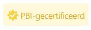

# Een Power BI-visual laten certificeren

Gecertificeerde Power BI-visuals zijn Power BI-visuals in [AppSource](https://appsource.microsoft.com/en-us/marketplace/apps?page=1&product=power-bi-visuals) die voldoen aan de [codevereisten](#certification-requirements) van het Microsoft Power BI-team. Deze visuals worden getest om te controleren of ze geen toegang hebben tot externe services of bronnen en of ze de patronen en richtlijnen voor veilige codering volgen.

Zodra een Power BI-visual gecertificeerd is, zijn er meer functies beschikbaar. Zo kunt u de visual [exporteren naar PowerPoint](../../consumer/end-user-powerpoint.md) en de visual weergeven in e-mails die worden ontvangen wanneer een gebruiker zich [op rapportpagina's abonneert](../../consumer/end-user-subscribe.md).

Het certificeringsproces is optioneel. Power BI-visuals die niet zijn gecertificeerd, zijn niet noodzakelijk onveilige Power BI-visuals. Sommige Power BI-visuals zijn niet gecertificeerd omdat ze niet aan een of meer van de [certificeringsvereisten](power-bi-custom-visuals-certified.md#certification-requirements) voldoen. Bijvoorbeeld een Power BI-visual voor een kaart die verbinding maakt met een externe service of een Power BI-visual die gebruikmaakt van commerciële bibliotheken.

> [!NOTE]
> Microsoft is niet de auteur van Power BI-visuals van derden. Neem contact op met de auteur van de visual als u de functionaliteit van visuals van derden wilt controleren.

## Vereisten voor certificering

Als uw Power BI-visual moet worden [gecertificeerd](#get-a-power-bi-visual-certified), moet uw Power BI-visual voldoen aan de vereisten die in deze sectie worden vermeld. 

### Algemene vereisten

Uw Power BI-visual moet worden goedgekeurd door het Partnercentrum. Het is raadzaam dat uw Power BI-visual zich al in [AppSource](https://appsource.microsoft.com/marketplace/apps?page=1&product=power-bi-visuals) bevindt. Zie [Power BI-visuals publiceren in het Partnercentrum](office-store.md) voor meer informatie over het publiceren van een Power BI Visual naar AppSource.

Voordat u uw Power BI-visual indient voor certificering, controleert u of deze voldoet aan de [richtlijnen voor Power BI-visuals](guidelines-powerbi-visuals.md).

Zorg ervoor dat het gecompileerde pakket precies overeenkomt met het ingediende pakket wanneer u de Power BI-visual indient.

### Vereisten voor de codeopslagplaats

U hoeft uw code niet openbaar te delen in GitHub, maar de codeopslagplaats moet wel beschikbaar zijn voor beoordeling door het Power BI-team. De beste manier om dit te doen, is door de broncode (JavaScript of TypeScript) in GitHub op te geven.

De opslagplaats moet het volgende bevatten:
* Code voor slechts één Power BI-visual. Deze mag geen code voor meerdere Power BI-visuals of niet-gerelateerde code bevatten.
* Een vertakking met de naam **certification** (kleine letters vereist). De broncode in deze vertakking moet overeenkomen met het ingediende pakket. Deze code kan alleen tijdens het volgende indieningsproces worden bijgewerkt als u uw Power BI-visual opnieuw wilt indienen.

Als uw Power BI-visual persoonlijke NPM-pakketten of git-submodules gebruikt, moet u toegang bieden tot de extra opslagplaatsen die deze code bevatten.

Bekijk de GitHub-opslagplaats voor de [Voorbeeldstaafdiagram voor Power BI-visual](https://github.com/microsoft/PowerBI-visuals-sampleBarChart) om te begrijpen hoe een opslagplaats voor Power BI-visuals eruitziet.

### Bestandsvereisten

Gebruik de nieuwste versie van de API om de Power BI-visual te schrijven.

De opslagplaats moet de volgende bestanden bevatten:
* **.gitignore**: voeg `node_modules`, `.tmp` en `dist` toe aan dit bestand. De code mag niet de mappen *node_modules*, *.tmp* of *dist* bevatten.
* **capabilities.json**: als u een nieuwere versie van uw Power BI-visual indient met wijzigingen in de eigenschappen in dit bestand, controleert u of hierdoor rapporten voor bestaande gebruikers niet onbruikbaar worden.
* **pbiviz.json** 
* **package.json**. Voor de visual moet het volgende pakket zijn geïnstalleerd:
   * [tslint](https://www.npmjs.com/package/tslint): versie 5.18.0 of hoger
   * [typescript](https://www.npmjs.com/package/typescript): versie 3.0.0 of hoger
   * [tslint-microsoftcontrib](https://www.npmjs.com/package/tslint-microsoft-contrib): versie 6.2.0 of hoger
   * Het bestand moet een opdracht bevatten voor het uitvoeren van linter - `"lint": "tslint -c tslint.json -p tsconfig.json"`
* **package-lock.json**
* **tsconfig.json**

### Opdrachtvereisten

Zorg ervoor dat de volgende opdrachten geen fouten retourneren.

* `npm install`
* `pbiviz package`
* `npm audit`: mag geen waarschuwingen van het niveau hoog of gemiddeld retourneren.
* [TSlint van Microsoft](https://www.npmjs.com/package/tslint-microsoft-contrib) met [de vereiste configuratie](https://github.com/microsoft/PowerBI-visuals-sampleBarChart/blob/master/tslint.json). Deze opdracht mag geen lint-fouten retourneren.

### Compileervereisten

Gebruik de nieuwste versie van [powerbi-visuals-tools](https://www.npmjs.com/package/powerbi-visuals-tools) om de Power BI-visual te schrijven.

U moet uw Power BI-visual compileren met `pbiviz package`. Als u uw eigen buildscripts gebruikt, geeft u de aangepaste buildopdracht `npm run package` op.

### Broncodevereisten

Controleer of u de lijst met [extra certificeringsbeleid voor Power BI-visuals](/legal/marketplace/certification-policies#1200-power-bi-visuals-additional-certification) hebt gevolgd. Als uw indiening niet aan deze richtlijnen voldoet, bevat het e-mailbericht van het Partnercentrum de beleidsnummers die in deze koppeling worden weer gegeven.

Volg de onderstaande codevereisten om ervoor te zorgen dat uw code in overeenstemming is met het certificeringsbeleid van Power BI.  

**Vereist**
* Gebruik alleen openbare OSS-onderdelen, zoals openbare Javascript- of TypeScript-bibliotheken.
* De code moet de [API voor rendering-gebeurtenissen](event-service.md) ondersteunen.
* Zorg ervoor dat DOM veilig wordt gemanipuleerd. Gebruik opschoning voor gebruikersinvoer of gebruikersgegevens voordat deze worden toegevoegd aan DOM.
* Gebruik het [voorbeeldrapport](https://github.com/Microsoft/PowerBI-visuals/raw/gh-pages/assets/reports/large_data.pbix) als een testgegevensset.

**Niet toegestaan**
* Gebruik van externe services of bronnen. U kunt bijvoorbeeld vanuit Power BI geen HTTP/S- of WebSocket-aanvragen naar services verzenden.
* Het gebruik van `innerHTML` of `D3.html(user data or user input)`.
* JavaScript-fouten of -uitzonderingen in de browserconsole voor invoergegevens.
* Willekeurige of dynamische code, zoals `eval()`, onveilig gebruik van `settimeout()`, `requestAnimationFrame()`, `setinterval(user input function)` en gebruikersinvoer of gebruikersgegevens.
* Geminifiede JavaScript-bestanden of-projecten.

## Een Power BI-visual indienen voor certificering

Via het Partnercentrum kunt u een aanvraag indienen om uw Power BI-visual door het Power BI-team te laten certificeren.

>[!TIP]
>Het Power BI-certificeringsproces kan enige tijd duren. Als u een nieuwe Power BI-visual maakt, wordt u aangeraden de Power BI-visual te publiceren via het Partnercentrum voordat u de certificeringsaanvraag indient. Dit zorgt ervoor dat de publicatie van de visual niet wordt vertraagd.

Power BI-certificering aanvragen:

1. Meld u aan bij Partnercentrum.
2. Kies uw Power BI-visual op de **pagina Overzicht** en ga naar de instellingspagina **Product**.
3. Schakel het selectievakje **Power BI-certificering aanvragen** in.
4. Geef op de pagina **Controleren en publiceren** in het tekstvak **Opmerkingen voor certificering** een koppeling naar de broncode en de benodigde referenties voor toegang op.

### Inzendingsproces voor privéopslagplaats

Volg de instructies in deze sectie als u een privéopslagplaats, zoals GitHub, gebruikt om uw Power BI Visual te verzenden voor certificering.
1. Maak een nieuw account voor het validatieteam.
2. Configureer [tweeledige verificatie](https://help.github.com/github/authenticating-to-github/securing-your-account-with-two-factor-authentication-2fa) voor uw account.
3. [Genereer een nieuwe set herstelcodes](https://help.github.com/github/authenticating-to-github/configuring-two-factor-authentication-recovery-methods#generating-a-new-set-of-recovery-codes).
4. Als u uw Power BI-visual wilt verzenden, moet u het volgende opgeven:
    * Een koppeling naar de opslagplaats
    * Aanmeldingsreferenties (inclusief een wachtwoord)
    * Herstelcodes
    * Alleen-lezenmachtigingen voor ons account ([pbicvsupport](https://github.com/pbicvsupport))

## Badges voor gecertificeerde Power BI-visuals

Zodra een Power BI-visual is gecertificeerd, krijgt deze een speciale badge om aan te geven dat de visual is gecertificeerd.

### Gecertificeerde Power BI-visuals in AppSource

* Wanneer u online naar [Power BI-visuals in AppSource](https://appsource.microsoft.com/marketplace/apps?product=power-bi-visuals) zoekt, geeft een kleine gele badge op de kaart van de visual aan dat het een gecertificeerde Power BI-visual is.

    

* Nadat u in AppSource op de kaart van de Power BI-visual hebt geklikt, geeft een gele badge met de titel *PBI Certified* aan dat deze Power BI-visual is gecertificeerd.

    

### Gecertificeerde Power BI-visuals in de Power BI-interface

* Bij het importeren van een Power BI-visual vanuit Power BI (bureaublad of service), geeft een blauwe badge aan dat de Power BI-visual is gecertificeerd.

    

* U kunt alleen gecertificeerde Power BI-visuals weergeven door de filteroptie *Power BI-gecertificeerd* te selecteren.

## Publicatietijdlijn

Implementeren in AppSource is een proces dat enige tijd kan duren. Uw Power BI-visual kan worden gedownload van AppSource wanneer dit proces is voltooid.

### Wanneer kunnen gebruikers mijn visual downloaden?

* Als u een Power BI-visual voor de eerste keer hebt verzonden, kunnen gebruikers deze een paar uur na ontvangst van een e-mail van AppSource downloaden.

* Als u een update hebt verzonden voor een bestaande Power BI-visual, kunnen gebruikers deze binnen een maand na uw verzending downloaden.

    >[!NOTE]
    > Het veld *Versie* in AppSource wordt bijgewerkt met de dag waarop uw Power BI is goedgekeurd door AppSource, ongeveer een week nadat u uw visual hebt verzonden. Gebruikers kunnen de bijgewerkte visual downloaden, maar de bijgewerkte functionaliteit zal niet van kracht worden. De nieuwe functionaliteit van uw visual is na ongeveer een maand van invloed op de rapporten van de gebruiker. 

### Wanneer zal bij mijn Power BI-visual een certificeringsbadge worden weergegeven?

* Als u een Power BI-visual voor de eerste keer hebt ingediend, wordt de certificeringsbadge weergegeven op de dag waarop de goedkeurings-e-mail van AppSource is ontvangen.

* Als u een certificering aanvraagt voor een bestaande Power BI-visual, wordt de certificeringsbadge binnen een maand na uw verzending weergegeven.

## Volgende stappen

* Als u een webontwikkelaar bent en uw eigen Power BI-visuals wilt maken en deze wilt toevoegen aan  [Microsoft AppSource](https://appsource.microsoft.com), begint u met de zelfstudie  [Een aangepaste visual met cirkelkaart voor Power BI ontwikkelen](develop-circle-card.md).

* Voor meer informatie over visuals gaat u naar [Veelgestelde vragen over gecertificeerde visuals](power-bi-custom-visuals-faq.md#certified-power-bi-visuals).

* [Microsoft-afspeellijst voor Power BI-visuals op YouTube](https://www.youtube.com/playlist?list=PL1N57mwBHtN1vIjfvuBIzZllrmKo-Vz6x)

* [Visuals in Power BI](power-bi-custom-visuals.md)

* [Power BI-visuals publiceren naar Microsoft AppSource](office-store.md)

* Nog vragen? [Misschien dat de Power BI-community het antwoord weet](https://community.powerbi.com/)