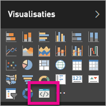

# Problemen met Power BI-visuals oplossen

## Fouten opsporen

**Kan de opdracht pbiviz niet vinden (of een vergelijkbare fouten)**

Als u `pbiviz` uitvoert vanaf de opdrachtregel in uw terminal wordt het Help-scherm weergegeven. Als dat niet het geval is, is de installatie niet goed verlopen. Zorg ervoor dat u hebt minimaal versie 4.0 van NodeJS hebt geïnstalleerd.

**Kan de foutopsporingsvisual niet vinden op het tabblad Visualisaties**

De foutopsporingsvisual ziet eruit als een promptpictogram en bevindt zich op het tabblad **Visualisaties**.

Als de visual niet wordt weergegeven, controleert u of u deze hebt ingeschakeld in de instellingen van Power BI.

> [!NOTE]
> De foutopsporingsvisual is momenteel alleen beschikbaar in de Power BI-service en niet in Power BI Desktop of de mobiele app. De verpakte visual werkt wel overal.

**Kan geen contact maken met de server van het visuele element**

Gebruik de opdracht `pbiviz start` vanaf de opdrachtregel in uw terminal vanuit de hoofdmap van het visualproject om de server van de visual uit te voeren. Als de server niet wordt uitgevoerd, zijn uw SSL-certificaten waarschijnlijk niet goed geïnstalleerd.

U kunt contact opnemen met het ondersteuningsteam voor Power BI-visuals (pbicvsupport@microsoft.com) bij vragen, opmerkingen of problemen.

## Volgende stappen

Ga naar [Veelgestelde vragen over Power BI-visuals](power-bi-custom-visuals-faq.md#organizational-power-bi-visuals) voor meer informatie.