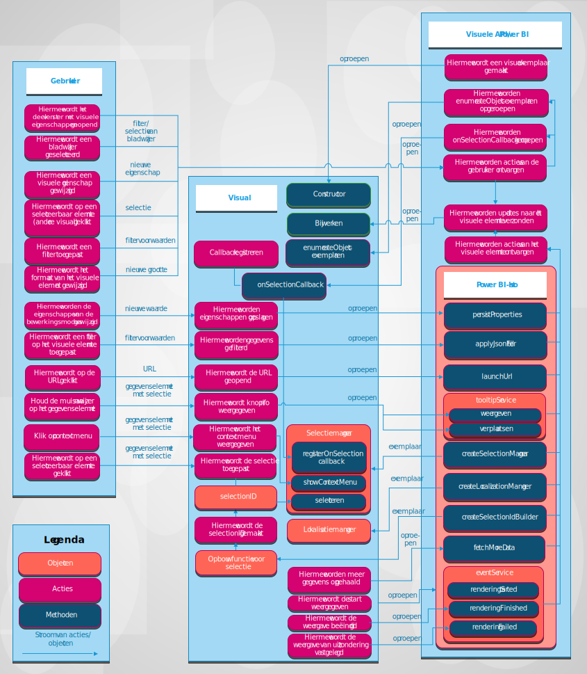

# Visuals in Power BI

In dit artikel wordt beschreven hoe visuals met Power BI integreren en hoe een gebruiker kan communiceren met een visual in Power BI. 

In de volgende afbeelding ziet u hoe algemene visuele acties die een gebruiker gebruikt, zoals het selecteren van een bladwijzer, worden verwerkt in Power BI.

## Visuele elementen halen updates op van Power BI

Een visual roept een `update`-methode aan om updates van Power BI op te halen. De `update`-methode bevat meestal de hoofdlogica van de visual en is verantwoordelijk voor het weergeven van het diagram of het visualiseren van gegevens.

Updates worden geactiveerd wanneer de Visual de `update`-methode aanroept.

## Actie- en update-patronen

Acties en volgende updates in Power BI-visuals treden op in een van deze drie patronen:

* De gebruiker communiceert via Power BI met de visual.
* De gebruiker werkt rechtstreeks met de visual.
* De visual communiceert met Power BI.

### Interactie van de gebruiker met een visual via Power BI

* Een gebruiker opent het deelvenster met de eigenschappen van de visual.

    Wanneer een gebruiker het deelvenster Eigenschappen van de visual opent, worden in Power BI ondersteunde objecten en eigenschappen opgehaald uit het bestand *capabilities.json*. Als u werkelijke waarden van eigenschappen wilt ontvangen, roept Power BI de `enumerateObjectInstances`-methode van de visual aan. De visual retourneert de daadwerkelijke waarden van eigenschappen.

    Zie [Objecten en eigenschappen van Power BI-visuals](capabilities.md) voor meer informatie.

* Een gebruiker [verandert een eigenschap van de visual](../../visuals/power-bi-visualization-customize-title-background-and-legend.md) in het opmaakdeelvenster.

    Wanneer een gebruiker de waarde van een eigenschap in het opmaakdeelvenster wijzigt, roept Power BI de `update`-methode van de Visual aan. Power BI wordt in het nieuwe `options`-object doorgegeven aan de `update`-methode. De objecten bevatten de nieuwe waarden.

    Zie [Objecten en eigenschappen van Power BI-visuals](objects-properties.md) voor meer informatie.

* Een gebruiker wijzigt het formaat van de visual.

    Wanneer een gebruiker de grootte van een visual wijzigt, roept Power BI de `update`-methode aan met het nieuwe `options`-object. De `options`-objecten hebben geneste `viewport`-objecten die de nieuwe breedte en hoogte van de visual bevatten.

* Een gebruiker past een filter op rapport-, pagina- of visualniveau toe.

    Power BI filtert gegevens op basis van filtervoorwaarden. Power BI roept de `update`-methode van de visual aan om de visual bij te werken met nieuwe gegevens.

    De visual ontvangt een nieuwe update van de `options`-objecten als er nieuwe gegevens in een van de geneste objecten zijn. Hoe de update wordt uitgevoerd, is afhankelijk van de configuratie van de gegevensweergavetoewijzing van de visual.

    Zie [Informatie over de toewijzing van gegevensweergaven in Power BI-visuals](dataview-mappings.md) voor meer informatie.

* De gebruiker selecteert een gegevenspunt in een andere visual van het rapport.

    Wanneer een gebruiker een gegevenspunt in een andere visuele in het rapport selecteert, filtert of accentueert Power BI de geselecteerde gegevenspunten en wordt de `update`-methode van de visual aangeroepen. De visual ontvangt nieuwe gefilterde gegevens of krijgt dezelfde gegevens met een reeks markeringen.

    Raadpleeg [Gegevenspunten markeren in Power BI-visuals](highlight.md) voor meer informatie.

* Een gebruiker selecteert een bladwijzer in het bladwijzerdeelvenster van het rapport.

    Wanneer een gebruiker een bladwijzer selecteert in het deelvenster bladwijzers van het rapport, kan een van de twee acties optreden:

    * Power BI roept een functie aan die wordt doorgegeven en geregistreerd door de `registerOnSelectionCallback`-methode. De callback-functie haalt reeksen van selecties op voor de bijbehorende bladwijzer.

    * Power BI roept de `update`-methode aan met een overeenkomend `filter`-object binnen het `options`-object.

    In beide gevallen moet de status van het visuele element worden gewijzigd op basis van de ontvangen selecties of het `filter`-object.

    Zie voor meer informatie over bladwijzers en filters [Visuele filters-API in Power BI-visuals](filter-api.md).

### De gebruiker werkt rechtstreeks met de visual

* Een gebruiker beweegt de muis over een gegevenselement.

    Een visual kan aanvullende informatie weergeven over een gegevenspunt via de Power BI Tooltips-API. Wanneer een gebruiker de muisaanwijzer over een visual houdt, kan de Visual de gebeurtenis verwerken en gegevens weergeven over het gekoppelde tooltip-element. De visual kan een reguliere tooltip of tooltip voor een rapportpagina weergeven.

    Zie [Tooltips in Power BI-visuals](add-tooltips.md) voor meer informatie.

* Een gebruiker wijzigt eigenschappen van een visual. (De gebruiker breidt bijvoorbeeld de boomstructuur uit en de visual slaat de status op in eigenschappen van de visual)

    In een visual kunnen eigenschapswaarden worden opgeslagen via de Power BI API. Als een gebruiker bijvoorbeeld communiceert met de visual en de visual moet waarden van eigenschappen opslaan of bijwerken, kan de visual de `presistProperties`-methode aanroepen.

* Een gebruiker selecteert een URL.

    Standaard kan een visual niet rechtstreeks een URL openen. In plaats daarvan kan de visual de `launchUrl`-methode aanroepen en de URL als een parameter doorgeven om een URL te openen op een nieuw tabblad.

    Zie [En start-URL maken](launch-url.md)voor meer informatie.

* Een gebruiker past een filter toe via de visual.

    Een visual kan de `applyJsonFilter`-methode aanroepen en de voorwaarden doorgeven om gegevens in andere visuals te filteren. Verschillende typen filters zijn beschikbaar, met inbegrip van Basic-, Advanced-en Tuple-filters.

    Zie [Visual Filters API in Power BI-visuals](filter-api.md) voor meer informatie.

* Een gebruiker selecteert elementen in de visual.

    Zie [Interactiviteit toevoegen met behulp van Power BI visal-selecties](selection-api.md)voor meer informatie over selecties in een Power BI-visual.

### De visual communiceert met Power BI

* De visual vraagt meer gegevens op bij Power BI.

    De visual verwerkt gegevens stuk voor stuk. Met de `fetchMoreData` API-methode wordt het volgende fragment van gegevens in de gegevensset opgevraagd.

    Als u meer wilt weten, leest u [Ophalen van meer gegevens uit Power BI](fetch-more-data.md).

* De gebeurtenisservice-triggers.

    Power BI kan een rapport exporteren naar PDF of een rapport verzenden via e-mail (alleen van toepassing op gecertificeerde visuals). Om Power BI te melden dat de rendering is voltooid en dat de visual gereed is om te worden vastgelegd als PDF of e-mail, moet de visual de API voor rendering-gebeurtenissen aanroepen.

    Zie [Exporteren van rapporten van Power BI naar PDF](../../consumer/end-user-pdf.md) voor meer informatie.

    Zie [Gebeurtenissen weergeven in Power BI-visuals](event-service.md)voor meer informatie over de gebeurtenisservice.

## Volgende stappen

Bent u geïnteresseerd in het maken van uw eigen visualisaties en wilt u deze toevoegen aan Microsoft AppSource? Zie deze artikelen:

* [Een Power BI-visual ontwikkelen](./custom-visual-develop-tutorial.md)
* [Power BI-visuals publiceren in het Partnercentrum](office-store.md)
