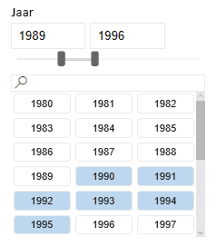
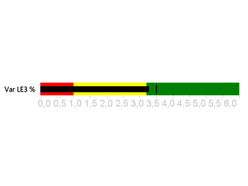
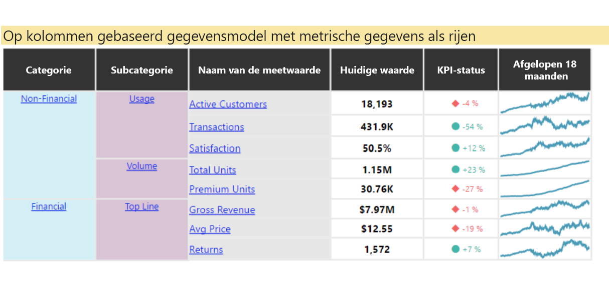
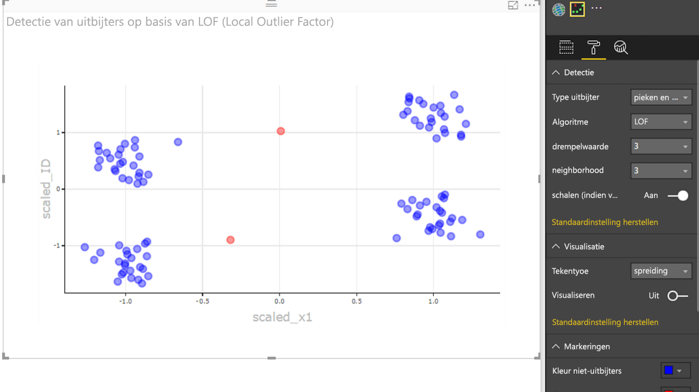

# Voorbeelden voor Power BI-visuals

U kunt deze Power BI-visuals downloaden, gebruiken en wijzigen vanuit GitHub. Deze voorbeelden laten zien hoe u veelvoorkomende situaties kunt afhandelen bij het ontwikkelen met Power BI.

## Slicers

Een slicer beperkt het deel van de gegevens dat wordt weergegeven in andere visualisaties in een rapport. Slicers zijn een van de manieren waarop u gegevens kunt filteren in Power BI.

|   |  | |
| ------------- | ------------- | -------------|
| [Chiclet-slicer](https://github.com/Microsoft/powerbi-visuals-chicletslicer/)   Een afbeelding of tekstknoppen weergeven die als een filter in het canvas fungeren voor andere visuals | [Tijdlijnslicer](https://github.com/Microsoft/powerbi-visuals-timeline/)  Grafische datumbereikselector die filtert op datum | [Voorbeeld van slicer](https://github.com/Microsoft/powerbi-visuals-sampleslicer/)  Toont het gebruik van de geavanceerde filter-API

## Grafieken

Doe inspiratie op in onze galerie met staafdiagrammen, cirkeldiagrammen, woordwolken en nog veel meer.

|   |  | |
| ------------- | ------------- | -------------|
| [Asterdiagram](https://github.com/Microsoft/powerbi-visuals-asterplot/)   Een variatie op een standaardringdiagram, waarin een tweede waarde wordt gebruikt om een zwaaihoek te bewerkstelligen | [Uitgebreid staafdiagram ](https://github.com/Microsoft/powerbi-visuals-bulletchart/)  Een staafdiagram met extra visuals waarmee context wordt gegeven, die kan worden gebruikt voor het bijhouden van doelstellingen | [Chord](https://github.com/Microsoft/powerbi-visuals-chord/)  Een methode voor grafische weergave van de relatie tussen gegevens in een matrix
|  | |  
| [Puntdiagram](https://github.com/Microsoft/powerbi-visuals-dotplot/)  Geeft de frequentieverdeling op een prachtige manier weer | [Dual KPI](https://github.com/Microsoft/powerbi-visuals-dualkpi/)  Geeft een efficiënt beeld van twee metingen over een bepaalde periode, waarbij de trend voor de metingen op een gemeenschappelijke tijdlijn wordt weergegeven | [Verbeterde spreidingsgrafiek](https://github.com/Microsoft/powerbi-visuals-enhancedscatter/)  Verbeteringen in het bestaande spreidingsdiagram
| | | 
| [Krachtgrafiek](https://github.com/Microsoft/powerbi-visuals-forcegraph/)  Diagram met kromme paden waarvan de lay-out wordt bepaald door aantrekkende en afstotende krachten. Dit diagram kan worden gebruikt om verbindingen tussen entiteiten weer te geven | [Gantt](https://github.com/Microsoft/powerbi-visuals-gantt/)  Een staafdiagram waarin een projecttijdlijn of -schema met resources wordt weergegeven | [Tabelheatmap](https://github.com/Microsoft/powerbi-visuals-heatmap/)  Gemakkelijk en intuïtief gegevens vergelijken met behulp van kleuren in een tabel
|  |  |  
| [Histogram](https://github.com/Microsoft/powerbi-visuals-histogram/)  Hiermee wordt de verdeling van gegevens over een ononderbroken interval of een bepaalde periode weergegeven | [LineDot-grafiek](https://github.com/Microsoft/powerbi-visuals-linedotchart/)  Een lijndiagram waarin de punten worden weergegeven in een animatie. Hiermee kunt u gegevens goed onder de aandacht brengen bij een publiek | [Mekkodiagram](https://github.com/Microsoft/powerbi-visuals-mekkochart/)  Een combinatie van een 100% gestapeld kolomdiagram en een 100% gestapeld staafdiagram die tot één weergave zijn samengevoegd
|  |  |  
| [Multi-KPI](https://github.com/microsoft/PowerBI-visuals-MultiKPI/)   Een krachtige multi-KPI-visualisatie met een sleutel-KPI en meerdere sparklines aan ondersteunende gegevens | [Power KPI](https://github.com/microsoft/PowerBI-visuals-PowerKPI/)  Een krachtige KPI-indicator met een grafiek met meerdere lijnen en labels voor de huidige datum, waarde en afwijkingen | [Power KPI Matrix](https://github.com/microsoft/PowerBI-visuals-PowerKPIMatrix/)  Balanced scorecards en een onbeperkt aantal metrische gegevens en KPI's in een compacte, eenvoudig te lezen lijst
| |  |  
| [Pulse-grafiek](https://github.com/Microsoft/powerbi-visuals-pulsechart/)  Dit lijndiagram met opmerkingen over belangrijke gebeurtenissen is ideaal wanneer u gegevens van achtergrondinformatie wilt voorzien| [Radardiagram](https://github.com/Microsoft/powerbi-visuals-radarchart/)  Meerdere metingen worden weergegeven langs een categorische as, wat nuttig is om kenmerken te vergelijken | [Sankeydiagram](https://github.com/Microsoft/powerbi-visuals-sankey/)  Stroomdiagram waarbij de breedte van de reeks zich verhoudt tot de hoeveelheid van de stroom
|  | | 
| [Stroomgrafiek](https://github.com/Microsoft/powerbi-visuals-streamgraph/)  Een gestapeld vlakdiagram met een vloeiende interpolatie, dat wordt vaak gebruikt om waarden over een bepaalde periode weer te geven | [Zonnestraalgrafiek](https://github.com/Microsoft/powerbi-visuals-sunburst/)  Ringdiagram met meerdere niveaus om hiërarchische gegevens weer te geven| [Tornadodiagram](https://github.com/Microsoft/powerbi-visuals-tornado/)  Het relatieve belang van variabelen voor twee groepen vergelijken
 | 
 | [Woordwolk](https://github.com/Microsoft/powerbi-visuals-wordcloud/)  Een leuke visual maken van veelvoorkomende tekst in uw gegevens

## WebGL

Met WebGL kan in webinhoud een API op basis van OpenGL ES 2.0 worden gebruikt voor 2D- en 3D-rendering in een HTML-canvas.

| |
| ------------- |
| [Wereldkaart](https://github.com/Microsoft/powerbi-visuals-globemap/)  Weergavelocaties op een interactieve 3D-kaart

## R-visuals

Deze voorbeelden laten zien hoe u de analytische en visuele kracht van R-visuals en R-scripts kunt bundelen.

| | | |
|------------- |------------- |------------- |------------- |
| [Association Rules](https://github.com/Microsoft/powerbi-visuals-assorules/)  Relaties tussen schijnbaar niet-gerelateerde gegevens opsporen met behulp van if-then-instructies | [Clustering](https://github.com/Microsoft/powerbi-visuals-clustering-kmeans/)  Vergelijkbare groepen in uw gegevens zoeken met behulp van het k-means algoritme | [Clustering met uitschieters](https://github.com/microsoft/PowerBI-visuals-dbscan/)  Vergelijkbare groepen en uitschieters in uw gegevens zoeken
|  |  |  
| [Correlatie-grafiek](https://github.com/Microsoft/powerbi-visuals-corrplot/)  De variabelen met de hoogste correlatie in een gegevenstabel markeren | [Beslissingsboomstructuur](https://github.com/Microsoft/powerbi-visuals-decision-tree/)  Schematisch boomstructuurdiagram voor het bepalen van statistische waarschijnlijkheid met recursieve partitionering | [Prognose maken van TBATS](https://github.com/Microsoft/powerbi-visuals-forcasting-tbats/)  Tijdreeksprognose voor reeksen met meerdere seizoensgebondenheden met behulp van het TBATS-model
|  |  |  
| [Prognose maken met ARIMA](https://github.com/Microsoft/powerbi-visuals-forcastingarima/)  Toekomstige waarden voorspellen op basis van historische gegevens met behulp van Autoregressive Integrated Moving Avg (ARIMA) | [Trechterdiagram](https://github.com/Microsoft/powerbi-visuals-funnel/)  Uitschieters in uw gegevens vinden met behulp van een trechterdiagram | [Detectie van uitschieters](https://github.com/Microsoft/powerbi-visuals-outliers-det/)  Uitschieters in uw gegevens vinden met de meest geschikte methode en weergave
|  |  | 
| [Spline-grafiek](https://github.com/Microsoft/powerbi-visuals-spline/)  Ruis in gegevens visualiseren en begrijpen | [Tijdreeksontledingsgrafiek](https://github.com/Microsoft/powerbi-visuals-timeseriesdecomposition/)  De tijdreeksonderdelen begrijpen met behulp van seizoen- en trendontleding met Loess | [Tijdreeks- en prognosediagram](https://github.com/Microsoft/powerbi-visuals-forcasting-exp/)  Een exponentieel vereffeningsmodel gebruiken om toekomstige waarden te voorspellen op basis van eerder geobserveerde waarden

## Volgende stappen

Als u zelf Power BI-visuals wilt gaan maken, raadpleegt u [Een aangepaste visual met cirkelkaart voor Power BI ontwikkelen](develop-circle-card.md).
