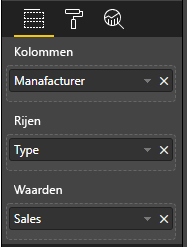

# <a name="add-interactivity-into-visual-by-power-bi-visuals-selections"></a>Interactiviteit toevoegen aan visual met selecties van Power BI-visuals

Power BI kent twee manieren van interactie met visuals: selecteren en filteren. In het onderstaande voorbeeld ziet u hoe u items in één visual selecteert en andere visuals in het rapport informeert over een nieuwe selectie.

Het object `Selection` correspondeert met de interface:

```typescript
export interface ISelectionId {
    equals(other: ISelectionId): boolean;
    includes(other: ISelectionId, ignoreHighlight?: boolean): boolean;
    getKey(): string;
    getSelector(): Selector;
    getSelectorsByColumn(): SelectorsByColumn;
    hasIdentity(): boolean;
}
```

## <a name="how-to-use-selectionmanager-to-select-data-points"></a>Hoe u Selectiebeheer gebruikt voor het selecteren van gegevenspunten

Het hostobject van de visual biedt de methode voor het maken van een exemplaar van Selectiebeheer. Selectiebeheer wordt gebruikt voor het maken en wissen van selecties, het weergeven van het contextmenu, het opslaan van huidige selecties en het controleren van de selectiestatus. Selectiebeheer voorziet bovendien in bijbehorende methoden voor deze acties.

### <a name="create-an-instance-of-the-selection-manager"></a>Een exemplaar van Selectiebeheer maken

Als u Selectiebeheer wilt gebruiken, moet u een Selectiebeheer-exemplaar maken. Normaal gesproken wordt een exemplaar van Selectiebeheer gemaakt in de `constructor` van het visualobject.

```typescript
export class Visual implements IVisual {
    private target: HTMLElement;
    private host: IVisualHost;
    private selectionManager: ISelectionManager;
    // ...
    constructor(options: VisualConstructorOptions) {
        this.host = options.host;
        // ...
        this.selectionManager = this.host.createSelectionManager();
    }
    // ...
}
```

### <a name="create-an-instance-of-the-selection-builder"></a>Een exemplaar van de opbouwfunctie voor selecties maken

Wanneer het exemplaar van Selectiebeheer is gemaakt, moet u `selections` maken voor elk gegevenspunt van de visual. Het hostobject van de visual levert de methode `createSelectionIdBuilder` voor het genereren van een selectie voor elk gegevenspunt. Deze methode retourneert een exemplaar van het object met interface `powerbi.visuals.ISelectionIdBuilder`:

```typescript
export interface ISelectionIdBuilder {
    withCategory(categoryColumn: DataViewCategoryColumn, index: number): this;
    withSeries(seriesColumn: DataViewValueColumns, valueColumn: DataViewValueColumn | DataViewValueColumnGroup): this;
    withMeasure(measureId: string): this;
    withMatrixNode(matrixNode: DataViewMatrixNode, levels: DataViewHierarchyLevel[]): this;
    withTable(table: DataViewTable, rowIndex: number): this;
    createSelectionId(): ISelectionId;
}
```

Dit object heeft overeenkomstige methoden voor het maken van `selections` voor verschillende typen toewijzingen van gegevensweergaven.

> [!NOTE]
> De methoden `withTable` en `withMatrixNode` zijn geïntroduceerd in API 2.5.0 van de Power BI-visuals.
> Als u selecties moet gebruiken voor toewijzingen van tabel- of matrixgegevensweergaven, moet u de API bijwerken naar versie 2.5.0 of hoger.

### <a name="create-selections-for-categorical-data-view-mapping"></a>Selecties maken voor toewijzing van categorische gegevensweergaven

Laten we eens kijken hoe selecties worden weergegeven voor de toewijzing van categorische gegevensweergaven voor een voorbeeldgegevensset:

| Fabrikant | Type | Waarde |
| - | - | - |
| Chrysler | Domestic Car | 28883 |
| Chrysler | Domestic Truck | 117131 |
| Chrysler | Import Car | 0 |
| Chrysler | Import Truck | 6362 |
| Ford | Domestic Car | 50032 |
| Ford | Domestic Truck | 122446 |
| Ford | Import Car | 0 |
| Ford | Import Truck | 0 |
| GM | Domestic Car | 65426 |
| GM | Domestic Truck | 138122 |
| GM | Import Car | 197 |
| GM | Import Truck | 0 |
| Honda | Domestic Car | 51450 |
| Honda | Domestic Truck | 46115 |
| Honda | Import Car | 2932 |
| Honda | Import Truck | 0 |
| Nissan | Domestic Car | 51476 |
| Nissan | Domestic Truck | 47343 |
| Nissan | Import Car | 5485 |
| Nissan | Import Truck | 1430 |
| Toyota | Domestic Car | 55643 |
| Toyota | Domestic Truck | 61227 |
| Toyota | Import Car | 20799 |
| Toyota | Import Truck | 23614 |

In de visual wordt de volgende toewijzing van gegevensweergaven gebruikt:

```json
{
    "dataRoles": [
        {
            "displayName": "Columns",
            "name": "columns",
            "kind": "Grouping"
        },
        {
            "displayName": "Rows",
            "name": "rows",
            "kind": "Grouping"
        },
        {
            "displayName": "Values",
            "name": "values",
            "kind": "Measure"
        }
    ],
    "dataViewMappings": [
        {
            "categorical": {
                "categories": {
                    "for": {
                        "in": "columns"
                    }
                },
                "values": {
                    "group": {
                        "by": "rows",
                        "select": [
                            {
                                "for": {
                                    "in": "values"
                                }
                            }
                        ]
                    }
                }
            }
        }
    ]
}
```

In het voorbeeld: `Manufacturer` is `columns` en `Type` is `rows`. Er is een reeks gemaakt door waarden te groeperen op `rows` (`Type`).

In de visual moeten gegevens kunnen worden gesegmenteerd op `Manufacturer` en `Type`.

Als de gebruiker bijvoorbeeld `Chrysler` op `Manufacturer` selecteert, moeten in andere visuals de volgende gegevens worden weergegeven:

| Fabrikant | Type | Waarde |
| - | - | - |
| **Chrysler** | Domestic Car | 28883 |
| **Chrysler** | Domestic Truck | 117131 |
| **Chrysler** | Import Car | 0 |
| **Chrysler** | Import Truck | 6362 |

Als de gebruiker `Import Car` op `Type` (gegevens op reeks) selecteert, moeten in andere visuals de volgende gegevens worden weergegeven:

| Fabrikant | Type | Waarde |
| - | - | - |
| Chrysler | **Import Car** | 0 |
| Ford | **Import Car** | 0 |
| GM | **Import Car** | 197 |
| Honda | **Import Car** | 2932 |
| Nissan | **Import Car** | 5485 |
| Toyota | **Import Car** | 20799 |


De visualgegevensmanden moeten worden gevuld.



De gegevens zijn `Manufacturer` als categorie (kolommen), `Type` als reeks (rijen) en `Value` als `Values` voor reeksen.

> [!NOTE]
> De `Values` is vereist voor reeksen, omdat volgens de toewijzing van de gegevensweergave van de visual wordt verwacht dat `Values` wordt gegroepeerd op `Rows`.

#### <a name="create-selections-for-categories"></a>Selecties voor categorieën maken

```typescript
// categories
const categories = dataView.categorical.categories;

// create label for 'Manufacturer' column
const p = document.createElement("p") as HTMLParagraphElement;
p.innerText = categories[0].source.displayName.toString();
this.target.appendChild(p);

// get count of category elements
const categoriesCount = categories[0].values.length;

// iterate all categories to generate selection and create button elements to use selections
for (let categoryIndex = 0; categoryIndex < categoriesCount; categoryIndex++) {
    const categoryValue: powerbi.PrimitiveValue = categories[0].values[categoryIndex];

    const categorySelectionId = this.host.createSelectionIdBuilder()
        .withCategory(categories[0], categoryIndex) // we have only one category (only one `Manufacturer` column)
        .createSelectionId();
    this.dataPoints.push({
        value: categoryValue,
        selection: categorySelectionId
    });
    console.log(categorySelectionId);

    // create button element to apply selection on click
    const button = document.createElement("button") as HTMLButtonElement;
    button.value = categoryValue.toString();
    button.innerText = categoryValue.toString();
    button.addEventListener("click", () => {
        // handle click event to apply correspond selection
        this.selectionManager.select(categorySelectionId);
    });
    this.target.appendChild(button);
}
```

In de voorbeeldcode kunt u zien dat alle categorieën worden herhaald. Bij elke herhaling wordt `createSelectionIdBuilder` aangeroepen om de volgende selectie voor elke categorie te maken met behulp van de methode `withCategory` van de opbouwfunctie voor selecties. Als laatste wordt de methode `createSelectionId` gebruikt om het gegenereerde `selection`-object te retourneren.

In de methode `withCategory` wordt de kolom `category` doorgegeven. In het voorbeeld is dat `Manufacturer` en de index van het categorie-element.

#### <a name="create-selections-for-series"></a>Selecties voor reeksen maken

```typescript
// get groupped values for series
const series: powerbi.DataViewValueColumnGroup[] = dataView.categorical.values.grouped();

// create label for 'Type' column
const p2 = document.createElement("p") as HTMLParagraphElement;
p2.innerText = dataView.categorical.values.source.displayName;
this.target.appendChild(p2);

// iterate all series to generate selection and create button elements to use selections
series.forEach( (ser: powerbi.DataViewValueColumnGroup) => {
    // create selection id for series
    const seriesSelectionId = this.host.createSelectionIdBuilder()
        .withSeries(dataView.categorical.values, ser)
        .createSelectionId();

    this.dataPoints.push({
        value: ser.name,
        selection: seriesSelectionId
    });

    // create button element to apply selection on click
    const button = document.createElement("button") as HTMLButtonElement;
    button.value =ser.name.toString();
    button.innerText = ser.name.toString();
    button.addEventListener("click", () => {
        // handle click event to apply correspond selection
        this.selectionManager.select(seriesSelectionId);
    });
    this.target.appendChild(button);
});
```

### <a name="create-selections-for-table-data-view-mapping"></a>Selecties maken voor toewijzing van tabelgegevensweergaven

Voorbeeld van toewijzing van tabelgegevensweergaven

```json
{
    "dataRoles": [
        {
            "displayName": "Values",
            "name": "values",
            "kind": "GroupingOrMeasure"
        }
    ],
    "dataViewMappings": [
        {
            "table": {
                "rows": {
                    "for": {
                        "in": "values"
                    }
                }
            }
        }
    ]
}
```

Als u een selectie wilt maken voor elke rij met een toewijzing van een tabelgegevensweergave, moet u de methode `withTable` van de opbouwfunctie voor selecties aanroepen.

```typescript
public update(options: VisualUpdateOptions) {
    const dataView = options.dataViews[0];
    dataView.table.rows.forEach((row: DataViewTableRow, rowIndex: number) => {
        this.target.appendChild(rowDiv);
        const selection: ISelectionId = this.host.createSelectionIdBuilder()
            .withTable(dataView.table, rowIndex)
            .createSelectionId();
    }
}
```

In de visualcode worden de rijen van de tabel herhaald en wordt voor elke rij de tabelmethode `withTable` aangeroepen. De parameters van de methode `withTable` zijn het object `table` en de index van de tabelrij.

### <a name="create-selections-for-matrix-data-view-mapping"></a>Selecties maken voor toewijzing van matrixgegevensweergaven

```typescript
public update(options: VisualUpdateOptions) {
    const host = this.host;
    const rowLevels: powerbi.DataViewHierarchyLevel[] = dataView.matrix.rows.levels;
    const columnLevels: powerbi.DataViewHierarchyLevel[] = dataView.matrix.rows.levels;

    // iterate rows hierarchy
    nodeWalker(dataView.matrix.rows.root, rowLevels);
    // iterate columns hierarchy
    nodeWalker(dataView.matrix.columns.root, columnLevels);

    function nodeWalker(node: powerbi.DataViewMatrixNode, levels: powerbi.DataViewHierarchyLevel[]) {
        const nodeSelection = host.createSelectionIdBuilder().withMatrixNode(node, levels);

        if (node.children && node.children.length) {
            node.children.forEach(child => {
                nodeWalker(child, levels);
            });
        }
    }
}
```

In het voorbeeld wordt `nodeWalker` recursief aangeroepen voor elk knooppunt en de onderliggende knooppunten.

Met `nodeWalker` wordt bij elke aanroep het object `nodeSelection` gemaakt. Elke `nodeSelection` vertegenwoordigt `selection` van de corresponderende knooppunten.

## <a name="select-datapoints-to-slice-other-visuals"></a>Gegevenspunten selecteren om andere visuals te segmenteren

Zoals u eerder in de voorbeeldcode van selecties voor toewijzing van categorische gegevensweergaven hebt kunnen zien, hebben we een klikhandler gemaakt voor knopelementen. Met deze handler wordt de methode `select` van Selectiebeheer aangeroepen en het selectieobject doorgegeven.

```typescript
button.addEventListener("click", () => {
    // handle click event to apply correspond selection
    this.selectionManager.select(categorySelectionId);
});
```

De interface van de methode `select` is

```typescript
interface ISelectionManager {
    // ...
    select(selectionId: ISelectionId | ISelectionId[], multiSelect?: boolean): IPromise<ISelectionId[]>;
    // ...
}
```

Zoals u kunt zien, kan `select` een matrix van selecties accepteren. Dit betekent dat met uw visual verschillende gegevenspunten kunnen worden geselecteerd. De tweede parameter `multiSelect` is verantwoordelijk voor multiselectie. Als de waarde true is, wordt in Power BI de vorige selectiestatus niet gewist en wordt de huidige selectie toegepast. Anders wordt de vorige selectie opnieuw ingesteld.

Het typische scenario voor het gebruik van `multiSelect` is de afhandeling van de status van de knop Ctrl bij een klikgebeurtenis.

```typescript
button.addEventListener("click", (mouseEvent) => {
    const multiSelect = (mouseEvent as MouseEvent).ctrlKey;
    this.selectionManager.select(seriesSelectionId, multiSelect);
});
```

## <a name="next-steps"></a>Volgende stappen

* [Lees hoe u selecties kunt gebruiken voor het verbinden van eigenschappen van visuals met gegevenspunten](objects-properties.md#objects-selector)

* [Lees hoe u selecties voor het wijzigen van bladwijzers kunt afhandelen](bookmarks-support.md#visuals-with-selection)

* [Lees hoe u een contextmenu voor gegevenspunten van visuals kunt toevoegen](context-menu.md)

* [Lees hoe u InteractivityUtils kunt gebruiken om selecties aan Power BI-visuals toe te voegen](utils-interactivity-selections.md)
