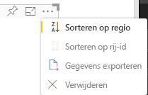

# <a name="sorting-options-for-power-bi-visuals"></a>Sorteeropties voor Power BI-visuals

In dit artikel wordt beschreven hoe u met opties voor *sorteren* het sorteergedrag voor Power BI-visuals opgeeft. 

Voor de sorteerfunctie is een van de volgende parameters vereist.

## <a name="default-sorting"></a>Standaardsortering

De `default`-optie is de eenvoudigste vorm. Hiermee kunnen de gegevens die worden gepresenteerd in de sectie 'DataMappings' worden gesorteerd. Met deze optie kan de gebruiker de gegevenstoewijzingen sorteren en de sorteerrichting opgeven.

```json
    "sorting": {
        "default": {   }
    }
```



## <a name="implicit-sorting"></a>Impliciete sortering

Impliciet sorteren is sorteren met de matrixparameter `clauses`, waarmee de sortering voor elke gegevensrol wordt beschreven. `implicit` betekent dat de gebruiker van de visual de sorteervolgorde niet kan wijzigen. In Power BI worden geen sorteeropties weergegeven in het menu van de visual. In Power BI worden de gegevens echter wel gesorteerd volgens de opgegeven instellingen.

`clauses`-parameters kunnen verschillende objecten bevatten met twee parameters:

- `role`: bepaalt `DataMapping` voor sorteren
- `direction`: bepaalt de sorteerrichting (1 = oplopend, 2 = aflopend)

```json
    "sorting": {
        "implicit": {
            "clauses": [
                {
                    "role": "category",
                    "direction": 1
                },
                {
                    "role": "measure",
                    "direction": 2
                }
            ]
        }
    }
```

## <a name="custom-sorting"></a>Aangepaste sortering

Met aangepaste sortering wordt de sortering beheerd door de ontwikkelaar, in de code van de visual.
