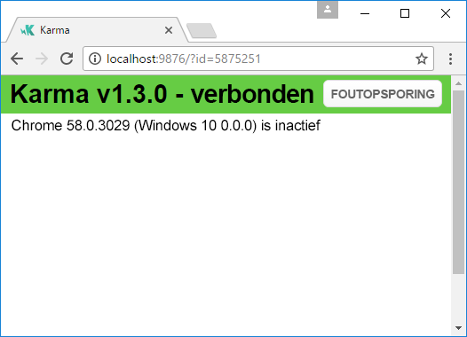
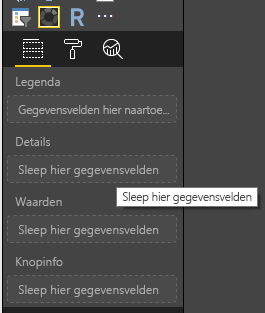
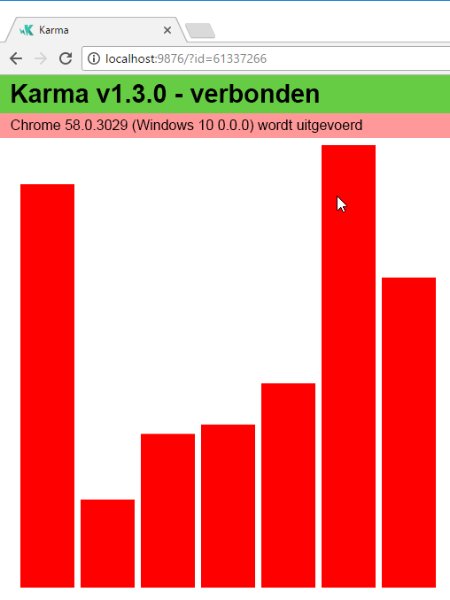
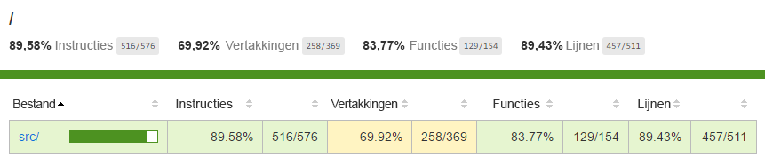
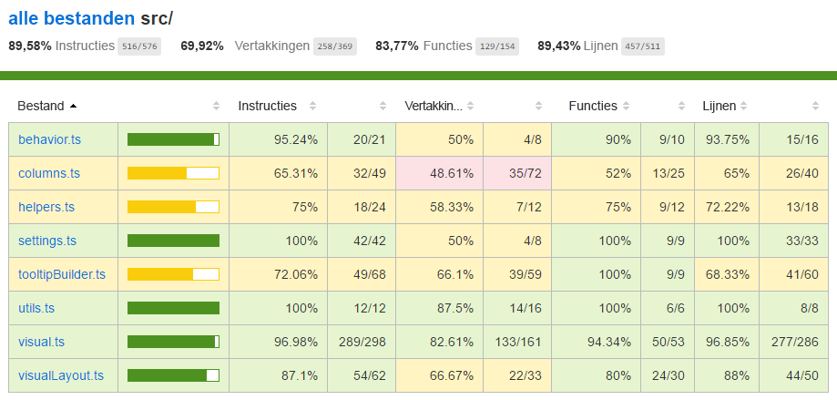

# <a name="tutorial-add-unit-tests-for-power-bi-visual-projects"></a>Zelfstudie: Eenheidstests voor Power BI-visualprojecten toevoegen

In dit artikel worden de basisbeginselen van het schrijven van tests voor uw Power BI-visuals beschreven, met onder meer:

* Stel Jasmine, het testraamwerk voor het Karma JavaScript-testuitvoeringsprogramma, in.
* Gebruik het pakket powerbi-visuals-utils-testutils.
* Gebruik prototypen en nabootsingen om eenheidstests voor Power BI-visuals te vereenvoudigen.

## <a name="prerequisites"></a>Vereisten

* Een geïnstalleerd Power BI-visualproject
* Een geconfigureerde Node.js-omgeving

## <a name="install-and-configure-the-karma-javascript-test-runner-and-jasmine"></a>Het Karma JavaScript-testuitvoeringsprogramma en Jasmine installeren en configureren

Voeg de vereiste bibliotheken toe aan het bestand *package.json* in de `devDependencies`-sectie:

```json
"@babel/polyfill": "^7.2.5",
"@types/d3": "5.5.0",
"@types/jasmine": "2.5.37",
"@types/jasmine-jquery": "1.5.28",
"@types/jquery": "2.0.41",
"@types/karma": "3.0.0",
"@types/lodash-es": "4.17.1",
"coveralls": "3.0.2",
"istanbul-instrumenter-loader": "^3.0.1",
"jasmine": "2.5.2",
"jasmine-core": "2.5.2",
"jasmine-jquery": "2.1.1",
"jquery": "3.1.1",
"karma": "3.1.1",
"karma-chrome-launcher": "2.2.0",
"karma-coverage": "1.1.2",
"karma-coverage-istanbul-reporter": "^2.0.4",
"karma-jasmine": "2.0.1",
"karma-junit-reporter": "^1.2.0",
"karma-sourcemap-loader": "^0.3.7",
"karma-typescript": "^3.0.13",
"karma-typescript-preprocessor": "0.4.0",
"karma-webpack": "3.0.5",
"puppeteer": "1.17.0",
"style-loader": "0.23.1",
"ts-loader": "5.3.0",
"ts-node": "7.0.1",
"tslint": "^5.12.0",
"webpack": "4.26.0"
```

Meer informatie over het pakket vindt u bij de beschrijving.

Sla het bestand *package.json* op en voer op de `package.json`-locatie de volgende opdracht uit:

```cmd
npm install
```

Met pakketbeheer worden alle nieuwe pakketten geïnstalleerd die zijn toegevoegd aan *package.json*.

Als u eenheidstests wilt uitvoeren, moet u het testuitvoeringsprogramma en de `webpack`-configuratie configureren.

De volgende code is een voorbeeld van het bestand *test.webpack.config*:

```typescript
const path = require('path');
const webpack = require("webpack");

module.exports = {
    devtool: 'source-map',
    mode: 'development',
    optimization : {
        concatenateModules: false,
        minimize: false
    },
    module: {
        rules: [
            {
                test: /\.tsx?$/,
                use: 'ts-loader',
                exclude: /node_modules/
            },
            {
                test: /\.json$/,
                loader: 'json-loader'
            },
            {
                test: /\.tsx?$/i,
                enforce: 'post',
                include: /(src)/,
                exclude: /(node_modules|resources\/js\/vendor)/,
                loader: 'istanbul-instrumenter-loader',
                options: { esModules: true }
            },
            {
                test: /\.less$/,
                use: [
                    {
                        loader: 'style-loader'
                    },
                    {
                        loader: 'css-loader'
                    },
                    {
                        loader: 'less-loader',
                        options: {
                            paths: [path.resolve(__dirname, 'node_modules')]
                        }
                    }
                ]
            }
        ]
    },
    externals: {
        "powerbi-visuals-api": '{}'
    },
    resolve: {
        extensions: ['.tsx', '.ts', '.js', '.css']
    },
    output: {
        path: path.resolve(__dirname, ".tmp/test")
    },
    plugins: [
        new webpack.ProvidePlugin({
            'powerbi-visuals-api': null
        })
    ]
};
```

De volgende code is een voorbeeld van het bestand *karma.conf.ts*:

```typescript
"use strict";

const webpackConfig = require("./test.webpack.config.js");
const tsconfig = require("./test.tsconfig.json");
const path = require("path");

const testRecursivePath = "test/visualTest.ts";
const srcOriginalRecursivePath = "src/**/*.ts";
const coverageFolder = "coverage";

process.env.CHROME_BIN = require("puppeteer").executablePath();

import { Config, ConfigOptions } from "karma";

module.exports = (config: Config) => {
    config.set(<ConfigOptions>{
        mode: "development",
        browserNoActivityTimeout: 100000,
        browsers: ["ChromeHeadless"], // or Chrome to use locally installed Chrome browser
        colors: true,
        frameworks: ["jasmine"],
        reporters: [
            "progress",
            "junit",
            "coverage-istanbul"
        ],
        junitReporter: {
            outputDir: path.join(__dirname, coverageFolder),
            outputFile: "TESTS-report.xml",
            useBrowserName: false
        },
        singleRun: true,
        plugins: [
            "karma-coverage",
            "karma-typescript",
            "karma-webpack",
            "karma-jasmine",
            "karma-sourcemap-loader",
            "karma-chrome-launcher",
            "karma-junit-reporter",
            "karma-coverage-istanbul-reporter"
        ],
        files: [
            "node_modules/jquery/dist/jquery.min.js",
            "node_modules/jasmine-jquery/lib/jasmine-jquery.js",
            {
                pattern: './capabilities.json',
                watched: false,
                served: true,
                included: false
            },
            testRecursivePath,
            {
                pattern: srcOriginalRecursivePath,
                included: false,
                served: true
            }
        ],
        preprocessors: {
            [testRecursivePath]: ["webpack", "coverage"]
        },
        typescriptPreprocessor: {
            options: tsconfig.compilerOptions
        },
        coverageIstanbulReporter: {
            reports: ["html", "lcovonly", "text-summary", "cobertura"],
            dir: path.join(__dirname, coverageFolder),
            'report-config': {
                html: {
                    subdir: 'html-report'
                }
            },
            combineBrowserReports: true,
            fixWebpackSourcePaths: true,
            verbose: false
        },
        coverageReporter: {
            dir: path.join(__dirname, coverageFolder),
            reporters: [
                // reporters not supporting the `file` property
                { type: 'html', subdir: 'html-report' },
                { type: 'lcov', subdir: 'lcov' },
                // reporters supporting the `file` property, use `subdir` to directly
                // output them in the `dir` directory
                { type: 'cobertura', subdir: '.', file: 'cobertura-coverage.xml' },
                { type: 'lcovonly', subdir: '.', file: 'report-lcovonly.txt' },
                { type: 'text-summary', subdir: '.', file: 'text-summary.txt' },
            ]
        },
        mime: {
            "text/x-typescript": ["ts", "tsx"]
        },
        webpack: webpackConfig,
        webpackMiddleware: {
            stats: "errors-only"
        }
    });
};
```

Indien nodig kunt u deze configuratie wijzigen.

De code in *karma.conf.js* bevat de volgende variabele:

* `recursivePathToTests`: leidt naar de locatie van de testcode

* `srcRecursivePath`: leidt naar de JavaScript-uitvoercode na het compileren

* `srcCssRecursivePath`: leidt naar de CSS-uitvoer na het compileren van Less-bestanden met stijlen

* `srcOriginalRecursivePath`: bepaalt de plaats van de broncode van uw visual

* `coverageFolder`: bepaalt waar het dekkingsrapport moet worden gemaakt

Het configuratiebestand bevat de volgende eigenschappen:

* `singleRun: true`: Tests worden uitgevoerd in een CI-systeem (continue integratie) of kunnen eenmalig worden uitgevoerd. U kunt de instelling wijzigen in *onwaar* voor het opsporen van fouten in uw tests. In Karma blijft de browser actief, zodat u de console kunt gebruiken voor foutopsporing.

* `files: [...]`: In deze matrix kunt u de bestanden opgeven die in de browser moeten worden geladen. Gewoonlijk zijn er bronbestanden, testcases en bibliotheken (Jasmine, testhulpprogramma's). Indien nodig kunt u extra bestanden toevoegen aan de lijst.

* `preprocessors`: In deze sectie configureert u acties die worden uitgevoerd voordat de eenheidstests worden uitgevoerd. Hiermee wordt het TypeScript vooraf gecompileerd naar JavaScript, worden brontoewijzingsbestanden voorbereid en wordt een codedekkingsrapport gegenereerd. U kunt `coverage` uitschakelen wanneer u fouten opspoort in uw tests. Met dekking wordt extra code gegenereerd voor het controleren van code voor de testdekking, wat foutopsporingstests complexer maakt.

Ga naar de pagina [Karma-configuratiebestand](https://karma-runner.github.io/1.0/config/configuration-file.html) voor beschrijvingen van alle Karma-configuraties.

Voor het gemak kunt u een testopdracht toevoegen aan `scripts`:

```json
{
    "scripts": {
        "pbiviz": "pbiviz",
        "start": "pbiviz start",
        "typings":"node node_modules/typings/dist/bin.js i",
        "lint": "tslint -r \"node_modules/tslint-microsoft-contrib\"  \"+(src|test)/**/*.ts\"",
        "pretest": "pbiviz package --resources --no-minify --no-pbiviz --no-plugin",
        "test": "karma start"
    }
    ...
}
```

Nu bent u klaar om te beginnen met het schrijven van uw eenheidstests.

## <a name="check-the-dom-element-of-the-visual"></a>Het DOM-element van de visual controleren

U moet eerst een instantie van de visual maken voordat u de visual kunt testen.

### <a name="create-a-visual-instance-builder"></a>Opbouwfunctie voor het maken van een visualinstantie

Voeg met de volgende code een bestand *visualBuilder.ts* toe aan de map *test*:

```typescript
import {
    VisualBuilderBase
} from "powerbi-visuals-utils-testutils";

import {
    BarChart as VisualClass
} from "../src/visual";

import  powerbi from "powerbi-visuals-api";
import VisualConstructorOptions = powerbi.extensibility.visual.VisualConstructorOptions;

export class BarChartBuilder extends VisualBuilderBase<VisualClass> {
    constructor(width: number, height: number) {
        super(width, height);
    }

    protected build(options: VisualConstructorOptions) {
        return new VisualClass(options);
    }

    public get mainElement() {
        return this.element.children("svg.barChart");
    }
}
```

Er is een `build`-methode voor het maken van een instantie van uw visual. `mainElement` is een Get-methode, waarmee een instantie van het DOM-element(Document Object Model) 'root' in uw visual wordt geretourneerd. De getter is optioneel, maar maakt het schrijven van de eenheidstest eenvoudiger.

U hebt nu een build van een instantie van uw visual. We gaan de testcase schrijven. Met de testcase worden de SVG-elementen gecontroleerd die worden gemaakt wanneer uw visual wordt weergegeven.

### <a name="create-a-typescript-file-to-write-test-cases"></a>Een TypeScript-bestand maken om testcases te schrijven

Voeg met de volgende code een bestand *visualTest.ts* voor de testcases toe:

```typescript
import powerbi from "powerbi-visuals-api";

import { BarChartBuilder } from "./VisualBuilder";

import {
    BarChart as VisualClass
} from "../src/visual";

import VisualBuilder = powerbi.extensibility.visual.test.BarChartBuilder;

describe("BarChart", () => {
    let visualBuilder: VisualBuilder;
    let dataView: DataView;

    beforeEach(() => {
        visualBuilder = new VisualBuilder(500, 500);
    });

    it("root DOM element is created", () => {
        expect(visualBuilder.mainElement).toBeInDOM();
    });
});
```

Er worden verschillende methoden aangeroepen:

* [`describe`](https://jasmine.github.io/api/2.6/global.html#describe): Hiermee wordt een testcase beschreven. In de context van het Jasmine-framework wordt vaak een suite of groep specificaties beschreven.

* `beforeEach`: Wordt aangeroepen vóór elke aanroep van de methode `it`, die is gedefinieerd in de methode [`describe`](https://jasmine.github.io/api/2.6/global.html#beforeEach).

* [`it`](https://jasmine.github.io/api/2.6/global.html#it): Hiermee wordt één specificatie gedefinieerd. De methode `it` moet een of meer `expectations` bevatten.

* [`expect`](https://jasmine.github.io/api/2.6/global.html#expect): Hiermee wordt een verwachting van een specificatie gedefinieerd. Een specificatie slaagt als er foutloos aan alle verwachtingen wordt voldaan.

* `toBeInDOM`: Dit is een van de *matchers*-methoden. Zie [Jasmine-naamruimte: matchers](https://jasmine.github.io/api/2.6/matchers.html) voor meer informatie over matchers.

Zie de pagina [Jasmine Framework-documentatie](https://jasmine.github.io/) voor meer informatie over Jasmine.

### <a name="launch-unit-tests"></a>Eenheidstests starten

Deze test controleert of het root-SVG-element van de visuals wordt gemaakt. U kunt de eenheidstest uitvoeren door de volgende opdracht in te voeren in het opdrachtregelprogramma:

```cmd
npm run test
```

Met `karma.js` wordt de testcase uitgevoerd in de browser Chrome.



> [!NOTE]
> U moet Google Chrome lokaal installeren.

In het volgende opdrachtregelvenster krijgt u de volgende uitvoer:

```cmd
> karma start

23 05 2017 12:24:26.842:WARN [watcher]: Pattern "E:/WORKSPACE/PowerBI/PowerBI-visuals-sampleBarChart/data/*.csv" does not match any file.
23 05 2017 12:24:30.836:WARN [karma]: No captured browser, open http://localhost:9876/
23 05 2017 12:24:30.849:INFO [karma]: Karma v1.3.0 server started at http://localhost:9876/
23 05 2017 12:24:30.850:INFO [launcher]: Launching browser Chrome with unlimited concurrency
23 05 2017 12:24:31.059:INFO [launcher]: Starting browser Chrome
23 05 2017 12:24:33.160:INFO [Chrome 58.0.3029 (Windows 10 0.0.0)]: Connected on socket /#2meR6hjXFmsE_fjiAAAA with id 5875251
Chrome 58.0.3029 (Windows 10 0.0.0): Executed 1 of 1 SUCCESS (0.194 secs / 0.011 secs)

=============================== Coverage summary ===============================
Statements   : 27.43% ( 65/237 )
Branches     : 19.84% ( 25/126 )
Functions    : 43.86% ( 25/57 )
Lines        : 20.85% ( 44/211 )
================================================================================
```

### <a name="how-to-add-static-data-for-unit-tests"></a>Statische gegevens voor eenheidstests toevoegen

Voeg met de volgende code het bestand *visualData.ts* toe aan de map *test*:

```typescript
import powerbi from "powerbi-visuals-api";
import DataView = powerbi.DataView;

import {
    testDataViewBuilder,
    getRandomNumbers
} from "powerbi-visuals-utils-testutils";

export class SampleBarChartDataBuilder extends TestDataViewBuilder {
    public static CategoryColumn: string = "category";
    public static MeasureColumn: string = "measure";

    public constructor() {
        super();
        ...
    }

    public getDataView(columnNames?: string[]): DataView {
        let dateView: any = this.createCategoricalDataViewBuilder([
            ...
        ],
        [
            ...
        ], columnNames).build();

        // there's client side computed maxValue
        let maxLocal = 0;
        this.valuesMeasure.forEach((item) => {
                if (item > maxLocal) {
                    maxLocal = item;
                }
        });
        (<any>dataView).categorical.values[0].maxLocal = maxLocal;
    }
}
```

Met de klasse `SampleBarChartDataBuilder` wordt `TestDataViewBuilder` uitgebreid en de abstracte methode `getDataView` geïmplementeerd.

Wanneer u gegevens in gegevensveldbuckets plaatst, produceert Power BI een categorisch `dataview`-object op basis van uw gegevens.



In eenheidstests hebt u geen Power BI-kernfuncties om de gegevens te reproduceren. U moet uw statische gegevens echter toewijzen aan de categorische `dataview`. U kunt deze toewijzen met behulp van de klasse `TestDataViewBuilder`.

Zie [DataViewMappings](https://github.com/Microsoft/PowerBI-visuals/blob/master/Capabilities/DataViewMappings.md) voor meer informatie over de toewijzing van gegevensweergaven.

In de methode `getDataView` roept u de methode `createCategoricalDataViewBuilder` aan met uw gegevens.

In het bestand [capabilities.json](https://github.com/Microsoft/PowerBI-visuals-sampleBarChart/blob/master/capabilities.json#L2) van de visual `sampleBarChart` hebben we dataRoles- en dataViewMapping-objecten:

```json
"dataRoles": [
    {
        "displayName": "Category Data",
        "name": "category",
        "kind": "Grouping"
    },
    {
        "displayName": "Measure Data",
        "name": "measure",
        "kind": "Measure"
    }
],
"dataViewMappings": [
    {
        "conditions": [
            {
                "category": {
                    "max": 1
                },
                "measure": {
                    "max": 1
                }
            }
        ],
        "categorical": {
            "categories": {
                "for": {
                    "in": "category"
                }
            },
            "values": {
                "select": [
                    {
                        "bind": {
                            "to": "measure"
                        }
                    }
                ]
            }
        }
    }
],
```

Als u dezelfde toewijzing wilt genereren, moet u de volgende parameters instellen in de `createCategoricalDataViewBuilder`-methode:

```typescript
([
    {
        source: {
            displayName: "Category",
            queryName: SampleBarChartData.ColumnCategory,
            type: ValueType.fromDescriptor({ text: true }),
            roles: {
                Category: true
            },
        },
        values: this.valuesCategory
    }
],
[
    {
        source: {
            displayName: "Measure",
            isMeasure: true,
            queryName: SampleBarChartData.MeasureColumn,
            type: ValueType.fromDescriptor({ numeric: true }),
            roles: {
                Measure: true
            },
        },
        values: this.valuesMeasure
    },
], columnNames)
```

Hierbij is `this.valuesCategory` een matrix met categorieën:

```ts
public valuesCategory: string[] = ["Monday", "Tuesday", "Wednesday", "Thursday", "Friday", "Saturday", "Sunday"];
```

En `this.valuesMeasure` is een matrix met metingen voor elke categorie:

```ts
public valuesMeasure: number[] = [742731.43, 162066.43, 283085.78, 300263.49, 376074.57, 814724.34, 570921.34];
```

Nu kunt u de klasse `SampleBarChartDataBuilder` in uw eenheidstest gebruiken.

De klasse `ValueType` is gedefinieerd in het pakket powerbi-visuals-utils-testutils. Daarnaast is voor de methode `createCategoricalDataViewBuilder` de bibliotheek `lodash` vereist.

Voeg deze pakketten toe aan de afhankelijkheden.

In `package.json` in de sectie `devDependencies`

```json
"lodash-es": "4.17.1",
"powerbi-visuals-utils-testutils": "2.2.0"
```

Roept u

```cmd
npm install
```

aan om de `lodash-es`-bibliotheek te installeren.

Nu kunt u de eenheidstest opnieuw uitvoeren. U moet de volgende uitvoer ophalen:

```cmd
> karma start

23 05 2017 16:19:54.318:WARN [watcher]: Pattern "E:/WORKSPACE/PowerBI/PowerBI-visuals-sampleBarChart/data/*.csv" does not match any file.
23 05 2017 16:19:58.333:WARN [karma]: No captured browser, open http://localhost:9876/
23 05 2017 16:19:58.346:INFO [karma]: Karma v1.3.0 server started at http://localhost:9876/
23 05 2017 16:19:58.346:INFO [launcher]: Launching browser Chrome with unlimited concurrency
23 05 2017 16:19:58.394:INFO [launcher]: Starting browser Chrome
23 05 2017 16:19:59.873:INFO [Chrome 58.0.3029 (Windows 10 0.0.0)]: Connected on socket /#NcNTAGH9hWfGMCuEAAAA with id 3551106
Chrome 58.0.3029 (Windows 10 0.0.0): Executed 1 of 1 SUCCESS (1.266 secs / 1.052 secs)

=============================== Coverage summary ===============================
Statements   : 56.72% ( 135/238 )
Branches     : 32.54% ( 41/126 )
Functions    : 66.67% ( 38/57 )
Lines        : 52.83% ( 112/212 )
================================================================================
```

Uw visual wordt geopend in de browser Chrome, zoals hier wordt weergegeven:



In de samenvatting ziet u dat de dekking is verhoogd. Open `coverage\index.html` voor meer informatie over de huidige codedekking.



Of kijk naar het bereik van de map `src`:



In het bereik van het bestand kunt u de broncode bekijken. Met de `Coverage`-hulpprogramma's wordt de rij rood gemarkeerd als bepaalde code niet is uitgevoerd tijdens de eenheidstests.


> [!IMPORTANT]
> Codedekking betekent niet dat u een goede functionaliteitsdekking van de visual hebt. Eén eenvoudige eenheidstest zorgt voor meer dan 96 procent dekking in `src\visual.ts`.

## <a name="next-steps"></a>Volgende stappen

Wanneer uw visual klaar is, kunt u deze indienen voor publicatie. Zie [Aangepaste visuals in AppSource publiceren](../office-store.md) voor meer informatie.
