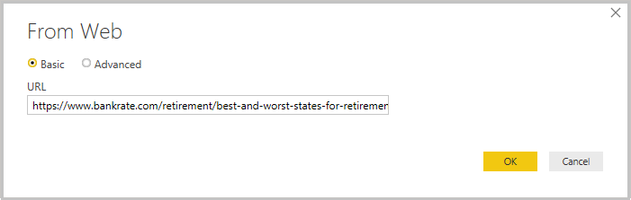
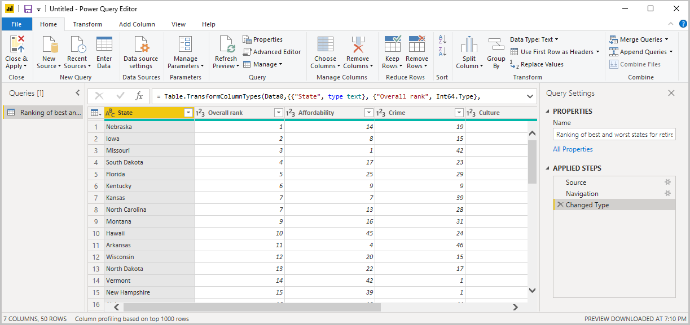
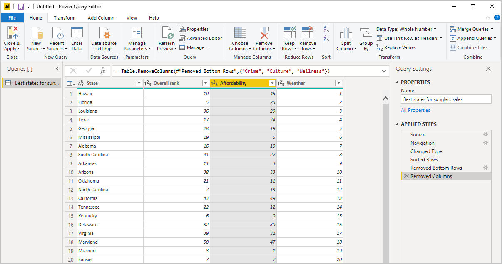
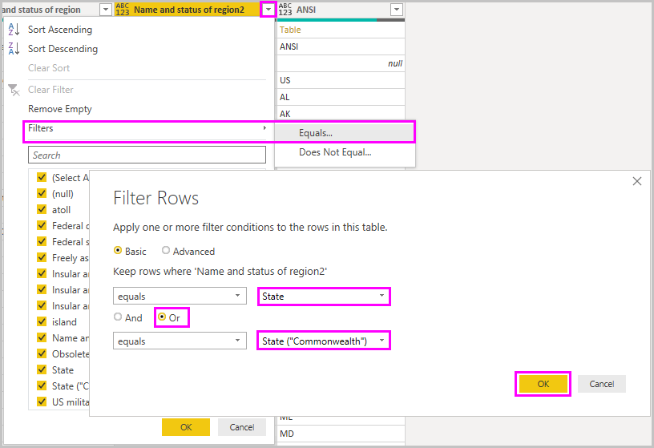
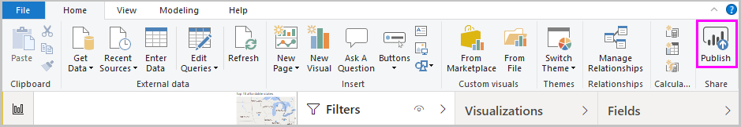

# Aan de slag met Power BI Desktop
Welkom bij de gids Aan de slag met Power BI Desktop. Tijdens deze rondleiding ziet u hoe Power BI Desktop werkt, wat u ermee kunt doen en hoe u robuuste gegevensmodellen en fantastische rapporten kunt bouwen om uw business intelligence te versterken.

Als u snel een overzicht wilt hebben van hoe Power BI Desktop werkt en hoe u het kunt gebruiken, neem dan een paar minuten de tijd om een blik te werpen op de schermen in deze gids. Voor een uitgebreider inzicht kunt u elke sectie doorlezen, de stappen uitvoeren en uw eigen Power BI Desktop-bestand maken dat u in de [Power BI](https://app.powerbi.com/)-service kunt plaatsen en met anderen delen.

U kunt ook de video [Aan de slag met Power BI Desktop](https://www.youtube.com/watch?v=Qgam9M8I0xA) bekijken en het [Excel werkmap - Financieel voorbeeld](https://go.microsoft.com/fwlink/?LinkID=521962) downloaden om mee te doen met de video.

> [!IMPORTANT]
> Power BI Desktop wordt maandelijks bijgewerkt en uitgebracht, waarin de feedback van klanten en nieuwe functies zijn verwerkt. Alleen de meest recente versie van Power BI Desktop wordt ondersteund. Klanten die contact opnemen met de ondersteuning voor Power BI Desktop, wordt gevraagd om een upgrade naar de meest recente versie uit te voeren. U kunt de meest recente versie van Power BI Desktop ophalen uit de [Windows Store](https://aka.ms/pbidesktopstore) of als één uitvoerbaar bestand met alle ondersteunde talen die u [downloadt](https://www.microsoft.com/download/details.aspx?id=58494) en op uw computer installeert.

## De werking van Power BI Desktop
Met Power BI Desktop kunt u het volgende doen:
1. Verbinding maken met gegevens, ook als die uit meerdere gegevensbronnen afkomstig zijn.
1. Vorm geven aan de gegevens met behulp van query's waarmee verhelderende, interessante gegevensmodellen kunnen worden gebouwd.
1. De gegevensmodellen gebruiken om visualisaties en rapporten te maken. 
1. Uw rapportbestanden delen zodat anderen deze kunnen gebruiken, er verder aan kunnen werken en kunnen delen. U kunt *.pbix-* -bestanden van Power BI Desktop delen net als andere bestanden, maar de interessantste methode is die waarbij u de bestanden uploadt naar de [Power BI-service](https://preview.powerbi.com/). 

In Power BI Desktop zijn beproefde Microsoft-technologieën op het gebied van queryengines, gegevensmodellering en visualisatie met elkaar geïntegreerd. Gegevensanalisten en anderen kunnen queryverzamelingen, gegevensverbindingen, modellen en rapporten maken en deze eenvoudig delen met anderen. Dankzij de combinatie van Power BI Desktop en de Power BI-service kunt u nieuwe inzichten op basis van gegevens eenvoudiger modelleren, bouwen, delen en uitbreiden.

Met Power BI Desktop centraliseert, vereenvoudigt en stroomlijnt u het ontwerpen en maken van opslagplaatsen en rapporten voor business intelligence, wat anders een verspreid, ongeorganiseerd en lastig proces kan zijn.
Wilt u het proberen? Aan de slag.

> [!NOTE]
> Voor gegevens die on-premises moeten blijven, is er een afzonderlijke en speciale versie van Power BI met de naam [Power BI Report Server](../report-server/get-started.md). Power BI Desktop Server maakt gebruik van een afzonderlijke en gespecialiseerde versie van Power BI Desktop met de naam Power BI Desktop voor Power BI Report Server, die alleen werkt met de versie Report Server van Power BI. In dit artikel wordt de standaard Power BI Desktop omschreven.

## Power BI Desktop installeren en starten
Als u Power BI Desktop wilt downloaden, gaat u naar de pagina [Power BI Desktop downloaden](https://powerbi.microsoft.com/desktop) en selecteert u **Gratis downloaden**. Of selecteer [Download- of taalopties bekijken](https://www.microsoft.com/download/details.aspx?id=58494) voor downloadopties. 

U kunt Power BI Desktop ook uit de Power BI-service downloaden. Selecteer het pictogram **Downloaden** in de bovenste menubalk en selecteer vervolgens **Power BI Desktop**.

Selecteer **Downloaden** op de pagina Microsoft Store en volg de aanwijzingen om Power BI Desktop op uw computer te installeren. Start Power BI Desktop vanuit het menu **Start** van Windows of met het pictogram in de Windows-taakbalk.

De eerste keer dat Power BI Desktop wordt gestart, wordt het **welkomstscherm** weergegeven.

In het **welkomstscherm** kunt u **gegevens ophalen**, **recente bronnen** bekijken, recente rapporten openen, **andere rapporten openen** of andere koppelingen selecteren. U kunt ook kiezen of u wilt dat het **welkomstscherm** bij het opstarten altijd wordt weergegeven. Selecteer het pictogram Sluiten om het **welkomstscherm** te sluiten.

Aan de linkerkant van Power BI Desktop bevinden zich pictogrammen voor de drie weergaven van Power BI Desktop: **Rapport**, **Gegevens** en **Relaties**. De huidige weergave wordt aangeduid met de gele balk aan de linkerkant. U kunt van weergave veranderen door een van de pictogrammen te selecteren. 

De standaardweergave is **Rapport**. 

Power BI Desktop bevat ook de **Power Query-editor**, die in een afzonderlijk venster wordt geopend. In de **Power Query-editor** kunt u query's maken en gegevens transformeren, en het verfijnde gegevensmodel vervolgens in Power BI Desktop laden om rapporten te maken.

## Verbinding maken met gegevens
Nu Power BI Desktop is geïnstalleerd, kunt u verbinding maken met de steeds verder uitbreidende wereld van gegevens. Voor een overzicht van de verschillende soorten gegevensbronnen die beschikbaar zijn, selecteert u **Gegevens ophalen** > **Meer** op het tabblad **Start** in Power BI Desktop, en bladert u in het venster **Gegevens ophalen** door de lijst met **alle** gegevensbronnen. In deze korte rondleiding gaat u verbinding maken met een aantal verschillende **web** gegevensbronnen.

Stel dat u een gegevensanalist bent die werkt voor een detailhandel in zonnebrillen. U wilt uw klant helpen zich te richten op de markten met de meeste zonuren. De pagina [Best and worst states for retirement](https://www.bankrate.com/retirement/best-and-worst-states-for-retirement/) (De beste en slechtste staten om na uw pensionering te wonen) bevat interessante gegevens over dit onderwerp.

Selecteer op het tabblad **Start** in Power BI Desktop de optie **Gegevens ophalen** > **Web** om verbinding te maken met een webgegevensbron. 

Plak in het dialoogvenster **Van web** het adres *https:\//www.bankrate.com/retirement/best-and-worst-states-for-retirement/* in het veld **URL** en selecteer **OK**. 

Als u hierom wordt gevraagd, klikt u in het scherm **Webinhoud openen** op **Verbinding maken** om anonieme toegang te gebruiken. 

De queryfunctionaliteit van Power BI Desktop gaat aan de slag en maakt verbinding met de webresource. In het venster **Navigator** wordt weergegeven wat er op de webpagina is gevonden, in dit geval een tabel met de naam **Ranking of best and worst states for retirement**  (Classificatie van de beste en slechtste staten om na uw pensionering te wonen) en een document. U bent geïnteresseerd in de tabel, dus u selecteert deze om er een voorbeeld van te zien.

Op dit punt kunt u **Laden** selecteren om de tabel te laden, of **Gegevens transformeren** om wijzigingen in de tabel aan te brengen voordat u deze laadt.

Wanneer u **Gegevens transformeren** selecteert, wordt de Power Query-editor gestart, met een representatieve weergave van de tabel. Het deelvenster **Queryinstellingen** bevindt zich aan de rechterkant, of u kunt het altijd weergeven door **Queryinstellingen** te selecteren op het tabblad **Weergeven** van de Power Query-editor. 

Zie [Verbinding maken met gegevens in Power BI Desktop](../connect-data/desktop-connect-to-data.md) voor meer informatie over het verbinding maken met gegevens.

## Gegevens vormgeven
Nu u verbinding met een gegevensbron hebt gemaakt, kunt u de gegevens aan uw behoeften aanpassen. Als u *vorm* wilt geven aan gegevens, geeft u de Power Query-editor stapsgewijze instructies voor het aanpassen van de gegevens tijdens het laden en weergeven ervan. Door gegevens vorm te geven, wordt de oorspronkelijke gegevensbron niet beïnvloed, alleen deze specifieke weergave van de gegevens. 

> [!NOTE]
> De tabelgegevens die in deze handleiding worden gebruikt, kunnen in de loop van de tijd veranderen. Daarom kunnen de stappen die u moet volgen enigszins anders zijn. U zult dus creatief moeten zijn in het aanpassen van de stappen of resultaten; maar dat maakt het leren alleen maar leuker. 

Vormgeven kan betekenen de gegevens *transformeren*, zoals het hernoemen van kolommen of tabellen, het verwijderen van rijen of kolommen of het wijzigen van gegevenstypen. De Power Query-editor legt deze stappen op volgorde vast onder **Toegepaste stappen** in het deelvenster **Queryinstellingen**. Steeds wanneer deze query verbinding maakt met de gegevensbron, worden die stappen uitgevoerd zodat de gegevens altijd op de door u opgegeven manier worden vormgegeven. Dit proces vindt plaats wanneer u de query in Power BI Desktop gebruikt, of als iemand gebruikmaakt van de door u gedeelde query, bijvoorbeeld in de Power BI-service. 

Zoals u ziet, worden er bij **Toegepaste stappen** in **Query-instellingen** al een aantal stappen vermeld. U kunt elke afzonderlijke stap selecteren om het effect ervan in de Power Query-editor te bekijken. Eerst hebt u een webbron opgegeven en vervolgens een voorbeeld van de tabel in het venster **Navigator** bekeken. Tijdens de derde stap, **Gewijzigd type**, herkende Power BI bij het importeren numerieke gegevens in de vorm van gehele getallen en wijzigde Power BI het oorspronkelijke webgegevenstype **Tekst** in het *gegevenstype* **Gehele getallen**. 

Als u een gegevenstype wilt wijzigen, selecteert u de kolom of kolommen die u wilt wijzigen. Houd de **Shift**-toets ingedrukt om meerdere aangrenzende kolommen te selecteren of houd **CTRL** ingedrukt om niet-aangrenzende kolommen te selecteren. Klik met de rechtermuisknop op een kolomkop, selecteer **Type wijzigen** en kies een nieuw gegevenstype in het menu, of open de vervolgkeuzelijst naast **Gegevenstype** en selecteer een nieuw gegevenstype in de groep **Transformeren** op het tabblad **Start**.

> [!NOTE]
> De Power Query-editor in Power BI Desktop maakt voor beschikbare taken gebruik van het lint of de contextmenu's. De meeste taken die u kunt selecteren op de tabbladen **Start** of **Transformeren** van het lint zijn ook beschikbaar als u met de rechtermuisknop op een item klikt en een keuze maakt in het menu dat verschijnt.

U kunt nu uw eigen wijzigingen en transformaties toepassen op de gegevens en deze weergeven in **Toegepaste stappen**. 

Bijvoorbeeld: voor de verkoop van zonnebrillen bent u het meest geïnteresseerd in lijstjes met de kwaliteit van het weer, dus besluit u om de tabel te sorteren op de kolom **Weer** in plaats van **Algehele positionering**. Klik op de pijl naast de kop **Weer** en selecteer **Oplopend sorteren**. De gegevens worden nu weergegeven gesorteerd op weerkwaliteit en de stap **Rijen gesorteerd** wordt weergegeven in **Toegepaste stappen**. 

U bent niet geïnteresseerd in het verkopen van zonnebrillen in de staten met het slechtste weer, dus u besluit om deze uit de tabel te verwijderen. Selecteer in de groep **Rijen verminderen** op het tabblad **Start** **Rijen verwijderen** > **Onderste rijen verwijderen**. Voer in het dialoogvenster **Onderste rijen verwijderen** *10* in en selecteer vervolgens **OK**. 

De onderste tien rijen met staten met het slechtste weer worden verwijderd uit de tabel en de stap **Onderste rijen verwijderd** wordt weergegeven in **Toegepaste stappen**.

U vindt dat de tabel meer informatie bevat dan u nodig hebt en besluit om de kolommen **Betaalbaarheid**, **Criminaliteit**, **Cultuur** en **Welzijn** te verwijderen. Selecteer de kolomkop van elke kolom die u wilt verwijderen. Houd de **Shift**-toets ingedrukt om meerdere aangrenzende kolommen te selecteren of houd **CTRL** ingedrukt om niet-aangrenzende kolommen te selecteren. 

Ga vervolgens naar de groep **Kolommen beheren** van het tabblad **Start** en selecteer **Kolommen verwijderen**. U kunt ook met de rechtermuisknop op een van de geselecteerde kolomkoppen klikken en **Kolommen verwijderen** in het menu selecteren. De geselecteerde kolommen worden verwijderd en de stap **Verwijderde kolommen** wordt weergegeven in **Toegepaste stappen**.

Maar nu u er eens goed over nadenkt, is **Betaalbaarheid** misschien toch relevant voor de verkoop van zonnebrillen. U wilt die kolom terughalen. U kunt de laatste stap in het deelvenster **Toegepaste stappen** eenvoudig ongedaan maken door het pictogram voor verwijderen **X** naast de stap te selecteren. Voer de stap nu opnieuw uit en selecteer alleen de kolommen die u wilt verwijderen. Voor meer flexibiliteit kunt u elke kolom als een afzonderlijke stap verwijderen. 

U kunt met de rechtermuisknop op een willekeurige stap in het deelvenster **Toegepaste stappen** klikken om deze te verwijderen, de naam ervan te wijzigen, de stap omhoog of omlaag te verplaatsen in de rangorde, of om stappen na een stap toe te voegen of te verwijderen. Power BI Desktop waarschuwt u bij tussenliggende stappen als de wijziging invloed kan hebben op latere stappen en uw query onderbreekt.  

Als u bijvoorbeeld niet meer wilt dat de tabel wordt gesorteerd op **Weer**, kunt u de stap **Rijen gesorteerd** proberen te verwijderen. Power BI Desktop waarschuwt u dat het verwijderen van deze stap ertoe kan leiden dat de query wordt onderbroken. U hebt de onderste tien rijen verwijderd nadat u had gesorteerd op weer, dus als u de sortering verwijdert, worden andere rijen verwijderd. U ontvangt ook een waarschuwing als u de stap **Gesorteerde rijen** hebt geselecteerd en probeert een nieuwe tussenliggende stap op dat punt toe te voegen.  

Ten slotte wijzigt u de titel van de tabel in iets dat verwijst naar de verkoop van zonnebrillen in plaats van naar pensioen. Vervang onder **Eigenschappen** in het deelvenster **Queryinstellingen** de oude titel door *Beste staten voor verkoop van zonnebrillen*.

De voltooide query voor de door u vormgegeven gegevens ziet er als volgt uit:

Zie [Gegevens vormgeven en combineren in Power BI Desktop](../connect-data/desktop-shape-and-combine-data.md) voor meer informatie over het vormgeven van gegevens.

## Gegevens combineren
De gegevens over de verschillende staten is interessant en nuttig voor aanvullende analyses en query's. Maar er is wel één probleem: de meeste van die gegevens gebruiken de tweeletterige afkorting als code voor staten, niet de volledige namen van de staten. Om die gegevens te kunnen gebruiken, hebt u een manier nodig om namen van staten te koppelen aan hun afkortingen.

U hebt geluk. Dat is nu precies wat een andere openbare gegevensbron doet. Er moet echter nog behoorlijk wat aandacht worden besteed aan het vormgeven van de gegevens voordat u deze kunt *combineren* met uw zonnebrillentabel.

Als u de afkortingen voor de staten in de Power Query-editor wilt importeren, selecteert u **Nieuwe bron** > **Web** in de groep **Nieuwe query** op het tabblad **Start** van het lint. 

Voer in het dialoogvenster **Van web** de URL in van de site met de afkortingen voor de staten: *https:\//en.wikipedia.org/wiki/List_of_U.S._state_abbreviations*.

Selecteer in het venster **Navigator** de tabel **Codes and abbreviations for U.S. states, federal district, territories, and other regions** en selecteer vervolgens **OK**. De tabel wordt geopend in de Power Query-editor.

Verwijder alle kolommen behalve **Name and status of region**, **Name and status of region2** en **ANSI**. Als u alleen deze kolommen wilt behouden, houdt u **CTRL ingedrukt** en selecteert u de kolommen. Vervolgens klikt u met de rechtermuisknop op een van de kolomkoppen en selecteert u **Overige kolommen verwijderen** of selecteert u in de groep **Kolommen beheren** op het tabblad **Start** de optie **Overige kolommen verwijderen**. 

Klik op de pijl naast de kolomkop **Name and status of region2** en selecteer **Filters** > **Is gelijk aan**. In het dialoogvenster **Rijen filteren** opent u de vervolgkeuzelijst voor het veld **Typ of selecteer een waarde** naast **Is gelijk aan** en selecteert u **Staat**. 

Selecteer **Of** en selecteer naast het tweede veld **Is gelijk aan** de optie **State ("Commonwealth")** . Selecteer **OK**. 

Nu u extra waarden als **Federal district** en **island** hebt verwijderd, beschikt u over een lijst met de 50 staten en hun officiële tweeletterige afkortingen. Omwille van de duidelijkheid kunt u de namen van de kolommen wijzigen, bijvoorbeeld in **Naam van staat**, **Staat** en **Afkorting**, door met de rechtermuisknop op de kolomkop te klikken en **Naam wijzigen** te selecteren.

Zoals u ziet worden al deze stappen vastgelegd bij **Toegepaste stappen** in het deelvenster **Queryinstellingen**.

De door u vormgegeven voorbeeldtabel ziet er nu als volgt uit:

Geef de tabel de nieuwe titel *Codes voor staten* in het veld **Eigenschappen** bij **Queryinstellingen**. 

Nu u de tabel **Codes voor staten** hebt vormgegeven, kunt u deze twee tabellen tot één tabel *combineren*. Omdat de tabellen die u nu hebt een resultaat zijn van de query's die u hebt toegepast op de gegevens, worden deze ook *query's* genoemd. Query's worden voornamelijk op twee manieren gecombineerd: door ze *samen te voegen* en door ze aan elkaar *toe te voegen*. 

Wanneer u een of meer kolommen hebt die u wilt toevoegen aan een andere query gaat u de query’s *samenvoegen*. Wanneer u extra rijen met gegevens hebt die u aan een bestaande query wilt toevoegen, gaat u de query *toevoegen*.

In dit geval wilt u de query **Codes voor staten** *samenvoegen* met de query **Beste staten voor zonnebrillen**. Als u de query's wilt samenvoegen, gaat u naar de query **Beste staten voor zonnebrillen** door deze te selecteren in het deelvenster **Query's** aan de linkerkant van de Power Query-editor. Selecteer vervolgens **Query's samenvoegen** in de groep **Combineren** op het tabblad **Start** van het lint.

In het venster **Samenvoegen** opent u de vervolgkeuzelijst voor het veld om **Codes voor staten** te selecteren uit de andere query's die beschikbaar zijn. Selecteer de kolom van elke tabel die overeen moet komen, in dit geval is dat **Staat** in de query **Beste staten voor zonnebrillen** en **Naam staat** in de query **Codes voor staten**. 

Als u een dialoogvenster **Privacyniveaus** ziet, selecteert u **Controles van privacyniveaus voor dit bestand negeren** en selecteert u vervolgens **Opslaan**. Selecteer **OK**. 

Er wordt een nieuwe kolom **Codes voor staten** weergegeven rechts van de tabel **Beste staten voor verkoop van zonnebrillen**. Deze bevat de query Code voor staten die u hebt samengevoegd met de query Beste staten voor verkoop van zonnebrillen. Alle kolommen van de samengevoegde tabel zijn gecomprimeerd tot de kolom **Codes voor staten**. U kunt de samengevoegde tabel *uitvouwen* en ervoor zorgen dat alleen de door u gewenste kolommen worden opgenomen. 

Als u de samengevoegde tabel wilt uitvouwen en wilt aangeven welke kolommen u wilt opnemen, selecteert u het **uitvouwpictogram** in de kolomkop. Selecteer in het dialoogvenster **Uitvouwen** alleen de kolom **Afkorting**. Schakel het selectievakje bij **Oorspronkelijke kolomnaam als voorvoegsel gebruiken** uit en selecteer vervolgens **OK**. 

> [!NOTE]
> U kunt een beetje experimenteren met hoe u de tabel **Codes voor staten** kunt gaan gebruiken. U kunt wat experimenteren en als de resultaten u niet bevallen, kunt u die stap gewoon verwijderen uit de lijst **Toegepaste stappen** in het deelvenster **Queryinstellingen**. U kunt dit zo vaak doen als u wilt, totdat u met het uitvouwproces het gewenste resultaat hebt bereikt.

Zie [Gegevens vormgeven en combineren in Power BI Desktop](../connect-data/desktop-shape-and-combine-data.md) voor een gedetailleerde beschrijving van de stappen voor het vormgeven en combineren van gegevens.

U hebt nu één querytabel waarin twee gegevensbronnen met elkaar zijn gecombineerd, die elk volgens uw wensen zijn vormgegeven. Deze query kan fungeren als basis voor een groot aantal aanvullende, interessante gegevensverbindingen, zoals demografische gegevens, inkomensniveaus of recreatieve mogelijkheden in de respectievelijke staten.

U hebt nu voldoende gegevens om een interessant rapport in Power BI Desktop te maken. Omdat het hier om een mijlpaal gaat, moet u de wijzigingen in de **Power Query-editor** toepassen en deze in Power BI Desktop laden door **Sluiten en toepassen** te selecteren op het tabblad **Start** van het lint. U kunt ook alleen **Toepassen** selecteren om de query in de Power Query-editor open te houden terwijl u in Power BI Desktop werkt. 

U kunt nog wijzigingen aanbrengen in een tabel nadat deze in Power BI Desktop is geladen, en het model opnieuw laden om de wijzigingen toe te passen die u aanbrengt. Als u de **Power Query-editor** vanuit Power BI Desktop opnieuw wilt openen, selecteert u **Query's bewerken** op het tabblad **Start** van het lint in Power BI Desktop. 

## Rapporten maken
In de weergave **Rapport** van Power BI Desktop kunt u visualisaties en rapporten maken. De weergave **Rapport** bevat zes hoofdgebieden:

1. Het lint bovenaan, waarop de algemene taken worden weergegeven die betrekking hebben op rapporten en visualisaties.
2. Het canvasgebied in het midden, waar visualisaties worden gemaakt en gerangschikt.
3. Het tabblad Pagina's onderaan, waar u rapportpagina's kunt selecteren of toevoegen.
4. Het deelvenster **Filters**, waarin u gegevensvisualisaties kunt filteren.
5. Het deelvenster **Visualisaties**, waar u visualisaties kunt toevoegen, wijzigen of aanpassen, en drillthrough kunt toepassen.
6. Het deelvenster **Velden**, waarin de beschikbare velden in uw query's worden weergegeven. U kunt deze velden naar het canvas slepen, naar het deelvenster **Filters** of naar het deelvenster **Visualisaties** om visualisaties te maken of te wijzigen.

U kunt de deelvensters **Filters**, **Visualisaties** en **Velden** uitvouwen en samenvouwen door de pijlen boven in de deelvensters te selecteren. Als u de deelvensters samenvouwt, beschikt u over meer ruimte op het canvas om fraaie visualisaties te bouwen. 

Als u een eenvoudige visualisatie wilt maken, selecteert u een willekeurig veld in de lijst met velden of sleept u het veld vanuit de lijst **Velden** naar het canvas. Sleep bijvoorbeeld het veld **Staat** van **Beste staten voor verkoop van zonnebrillen** naar het canvas en kijk wat er gebeurt.

Kijk wat er gebeurt. Power BI Desktop heeft herkend dat het veld **Staat** geolocatiegegevens bevat en heeft daarom automatisch een visualisatie gemaakt op basis van een kaart. De visualisatie toont gegevenspunten voor de 40 staten van uw gegevensmodel. 

In het deelvenster **Visualisaties** ziet u informatie over de visualisatie. U kunt deze hier wijzigen. 

1. De pictogrammen bevatten het type visualisatie dat is gemaakt. U kunt het type van een geselecteerde visualisatie wijzigen door een ander pictogram te selecteren, of u kunt een nieuwe visualisatie maken door een pictogram te selecteren zonder dat er een bestaande visualisatie is geselecteerd. 
2. Met de optie **Velden** in het deelvenster **Visualisatie** kunt u gegevensvelden naar **Legenda** en andere veldbronnen in het deelvenster slepen. 
3. Met de optie **Opmaak** kunt u opmaak en andere besturingselementen op visualisaties toepassen. 

De beschikbare opties in de gebieden **Velden** en **Opmaak** zijn afhankelijk van het type visualisatie en gegevens die u hebt.

U wilt dat in de kaartvisualisatie alleen de top 10 van staten met het beste weer wordt weergeven. Als u wilt dat alleen de top 10 van staten met het beste weer wordt weergegeven in het deelvenster **Filters**, plaatst u de muisaanwijzer op **Staat is (Alle)** en klikt u op de pijl die wordt weergegeven. Open de vervolgkeuzelijst voor **Filtertype** en selecteer **Bovenste N**. Selecteer onder **Items weergeven** de optie **Onderste**, omdat u de items die numeriek het laagst scoren wilt weergeven, en voer *10* in het volgende veld in.

Sleep het veld **Weer** vanuit het deelvenster **Velden** naar het veld **Op waarde** en selecteer **Filter toepassen**. 

U ziet in de kaartvisualisatie nu alleen de top 10 van staten met het beste weer. 

Wijzig de titel van uw visualisatie door het pictogram **Opmaak** te selecteren in het deelvenster **Visualisatie**, selecteer **Titel** en typ vervolgens *Top 10 van staten met beste weer* onder **Titeltekst**. 

Als u een visualisatie wilt toevoegen waarin de namen van de tien staten met het beste weer en hun rangorde van 1 tot 10 worden weergegeven, selecteert u een leeg gebied in het canvas en selecteert u vervolgens het pictogram **Kolomdiagram** in het deelvenster **Visualisatie**. Selecteer in het deelvenster **Velden** de items **Staat** en **Weer**. Een kolomdiagram toont de 40 staten in uw query, gerangschikt op hun numerieke waarde van hoog naar laag, of van staat met het slechtste naar staat met het beste weer. 

Als u de rangorde wilt wijzigen zodat nummer 1 het eerst wordt weergegeven, selecteert u het beletselteken van **Meer opties** in de rechterbovenhoek van de visualisatie en selecteert u **Oplopend sorteren** in het menu. 

Als u de tabel wilt beperken tot de bovenste tien staten, past u hetzelfde filter toe dat u voor de onderste tien staten hebt gebruikt, net zoals u voor de kaartvisualisatie hebt gedaan. 

Wijzig de titel van de visualisatie zodat deze gelijk is aan de titel van de kaartvisualisatie. Wijzig ook in de sectie **Opmaak** van het deelvenster **Visualisatie** **Y-as** > **Astitel** van **Weer** in *Weerkwaliteit* om alles begrijpelijker te maken. Schakel vervolgens de **Y-as**-selector **Uit** en schakel **Gegevenslabels** **in**.

Nu worden de tien staten met het beste weer op volgorde weergegeven, samen met het getal dat hun positie in de rangorde aangeeft.

U kunt vergelijkbare of andere visualisaties maken voor de velden **Betaalbaarheid** en **Algehele positionering**, of verschillende velden samenvoegen tot één visualisatie. U kunt allerlei interessante rapporten en visualisaties maken. In deze visualisaties in de vorm van **tabellen** en **lijndiagrammen en gegroepeerde kolomdiagrammen** worden de tien staten met het beste weer weergegeven, samen met betaalbaarheid en hun algehele positionering:

U kunt verschillende visualisaties op verschillende rapportpagina's weergeven. Als u een nieuwe pagina wilt toevoegen, selecteert u het symbool **+** naast de bestaande pagina's op de paginabalk of selecteert u **Invoegen** > **Nieuwe pagina** op het tabblad **Start** van het lint. Als u de naam van een pagina wilt wijzigen, dubbelklikt u op de paginanaam in de paginabalk of klikt u er met de rechtermuisknop op en selecteert u **Naam van de pagina wijzigen** en typt u de nieuwe naam. Als u naar een andere pagina van het rapport wilt gaan, selecteert u de pagina in de paginabalk. 

U kunt tekstvakken, afbeeldingen en knoppen toevoegen aan uw rapportpagina vanuit de groep **Invoegen** op het tabblad **Start**. Als u opmaakopties voor visualisaties wilt instellen, selecteert u een visualisatie en selecteert u vervolgens het pictogram **Opmaak** in het deelvenster **Visualisaties**. Als u paginaformaten, achtergronden en andere pagina-informatie wilt configureren, selecteert u het pictogram **Opmaak** zonder dat er een visualisatie is geselecteerd.

Wanneer u klaar bent met het maken van uw pagina's en visualisaties, selecteert u **Bestand** > **Opslaan** om het rapport op te slaan. 

Zie [Rapportweergave in Power BI Desktop](../create-reports/desktop-report-view.md) voor meer informatie over rapporten.

## Uw werk delen
Nu u een Power BI Desktop rapport hebt, kunt u het met anderen delen. Er zijn een aantal manieren om uw werk te delen. U kunt het *.pbix*-rapportbestand net als elk ander bestand distribueren, u kunt het *.pbix*-bestand uit de Power BI-service uploaden of u kunt het rechtstreeks vanuit Power BI Desktop publiceren naar de Power BI-service. U moet een Power BI-account hebben om rapporten te kunnen publiceren of uploaden naar de Power BI-service. 

Selecteer **Publiceren** op het tabblad **Start** van het lint als u vanuit Power BI Desktop naar de **Power BI**-service wilt publiceren.

U wordt mogelijk gevraagd om u aan te melden bij Power BI of om een bestemming te selecteren.

Als het publiceren is voltooid, ziet u het volgende dialoogvenster:

Wanneer u de koppeling selecteert om het rapport te openen in Power BI, wordt uw rapport geopend op de Power BI-site onder **Mijn werkruimte** > **Rapporten**. 

Een andere manier om uw werk te delen, is om het te laden vanuit de **Power BI**-service. Ga naar *https:\//app.powerbi.com* om Power BI in een browser te openen. Selecteer **Gegevens ophalen** links onder op de **Startpagina** van Power BI om het laden van uw Power BI Desktop-rapport te starten.

Selecteer op de volgende pagina de optie **Ophalen** in de sectie **Bestanden**.

Selecteer op de volgende pagina **Lokaal bestand**. Blader naar en selecteer uw *.pbix*-bestand van Power BI Desktop en selecteer **Openen**. 

Nadat het bestand is geïmporteerd, wordt dit weergeven onder **Mijn werkruimte** > **Rapporten** in het linkerdeelvenster van de Power BI-service.

Als u het bestand selecteert, wordt de eerste pagina van het rapport weergegeven. U kunt andere pagina's selecteren via de tabbladen links van het rapport. 

U kunt wijzigingen aanbrengen in een rapport in de **Power BI**-service door bovenaan het rapportcanvas **Meer opties** > **Bewerken** te selecteren. Selecteer **Een kopie opslaan** om uw wijzigingen op te slaan.

U kunt allerlei interessante visuals maken vanuit uw rapport in de **Power BI**-service, die u aan een *dashboard* kunt vastmaken. Als u meer informatie wilt over dashboards in de **Power BI**-service, bekijkt u [Tips voor het ontwerpen van een geweldig dashboard](../create-reports/service-dashboards-design-tips.md). Zie [Een dashboard delen](../collaborate-share/service-share-dashboards.md) voor meer informatie over het maken, delen en wijzigen van dashboards.

Als u een rapport of dashboard wilt delen, selecteert u **Delen** bovenaan de pagina met het geopende rapport of dashboard, of selecteert u het pictogram **Delen** naast de naam van het rapport of het dashboard in de lijsten **Mijn werkruimte** > **Rapporten** of **Mijn werkruimte** > **Dashboards**.

Vul het scherm **Rapport delen** of **Dashboard delen** in om een e-mail de verzenden of een koppeling te ontvangen waarmee u uw rapport met anderen kunt delen. 

U kunt veel interessante aan gegevens gerelateerde combinaties en visualisaties maken met Power BI Desktop en met de Power BI-service. 

## Volgende stappen
Power BI Desktop ondersteunt verbindingen met een poort voor diagnostische gegevens. Via de poort voor diagnostische gegevens kunt u verbinding maken met andere hulpprogramma's en traceringen uitvoeren voor diagnostische doeleinden. Als de poort voor diagnostische gegevens wordt gebruikt, wordt *het aanbrengen van wijzigingen in het model niet ondersteund. Wijzigingen in het model kunnen leiden tot beschadiging en verlies van gegevens.*

Raadpleeg de volgende resources voor meer informatie over de vele mogelijkheden die Power BI Desktop biedt:

* [Queryoverzicht in Power BI Desktop](../transform-model/desktop-query-overview.md)
* [Gegevensbronnen in Power BI Desktop](../connect-data/desktop-data-sources.md)
* [Verbinding maken met gegevens in Power BI Desktop](../connect-data/desktop-connect-to-data.md)
* [Zelfstudie: Gegevens vormgeven en combineren met Power BI Desktop](../connect-data/desktop-shape-and-combine-data.md)
* [Algemene querytaken in Power BI Desktop](../transform-model/desktop-common-query-tasks.md)   
