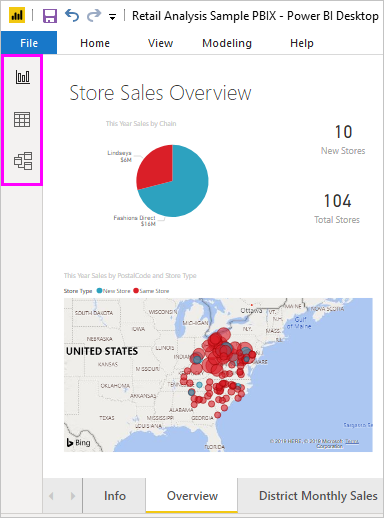
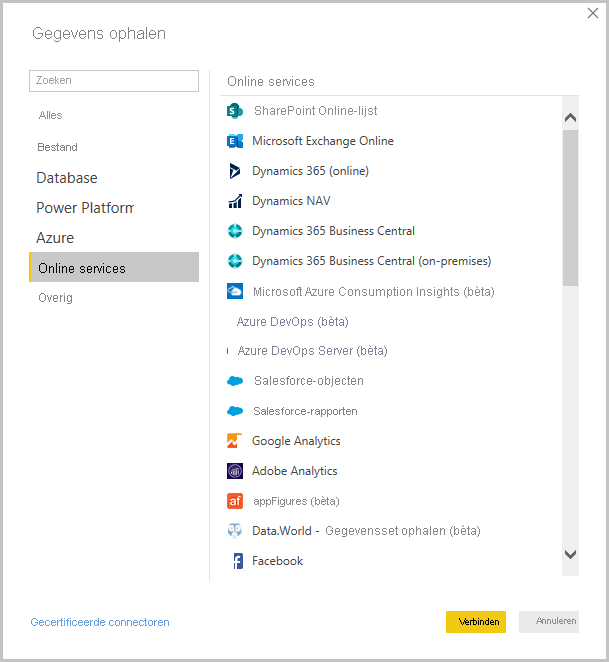
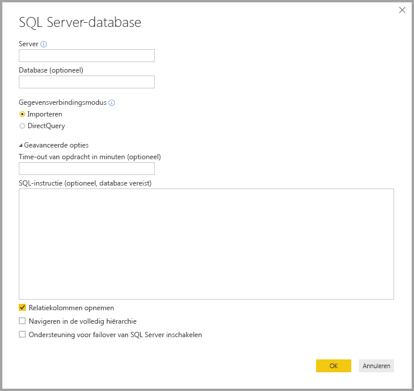
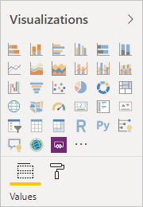
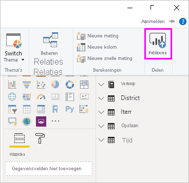

# Wat is Power BI Desktop?

*Power BI Desktop* is een gratis toepassing die u op uw lokale computer installeert en waarmee u verbinding kunt maken met gegevens, gegevens kunt transformeren en gegevens kunt visualiseren. Met Power BI Desktop kunt u verbinding maken met tal van gegevensbronnen en deze in een gegevensmodel combineren. Dit wordt vaak *modellering* genoemd. Met dit gegevensmodel kunt u visuals en verzamelingen van visuals maken die u als rapporten kunt delen met andere personen in uw organisatie. De meeste gebruikers die aan business intelligence-projecten werken, gebruiken Power BI Desktop om rapporten maken en gebruiken vervolgens de *Power BI-service* om hun rapporten met anderen te delen.

Power BI Desktop wordt het meest gebruikt voor de volgende taken:

* Verbinding maken met gegevens
* Deze gegevens transformeren en opschonen om een gegevensmodel te maken
* Visuals maken, zoals diagrammen en grafieken, die de gegevens visueel weergeven
* Rapporten (van een of meer rapportpagina's) maken die verzamelingen zijn van visuals
* Rapporten delen met anderen behulp van de Power BI-service

De personen die meestal verantwoordelijk zijn voor dergelijke taken, worden ook wel *gegevensanalisten* (of *analisten*) of business intelligence-professionals, (ook wel *makers van rapporten*) genoemd. Veel personen die zichzelf niet als analist of maker van rapporten zien, gebruiken Power BI Desktop echter om aantrekkelijke rapporten te maken, of om gegevens op te halen uit diverse bronnen en vervolgens gegevensmodellen te maken, die ze met hun collega's en organisaties kunnen delen.

> [!IMPORTANT]
> Power BI Desktop wordt maandelijks bijgewerkt en uitgebracht, waarin de feedback van klanten en nieuwe functies zijn verwerkt. Alleen de meest recente versie van Power BI Desktop wordt ondersteund. Klanten die contact opnemen met de ondersteuning voor Power BI Desktop, wordt gevraagd om een upgrade naar de meest recente versie uit te voeren. U kunt de meest recente versie van Power BI Desktop ophalen uit de [Windows Store](https://aka.ms/pbidesktopstore) of als één uitvoerbaar bestand met alle ondersteunde talen die u [downloadt](https://www.microsoft.com/download/details.aspx?id=58494) en op uw computer installeert.

Er zijn drie weergaven in Power BI Desktop, die u kunt selecteren aan de linkerkant van het canvas. Het betreft deze weergaven, beschreven in de volgorde waarin u ze worden weergegeven:
* **Rapport**: in deze weergave maakt u rapporten en visuals, en dit is de plek waar u alle maakbewerkingen uitvoert.
* **Gegevens**: in deze weergave ziet u de tabellen, metingen en andere gegevens die worden gebruikt in het gegevensmodel dat aan het rapport is gekoppeld, en kunt u de gegevens transformeren voor het beste gebruik in het rapportmodel.
* **Model**: in deze weergave ziet en beheert u de relaties tussen tabellen in uw gegevensmodel.

In de volgende afbeelding ziet u de drie weergaven, zoals deze worden weergegeven aan de linkerkant van het canvas:

 

## Verbinding maken met gegevens
Als u aan de slag wilt met Power BI Desktop moet u eerst verbinding maken met gegevens. Via Power BI Desktop kunt u verbinding maken met allerlei gegevensbronnen. 

Verbinding maken met gegevens:

1. Selecteer in het lint **Start** de optie **Gegevens ophalen** > **Meer**. 

   In het venster **Gegevens ophalen** dat wordt weergegeven, worden de vele categorieën weergegeven waarmee u in Power BI Desktop verbinding kunt maken.

   

2. Wanneer u een gegevenstype selecteert, wordt u gevraagd om gegevens (zoals de URL en de referenties) in te voeren die in Power BI Desktop nodig zijn om namens u verbinding te kunnen maken met de gegevensbron.

   

3. Wanneer u verbinding maakt met een of meer gegevensbronnen, wilt u de gegevens wellicht transformeren, zodat ze nuttig voor u zijn.

## Gegevens transformeren en opschonen, en een model maken

In Power BI Desktop kunt u gegevens opschonen en transformeren met behulp van de ingebouwde [Power Query-editor](../transform-model/desktop-query-overview.md). Met Power Query-editor kunt u wijzigingen aanbrengen in uw gegevens. Zo kunt u het gegevenstype wijzigen, kolommen verwijderen of gegevens uit meerdere bronnen combineren. U kunt dit proces vergelijken met beeldhouwen: u kunt beginnen met een groot blok klei, of gegevens en vervolgens kleine delen afschaven of juist toevoegen, totdat de gewenste vorm ontstaat. 

U start Power Query-editor als volgt:

- Selecteer **Query's bewerken** > **Query's bewerken** in het lint **Start**.

   Het venster **Power Query-editor** wordt weergegeven.

   

Elke stap die u uitvoert voor het transformeren van gegevens (zoals het wijzigen van de naam van een tabel, het transformeren van een gegevenstype of het verwijderen van een kolom), wordt vastgelegd door Power Query-editor. Steeds wanneer deze query verbinding maakt met de gegevensbron, worden die stappen uitgevoerd zodat de gegevens altijd op de door u opgegeven manier worden vormgegeven.

In de volgende afbeelding ziet u het deelvenster **Power Query-editor** voor een query die is vormgegeven en is omgezet in een model.

 

Als de gegevens op de gewenste manier zijn vormgegeven, kunt u visuals maken. 

## Visuals maken 

Zodra u een gegevensmodel hebt, kunt u *velden* naar het rapportcanvas slepen om *visuals* te maken. Een visual is een grafische weergave van de gegevens in het model. Er zijn veel verschillende typen visuals waaruit u kunt kiezen in Power BI Desktop. Met de volgende visual wordt een eenvoudig kolomdiagram aangegeven. 

Een visual maken of wijzigen: 

- Selecteer in het deelvenster **Visualisaties** het pictogram van de visual. 

   

   Als u al een visual op het rapportcanvas hebt geselecteerd, verandert de geselecteerde visual in het type dat u hebt geselecteerd. 

   Als u geen visual op het canvas hebt geselecteerd, wordt op basis van de selectie een nieuwe visual gemaakt.

## Rapporten maken

Het komt vaker voor dat u een verzameling met visuals wilt maken waarmee verschillende aspecten worden weergegeven van de gegevens op basis waarvan u het model in Power BI Desktop gemaakt. Een verzameling met visuals in één Power BI Desktop-bestand wordt een *rapport* genoemd. Een rapport kan uit een of meer pagina's bestaan, net zoals een Excel-bestand uit een of meer werkbladen kan bestaan.

Met Power BI Desktop kunt u complexe en visueel rijke rapporten maken van gegevens uit meerdere bronnen, die u allemaal in één rapport kunt opnemen dat u vervolgens kunt delen met anderen in uw organisatie.

In de volgende afbeelding ziet u de eerste pagina van een Power BI Desktop-rapport met de naam **Overzicht**, zoals dat wordt weergegeven op het tabblad onderaan de afbeelding. 

## Rapporten delen

Zodra het rapport met anderen kan worden gedeeld, kunt u het rapport *publiceren* naar de Power BI-service en het beschikbaar maken voor iedereen in uw organisatie die een licentie heeft voor Power BI. 

Een Power BI Desktop-rapport publiceren: 

1. Selecteer de optie **Publiceren** in het lint **Start**.

   

   In Power BI Desktop maakt u verbinding met de Power BI-service met uw Power BI-account. 

2. U wordt gevraagd om te selecteren op welke plek in de Power BI-service u het rapport wilt delen, zoals uw werkruimte, een teamwerkruimte of een andere locatie in de Power BI-service. 

   U moet over een licentie voor Power BI beschikken om rapporten te delen met de Power BI-service.

## Volgende stappen

Als u aan de slag wilt met Power BI Desktop moet u eerst de toepassing downloaden en installeren. U kunt Power BI Desktop op twee manieren downloaden:

* [Power BI Desktop downloaden vanuit de Windows Store](https://aka.ms/pbidesktopstore)
* [Power BI Desktop downloaden via het web](https://www.microsoft.com/download/details.aspx?id=58494)