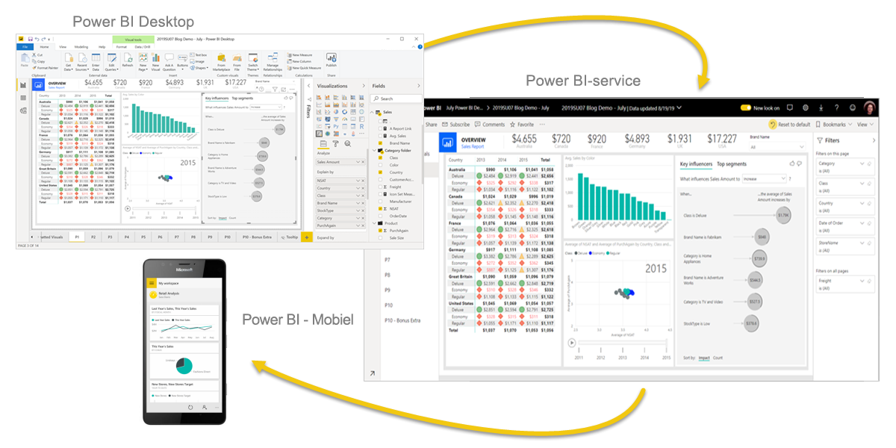
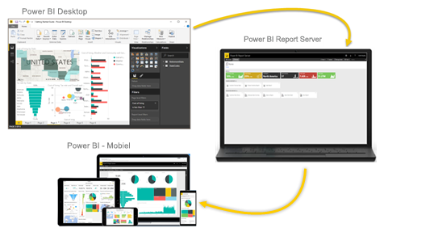

# Wat is Power BI?
**Power BI** bestaat uit een verzameling softwareservices, apps en connectors die samenwerken om uw niet-gerelateerde gegevensbronnen om te zetten in coherente, visueel aantrekkelijke en interactieve inzichten. Uw gegevens kunnen bestaan uit een Excel-werkblad, maar ook uit een verzameling op de cloud gebaseerde en on-premises hybride datawarehouses. Met Power BI kunt u eenvoudig verbinding maken met uw gegevensbronnen, gegevens visualiseren en ontdekken wat belangrijk is, en dat delen met wie u maar wilt.

## De onderdelen van Power BI
Power BI bestaat uit verschillende elementen die alle samenwerken, te beginnen met de volgende drie basisprincipes: 
- Een Windows Desktop-toepassing met de naam **Power BI Desktop**.
- Een online SaaS (*Software as a Service*) met de naam **Power BI-service**. 
- **Mobiele Power BI-apps** voor Windows-, iOS- en Android-apparaten.

Deze drie elementen, &mdash;Power BI Desktop, de service en de mobiele apps&mdash;, zijn ontworpen om u zakelijke inzichten te laten maken, delen en gebruiken op een manier die optimaal aansluit bij u en uw rol.

Naast die drie beschikt Power BI ook over twee andere elementen:

- **Power BI Report Builder**, voor het maken van gepagineerde rapporten die u in de Power BI-service wilt delen. Meer informatie over [gepagineerde rapporten](#paginated-reports-in-the-power-bi-service) vindt u verderop in dit artikel.
- **Power BI Report Server**, een on-premises rapportserver waar u uw Power BI-rapporten kunt publiceren nadat u ze in Power BI Desktop hebt gemaakt. Lees verderop in dit artikel meer over [Power BI Report Server](#on-premises-reporting-with-power-bi-report-server).

## Hoe Power BI aansluit bij uw rol
Hoe u Power BI gebruikt, is mogelijk afhankelijk van uw rol in een project of een team. Andere personen (eventueel met andere rollen) kunnen Power BI op een andere manier gebruiken.

Het kan bijvoorbeeld zijn dat u de **Power BI-service** voornamelijk gebruikt om rapporten en dashboards weer te geven. Uw collega die alle cijfers in zakelijk rapporten verwerkt, kan intensief gebruikmaken van **Power BI Desktop** of **Power BI Report Builder** om rapporten te maken en deze vervolgens in de Power BI-service te publiceren, waar u ze bekijkt. Weer een andere collega op de verkoopafdeling gebruikt mogelijk vooral de **Power BI-telefoon-app** om de verkoopquota bij te houden en detailgegevens van nieuwe verkoopleads weer te geven.

Als u een ontwikkelaar bent, kunt u Power BI API's gebruiken om gegevens naar gegevenssets te pushen of om dashboards en rapporten in te sluiten in uw eigen aangepaste toepassingen. Hebt u een idee voor een nieuwe visualisatie? Bouw de visualisatie zelf en deel deze met anderen.  

Het is ook mogelijk dat u bepaalde elementen van Power BI op verschillende momenten gebruikt, afhankelijk van uw doelen of uw rol in een bepaald project.

U kunt uw gebruik van Power BI laten afhangen van de functies en services in Power BI die het beste bij uw situatie aansluiten. U kunt Power BI Desktop bijvoorbeeld gebruiken om rapporten met statistieken over klantcontacten voor uw eigen team te maken en u kunt de voorraadontwikkeling en productievoortgang in de gaten houden via een realtime dashboard in de Power BI-service. U kunt een gepagineerd rapport van verzendbare facturen maken op basis van een Power BI-gegevensset. Elk onderdeel van Power BI staat tot uw beschikking: daarom is deze oplossing zo flexibel en overtuigend.

Bekijk documenten die betrekking hebben op uw rol:
- Power BI voor [*zakelijke gebruikers*](../consumer/end-user-consumer.md)
- Power BI Desktop voor [*rapportmakers*](desktop-what-is-desktop.md)
- Power BI Report Builder voor [*zakelijke rapportmakers*](../paginated-reports/paginated-reports-report-builder-power-bi.md)
- Power BI voor [*beheerders*](../admin/service-admin-administering-power-bi-in-your-organization.md)
- Power BI voor *ontwikkelaars*
    * [Ingesloten analysen met Power BI](../developer/embedded/embedding.md)
    * [Wat is Power BI Embedded in Azure?](../developer/embedded/azure-pbie-what-is-power-bi-embedded.md)
    * [Visuals in Power BI](../developer/visuals/power-bi-custom-visuals.md)
    * [Wat kunnen ontwikkelaars doen met de Power BI-API?](../developer/automation/overview-of-power-bi-rest-api.md)

## De werkstroom in Power BI
Een gangbare werkstroom in Power BI begint met het maken van verbinding met gegevensbronnen in Power BI Desktop en het compileren van een rapport. Vervolgens publiceert u dit rapport vanuit Power BI Desktop in de Power BI-service en deelt u het, zodat zakelijke gebruikers in de Power BI-service en op mobiele apparaten het rapport kunnen bekijken en gebruiken.

Deze workflow is zeer gangbaar en laat zien hoe de drie belangrijkste Power BI-elementen elkaar aanvullen.

Hier volgt een gedetailleerde [vergelijking van Power BI Desktop en de Power BI-service](../fundamentals/service-service-vs-desktop.md).

## Gepagineerde rapporten in de Power BI-service

Een andere werkstroom omvat gepagineerde rapporten in de Power BI-service. Zakelijke rapportmakers ontwerpen gepagineerde rapporten die moeten worden afgedrukt of gedeeld. Ze kunnen deze rapporten ook delen in de Power BI-service. Ze worden *gepagineerd* genoemd, omdat ze zo zijn opgemaakt dat ze op een pagina passen. Ze worden vaak gebruikt voor operationele rapporten of voor het afdrukken van formulieren zoals facturen of transcripten. Alle gegevens worden in een tabel weergegeven, zelfs als de tabel meerdere pagina's omvat. De Power BI Report Builder is het zelfstandige hulpprogramma voor het maken van gepagineerde rapporten.

:::image type="content" source="media/power-bi-overview/paginated-report-invoice-power-bi-service.png" alt-text="Schermopname van een gepagineerd rapport in de Power BI-service.":::

Lees meer over [gepagineerd rapporten](../paginated-reports/paginated-reports-report-builder-power-bi.md) in de Power BI-service.

## On-premises rapportage met Power BI Report Server

Wat moet u doen als u uw rapporten on-premises wilt houden, achter een firewall?  Lees verder.

U kunt Power BI-rapporten maken, implementeren en beheren in Power BI Desktop, en gepagineerde rapporten in Report Builder met de kant-en-klare hulpprogramma's en services van Power BI Report Server.

Power BI Report Server is een oplossing die u implementeert achter de firewall. Vervolgens kunt u uw rapporten op verschillende manieren aanbieden aan de juiste gebruikers, zoals weergegeven in een webbrowser, op een mobiel apparaat of als een e-mailbericht. En omdat Power BI Report Server compatibel is met Power BI in de cloud, kunt u uw inhoud naar de cloud verplaatsen op het moment dat u er klaar voor bent. 

Lees hier meer over [Power BI Report Server](../report-server/get-started.md).

## Volgende stappen
- [Snelstart: Kennismaken met de Power BI-service](../consumer/end-user-experience.md)   
- [Zelfstudie: Aan de slag met de Power BI-service](service-get-started.md)
- [Snelstart: verbinding maken met gegevens in Power BI Desktop](../connect-data/desktop-quickstart-connect-to-data.md)
