# Basisconcepten voor ontwerpers in de Power BI-service

Het doel van dit artikel is om u wegwijs te maken in de Power BI-service: wat zijn de verschillende elementen, hoe werken deze samen en hoe kunt u ermee werken? In dit artikel wordt ervan uitgegaan dat u [zich al hebt aangemeld voor de Power BI-service](service-self-service-signup-for-power-bi.md) en [enkele gegevens hebt toegevoegd](../connect-data/service-get-data.md). Als ontwerper begint uw workflow doorgaans met het maken van rapporten in Power BI Desktop. Vervolgens publiceert u deze in de Power BI-service, waar u ze verder kunt aanpassen. In de Power BI-service maakt u ook de dashboards op basis van uw rapporten. 

Voor dit artikel geldt: als u nog geen eigen rapporten hebt, kunt een van de [voorbeelden voor Power BI](../create-reports/sample-datasets.md) installeren.

Wanneer u de Power BI-service in een browser opent, start u bij het startscherm. Dit zijn de elementen die u mogelijk te zien krijgt:

1. Navigatiedeelvenster
2. Startprogramma voor apps van Microsoft 365
3. Knop voor de startpagina van Power BI
4. Pictogramknoppen, inclusief instellingen, help en feedback
5. Zoekvak
6. Favoriete en frequente dashboards, rapporten en werkruimten
7. Recente dashboards, rapporten en werkruimten
8. Uw werkruimten

U en de eindgebruikers van uw rapporten en dashboards hebben dezelfde startervaring in de Power BI-service in een browser.

Meer informatie over deze functies volgt later, maar laten we eerst enkele concepten van Power BI bekijken. Of bekijk eerst deze video.  In de video bespreekt Will de basisconcepten aan de hand van een rondleiding door de Power BI-service.

<iframe width="560" height="315" src="https://www.youtube.com/embed/B2vd4MQrz4M" frameborder="0" allowfullscreen></iframe>

## Power BI-concepten
De vijf primaire bouwstenen van Power BI zijn: *dashboards*, *rapporten*, *werkmappen*, *gegevenssets* en *gegevensstromen*. Ze zijn allemaal ingedeeld in *werkruimten* en ze zijn gemaakt op *capaciteiten*.  Het is belangrijk om te begrijpen hoe capaciteiten en werkruimten werken voordat we ons verdiepen in de vijf bouwstenen. Laten we dus bij het begin beginnen.

## Capaciteiten
Capaciteiten zijn een kernconcept van Power BI en vertegenwoordigen een aantal resources (opslag, processor en geheugen) die wordt gebruikt om uw Power BI-inhoud te hosten en te leveren. Capaciteiten worden _gedeeld_ of zijn _toegewezen_. Een gedeelde capaciteit wordt gedeeld met andere Microsoft-klanten, terwijl een toegewezen capaciteit volledig voor één klant is bestemd. Voor toegewezen capaciteiten is een [abonnement ](../admin/service-premium-what-is.md) vereist. Ze worden volledig beschreven in het artikel [Premium-capaciteiten beheren](../admin/service-premium-capacity-manage.md).

Werkruimten worden standaard op een gedeelte capaciteit gemaakt. Met gedeelde capaciteit worden workloads uitgevoerd via rekenresources die met andere klanten worden gedeeld. Omdat de capaciteit resources moet delen, worden er beperkingen opgelegd om ervoor te zorgen dat alles op een rechtvaardige basis gebeurt, bijvoorbeeld met de maximale modelgrootte (1 GB) en een maximale vernieuwingsfrequentie per dag (acht keer per dag).

## Werkruimten
Werkruimten worden gemaakt op capaciteiten. In wezen zijn het containers voor dashboards, rapporten, werkmappen, gegevenssets en gegevensstromen in Power BI.

Er zijn twee typen werkruimten: *Mijn werkruimte* en *werkruimten*.

- *Mijn werkruimte* is de persoonlijke werkruimte voor een klant van Power BI om met de eigen inhoud te kunnen werken. Alleen u hebt toegang tot uw Mijn werkruimte. U kunt dashboards en rapporten delen vanuit uw Mijn werkruimte. Als u wilt samenwerken aan dashboards en rapporten, of een app wilt maken, gaat u naar een werkruimte.

-  *Werkruimten* worden gebruikt om samen te werken en inhoud te delen met collega's. U kunt collega's toevoegen aan uw werkruimten en samenwerken aan dashboards, rapporten, werkmappen en gegevenssets. Op één uitzondering na hebben alle leden van de werkruimte Power BI Pro-licenties nodig. Lees hier meer over de [nieuwe werkruimten](../collaborate-share/service-create-the-new-workspaces.md). 

    Werkruimten zijn ook de plek om *apps* voor uw organisatie te maken, publiceren en beheren. U kunt werkruimten beschouwen als tijdelijke locaties en containers voor de inhoud die straks een Power BI-app zullen vormen. Wat is een *app* nu precies? Het is een verzameling dashboards en rapporten die is gebouwd om belangrijke metrische gegevens te leveren aan de Power BI-consumenten in uw organisatie. Apps zijn interactief, maar consumenten kunnen ze niet bewerken. App-consumenten, de collega's die toegang tot de apps hebben, hoeven niet per se over Pro-licenties te beschikken.  

Als u meer wilt weten over delen in het algemeen, leest u eerst [Manieren om dashboards te delen op uw werk](../collaborate-share/service-how-to-collaborate-distribute-dashboards-reports.md).

Laten we het nu hebben over vijf de bouwstenen van Power BI.

## Gegevensstromen
Een *gegevensstroom* helpt organisaties bij het combineren van gegevens uit verschillende bronnen. Ze zijn optioneel en worden vaak gebruikt in complexe of grotere projecten. Ze vertegenwoordigen gegevens die zijn voorbereid en gefaseerd voor gebruik door gegevenssets. Ze kunnen echter niet rechtstreeks als bron worden gebruikt voor rapportage. Ze maken gebruik van de uitgebreide verzameling Microsoft-gegevensconnectors, waarmee gegevens kunnen worden opgenomen vanuit on-premises gegevensbronnen en gegevensbronnen in de cloud.

Gegevensstromen worden alleen gemaakt en beheerd in werkruimten (maar niet *Mijn werkruimte*) en ze worden opgeslagen als entiteiten in het Common Data Model (CDM) in Azure Data Lake Storage Gen2. Meestal zijn ze gepland om periodiek te vernieuwen om actuele gegevens op te slaan. Ze zijn geweldig voor het voorbereiden van gegevens voor gebruik, en mogelijk hergebruik, door uw gegevenssets. Zie het artikel [Selfservice voor gegevensvoorbereiding in Power BI](../transform-model/dataflows/dataflows-introduction-self-service.md) voor meer informatie.

U kunt geen dashboards of rapporten maken zonder gegevens (u kunt uiteraard lege dashboards en rapporten maken, maar deze zijn pas bruikbaar wanneer ze gegevens bevatten). Laten nu we beginnen met **gegevenssets**.

## Gegevenssets
Een *gegevensset* is een verzameling gegevens die u *importeert* of waar u *verbinding* mee maakt. Met Power BI kunt u diverse soorten gegevenssets importeren of hier verbinding mee maken en alle gegevens samen te brengen op één locatie. Gegevenssets kunnen ook gegevens halen uit gegevensstromen.

Gegevenssets zijn gekoppeld aan *werkruimten* en één gegevensset kan deel uitmaken van veel werkruimten. Wanneer u een werkruimte opent, worden de bijbehorende gegevenssets vermeld op het tabblad **Gegevenssets**. Elke vermelde gegevensset vertegenwoordigt één bron van gegevens, bijvoorbeeld een Excel-werkmap in OneDrive, een on-premises SSAS-gegevensset in tabelvorm of een Salesforce-gegevensset. Er worden diverse verschillende gegevensbronnen ondersteund en er worden voortdurend nieuwe bronnen toegevoegd. Raadpleeg de lijst met [typen gegevenssets die u kunt gebruiken met Power BI](../connect-data/service-get-data.md).

In het onderstaande voorbeeld heb ik de werkruimte 'Verkoop en marketing' geselecteerd en op het tabblad **Gegevenssets** geklikt.

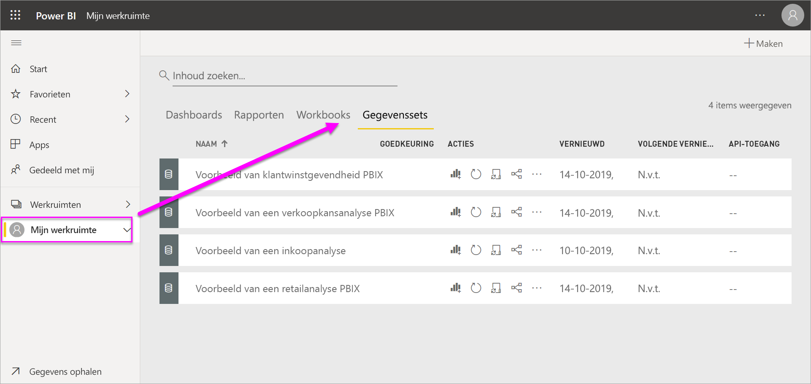

**Eén** dataset

* kan herhaaldelijk worden gebruikt in een of in veel werkruimten.
* kan worden in tal van verschillende rapporten.
* De visualisatie uit die ene gegevensset kunnen worden weergegeven op een groot aantal verschillende dashboards.

  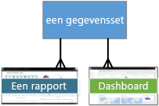

Als u [verbinding met een gegevensset wilt maken of een gegevensset wilt importeren](../connect-data/service-get-data.md), selecteert u **Gegevens ophalen** onderaan het navigatiedeelvenster. Volg de instructies om verbinding te maken met de specifieke bron of om deze te importeren en de gegevensset aan de actieve werkruimte toe te voegen. Nieuwe gegevenssets zijn gemarkeerd met een geel sterretje. Uw werkzaamheden in Power BI zijn niet van invloed op de onderliggende gegevensset. Deze blijft ongewijzigd.

Gegevenssets die worden toegevoegd door een lid van de werkruimte zijn beschikbaar voor andere leden van de werkruimte die de rol *Beheerder*, *Lid* of *Inzender* hebben.

U kunt gegevenssets vernieuwen, een andere naam geven, verkennen en verwijderen. U kunt een gegevensset gebruiken om een nieuw rapport maken of door [snelle inzichten](../create-reports/service-insights.md) uit te voeren.  Als u wilt zien welke rapporten en dashboards al een gegevensset gebruiken, selecteert u **Verwante items weergeven**. Selecteer een gegevensset om deze te verkennen In werkelijkheid opent de gegevensset in de rapporteditor, waar u de gegevens echt kunt verkennen door visualisaties te maken.

Laten we doorgaan met het volgende onderwerp: rapporten.

### Dieper graven
* [Gegevenssets in de Power BI-service](../connect-data/service-datasets-understand.md)
* [Gegevenssetmodi in de Power BI-service](../connect-data/service-dataset-modes-understand.md)
* [Wat is Power BI Premium?](../admin/service-premium-what-is.md)
* [Gegevens ophalen voor Power BI](../connect-data/service-get-data.md)
* [Voorbeeldgegevenssets voor Power BI](../create-reports/sample-datasets.md)

## Rapporten
Een Power BI-rapport bestaat uit een of meer pagina’s met visualisaties zoals lijndiagrammen, toewijzingen en treemaps. Visualisaties worden ook wel **_visuals_** genoemd. Alle visualisaties in een rapport zijn afkomstig uit één gegevensset. U kunt compleet nieuwe rapporten maken in Power BI, rapporten importeren met dashboards die collega's met u hebben gedeeld, maar u kunt ze ook laten maken door Power BI wanneer u verbinding maakt met gegevenssets vanuit Excel, Power BI Desktop, databases en SaaS-toepassingen.  Als u bijvoorbeeld verbinding maakt met een Excel-werkmap die Power View-werkbladen bevat, wordt er een rapport in Power BI gemaakt op basis van die werkbladen. En als u verbinding met een SaaS-toepassing maakt, wordt er een vooraf samengestelde rapport in Power BI geïmporteerd.

Er zijn twee modi om rapporten weer te geven en om met rapporten te werken: de *leesweergave* en de *bewerkweergave*. Wanneer u een rapport opent, wordt het geopend in de leesweergave. Als u machtigingen voor bewerken hebt, ziet u in de linkerbovenhoek de optie **Rapport bewerken** en kunt u het rapport openen in de bewerkweergave.  Als een rapport zich in een werkruimte bevindt , kan iedereen met de rol *Beheerder*, *Lid* of *Inzender* het rapport bewerken. De personen hebben dan toegang tot alle functies voor het verkennen, ontwerpen, bouwen en delen van de bewerkweergave voor dat rapport. De personen met wie ze het rapport delen, kunnen het rapport verkennen en gebruiken in de leesweergave.

Wanneer u een werkruimte opent, worden de bijbehorende rapporten vermeld op het tabblad **Rapporten**. Elk rapport dat wordt vermeld, vertegenwoordigt een of meer pagina's met visualisaties die zijn gebaseerd op een van de onderliggende gegevenssets. Selecteer een rapport om dit te openen.

Wanneer u een app opent, krijgt u een dashboard te zien.  Voor toegang tot een onderliggend rapport selecteert u een dashboardtegel (later meer over tegels) die vanuit een rapport is vastgemaakt. Houd er rekening mee dat niet alle tegels vanuit rapporten zijn vastgemaakt. Mogelijk moet u dus op een aantal tegels klikken om een rapport te vinden.

Het rapport wordt standaard geopend in de leesweergave.  Selecteer **Rapport bewerken** om het rapport te openen in bewerkweergave (als u over de benodigde machtigingen beschikt).

In het onderstaande voorbeeld heb ik de werkruimte 'Verkoop en marketing' geselecteerd en op het tabblad **Rapporten** geklikt.

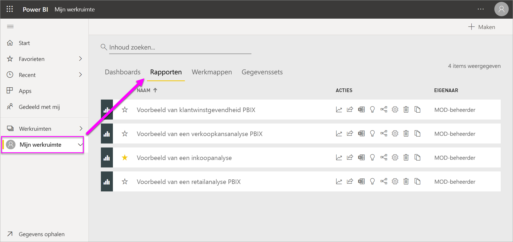

**Eén** rapport

* is opgenomen in één werkruimte.
* kan worden gekoppeld aan meerdere dashboards in die werkruimte. Tegels die zijn vastgemaakt vanuit dat rapport, kunnen worden weergegeven in meerdere dashboards.
* kan worden gemaakt van gegevens uit één gegevensset. Power BI Desktop kan meer dan één gegevensbron combineren in één gegevensset in een rapport en dat rapport kan worden geïmporteerd in Power BI.

  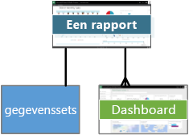

### Dieper graven
- [Een rapport in de Power BI-service maken door een gegevensset te importeren](../create-reports/service-report-create-new.md)
- [Rapporten optimaliseren voor de mobiele Power BI-apps](../create-reports/desktop-create-phone-report.md)

## Dashboards
Een *dashboard* is een element dat u maakt **in de Power BI-service** of dat een collega maakt **in de Power BI-service** en met u deelt. Het dashboard bestaat uit één canvas dat nul of meer tegels en widgets bevat. Elke tegel die vanuit een rapport of vanuit [Q&A](../consumer/end-user-q-and-a.md) is vastgemaakt, geeft één [visualisatie](../visuals/power-bi-report-visualizations.md) weer die is gemaakt van een gegevensset en die is vastgemaakt aan het dashboard. Volledige rapportpagina's kunnen ook als één tegel worden vastgemaakt aan een dashboard. Er zijn tal van manieren om tegels aan uw dashboard toe te voegen. Teveel om in dit overzichtsonderwerp te bespreken. Zie [Dashboardtegels in Power BI](../create-reports/service-dashboard-tiles.md) voor meer informatie.

Waarom zou ik dashboards willen maken?  Hier volgen slechts enkele van de redenen:

* U kunt in één oogopslag alle benodigde informatie weergeven om een beslissing te nemen.
* U kunt de belangrijkste informatie over uw bedrijf bewaken.
* U kunt er met dashboards voor zorgen dat alle collega's hetzelfde voor ogen hebben en allemaal dezelfde informatie zien en gebruiken.
* U kunt met dashboards de status van een bedrijf, product, afdelingen of marketingcampagne, enzovoort in de gaten houden.
* U kunt een gepersonaliseerde weergave van een groter dashboard maken met alle metrische gegevens die voor u belangrijk zijn.

Wanneer u een werkruimte opent, worden de bijbehorende dashboards vermeld op het tabblad **Dashboards**. Selecteer een dashboard om het te openen. Wanneer u een app opent, krijgt u een dashboard te zien.  Elk dashboard vertegenwoordigt een aangepaste weergave of een subset van de onderliggende gegevensset(s).  Als u de eigenaar van het dashboard bent, hebt u ook bewerktoegang tot de onderliggende gegevensset(s) en rapporten.  Als het dashboard met u is gedeeld, kunt u interactief met het dashboard en eventuele onderliggende rapporten werken, maar u kunt geen wijzigingen opslaan.

Er zijn veel verschillende manieren waarop u of een collega [een dashboard kan delen](../collaborate-share/service-share-dashboards.md). U hebt Power BI Pro nodig om dashboard te kunnen delen, maar mogelijk ook om een gedeeld dashboard weer te geven.

**Eén** dashboard

* is gekoppeld aan één werkruimte
* kan visualisaties weergeven uit diverse gegevenssets,
* uit verschillende rapporten en
* kan visualisaties weergeven die zijn vastgemaakt vanuit andere hulpprogramma's (bijvoorbeeld Excel)

  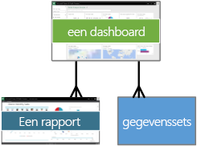

### Dieper graven
* [Maak een leeg dashboard en haal vervolgens een aantal gegevens op](../create-reports/service-dashboard-create.md).
* [Een dashboard dupliceren](../create-reports/service-dashboard-copy.md)
* [Een telefoonweergave van een dashboard maken](../create-reports/service-create-dashboard-mobile-phone-view.md)

## Werkmappen
Werkmappen zijn een speciaal type gegevensset. Als u het bovenstaande gedeelte over **gegevenssets** hebt gelezen, weet u vrijwel alles wat u over werkmappen moet weten. Maar u vraagt zich misschien af waarom Power BI een Excel-werkmap in sommige gevallen als een **gegevensset** en op andere momenten als een **werkmap** classificeert.

Als u de optie **Gegevens ophalen** gebruikt met Excel-bestanden, hebt u de mogelijkheid om het bestand te *Importeren* of om *verbinding te maken* met het bestand. Wanneer u de optie Verbinden kiest, wordt uw werkmap weergegeven in Power BI, precies zoals in Excel Online. Maar anders dan in Excel Online hebt u een aantal handige functies waarmee u elementen uit uw werkbladen direct aan uw dashboards kunt vastmaken.

U kunt uw werkmap niet in Power BI bewerken. Maar als u wijzigingen wilt aanbrengen, kunt u op Bewerken klikken en uw werkmap vervolgens bewerken in Excel Online of openen in Excel op uw computer. Eventuele wijzigingen worden opgeslagen in de werkmap op OneDrive.

### Dieper graven
* [Gegevens ophalen uit Excel-werkmappen](../connect-data/service-excel-workbook-files.md)
* [Vanuit Excel publiceren naar Power BI](../connect-data/service-publish-from-excel.md)

## Een dashboard in Mijn werkruimte
We hebben werkruimten en bouwstenen besproken. Laten we nu alle onderdelen van de dashboardervaring in de Power BI-service combineren en controleren.

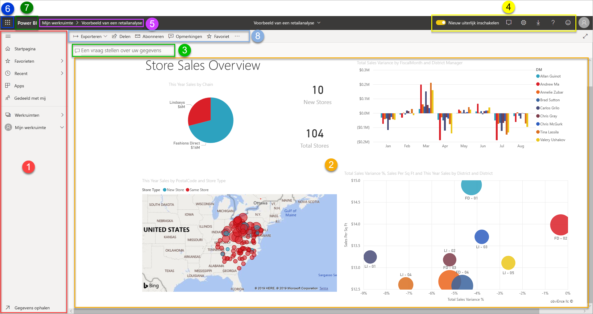

### 1. **Navigatiedeelvenster**
Gebruik het navigatiedeelvenster om werkruimten te zoeken en tussen werkruimten en de Power BI-bouwblokken te schakelen: dashboards, rapporten, werkboeken en gegevenssets.  

  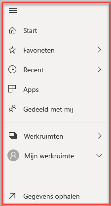

* Selecteer **Gegevens ophalen** om [gegevenssets, rapporten en dashboards toe te voegen aan Power BI](../connect-data/service-get-data.md).
* U kunt het navigatiedeelvenster uitvouwen of samenvouwen met dit pictogram .
* Open of beheer uw favoriete inhoud door **Favorieten** te selecteren.
* Bekijk en open de laatst bezochte inhoud door **Recent** te selecteren.
* Bekijk, open of verwijder een app door **Apps** te selecteren.
* Heeft een collega inhoud met u gedeeld? Selecteer **Gedeeld met mij** om die inhoud te zoeken en te sorteren om te vinden wat u nodig hebt.
* Toon en open uw werkruimten door **Werkruimten** te selecteren.

Klik éénmaal op deze elementen:

* op een pictogram of kop om in de inhoudsweergave te openen
* op een pijl naar rechts (>) om een uitvouwmenu te openen voor Favorieten, Recent en Werkruimten.
* op een dubbele punthaak om de doorbladerbare lijst **Mijn werkruimte** met dashboards, rapporten, werkboeken en gegevenssets weer te geven.

### 2. **Canvas**
Omdat we een dashboard hebben geopend, worden in het tekengebied visualisatietegels weergegeven. Als we bijvoorbeeld de rapporteditor hadden geopend, zou in het tekengebied een rapportpagina worden weergegeven.

Dashboards bestaan uit [tegels](../create-reports/service-dashboard-tiles.md).  Tegels worden gemaakt in een rapport in de bewerkweergave, in Q&A of in andere dashboards en kunnen worden vastgemaakt vanuit Excel, SSRS en meer. Een speciaal type tegel, een [widget](../create-reports/service-dashboard-add-widget.md), wordt rechtstreeks aan het dashboard toegevoegd. De tegels die worden weergegeven op een dashboard, daar bewust neergezet door een maker of eigenaar van een rapport.  De bewerking waarmee een tegel wordt toegevoegd aan een dashboard, noemen we *vastmaken*.

Zie [Dashboards](#dashboards) (hierboven) voor meer informatie.

### 3. **Q&A-vragenvak**
U kunt uw gegevens onder andere verkennen door vragen te stellen die door Power BI Q&A worden beantwoord de vorm van een visualisatie. Met Q&A kunt u inhoud aan een dashboard of rapport toevoegen.

U zoekt met Q&A naar antwoorden in een of meer gegevenssets die zijn verbonden met het dashboard.  Een verbonden gegevensset is een gegevensset waarvoor ten minste één tegel is vastgemaakt aan het desbetreffende dashboard.

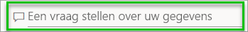

Zodra u een vraag begint te typen, wordt u door Q&A omgeleid naar Q&A-pagina. Terwijl u typt, helpt Q&A u de juiste vraag te stellen en het antwoord te zoeken met herformuleringen, automatisch doorvoeren en suggesties. Wanneer u een gewenste visualisatie (antwoord) hebt gevonden, kunt u deze vastmaken aan uw dashboard. Zie [Q&A in Power BI](../consumer/end-user-q-and-a.md) voor meer informatie.

### 4. **Pictogrammen in de zwarte koptekstbalk**
De pictogrammen in de rechterbovenhoek zijn uw resources voor instellingen, meldingen, downloads, hulp en feedback aan het Power BI-team.  

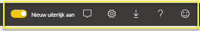

### 5. **Dashboardtitel** (navigatiepad, oftewel ‘breadcrumbs’)
Het is niet altijd gemakkelijk te achterhalen welke werkruimte en welk dashboard actief zijn, dus Power BI maakt een navigatiepad voor u.  In dit voorbeeld ziet u de werkruimte (Mijn werkruimte) en de titel van het dashboard (Voorbeeld van een retailanalyse).  Als we een rapport hebben geopend, wordt de naam van het rapport aan het einde van het navigatiepad toegevoegd.  Elke sectie van het pad is een actieve hyperlink.  

Let op het pictogram 'C' na de titel van het dashboard. Dit dashboard bevat de [gegevensclassificatietag](../create-reports/service-data-classification.md) ‘Vertrouwelijk’. De tag identificeert de gevoeligheid en het beveiligingsniveau van de gegevens. Als uw beheerder gegevensclassificatie heeft ingeschakeld, beschikt elk dashboard over een standaardtagset. Dashboardeigenaren moeten de tag wijzigen zodat deze overeenkomt met het goede beveiligingsniveau van hun dashboard.

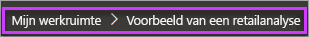

### 6. **Startprogramma voor apps van Microsoft 365**
Met het startprogramma voor apps zijn al uw Microsoft 365-apps met één klik beschikbaar. Hier kunt u snel uw e-mail, documenten, agenda enzovoort openen.

### 7. **Power BI-startknop**
Als u **Power BI** selecteert, keert u terug naar de Power BI-startpagina.

   

### 8. **Pictogrammen met een label in de grijze menubalk**
Dit gedeelte van het scherm bevat aanvullende opties voor interactie met de inhoud (in dit geval met het dashboard).  Als u het beletselteken naast de zichtbare gelabelde pictogrammen selecteert, worden er met **Meer opties (...)** onder andere opties weergegeven waarmee u het dashboard kunt dupliceren, afdrukken en vernieuwen.

   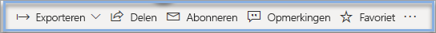

## Volgende stappen
- [Wat is Power BI?](power-bi-overview.md)  
- [Power BI-video's](videos.md)  
- [De rapporteditor... Een rondleiding](../create-reports/service-the-report-editor-take-a-tour.md)
- Hebt u nog vragen? [Misschien dat de Power BI-community het antwoord weet](https://community.powerbi.com/)