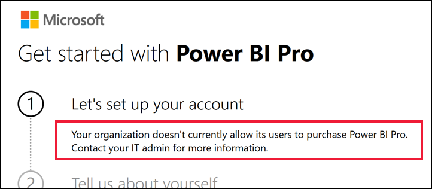

# Wat u moet doen als de aankoop van Power BI Pro is uitgeschakeld

U hebt geprobeerd om Power BI Pro te kopen en een bericht ontvangen dat uw organisatie haar gebruikers zoiets niet toestaat. Om verschillende redenen blokkeren sommige organisaties de mogelijkheid voor leden om Power BI Pro via self-service aan te schaffen.  Uw organisatie kan bijvoorbeeld een beleid hebben dat alle licenties en abonnementen worden beheerd door een gecentraliseerde IT-afdeling of helpdesk. 

## Oplossing
Neem na voltooiing van uw aankoop contact op met uw IT-afdeling of helpdesk en vraag deze om [deze instructies te volgen om u een licentie te verstrekken](../admin/service-admin-manage-licenses.md).

## Volgende stappen
[Power BI-functies op licentietype](service-features-license-type.md)