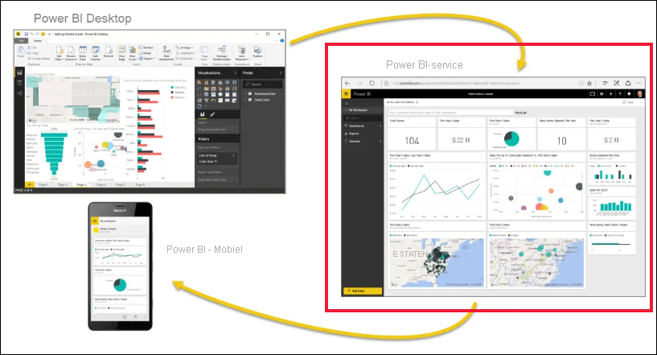
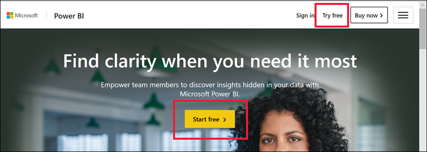
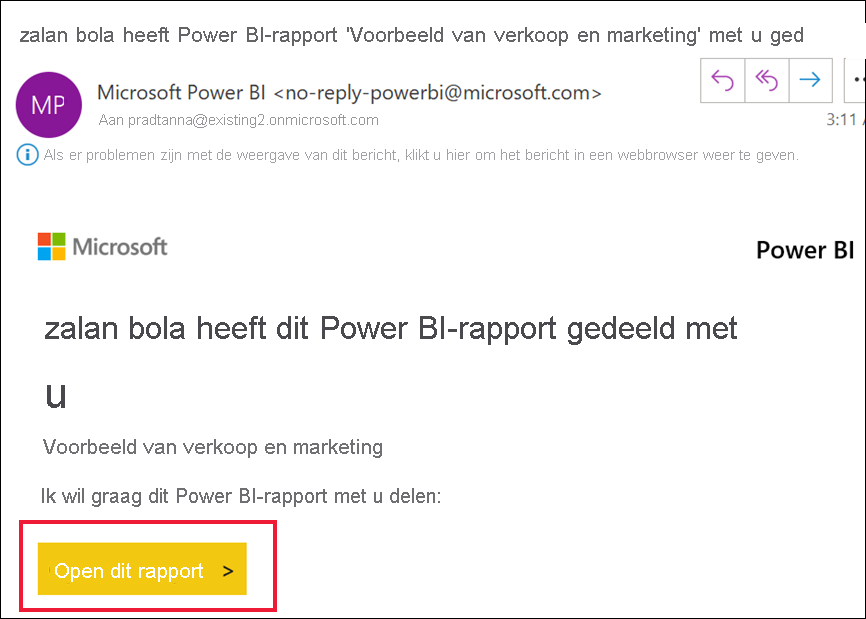
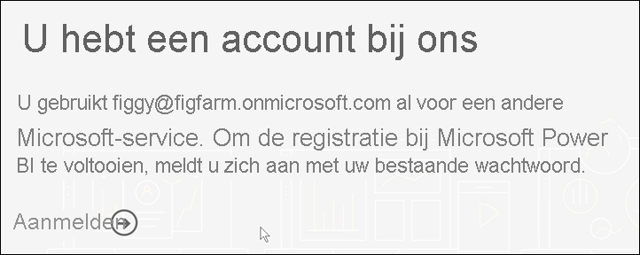
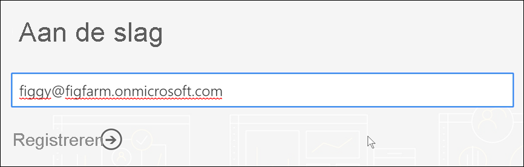
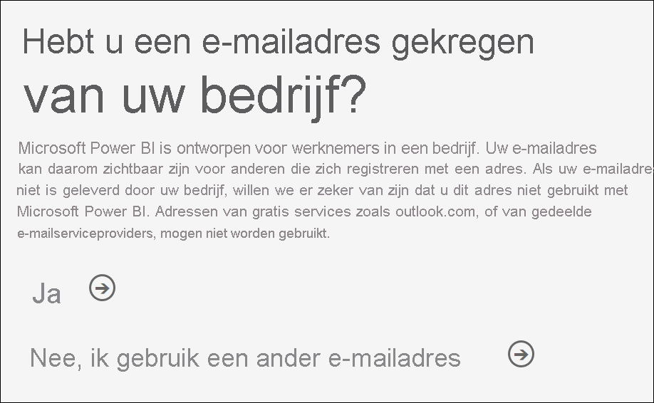
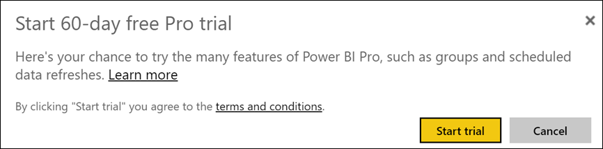

# Registreren voor de Power BI-service als zelfstandige gebruiker

Power BI kan uw persoonlijk hulpprogramma voor gegevensanalyse en -visualisatie vormen, maar ook de oplossing zijn voor analyse en besluitvorming voor groepsprojecten, afdelingen en complete bedrijven. In dit artikel wordt uitgelegd hoe u zich als afzonderlijke gebruiker kunt registreren voor Power BI. Zie [Power BI-licenties in uw organisatie](../admin/service-admin-licensing-organization.md) als u een globale beheerder of factureringsbeheerder bent.

## Wat is Power BI?
Power BI is een uniform self-service business intelligence-platform voor bedrijven dat een intuïtieve gebruikerservaring combineert met intelligente gegevensvisualisaties om meer inzicht te krijgen in de gegevens. Rapporten kunnen worden gedeeld in Microsoft-hulpprogramma's zoals Teams, SharePoint, PowerPoint of in andere productiviteitsproducten. Het wordt aangeboden als een online SaaS-aanbieding (software als een service) met twee begeleidende toepassingen: een Microsoft Windows-bureaubladtoepassing met de naam Power BI Desktop voor het maken van rapporten en systeemeigen mobiele BI-apps voor het gebruik van rapporten op iOS-en Android-apparaten. 

Deze drie elementen, Desktop, de service en de mobiele apps, zijn ontworpen om mensen zakelijke inzichten op te laten doen, deze te delen en te gebruiken op een manier die optimaal aansluit bij hun behoeften of rol.

## Registreren voor de Power BI-service
In dit artikel worden de stappen beschreven voor registratie voor de **Power BI-service** als zelfstandige gebruiker. Als u hulp nodig hebt bij het downloaden van Power BI Desktop of het installeren van de mobiele apps, raadpleegt u de volgende artikelen:
- [Power BI Desktop (volledig gratis te downloaden)](desktop-get-the-desktop.md)    
- [Mobiele Power BI-apps (volledig gratis te downloaden)](../consumer/mobile/mobile-apps-for-mobile-devices.md)

## Ondersteunde e-mailadressen

Voordat u het aanmeldingsproces start, is het belangrijk dat u begrijpt welke typen e-mailadressen u kunt gebruiken om zich te registreren voor Power BI:

* Voor registratie bij Power BI dient u een e-mailadres van uw werk of school te gebruiken. U kunt zich niet registreren met e-mailadressen die worden geleverd door e-mailservices voor consumenten of door telecomproviders. Het betreft onder andere deze e-mailadressen: outlook.com, hotmail.com en gmail.com. Ontdek, als u geen werk- of school account hebt, [alternatieve manieren om u te registreren.](../admin/service-admin-signing-up-for-power-bi-with-a-new-office-365-trial.md)

* U kunt zich registreren voor Power BI met gov- of mil-adressen, maar hiervoor geldt een ander proces. Zie [Uw Amerikaanse overheidsorganisatie registreren in Power BI-service](../admin/service-govus-signup.md) voor meer informatie.

## Aanmelden voor de Power BI-service

Volg deze stappen om u te registreren voor een Power BI-account. Nadat u dit proces hebt voltooid, beschikt u over een gratis Power BI-licentie, die u kunt gebruiken om de Power BI-service zelfstandig te proberen via Mijn werkruimte, om inhoud te gebruiken uit een Power BI-werkruimte die is toegewezen aan een Power BI Premium-capaciteit of om een persoonlijke Power BI Pro-proefversie te starten. Zie [Power BI Free vs Pro](service-features-license-type.md) voor meer informatie. 

De exacte stappen voor het registreren kunnen variëren, afhankelijk van uw organisatie en waarop u klikt om het proces te starten. Daarom is het mogelijk dat niet alle onderstaande schermen worden weergegeven. Er zijn veel verschillende manieren om u te registreren voor de Power BI-service als zelfstandige gebruiker. De stappen in dit artikel zijn van toepassing op de twee meest voorkomende.      
- u selecteert de knop **Gratis proberen** of **Gratis beginnen**1.     
- u ontvangt een e-mail met een koppeling naar een Power BI-dashboard, -rapport of -app. U hebt zich nog niet aangemeld bij uw Power BI-account.

    1U vindt de knoppen van het type **Gratis proberen** op powerbi.microsoft.com, in gerelateerde Microsoft-producten en in documentatie- en marketingartikelen.

### Stap 1

- Selecteer **Gratis beginnen** of **Gratis proberen** op [powerbi.microsoft.com](https://powerbi.com). Mogelijk moet u twee keer een knop selecteren.

        

- U kunt ook een e-mail met een koppeling naar een Power BI-dashboard, -rapport of -app selecteren.

        

1. Microsoft 365 detecteert u en registreert dat er al een Microsoft-service voor u is geïnstalleerd. Selecteer **Aanmelden**.

        
    
1. Mogelijk wordt een van deze dialoogvensters weergegeven. 
    - Als u hierom wordt gevraagd, meldt u zich aan met het account van uw organisatie.

            

    - Controleer, als u een dergelijk bericht krijgt, of u een werk- of school-e-mailadres gebruikt en niet een consumentadres zoals Hotmail, Gmail of Outlook. Zie [bovenstaande ondersteunde e-mailadressen.](#supported-email-addresses)

       
   
    - Als u een dergelijk bericht krijgt, moet u de voorwaarden doornemen. Als u akkoord gaat, selecteert u **Start**. 

        

1. U kunt ook enkele collega's uitnodigen om met u mee te doen.

       

1. Op dit punt moet u mogelijk wachten, indien Microsoft [een nieuwe tenant instelt](../admin/service-admin-signing-up-for-power-bi-with-a-new-office-365-trial.md). Zo niet, dan wordt de Power BI-service in uw browser geopend.

        

## Registreren voor een afzonderlijke proefversie van Power BI Pro
U hebt zich voor de eerste keer aangemeld bij uw Power BI-account. U hebt nu een gratis licentie2. Wanneer u begint met het verkennen van de Power BI-service, ziet u pop-ups waarin u wordt gevraagd of u wilt upgraden naar een afzonderlijke proefversie van Power BI Pro. [Voor sommige functies van de Power BI-service is een Pro-licentie](../consumer/end-user-license.md) vereist. Als u een afzonderlijke gratis 60-daagse proefversie van Power BI Pro wilt starten, selecteert u **Proefversie starten**.  

    

2 In sommige organisaties kan uw standaard Power BI-account een Power BI **Pro**-licentie zijn. Sommige versies van Microsoft 365 bevatten bijvoorbeeld een Power BI Pro-licentie. Zie [Welke licentie heb ik?](../consumer/end-user-license.md) voor meer informatie over het opzoeken van uw gebruikerslicentie.

## Vervaldatum van de proefversie

Wanneer uw gratis proefversie van Power BI Pro verloopt, wordt uw licentie teruggezet naar een (gratis) Power BI-licentie. De proefversie kan niet worden verlengd. U hebt niet langer toegang tot functies waarvoor een Power BI Pro-licentie is vereist. Zie [Functies per licentietype](service-features-license-type.md) voor meer informatie.    

Als een (gratis) Power BI-licentie voldoende is, hoeft u niets anders te doen. Als u gebruik wilt maken van Power BI Pro-functies, koopt u een Pro-licentie door **Nu kopen** te selecteren of door naar [Prijzen van Power BI](https://powerbi.microsoft.com/pricing) te gaan.

      

Als de self-service aankoop niet beschikbaar is, neemt u contact op met uw beheerder over het aanschaffen van een Power BI Pro-licentie.

## Problemen met het registratieproces oplossen

In de meeste gevallen kunt u zich registreren voor Power BI door het beschreven proces te volgen. In de volgende tabel staan enkele problemen waardoor u zich mogelijk niet kunt aanmelden, met mogelijke tijdelijke oplossingen.

| Symptoom/foutbericht | Oorzaak en tijdelijke oplossing |
| ----------------------- | -------------------- |
| <strong>Persoonlijke e-mailadressen (bijvoorbeeld nancy@gmail.com)</strong> U ziet tijdens het aanmelden een bericht dat vergelijkbaar is met het volgende:    *U hebt een persoonlijke e-mailadres ingevoerd: Voer uw zakelijke e-mailadres in, zodat we uw bedrijfsgegevens veilig kunnen opslaan.*    of    *Dat ziet eruit als een persoonlijke e-mailadres. Voer uw zakelijke e-mailadres in zodat we u kunnen koppelen aan anderen in uw bedrijf. En u hoeft zich geen zorgen te maken. We delen uw adres met niemand.* | Power BI biedt geen ondersteuning voor e-mailadressen die worden geleverd via e-mailservices voor consumenten, of die afkomstig zijn van telecomproviders.    U kunt de registratie alsnog proberen te voltooien door een e-mailadres te gebruiken dat is toegewezen door uw werk of school.    Als u zich nog steeds niet kunt registreren en u er geen bezwaar tegen hebt om een meer geavanceerde registratie te voltooien, kunt u zich [registreren voor een nieuw proefabonnement op Office 365 en gebruikt u dat e-mailadres voor de registratie](../admin/service-admin-signing-up-for-power-bi-with-a-new-office-365-trial.md).    U kunt ook zich ook door een bestaande gebruiker [als gast laten uitnodigen](../admin/service-admin-azure-ad-b2b.md). |
| **Aanmelding via selfservice uitgeschakeld**: U ziet bij het aanmelden een bericht dat vergelijkbaar is met het volgende:    *De registratie kan niet worden voltooid. Uw IT-afdeling heeft registratie voor Microsoft Power BI uitgeschakeld. Neem contact met ze op om de registratie te voltooien.*    | De [globale beheerder](https://docs.microsoft.com/azure/active-directory/users-groups-roles/directory-assign-admin-roles.md) van uw organisatie heeft registratie via selfservice voor Power BI uitgeschakeld.    Neem contact op met uw globale beheerder en vraag deze om [de instructies te volgen om registratie in te schakelen](../admin/service-admin-disable-self-service.md).    Dit probleem kan ook optreden als u zich via een partner hebt geregistreerd voor Microsoft 365. In dat geval neemt u contact op met de organisatie die verantwoordelijk is voor het leveren van Microsoft 365. |
| **E-mailadres is geen Microsoft 365-id** U ziet bij de registratie een bericht dat vergelijkbaar is met het volgende:    *We kunnen u niet vinden op contoso.com.  Gebruikt u een andere id op het werk of school?   Probeer u met die id aan te melden en als dat niet lukt, neemt u contact op met uw IT-afdeling.* | Uw organisatie gebruikt id's voor aanmelding bij Microsoft 365 en andere Microsoft-services die verschillen van uw e-mailadres.  Bijvoorbeeld: uw e-mailadres is Nancy.Smith@contoso.com, maar uw id is nancys@contoso.com.    Gebruik de id die uw organisatie aan u heeft toegewezen voor aanmelding bij Microsoft 365 of andere Microsoft-services om uw registratie te voltooien.  Als u niet weet wat dit is, kunt u contact opnemen met uw Globale beheerder.    Als u zich nog steeds niet kunt registreren en u er geen bezwaar tegen hebt om een meer geavanceerde registratie te voltooien, kunt u zich [registreren voor een nieuw proefabonnement op Office 365 en gebruikt u dat e-mailadres voor de registratie](../admin/service-admin-signing-up-for-power-bi-with-a-new-office-365-trial.md). |
Uw wachtwoord wordt niet herkend wanneer u zich aanmeldt bij Power BI  |  Soms moet u het een paar keer proberen. Als u het wachtwoord meerdere keren hebt geprobeerd en u zich nog steeds niet kunt aanmelden, kunt u uw browser uitvoeren in de modus Incognito (Chrome) of InPrivate (Edge).

## Volgende stappen

[Power BI-functies op licentietype](../consumer/end-user-features.md)    
[Tips voor het vinden van Help](../fundamentals/service-tips-for-finding-help.md)    

Hebt u nog vragen? [Misschien dat de Power BI-community het antwoord weet](https://community.powerbi.com/)
