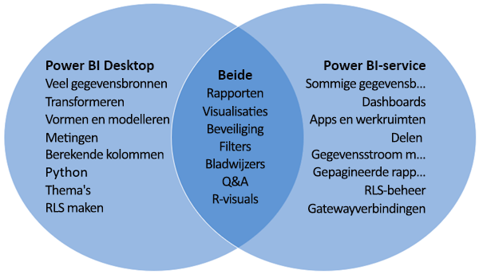

# Power BI Desktop en de Power BI-service vergelijken

In een Venn-diagram waarin de Power BI Desktop en de Power BI-service worden vergeleken, ziet u in het midden waar de twee overlappen. Bepaalde taken kunt u ofwel in Power BI Desktop of in de service uitvoeren. De twee zijden van het Venn-diagram tonen de kenmerken die uniek zijn voor de toepassing en de service.  

**Power BI Desktop** is een volledig hulpprogramma voor gegevensanalyse en het maken van rapporten dat u installeert voor gratis toepassing op uw lokale computer. Hierin is de Query-editor inbegrepen, waarmee u verbinding kunt maken met tal van gegevensbronnen en deze in een gegevensmodel kunt combineren (dit wordt vaak modellering genoemd). Vervolgens ontwerpt u een rapport op basis van dat gegevensmodel. In de [introductiehandleiding voor Power BI Desktop](desktop-getting-started.md) wordt het proces uitgelegd.

De **Power BI-service** is een cloudgebaseerde service. Het biedt ondersteuning voor lichte rapportbewerkingen en samenwerking tussen teams en organisaties. In de Power BI-service kunt u ook verbinding maken met gegevensbronnen, maar modellering is dan beperkt. 

De meeste rapportontwerpers die aan business intelligence-projecten werken, gebruiken **Power BI Desktop** om rapporten te maken en gebruiken vervolgens de **Power BI-service** om hun rapporten naar anderen te distribueren.

## Rapporten bewerken

In zowel de toepassing als de service maakt en bewerkt u *rapporten*. Een rapport kan een of meer pagina’s hebben, met visuals en verzamelingen met visuals. U kunt bladwijzers, knoppen, filters en drillthroughs toevoegen om de navigatie in uw rapporten te verbeteren.

De rapporteditors in Power BI Desktop en in de service zijn vergelijkbaar. Ze bestaan uit drie delen:  

1. De bovenste navigatievensters (deze zijn verschillend in Power BI Desktop en de service)    
2. Het rapportcanvas     
3. De deelvensters **Velden**, **Visualisaties** en **Filters**

Deze video toont de rapporteditor in Power BI Desktop. 

<iframe width="560" height="315" src="https://www.youtube.com/embed/IkJda4O7oGs" frameborder="0" allowfullscreen></iframe>

## Werken in de Power BI-service

### Samenwerken

Nadat u uw rapporten hebt gemaakt, kunt u deze opslaan naar een *werkruimte* in de **Power BI-service**, waarin u en uw collega’s samenwerken. U bouwt *dashboards* bovenop die rapporten. Vervolgens deelt u die dashboards en rapporten met gebruikers van rapporten in en buiten uw organisatie. De gebruikers van uw rapporten bekijken ze in de Power BI-service in de *leesweergave*, niet de bewerkingsweergave. Ze hebben geen toegang tot alle functies die beschikbaar zijn voor de makers van rapporten.  U kunt ook uw gegevenssets delen en anderen hun eigen rapporten laten opstellen op basis daarvan. Lees meer over [samenwerken in de Power BI-service](../collaborate-share/service-new-workspaces.md).

### Selfservice voor gegevensvoorbereiding met gegevensstromen

Met gegevensstromen kunnen organisaties gegevens uit verschillende bronnen samenvoegen en voorbereiden voor modellering. Analisten kunnen gemakkelijk gegevensstromen maken met bekende selfservicehulpprogramma's. Analisten gebruiken gegevensstromen voor het opnemen, transformeren, integreren en verrijken van big data door het definiëren van gegevensbronverbindingen, ETL-logica, vernieuwingsschema's en nog veel meer. Meer informatie over [selfservice voor gegevensvoorbereiding met gegevensstromen](../transform-model/service-dataflows-overview.md).

## Volgende stappen

[Wat is Power BI Desktop?](desktop-what-is-desktop.md)

[Een rapport maken](../create-reports/service-report-create-new.md) in de Power BI-service

[Basisconcepten voor rapportontwerpers](service-basic-concepts.md)

Hebt u nog vragen? [Misschien dat de Power BI-community het antwoord weet](https://community.powerbi.com/)
