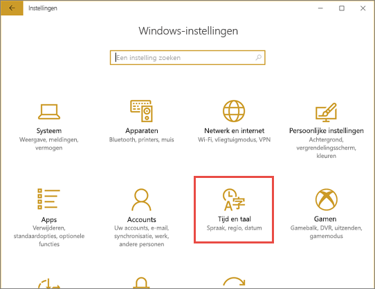
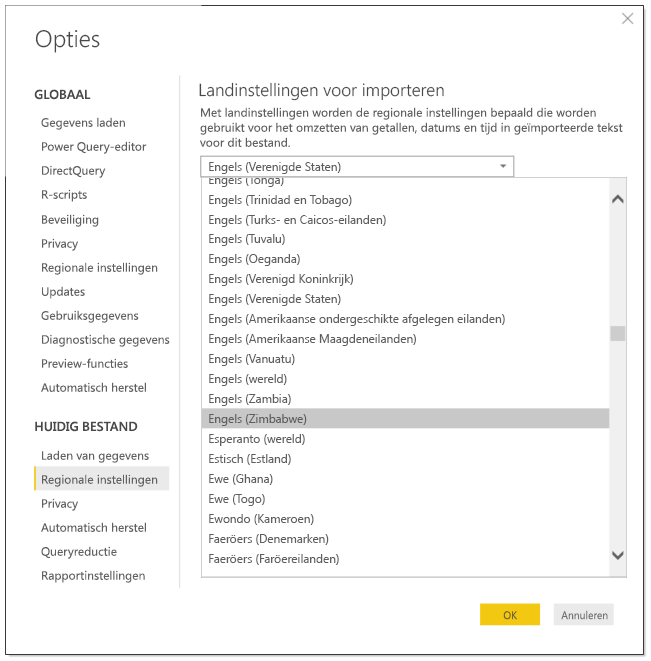
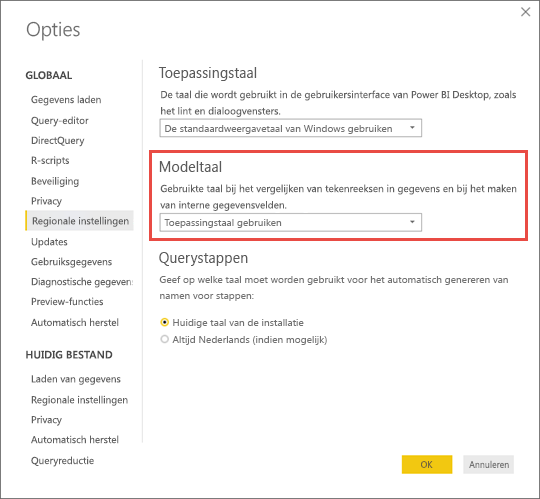

# Ondersteunde talen en landen/regio's voor Power BI

In dit artikel worden de ondersteunde talen en landen/regio's voor de documentatie van de Power BI-service, Power BI Desktop en Power BI behandeld.

## Landen en regio's waar Power BI beschikbaar is
Zie de [internationale beschikbaarheidslijst](https://products.office.com/business/international-availability) voor een overzicht met de landen en regio's waar Power BI beschikbaar is. 

## Talen voor de Power BI-service
De Power BI-service (in de browser) is beschikbaar in de volgende 44 talen:

* Arabisch
* Baskisch - Basque
* Bulgaars - Български
* Catalaans - Català
* Vereenvoudigd Chinees - 中文(简体)
* Traditioneel Chinees - 中文(繁體)
* Kroatisch - hrvatski
* Tsjechisch - čeština
* Deens - dansk
* Nederlands - Nederlands
* Engels - English
* Estlands - Eesti
* Fins - Suomi
* Frans - Français
* Galicisch - galego
* Duits - Deutsch
* Grieks - Ελληνικά
* Hebreeuws
* Hindi - हिंदी
* Hongaars - Magyar
* Indonesisch - Bahasa Indonesia
* Italiaans - italiano
* Japans - 日本語
* Kazachstaans - Қазақ
* Koreaans - 한국어
* Lets - Latviešu
* Litouws - Lietuvių
* Maleis - Bahasa Melayu
* Noors (Bokmål) - Norsk (Bokmål)
* Pools - Polski
* Portugees (Brazilië) - Português (Brasil)
* Portugees (Portugal) - Português (Portugal)
* Roemeens - Română
* Russisch - Русский
* Servisch (Cyrillisch) - српски
* Servisch (Latijns alfabet) - Srpski
* Slowaaks - slovenčina
* Sloveens - slovenski
* Spaans - español
* Zweeds - svenska
* Thais - ไทย
* Turks - Türkçe
* Oekraïens - українська
* Vietnamees - Tiếng Việt

## Talen voor Power BI Desktop
Power BI Desktop is beschikbaar in dezelfde talen als de Power BI-service, met uitzonde ring van Hebreeuws en Arabisch. Desktop biedt geen ondersteuning voor talen die van rechts naar links worden geschreven.

### Wat er is vertaald
In Power BI worden menu's, knoppen, berichten en andere elementen van de ervaring vertaald in uw eigen taal. In Power BI wordt bijvoorbeeld rapportinhoud omgezet, zoals automatisch gegenereerde titels, filters en knopinfo. Uw gegevens worden echter niet automatisch omgezet. In rapporten verandert de indeling van visuals niet als u gebruikmaakt van een taal die van rechts naar links wordt geschreven, zoals het Hebreeuws.

Op dit moment zijn een paar functies alleen in het Engels beschikbaar:

* Dashboards en rapporten die in Power BI worden gemaakt wanneer u verbinding maakt met services zoals Microsoft Dynamics CRM, Google Analytics en Salesforce. U kunt uw eigen dashboards en rapporten echter wel in uw eigen taal maken.
* Uw gegevens verkennen met Q&A.

Controleer regelmatig of er meer functies in uw taal beschikbaar zijn gekomen. Hier wordt aan gewerkt. 

### Uw taal kiezen in de Power BI-service
1. Selecteer in de Power BI-service scherm opname van het pictogram **instellingen**  > **Instellingen**.
2. Selecteer op het tabblad **Algemeen** de optie **taal**.
3. Gebruik de taal die al is ingesteld voor uw browser of selecteer een afzonderlijke taal voor de Power BI-service.  

### Uw taal in de browser kiezen
Power BI detecteert uw taal op basis van de taalvoorkeuren op uw computer. Waar en hoe u de voorkeuren wijzigt is afhankelijk van uw besturingssysteem en browser. U kunt deze voor keuren openen via micro soft Edge en Google Chrome.

#### Microsoft Edge
1. Selecteer de **instellingen en meer** weglatings tekens (...) in de rechter bovenhoek van het browser venster en kies **instellingen**.    
    

1. Selecteer het pictogram **instellingen** in de linkerbovenhoek van het browser venster en kies **talen**.
   
   

1. Selecteer de taal van uw voor keur.

#### Google Chrome (versie 87)
1. Selecteer de menu knop in de rechter bovenhoek van het browser venster en kies **instellingen**.
   
   
 
3. Vouw **Geavanceerd** uit en kies **talen**.

    

4. Selecteer **talen toevoegen** om een nieuwe taal toe te voegen.
   
   Mogelijk moet u de browser sluiten en opnieuw openen om de wijzigingen te zien.

## De taal of landinstellingen van Power BI Desktop kiezen
Er zijn twee manieren om Power BI Desktop te installeren: U kunt het downloaden als een zelfstandig installatieprogramma of het installeren vanuit de Windows Store. 

* Wanneer u Power BI Desktop installeert vanuit de Windows Store, worden alle talen (momenteel 42 talen) geïnstalleerd en wordt standaard de taal weer gegeven die overeenkomt met de standaard taal van Windows.
* Wanneer u Power BI Desktop downloadt als zelfstandig installatieprogramma, kiest u de standaardtaal wanneer u het installatieprogramma uitvoert. U kunt dit op een later tijdstip wijzigen.
* U kunt ook [een landinstelling kiezen die moet worden gebruikt wanneer u gegevens importeert](#choose-the-locale-for-importing-data-into-power-bi-desktop) voor een specifiek rapport.

> [!NOTE]
> Als u de versie van Power BI Desktop installeert die is geoptimaliseerd voor Power BI Report Server, kiest u de taal bij het downloaden. Zie [Power BI Desktop geoptimaliseerd voor Power BI Report Server](../report-server/install-powerbi-desktop.md) voor meer informatie.

### Kies een taal voor Power BI Desktop 
1. Installeer Power BI Desktop [vanuit de Windows Store](https://aka.ms/pbidesktopstore) of als een [zelfstandig installatieprogramma](https://aka.ms/pbiSingleInstaller).
2. Als u de taal wilt wijzigen, opent u bureau blad en selecteert u in de linkerbovenhoek opties voor **Bestands**  >  **Opties en instellingen**  >  .    

       

1. **Land instellingen** selecteren en uw taal voorkeuren instellen of wijzigen.

De taalondersteuning in Power BI Desktop is beperkt tot de talen die worden weergegeven in de vervolgkeuzelijst Toepassingstaal.

### Standaardnotatie van getallen en datums in Power BI Desktop controleren

Power BI Desktop neemt de standaardnotatie van getallen en datums over van de Windows-landinstellingen. U kunt deze instellingen zo nodig controleren of wijzigen.

1. Selecteer **Instellingen** in het Windows-menu

2. Selecteer **Tijd en taal** in **Windows-instellingen**.
   
     

3. Selecteer **Regio** > **Extra datum-, tijd- en landinstellingen**. Als u deze optie niet ziet, selecteert u **gegevens indelingen wijzigen** en vervolgens **gerelateerde instellingen**.

    :::image type="content" source="media/supported-languages-countries-regions/power-bi-service-region-settings.png" alt-text="Extra datum-, tijd- en landinstellingen":::

4. Selecteer in **Klok en regio** **Datum-, tijd- of getalnotaties wijzigen**.

    :::image type="content" source="media/supported-languages-countries-regions/power-bi-service-check-region-settings.png" alt-text="Klok- en land/regio-instellingen":::

5. Zorg ervoor dat **Aanpassen aan Windows-weergavetaal** is geselecteerd, of wijzig deze indien nodig.

    :::image type="content" source="media/supported-languages-countries-regions/power-bi-service-match-windows.png" alt-text="Aanpassen aan Windows-weergavetaal":::

### De landinstellingen kiezen voor het importeren van gegevens in Power BI Desktop
Of u Power BI Desktop downloadt of installeert via de Windows Store, u kunt voor een specifiek rapport een andere landinstelling kiezen dan de landinstelling in uw versie van Power BI Desktop. Op basis van de landinstelling worden gegevens anders door Power BI geïnterpreteerd wanneer deze uit uw gegevensbron worden geïmporteerd. Wordt 3/4/2017 bijvoorbeeld geïnterpreteerd als 3 april of 4 maart?

1. Ga in de Power BI Desktop naar **Bestand** > **Opties en instellingen** > **Opties**.
2. Selecteer onder **Huidig bestand** de optie **Landinstellingen**.
3. Selecteer in het vak **Landinstellingen voor importeren** een andere landinstelling. 
   
   
4. Selecteer **OK**.

### De taal voor het model in Power BI Desktop selecteren

Naast het instellen van de taal voor de Power BI Desktop-toepassing, kunt u ook de taal voor het model instellen. De taal voor het model is met name van invloed op twee dingen:

- Hoe we tekenreeksen vergelijken en sorteren. Turks heeft bijvoorbeeld 2 i’s. Deze kunnen, afhankelijk van de sortering van uw database, op verschillende plekken terechtkomen wanneer u de database sorteert. 
- De die taal Power BI Desktop gebruikt bij het maken van verborgen tabellen via datumvelden. Velden worden bijvoorbeeld Maand/Monat/Mois enzovoort genoemd.

> [!NOTE]
> Het model van Power BI gebruikt momenteel een landinstelling die niet hoofdlettergevoelig (of kana-gevoelig) is, zodat 'ABC' en 'abc' als hetzelfde worden gezien. Als 'ABC' eerst in de database is geladen, worden andere tekenreeksen waarvan alleen de lettergrootte verschilt, zoals 'Abc' niet als een afzonderlijke waarde geladen.
> 
>

Ga als volgt te werk om de taal voor het model in te stellen.

1. Ga in de Power BI Desktop naar **Bestand** > **Opties en instellingen** > **Opties**.
2. Selecteer **Regionale instellingen** onder **Globaal**.
3. Selecteer in het vak **Modeltaal** een andere taal. 

    

> [!NOTE]
> Als een Power BI-model is gemaakt, kan de taal ervan niet meer worden gewijzigd.
> 
>

## Talen voor de Help-documentatie
De Help is gelokaliseerd in de volgende tien talen: 

* Vereenvoudigd Chinees - 中文(简体)
* Traditioneel Chinees - 中文(繁體)
* Frans - français
* Duits - Deutsch
* Italiaans - Italiano
* Japans - 日本語
* Koreaans - 한국어
* Portugees (Brazilië) - Português (Brasil)
* Russisch - Русский
* Spaans - español

## Volgende stappen
* Gebruikt u een van de mobiele Power BI-apps? Zie [Ondersteunde talen in de mobiele Power BI-apps](../consumer/mobile/mobile-apps-supported-languages.md) voor meer informatie.
* Vragen? Misschien dat de[Power Bi-community](https://community.powerbi.com/) het antwoord weet.
* Nog steeds geen antwoord? Ga naar de [ondersteuningspagina van Power BI](https://powerbi.microsoft.com/support/).
