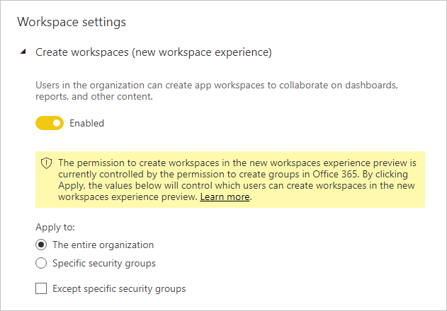

# Richtlijnen voor tenantinstellingen

Dit artikel is bedoeld voor Power BI-beheerders die verantwoordelijk zijn voor het instellen en configureren van de Power BI-omgeving in hun organisatie.

We geven richtlijnen voor specifieke tenantinstellingen waarmee u de Power BI-ervaring kunt verbeteren of die uw organisatie juist blootstellen aan risico's. We raden u aan uw tenant altijd zo te configureren dat deze is afgestemd op het beleid en de processen van uw organisatie.

[Tenantinstellingen](../admin/service-admin-portal.md#tenant-settings) worden beheerd in de [beheerportal](https://app.powerbi.com/admin-portal/tenantSettings) en kunnen worden geconfigureerd door een [Power BI-servicebeheerder](../admin/service-admin-administering-power-bi-in-your-organization.md#administrator-roles-related-to-power-bi). Veel tenantinstellingen kunnen mogelijkheden en functies beperken tot een beperkt aantal gebruikers. Daarom wordt u aangeraden eerst vertrouwd te raken met de instellingen om de beveiligingsgroepen te plannen die u nodig hebt. Het kan zijn dat u dezelfde beveiligingsgroep op meerdere instellingen kunt toepassen.

## De Power BI-ervaring verbeteren

### Help-informatie publiceren

We raden u aan interne sites met betrekking tot Power BI in te stellen met behulp van [Microsoft Teams](/microsoftteams) of een ander samenwerkingsplatform. Deze sites kunnen worden gebruikt voor het opslaan van trainingsdocumentatie, het hosten van discussies, het indienen van licentieaanvragen of het reageren op hulpverzoeken.

Als u dit doet, raden wij u aan om de instelling **Help-informatie publiceren** in te schakelen _voor de gehele organisatie_. Deze vindt u in de groep **Instellingen voor Help en ondersteuning**. U kunt URL's instellen voor uw:

- Trainingsdocumentatie
- Discussieforum
- Licentieaanvragen
- Helpdesk

Deze URL's worden beschikbaar als koppelingen in het menu Help van Power BI.

> [!NOTE]
> Door de URL voor de **Licentievereisten** op te geven voorkomt u dat individuele gebruikers een Power BI Pro-licentie kopen. In plaats hiervan worden ze naar uw interne site geleid met informatie over het verkrijgen van een licentie. De instelling **Gebruikers toestaan Power BI Pro uit te proberen** is standaard ingeschakeld, en zorgt voor een scheiding tussen de betaalde versie en de proefversie. Zie [Gebruikers toestaan Power BI Pro uit te proberen](../admin/service-admin-portal.md#allow-users-to-try-power-bi-pro) voor meer informatie over hoe deze instellingen werken.
>
>

Zie [Instellingen voor Help en ondersteuning](../admin/service-admin-portal.md#help-and-support-settings) voor meer informatie.

## beheer risico's.
De instellingen voor het beheren van risico's kunnen u helpen bij het vaststellen van governancebeleid in uw Power BI-tenant. Houd er echter rekening mee dat governance-instellingen geen beveiligingsmaatregel zijn. Als u bijvoorbeeld de instelling **Gegevens exporteren** uitschakelt, verwijdert u de functie uit de Gebruikersinterface van Power BI en helpt het op deze manier Power BI-gebruikers om te werken in overeenstemming met het governancebeleid van uw organisatie, maar het voorkomt niet dat bepaalde gebruikers gegevens exporteren met behulp van andere opties. Vanuit beveiligingsoogpunt heeft een Power BI-gebruiker met leestoegang tot een gegevensset de toestemming om deze gegevensset op te vragen en kan de resultaten behouden, ongeacht de functies die beschikbaar zijn in de Power BI-gebruikersinterface.
### E-mailmeldingen ontvangen voor serviceonderbrekingen of incidenten

U kunt een e-mailbericht ontvangen als uw tenant wordt beïnvloed door een serviceonderbreking of incident. Op deze manier kunt u proactief reageren op incidenten.

We raden u aan om de instelling **E-mailmeldingen ontvangen voor serviceonderbrekingen of incidenten** in te schakelen. Deze vindt u in de groep **Instellingen voor Help en ondersteuning**. Wijs een of meer beveiligingsgroepen met _e-mailfunctionaliteit_ toe.

### Gegevensbeveiliging

Met Gegevensbeveiliging kunnen beveiligingsinstellingen, zoals versleuteling of watermerken, worden afgedwongen bij het exporteren van gegevens uit de Power BI-service.

Er zijn twee tenantinstellingen die te maken hebben met gegevensbeveiliging. Beide instellingen zijn standaard uitgeschakeld voor de hele organisatie.

U wordt aangeraden deze instellingen in te schakelen wanneer u met gevoelige gegevens werkt en deze wilt beveiligen. Zie [Gegevensbescherming in Power BI](../admin/service-security-data-protection-overview.md) meer informatie.

### Werkruimten maken

U kunt instellen dat gebruikers geen werkruimten kunnen maken. Op deze manier kunt u bepalen wat er binnen uw organisatie wordt gemaakt.

> [!NOTE]
> Er is momenteel een overgangsperiode tussen de oude ervaring voor werkruimten en de nieuwe. Deze tenantinstelling is alleen van toepassing op de nieuwe ervaring.

De instelling **Werkruimten maken** is standaard ingeschakeld voor de hele organisatie. Deze vindt u in de groep **Instellingen voor werkruimte**.

U wordt aangeraden een of meer beveiligingsgroepen toe te wijzen. Aan deze groepen kan toestemming om werkruimten te maken, worden verleend _of geweigerd_.

Neem instructies op in uw documentatie zodat gebruikers (die geen rechten hebben voor het maken van een werkruimte) weten hoe ze een nieuwe werkruimte kunnen aanvragen.

### Inhoud delen met externe gebruikers

Gebruikers kunnen rapporten en dashboards delen met personen buiten uw organisatie.

De instelling **Inhoud delen met externe gebruikers** is standaard ingeschakeld voor de hele organisatie. Deze vindt u in de groep **Instellingen voor exporteren en delen**.

U wordt aangeraden een of meer beveiligingsgroepen toe te wijzen. Aan deze groepen kan toestemming om inhoud met externe gebruikers te delen, worden verleend _of geweigerd_.

### Publiceren op internet

Met de functie [Publiceren op internet](../collaborate-share/service-publish-to-web.md) kunt u openbare rapporten publiceren op internet. Als deze functie niet correct wordt gebruikt, is er een risico dat vertrouwelijke informatie op internet beschikbaar kan worden gemaakt.

De instelling **Publiceren op internet** is standaard ingeschakeld voor de hele organisatie, maar niet-beheerders kunnen geen invoegcodes maken. Deze vindt u in de groep **Instellingen voor exporteren en delen**.

Als deze instelling is ingeschakeld, wordt u aangeraden een of meer beveiligingsgroepen toe te wijzen. Aan deze groepen kan toestemming om rapporten te publiceren, worden verleend _of geweigerd_.

Daarnaast is er een optie om te kiezen hoe uw invoegcodes werken. Standaard is deze ingesteld op **Alleen bestaande codes toestaan**. Dit betekent dat gebruikers wordt gevraagd contact op te nemen met een Power BI-beheerder om een invoegcode te maken.

We raden u ook aan om regelmatig [invoegcodes voor publiceren op internet](https://app.powerbi.com/admin-portal/embedCodes) te controleren. Verwijder codes als ze resulteren in de publicatie van privé- of vertrouwelijke informatie.

### Gegevens exporteren

U kunt voorkomen dat gebruikers gegevens exporteren vanuit dashboardtegels of rapportvisuals.

De instelling **Gegevens exporteren** is standaard ingeschakeld voor de hele organisatie. Deze vindt u in de groep **Instellingen voor exporteren en delen**.

U wordt aangeraden een of meer beveiligingsgroepen toe te wijzen. Aan deze groepen kan toestemming om rapporten te publiceren, worden verleend _of geweigerd_.

> [!IMPORTANT]
> Als u deze instelling uitschakelt, wordt het gebruik van [Analyseren in Excel](../collaborate-share/service-analyze-in-excel.md) en de [liveverbinding](../connect-data/desktop-report-lifecycle-datasets.md#using-a-power-bi-service-live-connection-for-report-lifecycle-management) van de Power BI-service ook beperkt.

> [!NOTE]
> Als gebruikers andere gebruikers toestaan om gegevens te exporteren, kunt u een beveiligingslaag toevoegen door [gegevensbescherming](../admin/service-security-data-protection-overview.md) af te dwingen. Wanneer dit is geconfigureerd, kunnen ongeautoriseerde gebruikers geen inhoud met vertrouwelijkheidslabels exporteren.

### Externe gastgebruikers toestaan om inhoud in de organisatie te bewerken en te beheren

Het is mogelijk dat externe gastgebruikers Power BI-inhoud kunnen bewerken en beheren. Zie [Power BI-inhoud distribueren naar externe gastgebruikers met Azure AD B2B](../admin/service-admin-azure-ad-b2b.md) voor meer informatie.

De instelling **Externe gastgebruikers toestaan om inhoud in de organisatie te bewerken en te beheren** is standaard uitgeschakeld voor de hele organisatie. Deze vindt u in de groep **Instellingen voor exporteren en delen**.

Als u externe gebruikers toestemming wilt geven om inhoud te bewerken en te beheren, raden we u aan een of meer beveiligingsgroepen toe te wijzen. Aan deze groepen kan toestemming om rapporten te publiceren, worden verleend _of geweigerd_.

### Instellingen voor ontwikkelaars

Er zijn twee tenantinstellingen met betrekking tot het [insluiten van Power BI-inhoud](../developer/embedded/embedding.md). Dit zijn:

- Inhoud insluiten in apps (standaard ingeschakeld)
- Toestaan dat service-principals gebruikmaken van API's van Power BI (standaard uitgeschakeld)

Als u niet van plan bent de ontwikkelaar-API's te gebruiken voor het insluiten van inhoud, raden we u aan deze uit te schakelen. Op z'n minst moet u specifieke beveiligingsgroepen configureren die dit werk gaan doen.

## Volgende stappen

Bekijk de volgende resources voor meer informatie over dit artikel:

- [Wat is Power BI-beheer?](../admin/service-admin-administering-power-bi-in-your-organization.md)
- [Power BI beheren in de beheerportal](../admin/service-admin-portal.md)
- Vragen? [Misschien dat de Power BI-community het antwoord weet](https://community.powerbi.com/)
- Suggesties? [Ideeën bijdragen om Power BI te verbeteren](https://ideas.powerbi.com)