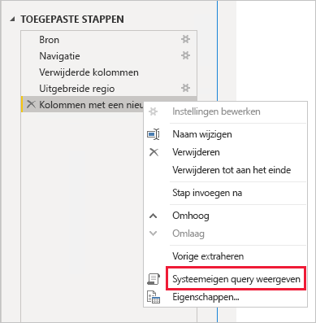
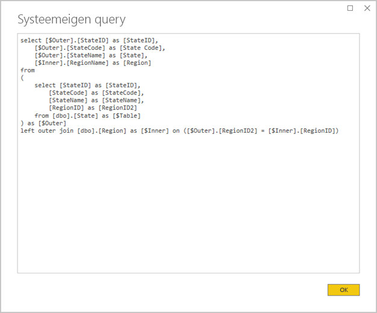
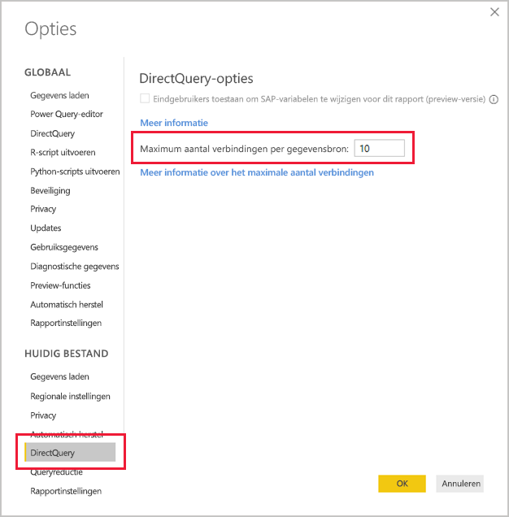
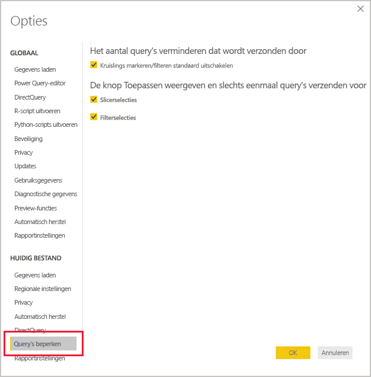
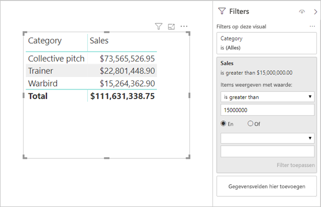

# <a name="directquery-model-guidance-in-power-bi-desktop"></a>Richtlijnen voor het DirectQuery-model in Power BI Desktop

Dit artikel is gericht op gegevensmodelleerders die Power BI DirectQuery-modellen ontwikkelen met behulp van Power BI Desktop of de Power BI-service. Hierin worden use cases, beperkingen en richtlijnen van DirectQuery beschreven. De richtlijnen zijn met name ontworpen om u te helpen bepalen of DirectQuery de juiste modus voor uw model is en om de prestaties van uw rapporten te verbeteren op basis van DirectQuery-modellen. Dit artikel is van toepassing op DirectQuery-modellen die worden gehost in de Power BI-service of Power BI Report Server.

Dit artikel is niet bedoeld om een volledige uitleg te geven over het ontwerpen van DirectQuery-modellen. Raadpleeg het artikel [DirectQuery-modellen in Power BI Desktop](../connect-data/desktop-directquery-about.md) voor een inleiding. Voor een uitgebreidere discussie gaat u rechtstreeks naar de whitepaper [DirectQuery in SQL Server 2016 Analysis Services](https://download.microsoft.com/download/F/6/F/F6FBC1FC-F956-49A1-80CD-2941C3B6E417/DirectQuery%20in%20Analysis%20Services%20-%20Whitepaper.pdf). Houd er rekening mee dat in de whitepaper het gebruik van DirectQuery in SQL Server Analysis Services wordt beschreven. Veel van de inhoud is echter nog steeds van toepassing op Power BI DirectQuery-modellen.

Samengestelde modellen worden niet specifiek in dit artikel behandeld. Een samengesteld model bestaat uit ten minste één DirectQuery-bron en mogelijk meer. De richtlijnen die in dit artikel worden beschreven, zijn nog steeds relevant, ten minste gedeeltelijk, voor het ontwerpen van samengestelde modellen. De gevolgen van het combineren van importtabellen met DirectQuery-tabellen vallen echter niet binnen het bereik van dit artikel. Zie [Samengestelde modellen in Power BI Desktop gebruiken](../transform-model/desktop-composite-models.md) voor meer informatie.

Het is belangrijk dat u begrijpt dat DirectQuery-modellen leiden tot een andere workload voor de Power BI-omgeving (Power BI-service of Power BI Report Server) en de onderliggende gegevensbronnen. Als u bepaalt dat DirectQuery de juiste ontwerpmethode is, raden we u aan de juiste personen bij het project te betrekken. We zien vaak dat een geslaagde implementatie van een DirectQuery-model het resultaat is van een team van IT-professionals die nauw samenwerken. Het team bestaat doorgaans uit modelontwikkelaars en de brondatabasebeheerders. Ook kunnen er gegevensarchitecten en datawarehouse- en ETL-ontwikkelaars bij betrokken zijn. Vaak moeten optimalisaties rechtstreeks op de gegevensbron worden toegepast om goede prestaties te krijgen.

## <a name="design-in-power-bi-desktop"></a>Ontwerpen in Power BI Desktop

Er kan rechtstreeks verbinding worden gemaakt met zowel Azure SQL Data Warehouse als Azure HDInsight Spark-gegevensbronnen, zonder Power BI Desktop te hoeven gebruiken. U kunt dit doen door in de Power BI-service achtereenvolgens Gegevens ophalen en de tegel Databases te kiezen. Zie [Azure SQL Data Warehouse met DirectQuery](../connect-data/service-azure-sql-data-warehouse-with-direct-connect.md) voor meer informatie.

Een rechtstreekse verbinding is weliswaar handig, maar het gebruik van deze methode wordt niet aanbevolen. De belangrijkste reden is dat het niet mogelijk is om de modelstructuur te vernieuwen indien het onderliggende gegevensbronschema wordt gewijzigd.

Het wordt aanbevolen Power BI Desktop te gebruiken om al uw DirectQuery-modellen te maken en te beheren. Deze methode biedt u complete controle om het model dat u nodig hebt te definiëren, inclusief het gebruik van ondersteunde functies zoals hiërarchieën, berekende kolommen, metingen en meer. Hiermee kunt u ook het modelontwerp herzien, indien het onderliggende gegevensbronschema wordt gewijzigd.

## <a name="optimize-data-source-performance"></a>Prestaties van gegevensbronnen optimaliseren

De relationele databasebron kan op verschillende manieren worden geoptimaliseerd, zoals wordt beschreven in de volgende lijst met opsommingstekens.

> [!NOTE]
> We begrijpen dat niet alle modelleerders over de machtigingen of vaardigheden beschikken om een relationele database te optimaliseren. Hoewel dit de voorkeurslaag is om de gegevens voor een DirectQuery-model voor te bereiden, kunt u een aantal optimalisaties ook bereiken bij het ontwerpen van het model, zonder de brondatabase te hoeven aanpassen. De beste optimalisatieresultaten worden echter vaak bereikt door optimalisaties op de brondatabase toe te passen.

- **Controleer of de gegevensintegriteit compleet is:** Het is met name belangrijk dat tabellen van het dimensietype een kolom met unieke waarden (dimensiesleutel) bevatten die aan de tabel(len) van het feittype worden toegewezen. Het is ook belangrijk dat dimensiekolommen van het feittype geldige dimensiesleutelwaarden bevatten. Hierdoor kunnen efficiëntere modelrelaties worden geconfigureerd waarvoor overeenkomende waarden aan beide zijden van relaties worden verwacht. Wanneer de brongegevens niet integer zijn, wordt het aanbevolen een 'onbekende' dimensierecord toe te voegen, om de gegevens effectief te herstellen. U kunt bijvoorbeeld een rij toevoegen aan de tabel **Product** als vertegenwoordiging van een onbekend product en hier vervolgens een sleutel aan toe te voegen die buiten het bereik ligt, zoals -1. Als rijen in de tabel **Verkoop** een ontbrekende productsleutelwaarde bevatten, worden deze vervangen door -1. Hierdoor wordt ervoor gezorgd dat aan elke productsleutelwaarde in **Verkoop** een bijbehorende rij in de tabel **Product** is gekoppeld.
- **Voeg indexen toe:** Definieer juiste indexen, in tabellen of weergaven, om gegevens efficiënt te kunnen ophalen voor het filteren en groeperen van rapportvisuals. Zie [Architectuur van de SQL Server-index en ontwerphandleiding](/sql/relational-databases/sql-server-index-design-guide) voor nuttige informatie over richtlijnen voor het ontwerpen van indexen voor SQL Server-, Azure SQL Database- of Azure SQL Data Warehouse-bronnen. Zie [Aan de slag met Columnstore voor realtime operationele analyse](/sql/relational-databases/indexes/get-started-with-columnstore-for-real-time-operational-analytics) voor vluchtige SQL Server- of Azure SQL Database-bronnen.
- **Ontwerp gedistribueerde tabellen:** Voor Azure SQL Data Warehouse-bronnen, waarvoor gebruik wordt gemaakt van MPP-architectuur (Massively Parallel Processing), kunt u grote tabellen van het feittype configureren als tabellen met hashverdeling en tabellen van het dimensietype om te repliceren naar alle rekenknooppunten. Zie [Richtlijnen voor het ontwerpen van gedistribueerde tabellen in Azure SQL Data Warehouse](/azure/sql-data-warehouse/sql-data-warehouse-tables-distribute#what-is-a-distributed-table) voor meer informatie.
- **Zorg ervoor dat vereiste gegevenstransformaties worden gematerialiseerd:** Voor relationele SQL Server-databasebronnen (en andere relationele databasebronnen) kunnen berekende kolommen worden toegevoegd aan tabellen. Deze kolommen zijn gebaseerd op een expressie, zoals **Quantity** vermenigvuldigd met **UnitPrice**. Berekende kolommen kunnen permanent worden gemaakt (gematerialiseerd) en kunnen soms, zoals gewone kolommen, worden geïndexeerd. Zie [Indexen voor berekende kolommen](/sql/relational-databases/indexes/indexes-on-computed-columns) voor meer informatie.

    U kunt geïndexeerde weergaven gebruiken waarmee gegevens uit een feitentabel vooraf nauwkeuriger kunnen worden samengevoegd. Als gegevens in de tabel **Verkoop** bijvoorbeeld worden opgeslagen op het niveau van de orderregel, kunt u een weergave maken om deze gegevens samen te vatten. De weergave kan worden gebaseerd op een SELECT-instructie waarmee de gegevens uit de tabel **Verkoop** op datum (op maandniveau), klant of product worden gegroepeerd en waarmee meetwaarden worden samengevat zoals verkoop, hoeveelheid enzovoort. De weergave kan vervolgens worden geïndexeerd. Zie [Geïndexeerde weergaven maken](/sql/relational-databases/views/create-indexed-views) voor SQL Server- of Azure SQL Database-bronnen.
- **Materialiseer een datumtabel:** Een veelvoorkomende vereiste voor modelleren betreft het toevoegen van een datumtabel om filters op basis van tijd te ondersteunen. Ter ondersteuning van de bekende op tijd gebaseerde filters in uw organisatie, maakt u een tabel in de brondatabase en zorgt u ervoor dat hierin datumbereiken worden geladen die overeenkomen met de datums in de feitentabel. Zorg er ook voor dat de tabel kolommen bevat voor nuttige tijdperioden, zoals jaar, kwartaal, maand, week, enzovoort.

## <a name="optimize-model-design"></a>Modelontwerp optimaliseren

Een DirectQuery-model kan op verschillende manieren worden geoptimaliseerd, zoals wordt beschreven in de volgende opsomming.

- **Vermijd complexe Power Query-query's:** Een efficiënt modelontwerp kan worden bereikt door ervoor te zorgen dat er geen transformaties meer hoeven te worden toegepast door de Power Query-query's. Dit houdt in dat elke query wordt toegewezen aan één relationele databasebrontabel of -weergave. U kunt een voorbeeld bekijken van een representatie van de daadwerkelijke SQL-queryinstructie voor een door Power Query toegepaste stap door de optie **Systeemeigen query weergeven** te selecteren.

    
    
    

- **Controleer het gebruik van berekende kolommen en wijzigingen van het gegevenstype:** DirectQuery-modellen bieden ondersteuning voor het toevoegen van berekeningen en Power Query-stappen om gegevenstypen om te zetten. Er worden echter vaak betere prestaties bereikt door, waar mogelijk, transformatieresultaten in de relationele databasebron te materialiseren.
- **Gebruik geen Power Query-filtering voor relatieve datums:** Het is mogelijk om relatieve datumfiltering te definiëren in een Power Query-query. Bijvoorbeeld om de verkooporders op te halen die in het afgelopen jaar zijn gemaakt (ten opzicht van de datum van vandaag). Dit type filters wordt omgezet in een inefficiënte systeemeigen query:

    ```SQL
    …
    from [dbo].[Sales] as [_]
    where [_].[OrderDate] >= convert(datetime2, '2018-01-01 00:00:00') and [_].[OrderDate] < convert(datetime2, '2019-01-01 00:00:00'))  
    ```
    
    Een betere ontwerpmethode is het opnemen van relatieve-tijdkolommen in de datumtabel. In deze kolommen worden offsetwaarden ten opzichte van de huidige datum opgeslagen. In de kolom **RelativeYear** staat de waarde nul bijvoorbeeld voor het huidige jaar, -1 voor het jaar daarvoor enzovoort. Bij voorkeur wordt de kolom **RelativeYear** gematerialiseerd in de datumtabel. Hoewel minder efficiënt, kunt u deze kolom ook als een door een model berekende kolom toevoegen, op basis van de expressie waarvoor de DAX-functies [TODAY](/dax/today-function-dax) en [DATE](/dax/date-function-dax) worden gebruikt.

- **Houd metingen simpel:** Zeker in eerste instantie is het raadzaam om metingen te beperken tot eenvoudige statistische functies. De statische functies zijn SUM, COUNT, MIN, MAX en AVERAGE. Als de metingen voldoende reageren, kunt u vervolgens experimenteren met complexere metingen; let wel goed op de prestaties van elke meting. Hoewel de DAX-functie [CALCULATE](/dax/calculate-function-dax) kan worden gebruikt om uitgebreide meetexpressies te produceren waarmee de filtercontext kan worden gemanipuleerd, kunnen hierdoor dure systeemeigen query's worden gegenereerd die niet goed presteren.
- **Vermijd relaties tussen berekende kolommen:** Met modelrelaties kan alleen een relatie tussen één kolom in één tabel en één kolom in een andere tabel tot stand worden gebracht. Soms is het echter noodzakelijk om een relatie tussen tabellen tot stand te brengen met behulp van meerdere kolommen. De tabellen **Verkoop** en **Geografie** zijn bijvoorbeeld gerelateerd aan twee kolommen: **Land** en **Stad**. Als u een relatie tussen de tabellen tot stand wilt brengen, is één kolom vereist en moet de kolom in de tabel **Geografie** unieke waarden bevatten. U kunt dit resultaat bereiken door het land en de stad met een streepje als scheidingsteken samen te voegen.

    De gecombineerde kolom kan worden gemaakt met ofwel een aangepaste Power Query-kolom of in het model als een berekende kolom. Dit moet echter worden vermeden, aangezien de berekeningsexpressie zal worden ingesloten in de bronquery's. Niet alleen is dit inefficiënt, maar het voorkomt doorgaans ook het gebruik van indexen. In plaats daarvan voegt u gematerialiseerde kolommen in de relationele databasebron toe en kunt u deze indexeren. U kunt ook surrogaatsleutelkolommen toevoegen aan tabellen van het dimensietype. Dit is een gangbare methode bij het ontwerpen van relationele datawarehouses.
    
    Er is één uitzondering op deze richtlijnen en dit heeft betrekking op het gebruik van de DAX-functie [COMBINEVALUES](/dax/combinevalues-function-dax). Het doel van deze functie is ondersteuning bieden aan relaties tussen modellen met meerdere kolommen. Hierbij wordt geen expressie gegenereerd die door de relatie wordt gebruikt, maar een SQL-join-predicaat met meerdere kolommen.
- **Vermijd relaties tussen kolommen van het type Unieke id:** Power BI biedt niet vanuit het systeem zelf ondersteuning voor het gegevenstype Unieke id (GUID). Wanneer u een relatie tussen kolommen van dit type definieert, genereert Power BI een bronquery met een join waarbij een cast-conversie betrokken is. Deze conversie van tijdgegevens van een query leidt doorgaans tot slechte prestaties. Totdat deze situatie is geoptimaliseerd, is de enige oplossing het gebruik van kolommen van een alternatief gegevenstype in de onderliggende database.
- **Verberg de eenzijdige kolom van relaties:** De eenzijdige kolom van een relatie moet worden verborgen. (Dit is doorgaans de primaire sleutelkolom van tabellen van het dimensietype.) Wanneer deze kolom verborgen is, is deze niet beschikbaar in het deelvenster **Velden** en kan deze dus niet worden gebruikt om een visual te configureren. De veelzijdige kolom kan zichtbaar blijven als dit handig is om rapporten te groeperen of te filteren op de kolomwaarden. U kunt bijvoorbeeld een model gebruiken waarbij er een relatie bestaat tussen de tabellen **Verkoop** en **Product**. De relatiekolommen bevatten waarden van een product-SKU (Stock-Keeping Unit). Als een product-SKU moet worden toegevoegd aan visuals, mag deze alleen zichtbaar worden gemaakt in de tabel **Verkoop**. Wanneer deze kolom wordt gebruikt om in een visual te filteren of te groeperen, genereert Power BI een query waarbij de tabellen **Verkoop** en **Product** niet hoeven te worden gekoppeld.
- **Stel relaties in om integriteit af te dwingen:** Met de eigenschap **Referentiële integriteit aannemen** van DirectQuery-relaties wordt bepaald of door Power BI bronquery's worden gegenereerd met behulp van een inner join in plaats van een outer join. Dit is in het algemeen beter voor de queryprestaties, hoewel de specifieke relationele databasebron hierbij ook een rol speelt. Zie [Instellingen voor referentiële integriteit aannemen in Power BI Desktop](../connect-data/desktop-assume-referential-integrity.md) voor meer informatie.
- **Vermijd het gebruik van bidirectionele relatiefiltering:** Het gebruik van bidirectionele relatiefiltering kan leiden tot queryinstructies die niet goed werken. Gebruik deze relatiefunctie alleen wanneer dit nodig is. Dit is doorgaans het geval wanneer u een veel-op-veel-relatie implementeert op een overbruggingstabel. Zie [Relaties met een veel-op-veel-kardinaliteit gebruiken in Power BI Desktop](../transform-model/desktop-many-to-many-relationships.md) voor meer informatie.
- **Beperk het aantal parallelle query's:** U kunt het maximumaantal verbindingen instellen dat door DirectQuery wordt geopend voor elke onderliggende gegevensbron. Hiermee regelt u het aantal query's dat gelijktijdig naar de gegevensbron wordt verzonden.

    
    
    Deze instelling wordt alleen ingeschakeld als er ten minste één DirectQuery-gegevensbron in het model staat. De waarde is van toepassing op alle DirectQuery-bronnen en op eventuele nieuwe DirectQuery-bronnen die worden toegevoegd aan het model.

    Als u het **Maximumaantal verbindingen per gegevensbron** vergroot, kunnen er meer query's (tot het maximumaantal dat is opgegeven) worden verzonden naar de onderliggende gegevensbron, wat nuttig is als er meerdere visuals op één pagina staan, of als veel gebruikers een rapport tegelijk bekijken. Wanneer het maximale aantal verbindingen is bereikt, worden aanvullende query's in een wachtrij geplaatst tot er weer een verbinding beschikbaar is. Als u de limiet verhoogt, resulteert dit in een grotere belasting voor de onderliggende gegevensbron. Met de instelling worden de algehele prestaties dus niet gegarandeerd beter.
    
    Wanneer het model wordt gepubliceerd naar Power BI, hangt het maximumaantal gelijktijdige query's dat naar de onderliggende gegevensbron wordt verzonden, ook af van de omgeving. In verschillende omgevingen (zoals Power BI, Power BI Premium en Power BI Report Server) kunnen verschillende doorvoerbeperkingen gelden. Zie [Power BI Premium-capaciteiten implementeren en beheren](./whitepaper-powerbi-premium-deployment.md) voor meer informatie over beperkingen voor Power BI Premium-capaciteitsresources.

## <a name="optimize-report-designs"></a>Rapportontwerpen optimaliseren

Rapporten op basis van een DirectQuery-gegevensset kunnen op verschillende manieren worden geoptimaliseerd, zoals wordt beschreven in de opsomming.

- **Schakel queryreductietechnieken in:** Bij de _Opties en instellingen_ voor Power BI Desktop vindt u de pagina Queryreductie. Deze pagina biedt drie nuttige opties. Het is mogelijk om kruislings markeren en kruislings filteren standaard uit te schakelen, hoewel dit kan worden overschreven door interacties te bewerken. Het is ook mogelijk om de knop Toepassen weer te geven op slicers en filters. De slicer- of filteropties worden pas toegepast zodra de rapportgebruiker op de knop klikt. Als u deze opties inschakelt, raden we u aan dit te doen wanneer u het rapport maakt.

    
    
- **Pas eerst filters toe:** Wanneer u voor het eerst rapporten ontwerpt, raden we u aan alle van toepassing zijnde filters toe te passen, op rapport-, pagina- of visualniveau, voordat u velden aan de visualvelden toewijst. U kunt bijvoorbeeld eerst het filter op het veld **Jaar** toepassen en pas daarna de meetwaarden voor **Land** en **Verkoop** verslepen en dan filtering op basis van een specifiek jaar toepassen. De reden hiervoor is dat bij elke stap van het bouwen van een visual een query wordt verstuurd, en hoewel het mogelijk is om vervolgens een andere wijziging door te voeren voordat de eerste query is voltooid, wordt de onderliggende gegevensbron hierbij onnodig belast. Door filters in een vroeg stadium toe te passen, zijn de tussenliggende query's over het algemeen minder belastend en sneller. Als u niet al in een vroeg stadium filters toepast, kan dit er bovendien toe leiden dat u de limiet van één miljoen rijen overschrijdt, zoals hierboven is beschreven.
- **Beperk het aantal visualisaties op een pagina:** Wanneer een rapportpagina wordt geopend (en wanneer paginafilters worden toegepast) worden alle visuals op een pagina vernieuwd. Er is echter een limiet op het aantal query's dat tegelijkertijd kan worden verzonden. Deze limiet wordt opgelegd door de Power BI-omgeving en de instelling voor het model **Maximumaantal verbindingen per gegevensbron**, zoals hierboven beschreven. Dus als het aantal paginavisuals toeneemt, is de kans groter dat ze serieel worden vernieuwd. Hierdoor duurt het langer om de gehele pagina te vernieuwen. Bovendien is de kans zo groter dat visuals mogelijke inconsistente resultaten weergeven (voor vluchtige gegevensbronnen). Daarom is het raadzaam om het aantal visualisaties op een pagina te beperken en in plaats daarvan meerdere eenvoudigere pagina's te gebruiken. Wanneer u meerdere kaartvisuals met één kaart vervangt door een visual met meerdere rijen, krijgt u een vergelijkbare paginaopmaak.
- **Schakel interactie tussen visuals uit:** Voor interacties zoals kruislings markeren en kruislings filteren moeten query's worden ingediend bij de onderliggende bron. Als deze interacties niet noodzakelijk zijn, wordt het aanbevolen deze uit te schakelen als het onredelijk lang duurt voordat er op selecties door gebruikers wordt gereageerd. Deze interacties kunnen worden uitgeschakeld voor het volledige rapport (zoals hierboven beschreven voor de opties voor Query's beperken), of per geval. Zie [Hoe visuele elementen elkaar kruislings filteren in een Power BI-rapport](../consumer/end-user-interactions.md) voor meer informatie.

Naast de bovenstaande lijst met optimalisatietechnieken, kunnen de volgende rapportagemogelijkheden bijdragen aan prestatieproblemen:

- **Maateenheidsfilters:** Op visuals met metingen (of totalen van kolommen) kunnen filters op die metingen zijn toegepast. In de onderstaande visual ziet u bijvoorbeeld **Verkoop** op **Categorie**, maar alleen voor categorieën met een verkoop hoger dan USD 15 miljoen.

    
    
    
    Hiervoor worden mogelijk twee query's naar de onderliggende gegevensbron verzonden:
    
    - De eerste query haalt de categorieën op die voldoen aan de voorwaarde (Omzet > USD 15 miljoen)
    - Met de tweede query worden vervolgens de benodigde gegevens voor de visual opgehaald, waarbij de categorieën worden toegevoegd die voldoen aan de voorwaarde in de WHERE-component
    
    Dit werkt meestal prima als er honderden of duizenden categorieën zijn, zoals in dit voorbeeld. De prestaties kunnen echter afnemen als het aantal categorieën veel groter is. Het is zelfs zo dat de query mislukt als er meer dan een miljoen categorieën zijn die voldoen aan de voorwaarde, vanwege de rijlimiet van één miljoen die we eerder hebben besproken.
- **TopN-filters:** Er kunnen geavanceerde filters worden gedefinieerd om alleen op de hoogste (of laagste) N-waarden te filteren, geclassificeerd door een meetwaarde. Als u bijvoorbeeld alleen de top vijf categorieën in de bovenstaande visual wilt weergeven. Net zoals de filters voor de meetwaarden zullen ook hierdoor twee query's worden verzonden naar de onderliggende gegevensbron. De eerste query retourneert echter alle categorieën uit de onderliggende gegevensbron, waarna vervolgens de top N wordt bepaald op basis van de geretourneerde resultaten. Afhankelijk van de kardinaliteit van de betrokken kolom kan dit prestatieproblemen veroorzaken (of mislukte query's door de limiet van één miljoen rijen).
- **Mediaan**: Over het algemeen wordt elke aggregatie (Sum, Count Distinct, enzovoort) naar de onderliggende gegevensbron gepusht. Dit geldt echter niet voor Median, omdat deze statistische functie niet wordt ondersteund door de onderliggende gegevensbron. In dergelijke gevallen worden detailgegevens opgehaald uit de onderliggende gegevensbron en wordt de mediaan door Power BI geëvalueerd aan de hand van de geretourneerde resultaten. Dit is geen probleem wanneer de mediaan moet worden berekend voor een relatief klein aantal resultaten, maar er treden prestatieproblemen op (of de query mislukt door de limiet van één miljoen rijen) als de kardinaliteit groot is. Zo kan het berekenen van de mediaan van het inwonertal van landen redelijk snel gaan, maar het berekenen van de mediaan van de verkoopprijs te lang duren.
- **Slicers voor meervoudige selectie:** Het toestaan van meervoudige selectie in slicers en filters kan prestatieproblemen veroorzaken. De reden hiervoor is dat door elke nieuwe selectie een nieuwe query wordt verzonden naar de onderliggende bron als de gebruiker extra sliceritems selecteert (bijvoorbeeld om tot aan tien producten te komen waarin ze zijn geïnteresseerd). Hoewel de gebruiker het volgende item kan selecteren terwijl de query nog niet is voltooid, leidt dit tot extra belasting van de onderliggende bron. U kunt deze situatie vermijden door de knop Toepassen weer te geven, zoals hierboven beschreven bij de queryreductietechnieken.
- **Totaal aantal visuals:** Standaard geven tabellen en matrices totalen en subtotalen weer. In veel gevallen moeten er extra query's worden verzonden naar de onderliggende bron om de waarden voor de totalen op te halen. Dit is steeds van toepassing wanneer u Afzonderlijke telling van statische mediaanwaarden gebruikt, en in alle gevallen wanneer u DirectQuery via SAP HANA of SAP Business Warehouse gebruikt. Dergelijke totalen moeten worden uitgeschakeld (met het deelvenster Indeling) als ze niet noodzakelijk zijn.

## <a name="convert-to-a-composite-model"></a>Omzetten naar een samengesteld model

De voordelen van Import- en DirectQuery-modellen kunnen worden gecombineerd in één model door de opslagmodus van de modeltabellen te configureren. De tabelopslagmodus kan Import of DirectQuery of beide zijn. Dit wordt ook wel Tweezijdig genoemd. Wanneer een model tabellen met verschillende opslagmodi bevat, wordt dit ook wel een Samengesteld model genoemd. Zie [Samengestelde modellen in Power BI Desktop gebruiken](../transform-model/desktop-composite-models.md) voor meer informatie.

Er zijn vele functionele en prestatiegerichte verbeteringen die kunnen worden bereikt door een DirectQuery-model om te zetten naar een samengesteld model. Een samengesteld model kan meer dan één DirectQuery-bron integreren, en het model kan ook aggregaties bevatten. Aggregatietabellen kunnen worden toegevoegd aan DirectQuery-tabellen om een samengevat overzicht van de tabel te importeren. Hiermee kunt u uw prestaties aanzienlijk verbeteren wanneer visuals een query uitvoeren op aggregaties van een hoger niveau. Zie [Aggregaties in Power BI Desktop](../transform-model/desktop-aggregations.md) voor meer informatie.

## <a name="educate-users"></a>Gebruikers informeren

Het is belangrijk om uw gebruikers erop te wijzen hoe ze efficiënt met rapporten kunnen werken op basis van DirectQuery-gegevenssets. Uw rapportauteurs moeten worden gewezen op de inhoud die wordt beschreven in de sectie [Rapportontwerpen optimaliseren](#optimize-report-designs).

Het wordt aanbevolen uw rapportgebruikers te informeren over uw rapporten die op DirectQuery-gegevenssets zijn gebaseerd. Het kan voor hun handig zijn om de algemene gegevensarchitectuur te kennen, inclusief eventuele relevante beperkingen dit in dit artikel worden beschreven. Laat ze weten dat ze kunnen verwachten dat vernieuwingssnelheden en interactieve filtering soms wat traag kunnen worden. Wanneer rapportgebruikers begrijpen waarom verslechtering van gegevens optreedt, is de kans kleiner dat ze hun vertrouwen in de rapporten en gegevens verliezen.

Wanneer u rapporten levert op vluchtige gegevensbronnen, moet u rapportgebruikers informeren over het gebruik van de knop Vernieuwen. Laat ze ook weten dat ze mogelijk inconsistente resultaten zien en dat eventuele inconsistenties op de rapportpagina kunnen worden opgelost door het rapport te vernieuwen.

## <a name="next-steps"></a>Volgende stappen

Bekijk de volgende bronnen voor meer informatie over DirectQuery:

- [DirectQuery-modellen in Power BI Desktop](../connect-data/desktop-directquery-about.md)
- [DirectQuery in Power BI Desktop gebruiken](../connect-data/desktop-use-directquery.md)
- [Problemen met het DirectQuery-model in Power BI Desktop oplossen](../connect-data/desktop-directquery-troubleshoot.md)
- Vragen? [Misschien dat de Power BI-community het antwoord weet](https://community.powerbi.com/)
