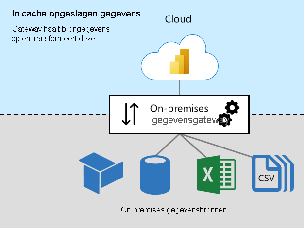
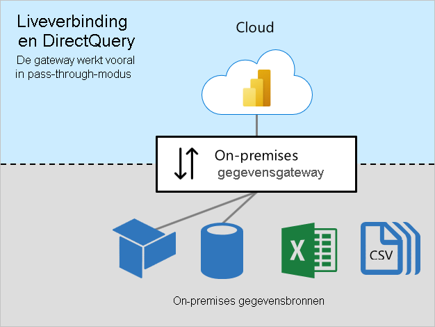

# Grootte aanpassen van on-premises gegevensgateways

Dit artikel is bedoeld voor Power BI-beheerders die de [on-premises gegevensgateway](../connect-data/service-gateway-onprem.md) moeten installeren en beheren.

De gateway is vereist wanneer Power BI toegang moet hebben tot gegevens die niet rechtstreeks via internet toegankelijk zijn. De gateway kan worden geïnstalleerd op een on-premises server of op een VM worden gehost als IaaS (Infrastructure-as-a-Service).

## Gateway-workloads

De on-premises gegevensgateway ondersteunt twee workloads. Het is belangrijk dat u deze workloads eerst begrijpt voordat we de grootte en aanbevelingen van de gateway gaan bespreken.

### Workload Gegevens in cache

Met de workload _Gegevens in cache_ worden brongegevens opgehaald en getransformeerd om te worden geladen in Power BI-gegevenssets. Dit gebeurt in drie stappen:

1. **Verbinding**: De gateway maakt verbinding met brongegevens.
1. **Ophalen van gegevens en transformatie**: Gegevens worden opgehaald en, zo nodig, getransformeerd. Als dat mogelijk is, pusht de Power Query mashup-engine transformatiestappen naar de gegevensbron. Dit wordt ook wel het _[vouwen van query's](power-query-folding.md)_ genoemd. Als dat niet mogelijk is, moeten transformaties door de gateway worden uitgevoerd. In dit geval verbruikt de gateway meer CPU- en geheugenresources.
1. **Overdracht**: Gegevens worden overgebracht naar de Power BI-service: een betrouwbare en snelle internetverbinding is belangrijk, met name voor grote gegevensvolumes.

### De workload Liveverbinding en DirectQuery

De workload _Liveverbinding en DirectQuery_ werkt voornamelijk in de passthrough-modus. De Power BI-service verzendt query's en de gateway reageert met queryresultaten. Meestal zijn queryresultaten klein van omvang.

- Zie Extern gehoste modellen in het artikel [Gegevenssets in de Power BI-service](../connect-data/service-datasets-understand.md#external-hosted-models)voor meer informatie over liveverbindingen.
- Zie DirectQuery-modus in het artikel [Gegevenssetmodi in de Power BI-service](../connect-data/service-dataset-modes-understand.md#directquery-mode) voor meer informatie over DirectQuery.

Deze workload vereist CPU-resources voor het routeren van query's en queryresultaten. Normaal gesproken is er veel minder vraag voor CPU dan vereist is voor de workload Gegevens in cache, met name wanneer het nodig is om gegevens te transformeren voor caching.

Betrouwbare, snelle en consistente connectiviteit is belangrijk om ervoor te zorgen dat rapportgebruikers goede ervaringen hebben.

## Overwegingen bij groottebepaling

Het bepalen van de juiste grootte voor uw gatewaycomputer kan afhankelijk zijn van de volgende variabelen:

- Voor workloads van het type Gegevens in cache:
  - Het aantal gelijktijdige vernieuwingen van gegevenssets
  - De typen gegevensbronnen (relationele database, analytische database, gegevensfeeds of bestanden)
  - Het volume aan gegevens dat moet worden opgehaald uit gegevensbronnen
  - Transformaties die moeten worden uitgevoerd door de mashup-engine van Power Query
  - De hoeveelheid gegevens die moet worden overgezet naar de Power BI-service
- Voor workloads van het type Liveverbinding en DirectQuery:
  - Het aantal gelijktijdige rapportgebruikers
  - Het aantal visuele elementen op rapportpagina's (elk element verzendt ten minste één query)
  - De frequentie van updates van de cache voor Power BI-dashboardquery's
  - Het aantal realtime-rapporten met behulp van de functie [Pagina automatisch vernieuwen](../create-reports/desktop-automatic-page-refresh.md)
  - Of gegevenssets [beveiliging op rijniveau (RLS) afdwingen](../create-reports/desktop-rls.md)

Over het algemeen vereisen workloads van het type Liveverbinding en DirectQuery voldoende CPU, terwijl workloads van het type Gegevens in cache meer CPU en geheugen vereisen. Beide workloads zijn afhankelijk van goede connectiviteit met de Power BI-service, en de gegevensbronnen.

> [!NOTE]
> Met Power BI-capaciteiten worden limieten opgelegd voor het gelijktijdig vernieuwen van modellen, en doorvoer van Liveverbinding en DirectQuery. Het heeft geen zin om een grootte te kiezen voor gateways die meer levert dan wat de Power BI-service ondersteunt. De limieten verschillen per Premium-SKU (en A-SKU's van vergelijkbare grootte). Zie Capaciteitsknooppunten in het artikel [Wat is Power BI Premium?](../admin/service-premium-what-is.md#capacity-nodes) voor meer informatie.

## Aanbevelingen

Aanbevelingen voor de grootte van een gateway zijn afhankelijk van verschillende variabelen. In dit gedeelte vindt u algemene aanbevelingen die u in overweging kunt nemen.

### Oorspronkelijke grootte

Het kan lastig zijn om de juiste grootte nauwkeurig te schatten. We raden u aan om te beginnen met een machine met ten minste 8 CPU-kernen, 8 GB RAM en meerdere Gigabit-netwerkadapters. Vervolgens kunt u een doorsnee workload van de gateway meten door tellers voor de CPU en het geheugen te registreren. Zie voor meer informatie [Prestaties van on-premises gegevensgateway controleren en optimaliseren](/data-integration/gateway/service-gateway-performance).

### Connectiviteit

Plan de best mogelijke connectiviteit tussen de Power BI-service en de gateway, en tussen de gateway en de gegevensbronnen.

- Streef naar betrouwbaarheid, hoge snelheden en lage, consistente latentie.
- Elimineer, of beperk, machine-hops tussen de gateway en uw gegevensbronnen.
- Verwijder eventuele netwerkbeperkingen die worden opgelegd door de firewallproxy. Zie [Power BI-URL's aan acceptatielijst toevoegen](../admin/power-bi-whitelist-urls.md) voor meer informatie over Power BI-eindpunten.
- Configureer [Azure ExpressRoute](/azure/expressroute/expressroute-introduction) om persoonlijke, beheerde verbindingen met Power BI op te zetten.
- In het geval van gegevensbronnen op Azure-VM's moet u ervoor zorgen dat de VM's zich [op dezelfde locatie bevinden als de Power BI-service.](../admin/service-admin-where-is-my-tenant-located.md)
- Bij workloads met een liveverbinding naar SQL Server Analysis Services (SSAS) met behulp van dynamische beveiliging op rijniveau moet u ervoor zorgen dat er een goede connectiviteit is tussen de gatewaycomputer en de on-premises Active Directory.

### Clustering

Voor grootschalige implementaties kunt u een gateway van clusterinstallaties maken. Clusters vermijden Single Points of Failure en kunnen het verkeer over de gateways verdelen. U kunt:

- Een of meer gateways installeren in een cluster
- Workloads isoleren voor zelfstandige gateways of clusters van gatewayservers

Zie [Clusters met hoge beschikbaarheid en taakverdeling van on-premises gegevensgateway beheren](/data-integration/gateway/service-gateway-high-availability-clusters) voor meer informatie.

### Ontwerp en instellingen van gegevensset

Het ontwerp van een gegevensset, en de bijbehorende instellingen, kan invloed hebben op de workloads van de gateway. U kunt de volgende acties overwegen om de workload van de gateway te verlagen.

Voor importgegevenssets:

- Configureer minder vaak gegevensvernieuwing
- Configureer [incrementeel vernieuwen](../admin/service-premium-incremental-refresh.md) om de hoeveelheid gegevens te beperken die moet worden overgedragen
- Zorg er indien mogelijk voor dat [query's worden gevouwen](power-query-folding.md)
- Met name voor grote gegevensvolumes of bij behoefte aan resultaten met lage latentie, converteert u het ontwerp naar een DirectQuery- of [samengesteld](../connect-data/service-dataset-modes-understand.md#composite-mode) model

Voor DirectQuery-gegevenssets:

- Optimaliseer gegevensbronnen, model- en rapportontwerp; voor meer informatie zie [Richtlijnen voor het DirectQuery-model in Power BI Desktop](directquery-model-guidance.md)
- Maak [aggregaties](../transform-model/desktop-aggregations.md) om meer algemene resultaten in de cache op te slaan om het aantal DirectQuery-aanvragen te verminderen
- Beperk de intervallen voor [Pagina automatisch vernieuwen](../create-reports/desktop-automatic-page-refresh.md) in rapportontwerpen en capaciteitsinstellingen
- Met name wanneer dynamische beveiliging op rijniveau wordt afgedwongen, moet u de frequentie voor het bijwerken van de dashboardcache beperken
- Met name voor kleinere gegevensvolumes of voor niet-vluchtige gegevens, converteert u het ontwerp naar een import- of [samengesteld](../connect-data/service-dataset-modes-understand.md#composite-mode) model

Voor gegevenssets voor liveverbinding:

- Met name wanneer dynamische beveiliging op rijniveau wordt afgedwongen, moet u de frequentie voor het bijwerken van de dashboardcache beperken

## Volgende stappen

Bekijk de volgende resources voor meer informatie over dit artikel:

- [Richtlijnen voor het implementeren van een gegevensgateway voor Power BI](../connect-data/service-gateway-deployment-guidance.md)
- [Proxyinstellingen configureren voor de on-premises gegevensgateway](/data-integration/gateway/service-gateway-proxy)
- [Prestaties van on-premises gegevensgateway controleren en optimaliseren](/data-integration/gateway/service-gateway-performance)
- [Problemen met gateways oplossen - Power BI](../connect-data/service-gateway-onprem-tshoot.md)
- [Problemen met de on-premises gegevensgateway oplossen](/data-integration/gateway/service-gateway-tshoot)
- [Het belang van het vouwen van query's](power-query-folding.md)
- Vragen? [Misschien dat de Power BI-community het antwoord weet](https://community.powerbi.com/)
- Suggesties? [Ideeën bijdragen om Power BI te verbeteren](https://ideas.powerbi.com)
