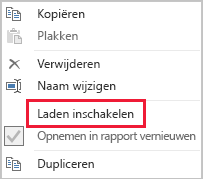

# Gegevensreductietechnieken voor het importeren van modellen

Dit artikel is bedoeld voor Power BI Desktop-gegevensmodelleerders die Importmodellen ontwikkelen. In dit artikel worden verschillende technieken beschreven om de hoeveelheid gegevens te beperken die wordt geladen in Importmodellen.

In importmodellen worden gegevens geladen die zijn gecomprimeerd en geoptimaliseerd en vervolgens op een schijf op de VertiPaq-opslagengine zijn opgeslagen. Wanneer brongegevens in het geheugen worden geladen, is het mogelijk dat u 10x-compressie ziet. U mag dus verwachten dat 10 GB aan brongegevens tot ongeveer 1 GB kan worden gecomprimeerd. Wanneer de gegevens op een schijf worden bewaard, kan bovendien nog eens 20% extra reductie worden bereikt.

Ondanks de efficiëntie die door de VertiPaq-opslagengine wordt behaald, is het belangrijk dat u de gegevens die in uw modellen worden geladen zo goed mogelijk probeert te minimaliseren. Dit geldt met name voor grote modellen, of modellen waarvan u verwacht dat deze na verloop van tijd in omvang zullen toenemen. Vier aantrekkelijke redenen zijn bijvoorbeeld:

- Grotere modellen worden mogelijk niet ondersteund op uw capaciteit. In een gedeelde capaciteit kunnen modellen van maximaal 1 GB worden gehost, terwijl in Premium-capaciteiten modellen tot wel 13 GB kunnen worden gehost. Lees het artikel [Power BI Premium-ondersteuning voor grote gegevenssets](../admin/service-premium-what-is.md) voor meer informatie.
- Kleinere modellen beperken het aantal conflicten voor capaciteitsresources, met name wat geheugen betreft. Hierdoor kunnen meer modellen tegelijkertijd en voor langere tijd worden geladen, wat tot lagere verwijderingssnelheden zal leiden. Zie [Premium-capaciteiten beheren](../admin/service-premium-capacity-manage.md) voor meer informatie.
- Met kleinere modellen kunnen gegevens sneller worden vernieuwd; dit leidt tot rapporten met een lagere latentie, hogere doorvoer bij het vernieuwen van gegevenssets en minder druk op het bronsysteem en de capaciteitsresources.
- Een kleiner aantal tabelrijen kan leiden tot snellere evaluatie van berekeningen, waardoor de algemene queryprestaties kunnen verbeteren.

In dit artikel worden acht verschillende gegevensreductietechnieken besproken. Dit zijn de volgende technieken:

- [Niet-benodigde kolommen verwijderen](#remove-unnecessary-columns)
- [Niet-benodigde rijen verwijderen](#remove-unnecessary-rows)
- [Groeperen en samenvatten](#group-by-and-summarize)
- [Kolomgegevenstypen optimaliseren](#optimize-column-data-types)
- [Voorkeur voor aangepaste kolommen](#preference-for-custom-columns)
- [Het laden van Power Query-query's uitschakelen](#disable-power-query-query-load)
- [Automatische datum/tijd uitschakelen](#disable-auto-datetime)
- [Overschakelen naar de gemengde modus](#switch-to-mixed-mode)

## Niet-benodigde kolommen verwijderen

Om twee belangrijke redenen worden modeltabelkolommen gebruikt:

- **Rapporteren**: om rapportontwerpen te realiseren waarmee modelgegevens op de juiste manier worden gefilterd, gegroepeerd en samengevat
- **Modelstructuur**: door ondersteuning te bieden voor modelrelaties, modelberekeningen, beveiligingsrollen en zelfs de kleur van gegevens opmaken

Kolommen die niet hiervoor worden gebruikt, kunnen waarschijnlijk worden verwijderd. Het verwijderen van kolommen wordt _verticale filtering_ genoemd.

U wordt aangeraden om modellen met exact het juiste aantal kolommen te ontwerpen, gebaseerd op de bekende rapportvereisten. Het is mogelijk dat uw vereisten na verloop van tijd veranderen, maar onthoud dat het gemakkelijker is om kolommen toe te voegen dan ze later weer te moeten verwijderen. Door kolommen te verwijderen kan de rapport- of modelstructuur worden beschadigd.

## Niet-benodigde rijen verwijderen

In modeltabellen moeten zo min mogelijk rijen worden geladen. Dit kan worden bereikt door gefilterde rijensets in modeltabellen te laden voor twee verschillende redenen: om te filteren op entiteit of op tijd. Het verwijderen van rijen wordt _horizontale filtering_ genoemd.

Voor **Filteren op entiteit** moet een subset met brongegevens in het model worden geladen. U kunt bijvoorbeeld alleen feiten voor één regio laden in plaats van verkoopfeiten voor alle verkoopregio's te laden. Deze ontwerpmethode leidt tot een groot aantal kleinere modellen en hierdoor is het wellicht ook niet meer nodig om beveiliging op rijniveau te definiëren (maar hiervoor moet u wel specifieke gegevenssetmachtigingen in de Power BI-service toewijzen en 'dubbele' rapporten maken die verbinding maken met elke gegevensset). U kunt Power Query-parameters en Power BI-sjabloonbestanden gebruiken voor eenvoudiger beheer en publicatie. Lees het blogbericht [Deep Dive in Query Parameters and Power BI Templates](https://powerbi.microsoft.com/blog/deep-dive-into-query-parameters-and-power-bi-templates/) (Uitgebreide informatie over queryparameters en Power BI-sjablonen) voor meer informatie.

Bij **Filteren op tijd** wordt de hoeveelheid _gegevensgeschiedenis_ beperkt die in feitentabellen wordt geladen (en wordt ook het aantal datumrijen beperkt dat in de datumtabellen van het model wordt geladen). U wordt aangeraden om niet automatisch alle beschikbare geschiedenisgegevens te laden, tenzij dit een bekende rapportvereiste is. Het is handig om te weten dat Power Query-filters op basis van tijd kunnen worden geparameteriseerd en zelfs kunnen worden ingesteld op het gebruik van relatieve perioden (ten opzicht van vernieuwingsdatum, bijvoorbeeld de afgelopen vijf jaar). Houd er daarnaast rekening mee dat rapporten niet worden beschadigd door tijdfilters achteraf te wijzigen; dit leidt enkel tot minder (of meer) beschikbare gegevensgeschiedenis in rapporten.

## Groeperen en samenvatten

De meest effectieve techniek om een modelgrootte te beperken, is misschien wel het laden van vooraf samengevatte gegevens. Deze techniek kan worden gebruikt om de nauwkeurigheid van feitentabellen uit te breiden. Er is echter een specifiek nadeel dat zal leiden tot verlies van details.

In een feitentabel over de bronverkoop wordt bijvoorbeeld maar één rij per orderregel opgeslagen. Significante gegevensreductie kan worden bereikt door alle metrische gegevens over de verkoop samen te vatten door ze te groeperen op datum, klant en product. Denk eraan dat een nog significantere gegevensreductie kan worden bereikt door gegevens _op maandniveau_ op datum te groeperen. Hierdoor is eventueel zelfs een reductie van 99% van de modelgrootte mogelijk, maar dan kunt u niet langer op dagniveau of op het niveau van afzonderlijke orders rapporteren. Aan het samenvatten op gegevens van het type Feit kleven een aantal nadelen. Deze nadelen kunnen door een ontwerp met gemengde modellen worden opgelost. Deze optie wordt later beschreven bij de techniek [Overschakelen naar de gemengde modus](#switch-to-mixed-mode).

## Kolomgegevenstypen optimaliseren

In de VertiPaq-opslagengine worden afzonderlijke gegevensstructuren voor elke kolom gebruikt. Deze gegevensstructuren zijn zo ontworpen dat ze de hoogste optimalisaties voor numerieke kolomgegevens bereiken, waarvoor waardecodering wordt gebruikt. Voor tekst en andere niet-numerieke gegevens wordt echter hash-codering gebruikt. Hiervoor moet door de opslagengine een numerieke id worden toegewezen aan elke unieke tekstwaarde in de kolom. Het is deze numerieke id die vervolgens wordt opgeslagen in de gegevensstructuur; hiervoor is tijdens de opslag en het uitvoeren van query's een hash-zoekfunctie vereist.

In een aantal specifieke gevallen kunt u brontekstgegevens converteren naar numerieke waarden. Een verkoopordernummer kan bijvoorbeeld een consistente tekstwaarde als voorvoegsel krijgen (bijvoorbeeld SO123456). Het voorvoegsel kan worden verwijderd en de ordernummerwaarde kan worden geconverteerd naar een geheel getal. Voor grote tabellen kan dit leiden tot significante gegevensreductie, met name wanneer de kolom unieke waarden of waarden met een hoge kardinaliteit bevat.

In dit voorbeeld wordt u aangeraden om de eigenschap Standaardsamenvatting van de kolom in te stellen op Niet samenvatten. Hiermee helpt u de ongeschikte samenvatting van de ordernummerwaarden te minimaliseren.

## Voorkeur voor aangepaste kolommen

In de VertiPaq-opslagengine worden berekende modelkolommen (gedefinieerd in DAX) opgeslagen, net zoals gewone Power Query-bronkolommen. De gegevensstructuren worden echter op een iets andere manier opgeslagen en worden doorgaans minder efficiënt gecomprimeerd. Daarnaast worden ze pas gebouwd zodra alle Power Query-tabellen zijn geladen, waardoor het vernieuwen van gegevens langer kan duren. Het is daarom minder efficiënt om tabelkolommen toe te voegen als _berekende_ kolommen dan als _berekende_ Power Query-kolommen (gedefinieerd in M).

Bij voorkeur maakt u aangepaste kolommen in Power Query. Wanneer de bron een database is, kunt u op twee manieren efficiënter laden van gegevens bereiken. De berekening kan worden gedefinieerd in de SQL-instructie (met de systeemeigen querytaal van de provider), of worden gematerialiseerd als een kolom in de gegevensbron.

In een aantal gevallen is het beter om berekende kolommen in een model te gebruiken. Dit is mogelijk het geval wanneer de formule bestaat uit de evaluatie van metingen of als er een specifieke modelleerfunctionaliteit is vereist die alleen wordt ondersteund in DAX-functies. Lees het artikel [Functies voor hiërarchieën met bovenliggende en onderliggende items in DAX](/dax/understanding-functions-for-parent-child-hierarchies-in-dax) voor meer informatie over zo'n voorbeeld.

## Het laden van Power Query-query's uitschakelen

Power Query-query's die bedoeld zijn als ondersteuningsgegevensintegratie met andere query's moeten niet worden geladen in het model. Om te vermijden dat de query in het model wordt geladen, moet u ervoor zorgen dat u het laden van query's in deze gevallen uitschakelt.

## Automatische datum/tijd uitschakelen

Power BI Desktop bevat een optie met de naam _Automatische datum/tijd_. Wanneer deze optie is ingeschakeld, wordt er een verborgen tabel voor automatische datum/tijd voor datumkolommen gemaakt als hulp voor rapportontwerpers bij activiteiten zoals filters configureren, gegevens groeperen of inzoomen op details voor bepaalde kalenderperioden. De verborgen tabellen bevinden zich in op basis van feiten berekende tabellen die het model vergroten. Raadpleeg voor hulp bij het gebruik van deze optie het artikel [Automatische datum/tijd in Power BI Desktop](../transform-model/desktop-auto-date-time.md).

## Overschakelen naar de gemengde modus

In Power BI Desktop wordt met een ontwerp met de gemengde modus een samengesteld model geproduceerd. Het komt er in feite op neer dat u _voor elke tabel_ een opslagmodus kunt bepalen. Daarom kan voor elke tabel een eigen Opslagmodus-eigenschap worden ingesteld op Importeren of DirectQuery (Dual is een andere optie).

Een effectieve techniek om de modelgrootte te verkleinen, is de eigenschap Opslagmodus voor grotere feitentabellen in te stellen op DirectQuery. Onthoud dat deze ontwerpmethode goed zou kunnen werken in combinatie met de techniek [Groeperen en samenvatten](#group-by-and-summarize) die eerder is behandeld. Samengevatte verkoopgegevens kunnen bijvoorbeeld worden gebruikt om de prestaties van samenvattingsrapporten te verbeteren. Op een analysepagina kan de gedetailleerde verkoop worden weergegeven voor specifieke (en nauwkeurige) filtercontext, waarbij alle verkooporders binnen die context worden weergegeven. In dit voorbeeld bevat de analysepagina visuals die zijn gebaseerd op een DirectQuery-tabel voor het ophalen van de verkoopordergegevens.

Samengestelde modellen hebben echter veel gevolgen voor de beveiliging en de prestaties. Lees het artikel [Samengestelde modellen in Power BI Desktop gebruiken](../transform-model/desktop-composite-models.md) voor meer informatie.

## Volgende stappen

Raadpleeg de volgende artikelen voor meer informatie over het ontwerpen van importmodellen in Power BI:

- [Samengestelde modellen in Power BI Desktop gebruiken](../transform-model/desktop-composite-models.md)
- [Opslagmodus in Power BI Desktop](../transform-model/desktop-storage-mode.md)
- Vragen? [Misschien dat de Power BI-community het antwoord weet](https://community.powerbi.com/)
