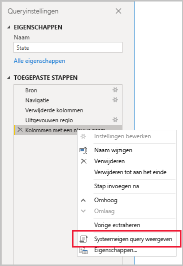
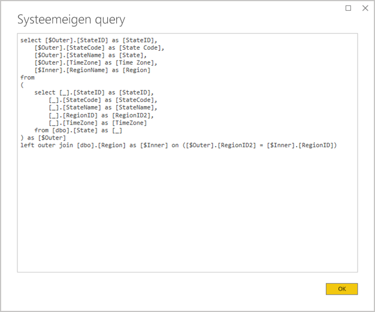
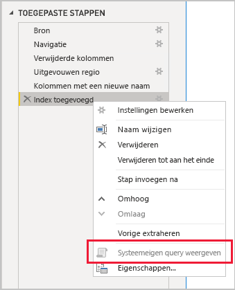

# <a name="the-importance-of-query-folding"></a>Het belang van het vouwen van query's

Dit artikel is bedoeld voor Power BI Desktop-gegevensmodelleerders die Importmodellen ontwikkelen. Hierin wordt beschreven wat het vouwen van query’s is en waarom het belangrijk is. Hierin worden ook de gegevensbronnen en transformaties beschreven waarmee query's kunnen worden gevouwen, en wordt uitgelegd hoe u kunt bepalen of uw Power Query-query's volledig of gedeeltelijk moeten worden gevouwen. Ten slotte biedt de best practice richtlijnen over wanneer en hoe u query's kunt vouwen.

## <a name="background"></a>Achtergrond

Met vouwen van query’s hebt u de mogelijkheid om met een Power Query-query een ​​enkele query-instructie te genereren om brongegevens op te halen en te transformeren. De Power Query mashup-engine streeft ernaar om waar mogelijk query's te vouwen, omdat dit het meest efficiënte pad oplevert om een Power BI-modeltabel te verbinden met de onderliggende gegevensbron.

Het vouwen van query's is een belangrijk onderwerp voor gegevensmodellering om verschillende redenen:

- **Modeltabellen importeren:** Het vernieuwen van gegevens vindt efficiënt plaats voor het importeren van modeltabellen, in termen van resourcegebruik en verversingsduur
- **Tabellen voor DirectQuery en Dual Storage-modus:** Elke DirectQuery- en Dual Storage-modustabel moet zijn gebaseerd op een Power Query-query die kan worden gevouwen
- **Incrementeel vernieuwen:** Incrementele gegevensvernieuwing is efficiënt, in termen van resourcegebruik en verversingsduur. In het venster incrementeel vernieuwen wordt een waarschuwing weergegeven wanneer u hebt vastgesteld dat het vouwen van query's voor de tabel niet kan worden bereikt. Als dit niet kan worden bereikt, is het doel van incrementeel vernieuwen tenietgedaan. Vervolgens moet de mashup-engine alle bronrijen ophalen en vervolgens filters toepassen om de incrementele wijzigingen te bepalen.

Het vouwen van query's kan voor een hele Power Query-query of voor een subset van de stappen worden uitgevoerd. Wanneer het vouwen van query's niet geheel of gedeeltelijk kan worden bereikt, moet de Power Query mashup-engine in Power BI worden gecompenseerd door de gegevenstransformaties zelf te verwerken. Dit kan ertoe leiden dat queryresultaten van de bron worden opgehaald, wat voor grote gegevenssets erg veel resources vergt en traag is.

Gegevensmodelleerders wordt aanbevolen te streven naar efficiëntie in hun importmodelontwerpen door ervoor te zorgen dat er zoveel mogelijk query's worden gevouwen.

## <a name="sources-that-support-query-folding"></a>Bronnen die ondersteuning bieden voor het vouwen van query's

De meeste gegevensbronnen met het concept van een querytaal ondersteunen het vouwen van query's. Dit kunnen relationele databases, OData-feeds (inclusief SharePoint-lijsten), Exchange en Active Directory zijn. Voor gegevensbronnen zoals platte bestanden, blobs en web geldt dat echter doorgaans niet.

## <a name="transformations-that-can-achieve-query-folding"></a>Transformaties die query’s kunnen vouwen

De transformaties van relationele gegevensbronnen waarvoor een query kan worden gevouwen, kunnen worden geschreven als één SELECT-instructie. Een SELECT-instructie kan worden samengesteld met de juiste WHERE-, GROUP BY- en JOIN-componenten. Deze kan ook kolomexpressies (berekeningen) bevatten die gebruikmaken van algemene ingebouwde functies die worden ondersteund door SQL-databases.

In het algemeen vormt de volgende lijst met opsommingstekens een beschrijving van transformaties waarmee query's kunnen worden gevouwen.

- Kolommen verwijderen
- Namen van kolommen wijzigen (SELECT-kolomaliassen)
- Rijen filteren, met statische waarden of Power Query-parameters (predicaten van WHERE-component)
- Groeperen en samenvatten (GROUP BY-component)
- Recordkolommen (aan bron refererende sleutelkolommen) uitbreiden om een samenvoeging van twee brontabellen (JOIN-component) te krijgen
- Niet-fuzzy samenvoeging van vouwbare query’s op basis van dezelfde bron (JOIN-component)
- Het toevoegen van vouwbare query's op basis van dezelfde bron (UNION ALL-operator)
- Aangepaste kolommen toevoegen met _eenvoudige logica_ (SELECT-kolomexpressies). Eenvoudige logica impliceert ongecompliceerde bewerkingen, met inbegrip van het gebruik van M-functies die vergelijkbare functies hebben in de SQL-gegevensbron, zoals wiskundige bewerkingen of tekstmanipulatie. Met de volgende expressies wordt bijvoorbeeld het jaargedeelte van de **OrderDate**-kolomwaarde geretourneerd (om een numerieke waarde te retourneren).

    ```powerquery-m
    Date.Year([OrderDate])
    ```

- Draaien en draaitabel opheffen (PIVOT- en UNPIVOT-operators)

## <a name="transformations-that-prevent-query-folding"></a>Transformaties die het vouwen van query's voorkomen

In het algemeen vormt de volgende lijst met opsommingstekens een beschrijving van transformaties waarmee het vouwen van query's wordt voorkomen. Dit is niet bedoeld als een alomvattende lijst.

- Query's samenvoegen op basis van verschillende bronnen
- Query's toevoegen (samenvoegen) op basis van verschillende bronnen
- Aangepaste kolommen toevoegen met _complexe logica_. Complexe logica impliceert het gebruik van M-functies die geen equivalente functies in de gegevensbron hebben. Met de volgende expressies wordt bijvoorbeeld de **OrderDate**-kolomwaarde ingedeeld (om een tekstwaarde te retourneren).

    ```powerquery-m
    Date.ToText([OrderDate], "yyyy")
    ```

- Indexkolommen toevoegen
- Een kolomgegevenstype wijzigen

Houd er rekening mee dat wanneer een Power Query-query meerdere gegevensbronnen omvat, de incompatibiliteit van de privacyniveaus van de gegevensbron kan voorkomen dat de query kan worden gevouwen. Lees het artikel over [privacyniveaus in Power BI Desktop](../desktop-privacy-levels.md) voor meer informatie.

## <a name="determine-when-a-query-can-be-folded"></a>Bepalen wanneer een query kan worden gevouwen

In het venster Power Query Editor is het mogelijk om te bepalen wanneer een Power Query-query kan worden gevouwen. Als u in het deelvenster **Query-instellingen** met de rechtermuisknop op de laatste toegepaste stap klikt, als de optie **Systeemeigen query weergeven** is ingeschakeld (niet grijs weer gegeven), kan de query worden gevouwen.



Als u de gevouwen query wilt weergeven, gaat u verder en selecteert u de optie **Systeemeigen query weergeven**. Vervolgens wordt de systeemeigen query weergegeven die Power Query gebruikt voor de brongegevens.



Als de optie **Systeemeigen query weergeven** niet is ingeschakeld (grijs), geeft dit aan dat alle querystappen niet kunnen worden gevouwen. Het kan echter ook betekenen dat een subset van stappen nog steeds kan worden gevouwen. Als u vanaf de laatste stap achteruit werkt, kunt u voor elke stap controleren of de optie **Systeemeigen query weergeven** wordt ingeschakeld. Als dit het geval is, hebt u geleerd waar in de reeks stappen het vouwen van query’s niet meer kon worden bereikt.



## <a name="best-practice-guidance"></a>Richtlijnen voor best practices

Kortom, voor een DirectQuery- of Dual Storage-modustabel moet de Power Query-query kunnen worden gevouwen. Voor een importtabel op basis van een relationele bron en wanneer een enkelvoudige SELECT-instructie kan worden samengesteld, worden de _beste gegevensvernieuwingsprestaties_ bereikt door ervoor te zorgen dat de query wordt gevouwen. Als de mashup-engine nog steeds nodig is om transformaties te verwerken, moet u ernaar streven om het werk te minimaliseren dat deze moet doen, vooral voor grote gegevenssets.

De volgende lijst met opsommingstekens bevat richtlijnen voor best practices.

- **Delegeer zoveel mogelijk verwerking naar de gegevensbron:** Wanneer alle stappen van een Power Query-query niet kunnen worden gevouwen, zoek dan naar de stap die het vouwen van query's voorkomt. Verplaats, indien mogelijk, de volgende stappen eerder achter elkaar, zodat deze in de query kunnen worden gevouwen. Houd er rekening mee dat de Power Query mashup-engine slim genoeg kan zijn om de volgorde van de querystappen te wijzigen wanneer de bronquery wordt gegenereerd.

Als voor een relationele gegevensbron de stap die het vouwen van query’s voorkomt, kan worden bereikt in een enkele SELECT-instructie of binnen de procedurele logica van een opgeslagen procedure, kunt u een systeemeigen query-instructie gebruiken, zoals hierna wordt beschreven.

- **Gebruik een systeemeigen SQL-query:** Wanneer een Power Query-query gegevens uit een relationele bron ophaalt, is het mogelijk om een systeemeigen SQL-query te gebruiken. De query kan in feite elke geldige instructie zijn, inclusief een opgeslagen procedure-uitvoering. Als de instructie meerdere resultatensets produceert, wordt alleen de eerste geretourneerd. Parameters kunnen worden gedeclareerd in de instructie en we raden u aan om de [Value.NativeQuery](/powerquery-m/value-nativequery) M-functie te gebruiken om veilig en eenvoudig parameterwaarden door te geven. Het is belangrijk om te begrijpen dat de Power Query mashup-engine de volgende querystappen niet kan vouwen, en dus is het belangrijk om alle (of evenveel) transformatielogica op te nemen in de systeemeigen query-instructie.

    Er zijn twee belangrijke overwegingen om in gedachten te houden bij het gebruik van systeemeigen SQL-query’s:

    - Voor een DirectQuery-modeltabel moet de query een SELECT-instructie zijn en kan deze geen algemene tabelexpressies (CTE's) of een opgeslagen procedure gebruiken
    - Incrementele vernieuwing kan geen gebruik maken van een systeemeigen SQL-query en zou dus de Power Query mashup-engine dwingen alle bronrijen op te halen en vervolgens filters toe te passen om incrementele wijzigingen te bepalen

    > [!IMPORTANT]
    > Een systeemeigen query kan mogelijk meer doen dan gegevens ophalen. Een geldige instructie kan worden uitgevoerd (en mogelijk meerdere malen), met inbegrip van een die gegevens wijzigt of verwijdert. Het is belangrijk om het principe van de minste rechten toe te passen om ervoor te zorgen dat het account dat wordt gebruikt om toegang te krijgen tot de database alleen leesrechten heeft voor de vereiste gegevens.

- **Gegevens in de bron voorbereiden en transformeren:** Als u weet dat bepaalde Power Query-querystappen niet kunnen worden gevouwen, is het wellicht mogelijk de transformaties in de gegevensbron toe te passen. Dit kan worden bereikt door een databaseweergave te schrijven die logisch brongegevens transformeert, of door gegevens fysiek voor te bereiden en te materialiseren voordat Power BI deze opvraagt. Een relationeel datawarehouse is een uitstekend voorbeeld van voorbereide gegevens, meestal bestaande uit vooraf geïntegreerde bronnen van organisatiegegevens.

## <a name="next-steps"></a>Volgende stappen

Raadpleeg de volgende bronnen voor meer informatie over Query Folding en verwante onderwerpen:

- [Samengestelde modellen in Power BI Desktop gebruiken](../desktop-composite-models.md)
- [Incrementeel vernieuwen in Power BI Premium](../service-premium-incremental-refresh.md)
- [Tabelweergave gebruiken om Query Folding te implementeren](/power-query/handlingqueryfolding)
- Vragen? [Misschien dat de Power BI-community het antwoord weet](https://community.powerbi.com/)
