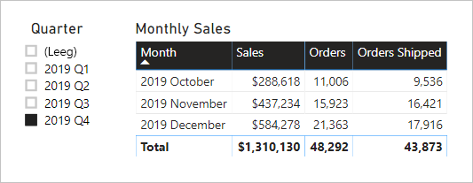

# <a name="active-vs-inactive-relationship-guidance"></a>Richtlijnen voor actieve versus inactieve relaties

Dit artikel is geschreven voor iedereen die gegevensmodellen maakt met Power BI Desktop. U vindt hier de richtlijnen voor het maken van actieve of inactieve modelrelaties. Actieve relaties geven standaard filters door aan andere tabellen. Inactieve relaties, daarentegen, geven alleen filters door wanneer de relatie wordt geactiveerd met (dat wil zeggen: gebruikt voor) een DAX-expressie.

[!INCLUDE [relationships-prerequisite-reading](includes/relationships-prerequisite-reading.md)]

## <a name="active-relationships"></a>Actieve relaties

Over het algemeen raden we u aan om, waar mogelijk, actieve relaties te definiëren. Deze vergroten het bereik en de mogelijkheden van hoe auteurs van rapporten en gebruikers die werken met Q&A, uw model kunnen gebruiken.

Bekijk een voorbeeld van een Import-model dat is ontworpen voor het analyseren van de OTP (prestaties tijdige levering) voor vluchten. Het model bevat een tabel **Flight**. Dit is een feitentabel met één rij per vlucht. Elke rij bevat de vluchtdatum, het vluchtnummer, de luchthavens van vertrek en aankomst, en eventuele vertraging (in minuten). Er is ook een tabel **Airport**. Dit is een dimensietabel met één rij per luchthaven. Elke rij bevat de code van de luchthaven, de naam van de luchthaven, en het land.

Hier volgt een gedeeltelijk modeldiagram van de twee tabellen.


Er zijn twee modelrelaties tussen de tabellen **Flight** en **Airport**. De kolommen **DepartureAirport** en **ArrivalAirport** in de tabel **Flight** hebben een relatie met de kolom **Airport** van de tabel **Airport**. In het stervormige schemaontwerp wordt de tabel **Airport** beschreven als een [rollenspeldimensie](star-schema.md#role-playing-dimensions). In dit model zijn _luchthaven van vertrek_ en _luchthaven van aankomst_ de twee rollen.

Dit ontwerp werkt goed met relationele stervormige schemaontwerpen, maar werkt niet voor Power BI-modellen. Dit komt doordat modelrelaties paden zijn voor het doorgeven van filters, en deze paden moeten deterministisch zijn. Daarom kan een model niet meerdere actieve relaties tussen twee tabellen hebben. En daarom is de ene relatie actief, zoals wordt beschreven in dit voorbeeld, terwijl de andere relatie inactief is (aangeduid door de onderbroken lijn). Het is met name de relatie met de kolom **ArrivalAirport** die actief is. Dit betekent dat filters die worden toegepast op de tabel **Airport**, automatisch worden doorgegeven aan de kolom **ArrivalAirport** van de tabel **Flight**.

Dit modelontwerp zorgt voor ernstige beperkingen voor hoe gegevens kunnen worden gerapporteerd. Meer specifiek: het is niet mogelijk om de tabel **Airport** te filteren zodat vluchtgegevens voor een luchthaven van vertrek automatisch worden geïsoleerd. Aangezien voor rapportage is vereist dat er _tegelijkertijd_ wordt gefilterd (of gegroepeerd) op luchthavens van vertrek en aankomst, zijn er twee actieve relaties nodig. Als we deze vereiste toepassen op een Power BI-modelontwerp, betekent dit dat het model twee luchthaventabellen moet hebben.

Hier ziet u het verbeterde modelontwerp.


Het model bevat nu twee tabellen voor luchthavens: **Departure Airport** en **Arrival Airport**. De modelrelaties tussen deze tabellen en de tabel **Flight** zijn actief. U ziet ook dat de kolomnamen in de tabellen **Departure Airport** en **Arrival Airport** worden voorafgegaan door het woord _Departure_ of _Arrival_.

Het verbeterde modelontwerp biedt ondersteuning voor het produceren van het volgende rapportontwerp.


Op de rapportpagina wordt gefilterd op Melbourne als luchthaven van vertrek, en de tabelvisual is gegroepeerd op luchthavens van aankomst.

> [!NOTE]
> Voor Import-modellen heeft de extra tabel geresulteerd in een groter model en langere vernieuwingstijden. Als zodanig is dit in strijd met de aanbevelingen die worden beschreven in het artikel [Technieken voor gegevensreductie voor Import-modellen](import-modeling-data-reduction.md). In dit voorbeeld wordt de vereiste van slechts één actieve relatie overschreven op basis van deze aanbevelingen.
>
> Verder is het gebruikelijk dat dimensietabellen een laag aantal rijen bevatten ten opzichte van het aantal rijen in een feitentabel. Het formaat en de vernieuwingstijden van het grotere model zijn daarom waarschijnlijk niet buitensporig toegenomen.

### <a name="refactoring-methodology"></a>Herstructureringsmethode

Hier volgt een methode voor het herstructureren van een model, van één rollenspeldimensietabel naar een ontwerp met _één tabel per rol_.

1. Verwijder eventuele inactieve relaties.
2. U kunt overwegen om de naam van de rollenspeldimensietabel te wijzigen zodat deze een betere beschrijving van de rol biedt. In het voorbeeld is de tabel **Airport** gerelateerd aan de kolom **ArrivalAirport** van de tabel **Flight**. De naam wordt daarom gewijzigd in **Arrival Airport**.
3. Maak een kopie van de rollenspeltabel en geef deze een naam die de bijbehorende rol weerspiegelt. Als het een Import-tabel is, is het raadzaam een berekende tabel te definiëren. Als het een DirectQuery-tabel is, kunt u de Power Query-query dupliceren.

    In het voorbeeld is de tabel **Departure Airport** gemaakt met behulp van de volgende definitie van een berekende tabel.

    ```dax
    Departure Airport = 'Arrival Airport'
    ```

4. Maak een actieve relatie naar de nieuwe tabel.
5. Overweeg om de kolommen van de tabel een nieuwe naam te geven, zodat ze de bijbehorende rollen nauwkeurig weerspiegelen. In het voorbeeld worden alle kolommen voorafgegaan door het woord _Departure_ of _Arrival_. Deze namen zorgen ervoor dat rapportvisuals standaard labels hebben die zelf-omschrijvend en ondubbelzinnig zijn. Dit verbetert ook de Q&A-ervaring, waardoor gebruikers eenvoudiger vragen kunnen schrijven.
6. Overweeg om beschrijvingen toe te voegen aan rollenspeltabellen. (In het deelvenster **Velden** wordt een beschrijving weergegeven in de knopinfo wanneer een auteur van een rapport de muisaanwijzer over de tabel beweegt.) Op deze manier kunt u eventuele aanvullende details over filterdoorgifte communiceren met de auteurs van rapporten.

## <a name="inactive-relationships"></a>Inactieve relaties beheren

In bepaalde omstandigheden kunnen inactieve relaties helpen te voldoen aan speciale rapportagebehoeften.

Laten we nu andere vereisten voor modellen en rapportage bekijken:

- Een verkoopmodel bevat een tabel **Sales** met twee datumkolommen: **OrderDate** en **ShipDate**
- Elke rij in de tabel **Sales** bevat één order
- Er worden bijna altijd datumfilters toegepast op de kolom **OrderDate**, waarin altijd een geldige datum is opgeslagen
- Er is slechts één meting waarvoor het datumfilter moet worden doorgegeven aan de kolom **ShipDate** die lege waarden kan bevatten (totdat de order is verzonden)
- Het is niet nodig om tegelijkertijd te filteren (of te groeperen) op order _én_ verzenddatum

Hier volgt een gedeeltelijk modeldiagram van de twee tabellen.


Er zijn twee modelrelaties tussen de tabellen **Sales** en **Date**. De kolommen **OrderDate** en **ShipDate** in de tabel **Sales** hebben een relatie met de kolom **Date** van de tabel **Date**. In dit model zijn de _orderdatum_ en de _verzenddatum_ de twee rollen voor de tabel **Date**. Het is de relatie met de kolom **OrderDate** die actief is.

Alle zes metingen, met uitzondering van één, moeten worden gefilterd op de kolom **OrderDate**. De meting **Orders Shipped** moet echter worden gefilterd op de kolom **ShipDate**.

Hier ziet u de metingsdefinitie **Orders**. Dit is gewoon het aantal rijen in de tabel **Sales** binnen de filtercontext. Filters die worden toegepast op de tabel **Date**, worden doorgegeven aan de kolom **OrderDate**.

```dax
Orders = COUNTROWS(Sales)
```

Hier ziet u de metingsdefinitie **Orders Shipped**. Hiervoor wordt gebruikgemaakt van de DAX-functie [USERELATIONSHIP](/dax/userelationship-function-dax), waarmee alleen tijdens de evaluatie van de expressie de filterdoorgifte voor een specifieke relatie wordt geactiveerd. In dit voorbeeld wordt de relatie met de kolom **ShipDate** gebruikt.

```dax
Orders Shipped =
CALCULATE(
    COUNTROWS(Sales)
    ,USERELATIONSHIP('Date'[Date], Sales[ShipDate])
)
```

Het modelontwerp biedt ondersteuning voor het produceren van het volgende rapportontwerp.



De rapportpagina is gefilterd op het kwartaal 2019 Q4. De tabelvisual is gegroepeerd op maand en er worden verschillende verkoopstatistieken weergegeven. De metingen **Orders** en **Orders Shipped** retourneren verschillende resultaten. Ze gebruiken beide dezelfde samenvattingslogica (aantal rijen van de tabel **Sales**), maar gebruiken een andere filterdoorgifte voor de tabel **Date**.

U ziet dat de slicer kwartaal een leeg item bevat. Dit sliceritem wordt weergegeven als gevolg van [tabeluitbreiding](../transform-model/desktop-relationships-understand.md#regular-relationships). Elke rij in de tabel **Verkoop** heeft een orderdatum, maar sommige rijen hebben een lege waarde bij verzenddatum. Dit komt omdat deze orders nog moeten worden verzonden. Tabeluitbreiding houdt ook rekening met niet-actieve relaties. Daarom kunnen lege waarden worden weergegeven als gevolg van lege waarden aan de 'veel'-zijde van de relatie of vanwege problemen met de gegevensintegriteit.

## <a name="recommendations"></a>Aanbevelingen

Samengevat raden we u aan om, waar mogelijk, actieve relaties te definiëren. Deze vergroten het bereik en de mogelijkheden van hoe auteurs van rapporten en gebruikers die werken met Q&A, uw model kunnen gebruiken. Dit betekent dat rollenspeldimensietabellen moeten worden gedupliceerd in uw model.

In bepaalde omstandigheden kunt u echter een of meer inactieve relaties definiëren voor een rollenspeldimensietabel. In de volgende gevallen kunt u dit ontwerp overwegen:

- Wanneer niet is vereist dat rapportvisuals tegelijkertijd worden gefilterd op verschillende rollen
- Wanneer u de DAX-functie USERELATIONSHIP gebruikt om een specifieke relatie te activeren voor relevante modelberekeningen

## <a name="next-steps"></a>Volgende stappen

Bekijk de volgende resources voor meer informatie over dit artikel:

- [Modelrelaties in Power BI Desktop](../transform-model/desktop-relationships-understand.md)
- [Meer informatie over stervormige schema's en het belang daarvan voor Power BI](star-schema.md)
- [Richtlijnen voor het oplossen van problemen met relaties](relationships-troubleshoot.md)
- Vragen? [Misschien dat de Power BI-community het antwoord weet](https://community.powerbi.com/)
- Suggesties? [Ideeën bijdragen om Power BI te verbeteren](https://ideas.powerbi.com/)
