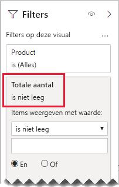

# <a name="bi-directional-relationship-guidance"></a>Richtlijnen voor bidirectionele relaties

Dit artikel is geschreven voor iedereen die gegevensmodellen maakt met Power BI Desktop. U vindt hier de richtlijnen voor het maken van bidirectionele modelrelaties. Een bidirectionele relatie is een relatie die in _beide richtingen_ wordt gefilterd.

[!INCLUDE [relationships-prerequisite-reading](includes/relationships-prerequisite-reading.md)]

Over het algemeen adviseren we om het gebruik van bidirectionele relaties tot een minimum te beperken. Ze kunnen een negatief effect hebben op de prestaties van modelquery's en zijn mogelijk verwarrend voor de gebruikers van uw rapport.

Er zijn drie scenario's waarbij bidirectionele filtering aan specifieke vereisten kan voldoen:

- [Speciale modelrelaties](#special-model-relationships)
- [Sliceritems ‘met gegevens’](#slicer-items-with-data)
- [Dimensie-naar-dimensie-analyse](#dimension-to-dimension-analysis)

## <a name="special-model-relationships"></a>Speciale modelrelaties

Bidirectionele relaties spelen een belangrijke rol bij het maken van de volgende twee speciale modelrelatietypen:

- **Een-op-een** Alle een-op-een-relaties moeten bidirectioneel zijn: het is niet mogelijk om dit anders te configureren. Over het algemeen raden we u aan om deze typen relaties niet te maken. Raadpleeg [Richtlijnen voor een-op-een-relaties](relationships-one-to-one.md) voor een volledige bespreking en alternatieve ontwerpen.
- **Veel-op-veel**: Voor het tot stand brengen van een relatie tussen dimensietabellen is een overbruggingstabel vereist. Een bidirectioneel filter is vereist om ervoor te zorgen dat filters worden doorgegeven aan de overbruggingstabel. Raadpleeg [Richtlijnen voor veel-op-veel-relaties (veel-op-veel-dimensies relateren)](relationships-many-to-many.md#relate-many-to-many-dimensions) voor meer informatie.

## <a name="slicer-items-with-data"></a>Sliceritems ‘met gegevens’

Bidirectionele relaties kunnen slicers leveren waarmee items worden beperkt tot waar gegevens bestaan. (Als u bekend bent met Excel-draaitabellen en -slicers, is dit het standaardgedrag wanneer u gegevens ophaalt uit een Power BI-gegevensset of een Analysis Services-model.) Bekijk eerst het volgende modeldiagram als u wilt weten wat dit inhoudt.


De eerste tabel heet **Customer** en bevat drie kolommen: **Country-Region**, **Customer** en **CustomerCode**. De tweede tabel heet **Product** en bevat drie kolommen: **Color**, **Product** en **SKU**. De derde tabel heet **Sales** en bevat vier kolommen: **CustomerCode**, **OrderDate**, **Quantity** en **SKU**. De tabellen **Customer** en **Product** zijn dimensietabellen, en elk ervan heeft een een-op-veel-relatie met de tabel **Sales**. Elke relatie filtert in één richting.

Het modeldiagram is zodanig gewijzigd dat de tabelrijen worden weergegeven om aan te geven hoe bidirectionele filtering werkt. Alle voorbeelden in dit artikel zijn gebaseerd op deze gegevens.

> [!NOTE]
> Het is niet mogelijk om tabelrijen weer te geven in het Power BI Desktop-modeldiagram. Het wordt wel gedaan in dit artikel om duidelijke voorbeelden te kunnen geven.


De rijgegevens voor de drie tabellen worden beschreven in de volgende lijst:

- De tabel **Customer** (klant) heeft twee rijen:
  - **CustomerCode** CUST-01, **Customer** Customer-1, **Country-Region** Verenigde Staten
  - **CustomerCode** CUST-02, **Customer** Customer-2, **Country-Region** Australië
- De tabel **Product** heeft drie rijen:
  - **SKU** CL-01, **Product** T-shirt, **Color** Groen
  - **SKU** CL-02, **Product** Jeans, **Color** Blauw
  - **SKU** AC-01, **Product** Hoed, **Color** Blauw
- De tabel **Sales** heeft drie rijen:
  - **OrderDate** 1 januari 2019, **CustomerCode** CUST-01, **SKU** CL-01, **Quantity** 10
  - **OrderDate** 2 februari 2019, **CustomerCode** CUST-01, **SKU** CL-02, **Quantity** 20
  - **OrderDate** 3 maart 2019, **CustomerCode** CUST-02, **SKU** CL-01, **Quantity** 30

Kijk nu eens naar de volgende rapportpagina.


De pagina bestaat uit twee slicers en een kaartvisual. De eerste slicer is voor **Country-Region** en heeft twee items: Australië en Verenigde Staten. Dit is momenteel gesegmenteerd op Australië. De tweede slicer is voor **Product** en heeft drie items: Hat, Jeans en T-shirt. Er zijn geen items geselecteerd (wat betekent dat er _geen producten_ worden gefilterd). De kaartvisual bevat een hoeveelheid van 30.

Wanneer rapportgebruikers segmenteren op Australië, wilt u de slicer **Product** mogelijk beperken zodat alleen items worden weergegeven waarvan de gegevens _gerelateerd_ zijn aan de verkoop in Australië. Dit is wat wordt bedoeld met: sliceritems weergeven ‘met gegevens’. Dit gedrag vindt plaats als u de relatie tussen de tabellen **Product** en **Sales** configureert om te filteren in beide richtingen.


In de slicer **Product** wordt nu één item vermeld: T-shirt. Dit item vertegenwoordigt het enige product dat is verkocht aan Australische klanten.


We raden u aan om te overwegen of dit ontwerp geschikt is voor uw rapportgebruikers. Sommige rapportgebruikers vinden deze ervaring verwarrend. Ze begrijpen niet waarom sliceritems dynamisch verschijnen of verdwijnen wanneer ze met andere slicers werken.

Als u besluit om de sliceritems ‘met gegevens’ weer te geven, raden wij u aan om geen bidirectionele relaties te configureren. Voor bidirectionele relaties is meer verwerking vereist, waardoor ze de queryprestaties negatief kunnen beïnvloeden, met name wanneer het aantal bidirectionele relaties in uw model toeneemt.

Er is een betere manier om tot hetzelfde resultaat te komen: In plaats van bidirectionele filters te gebruiken kunt u een visualfilter toepassen op de slicer **Product** zelf.

Laten we er even vanuit gaan dat de relatie tussen de tabellen **Product** en **Sales** niet meer in beide richtingen wordt gefilterd. En dat de volgende metingsdefinitie is toegevoegd aan de tabel **Sales**.

```dax
Total Quantity = SUM(Sales[Quantity])
```

Als u de sliceritems **Product** wilt weergeven ‘met gegevens’, hoeft u alleen maar te filteren op de meting **Totale hoeveelheid** met behulp van de voorwaarde: Is niet leeg.



## <a name="dimension-to-dimension-analysis"></a>Dimensie-naar-dimensie-analyse

Een ander scenario voor bidirectionele relaties gaat over een feitentabel zoals een overbruggingstabel. Op deze manier wordt ondersteuning geboden voor het analyseren van dimensietabelgegevens binnen de filtercontext van een andere dimensietabel.

Gebruik het voorbeeldmodel in dit artikel en bedenk wat de antwoorden zijn op de volgende vragen:

- Hoeveel kleuren zijn er verkocht aan Australische klanten?
- Hoeveel landen hebben jeans aangeschaft?

Beide vragen kunnen worden beantwoord _zonder_ gegevens samen te vatten in de overbruggende feitentabel. Het is echter wel vereist dat filters worden doorgegeven van de ene dimensietabel naar de andere. Nadat filters zijn doorgegeven via de feitentabel, kunnen de kolommen uit de dimensietabel worden samengevat met behulp van de DAX-functie [DISTINCTCOUNT](/dax/distinctcount-function-dax), en mogelijk ook met de DAX-functies [MIN](/dax/min-function-dax) en [MAX](/dax/max-function-dax).

Aangezien de feitentabel zich gedraagt als een overbruggingstabel, kunt u de richtlijnen voor veel-op-veel-relaties volgen om twee dimensietabellen te relateren. Hiervoor is vereist dat u minstens één relatie configureert voor filteren in beide richtingen. Raadpleeg [Richtlijnen voor veel-op-veel-relaties (veel-op-veel-dimensies relateren)](relationships-many-to-many.md#relate-many-to-many-dimensions) voor meer informatie.

Zoals eerder in dit artikel is beschreven, heeft dit ontwerp waarschijnlijk een negatieve invloed op de prestaties en heeft het gevolgen voor de gebruikerservaring met betrekking tot [sliceritems 'met gegevens'](#slicer-items-with-data). Daarom raden we u aan om in plaats hiervan bidirectionele filtering te activeren _in een metingsdefinitie_ met behulp van de DAX-functie [CROSSFILTER](/dax/crossfilter-function). De functie CROSSFILTER kan worden gebruikt om filterrichtingen te wijzigen - of zelfs om de relatie uit te schakelen - tijdens de evaluatie van een expressie.

Laten we de volgende metingsdefinitie toevoegen aan de tabel **Sales**. In dit voorbeeld is de modelrelatie tussen de tabellen **Customer** en **Sales** geconfigureerd om te filteren in _één richting_.

```dax
Different Countries Sold =
CALCULATE(
    DISTINCTCOUNT(Customer[Country-Region]),
    CROSSFILTER(
        Customer[CustomerCode],
        Sales[CustomerCode],
        BOTH
    )
)
```

Tijdens de evaluatie van de metingsexpressie **Different Countries Sold** wordt de relatie tussen de tabellen **Customer** en **Sales** in beide richtingen gefilterd.

In de volgende tabelvisual ziet u de statistieken voor elk verkocht product. De kolom **Quantity** bevat de som van alle hoeveelheidswaarden. De kolom **Different Countries Sold** vertegenwoordigt het unieke aantal waarden voor land/regio voor alle klanten die het product hebben aangeschaft.


## <a name="next-steps"></a>Volgende stappen

Bekijk de volgende resources voor meer informatie over dit artikel:

- [Modelrelaties in Power BI Desktop](../desktop-relationships-understand.md)
- [Meer informatie over stervormige schema's en het belang daarvan voor Power BI](star-schema.md)
- [Richtlijnen voor een-op-een-relaties](relationships-one-to-one.md)
- [Richtlijnen voor veel-op-veel-relaties](relationships-many-to-many.md)
- [Richtlijnen voor het oplossen van problemen met relaties](relationships-troubleshoot.md)
- Vragen? [Misschien dat de Power BI-community het antwoord weet](https://community.powerbi.com/)
- Suggesties? [Ideeën bijdragen om Power BI te verbeteren](https://ideas.powerbi.com/)
